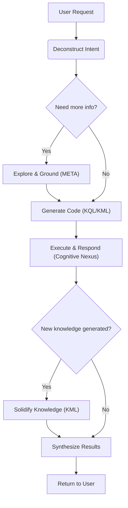

# 🧬 KIP (Knowledge Interaction Protocol) Specification (Draft)

**[English](./README.md) | [中文](./README_CN.md)**

**Version History**:
| Version     | Date       | Change Description                                                                                                       |
| ----------- | ---------- | ------------------------------------------------------------------------------------------------------------------------ |
| v1.0-draft1 | 2025-06-09 | Initial draft                                                                                                            |
| v1.0-draft2 | 2025-06-15 | Optimized `UNION` clause                                                                                                 |
| v1.0-draft3 | 2025-06-18 | Refined terminology, simplified syntax, removed `SELECT` subquery, added `META` clause, enhanced proposition link clause |
| v1.0-draft4 | 2025-06-19 | simplified syntax, removed `COLLECT`，`AS`，`@`                                                                          |

**KIP Implementation**:
- [Anda KIP](https://github.com/ldclabs/anda-db/tree/main/rs/anda_kip): A Rust implementation of KIP for building sustainable AI knowledge memory systems.

**About Us**:
- [ICPanda DAO](https://panda.fans/): ICPanda is a technical panda fully running on the [Internet Computer](https://internetcomputer.org/) blockchain, building chain-native infrastructures, Anda.AI and dMsg.net.
- [Anda.AI](https://anda.ai/): Create next-generation AI agents with persistent memory, decentralized trust, and swarm intelligence.
- GitHub: [LDC Labs](https://github.com/ldclabs/KIP)
- Follow Us on X: [ICPanda DAO](https://x.com/ICPandaDAO)

## 0. Preamble

We are at the dawn of a cognitive revolution driven by Large Language Models (LLMs). With their powerful capabilities in natural language understanding, generation, and reasoning, LLMs show the promise of Artificial General Intelligence (AGI). However, a current LLM is like a **brilliant but forgetful genius**: it possesses astounding real-time reasoning abilities but lacks a stable, cumulative, and traceable long-term memory. It can hold fascinating conversations, but once the dialogue ends, the knowledge dissipates; it may produce convincing "hallucinations" but cannot verify or validate its knowledge sources.

This chasm between the "neural core" and persistent, structured knowledge is the central obstacle preventing AI Agents from evolving from "clever tools" to "true intelligent partners." How can we build an equally powerful, trustworthy "symbolic core" for this potent "neural core," one that can co-evolve with it? This is the question of our time that we must answer.

**KIP (Knowledge Interaction Protocol) was born to answer this question.**

It is not merely a technical specification but a design philosophy, a new paradigm for AI architecture. KIP's core mission is to build a solid and efficient bridge connecting the LLM's transient, fluid "working memory" with the knowledge graph's persistent, stable "long-term memory."
KIP elevates the interaction paradigm between AI and knowledge bases **from a one-way "tool call" to a two-way "cognitive symbiosis"**:
- The **Neural Core** (LLM) provides real-time reasoning capabilities.
- The **Symbolic Core** (Knowledge Graph) provides structured memory.
- **KIP** enables the synergistic evolution of both.

In this specification, we are committed to achieving three core objectives:

1.  **Empowering AI with Persistent Memory**: Through KIP, an AI Agent can atomically and reliably solidify new knowledge acquired from conversations, observations, and reasoning into its knowledge graph in the form of structured "Knowledge Capsules." Memory is no longer volatile but a depositable, compoundable asset.

2.  **Enabling AI Self-Evolution**: Learning and forgetting are hallmarks of intelligence. KIP provides a complete Knowledge Manipulation Language (KML) that enables an Agent to autonomously update, correct, or even delete outdated knowledge based on new evidence. This lays the foundation for building AI that can continuously learn, self-improve, and adapt to changing environments.

3.  **Building a Foundation of Trust for AI**: Trust stems from transparency. Every interaction in KIP is an explicit, auditable "chain of thought." When an AI provides an answer, it can not only state "what" but also clearly demonstrate "how I know it" through the KIP code it generates. This provides indispensable underlying support for building responsible and explainable AI systems.

This specification is dedicated to providing all developers, architects, and researchers with an open, universal, and powerful standard for building the next generation of intelligent agents. We believe that the future of intelligence does not lie in an isolated, omniscient "black box," but in an open system that knows how to learn and how to collaborate efficiently with trusted knowledge.

We welcome you to join us in exploring and refining KIP, to usher in a new era of AI self-evolution and sustainable learning.

## 1. Introduction & Design Philosophy

**KIP (Knowledge Interaction Protocol)** is a knowledge interaction protocol designed specifically for Large Language Models (LLMs). Through a standardized instruction set (KQL/KML) and data structures, it defines a complete model for efficient, reliable, and bidirectional knowledge exchange between a neural core (LLM) and a symbolic core (knowledge graph). Its goal is to build a long-term memory system for AI Agents capable of sustainable learning and self-evolution.

**Design Principles:**

*   **LLM-Friendly**: The syntax is clear and well-structured, making it easy for LLMs to generate code.
*   **Declarative**: The initiator of an interaction only needs to describe the "intent," not the "implementation."
*   **Graph-Native**: Deeply optimized for the structure and query patterns of knowledge graphs.
*   **Explainable**: The KIP code itself is a transparent record of the LLM's reasoning process, serving as an auditable and verifiable "chain of thought."
*   **Comprehensive**: Provides full lifecycle management capabilities, from data querying to knowledge evolution, which is fundamental for an Agent to achieve true learning.

## 2. Core Definitions

### 2.1. Cognitive Nexus

A knowledge graph composed of **Concept Nodes** and **Proposition Links**, serving as the long-term memory system for an AI Agent.

### 2.2. Concept Node

*   **Definition**: An **entity** or **abstract concept** within the knowledge graph, representing the basic unit of knowledge (like a "node" in a graph).
*   **Example**: A `Drug` node named "Aspirin," a `Symptom` node named "Headache."
*   **Components**:
    *   `id`: String, a unique identifier used to locate the node within the graph.
    *   `type`: String, the type of the node, such as `Drug`, `Symptom`, etc.
    *   `name`: String, the name of the node, such as "Aspirin," "Headache," etc. The combination of `type` + `name` also uniquely identifies a node in the graph.
    *   `attributes`: Object, the node's properties, describing its intrinsic characteristics, such as `molecular_formula`, `risk_level`, etc.
    *   `metadata`: Object, the node's metadata, describing its source, credibility, etc., such as `source`, `confidence`, etc.

### 2.3. Proposition Link

*   **Definition**: A **reified proposition** that asserts a **fact** in the form of a `(subject, predicate, object)` triple. It acts as a **link** in the graph, connecting two concept nodes or enabling higher-order connections (i.e., higher-order proposition, or Reification), where the subject or object is itself another proposition link.
*   **Example**: A proposition link stating the fact "(Aspirin) - [treats] -> (Headache)."
*   **Components**:
    *   `subject`: Object ID, the originator of the relation, which can be a concept node or another proposition link.
    *   `predicate`: String, defines the type of **relation** between the subject and object.
    *   `object`: Object ID, the receiver of the relation, which can be a concept node or another proposition link.
    *   `attributes`: Object, the proposition's properties, describing its intrinsic characteristics.
    *   `metadata`: Object, the proposition's metadata, describing its source, credibility, etc., such as `source`, `confidence`, etc.

### 2.4. Knowledge Capsule

An atomic unit for knowledge updates, containing a collection of **Concept Nodes** and **Proposition Links**. It is used to address the encapsulation, distribution, and reuse of high-quality knowledge.

### 2.5. Cognitive Primer

A highly structured, information-dense JSON object specifically designed for LLMs. It contains a global summary and a domain map of the Cognitive Nexus, helping the LLM to quickly understand and use it.

### 2.6. Attributes

*   **Definition**: Key-value pairs that describe the intrinsic characteristics of a **concept** or **fact**. They are part of the knowledge memory.
*   **Example**:
    *   **Concept Attribute**: The `molecular_formula` of the drug "Aspirin" is "C9H8O4".
    *   **Proposition Attribute**: The `dosage` for the fact "Aspirin treats Headache" is "500mg".

### 2.7. Metadata

*   **Definition**: Key-value pairs that describe the **source, credibility, and context** of knowledge. It does not alter the content of the knowledge itself but describes "knowledge about the knowledge." See Appendix 1 for metadata field design.
*   **Example**: The `source` of a concept or proposition is "The Lancet, 2023, some paper," and its `confidence` is `0.98`.

### 2.8. Value Types

KIP adopts the **JSON** data model. This means all values used in KIP clauses follow the JSON standard for types and literal representations. This ensures unambiguous data exchange and makes it extremely easy for LLMs to generate and parse.

#### 2.8.1. Basic Types

*   **String**: A sequence of characters enclosed in double quotes `"`.
*   **Number**: An integer or a floating-point number.
*   **Boolean**: The logical value `true` or `false`.
*   **Null**: The special value `null`, representing "nothing" or "undefined."

#### 2.8.2. Complex Types

*   **Array**: An ordered list of values enclosed in square brackets `[]`. Array elements can be any KIP-supported value type.
*   **Object**: An unordered collection of key-value pairs enclosed in curly braces `{}`. Keys must be strings, and values can be any KIP-supported value type.

#### 2.8.3. Usage Restrictions

Although `Array` and `Object` types can be stored as attribute or metadata values, KQL's `FILTER` clause **primarily operates on basic types (String, Number, Boolean, Null)**. The core KIP query engine does not guarantee support for direct indexing and filtering of array elements or object fields (e.g., syntax like `FILTER(?array[0] == "value")` is not supported).

### 2.9. Identifier

The identifier in KIP starts with a letter or an underscore, followed by any combination of letters, digits, or underscores. Identifiers are used for variable names, attribute names, metadata keys, etc.

## 3. KIP-KQL Instruction Set: Knowledge Query Language

KQL is the part of KIP responsible for knowledge retrieval and reasoning.

### 3.1. Query Structure

```prolog
FIND( ... )
WHERE {
  ...
}
ORDER BY ...
LIMIT N
OFFSET M
```

### 3.2. `FIND` Clause

**Function**: Declares the final output of the query.

**Syntax**: `FIND( ... )`

*   **Multi-variable Return**: You can specify one or more variables, e.g., `FIND(?drug, ?symptom)`.
*   **Aggregate Return**: You can use aggregate functions to perform calculations on variables, e.g., `FIND(?var1, ?agg_func(?var2))`.

    **Aggregation Functions**:
    *   `COUNT(?var)`: Counts the number of times `?var` is bound. `COUNT(DISTINCT ?var)` counts the number of distinct bindings.
    *   `SUM(?var)`, `AVG(?var)`, `MIN(?var)`, `MAX(?var)`: Other common mathematical aggregation functions.

**Example**:

```prolog
// Return concept node objects
FIND(?drug)

// Return multiple variables
FIND(?drug_name, ?symptom_name)

// Return a variable and its count
FIND(?drug_class, COUNT(?drug))
```

### 3.3. `WHERE` Clause

**Function**: Contains a series of graph pattern matching and filtering clauses. All clauses are implicitly connected by a logical **AND**.

**Syntax**: `WHERE { ... }`

*   **Concept Node Clause**: `?node_var {type: "<type>", name: "<name>", id: "<id>"}`
*   **Proposition Link Clause**: `?link_var (?subject, "<predicate>", ?object)`
*   **Attribute Clause (`ATTR`)**: `ATTR(?node, "<attribute_name>", ?value_var)`
*   **Metadata Clause (`META`)**: `META(?node, "<metadata_key>", ?value_var)`
*   **Filter Clause (`FILTER`)**: `FILTER(boolean_expression)`
*   **Negation Clause (`NOT`)**: `NOT { ... }`
*   **Optional Clause (`OPTIONAL`)**: `OPTIONAL { ... }`
*   **Union Clause (`UNION`)**: `UNION { ... }`

#### 3.3.1. Concept Node Clause

**Function**: Matches concept nodes in the knowledge graph by `type`, `name`, or `id`, and can bind them to a variable.

**Syntax**: `?node_var {type: "<type>", name: "<name>", id: "<id>"}`

*   `?node_var` is optional and binds the matched concept node to a variable for later use.
*   The `type`, `name`, and `id` parameters are optional, but at least one must be provided. The `id` or the `type` + `name` combination must uniquely identify a node.

**Example**:

```prolog
// Bind nodes of type "Drug" to the ?drug variable
?drug {type: "Drug"}

// Bind the "Aspirin" node to the ?aspirin variable
?aspirin {type: "Drug", name: "Aspirin"}

// Bind the node with a specific ID to the ?headache variable
?headache {id: "snomedct_25064002"}
```

#### 3.3.2. Proposition Link Clause

**Function**: Matches proposition links in the knowledge graph using a `(subject, predicate, object)` pattern and can bind them to a variable.

**Syntax**: `?link_var (?subject, "<predicate>", ?object)`

*   `?link_var` is optional and binds the matched proposition link to a variable for later use.
*   Propositions can also serve as the subject or object. For instance, `?link_var (?subject, "predicate", (?drug, "treats", ?symptom))` uses a proposition as the object, meaning the object must match the pattern `(?drug, "treats", ?symptom)`.
*   The subject and object can be not only bound variables but also inline concept node clauses, e.g., `(?drug, "treats", {name: "Headache"})`, which makes the query more compact.
*   The predicate section supports path operators:
    *   `predicate{m,n}`: Matches a path of length m to n, such as `"follows"{1,5}`, `"follows"{1,}`, `"follows"{5}`.
    *   `predicate1 | predicate2`: Matches `predicate1` or `predicate2`, such as `"follows" | "connects" | "links"`.

**Example**:

```prolog
// Find all drugs that can treat headache
(?drug, "treats", ?headache)

// Bind all "treats" propositions to the variable ?treatment_link
?treatment_link (?drug, "treats", ?headache)
```

```prolog
// Find parent concepts of a concept within 5 levels
(?concept, "is_subclass_of{0,5}", ?parent_concept)
```

#### 3.3.3. Attribute Clause (`ATTR`)

**Function**: Retrieves the value of an intrinsic attribute from a **concept node** or a **proposition link** and binds it to a variable.

**Syntax**: `ATTR(?target_variable, "<attribute_name>", ?value_variable)`

**Example**:

```prolog
// Get the "name" attribute value of the ?drug node and bind it to ?drug_name
ATTR(?drug, "name", ?drug_name)

// Get the "dosage" attribute value of the ?treatment_link proposition and bind it to ?dosage
ATTR(?treatment_link, "dosage", ?dosage)
```

#### 3.3.4. Metadata Clause (`META`)

**Function**: Retrieves metadata from a **concept node** or a **proposition link** and binds it to a variable.

**Syntax**: `META(?target_variable, "<metadata_key>", ?value_variable)`

**Example**:

```prolog
// Get the confidence value from the metadata of the ?treatment_link proposition and bind it to ?conf
META(?treatment_link, "confidence", ?conf)
```

#### 3.3.5. Filter Clause (`FILTER`)

**Function**: Applies more complex filtering conditions to bound variables (usually values obtained via `ATTR` or `META`).

**Syntax**: `FILTER(boolean_expression)`

**Filter Functions & Operators**:

*   **Comparison Operators**: `==`, `!=`, `<`, `>`, `<=`, `>=`
*   **Logical Operators**: `&&` (AND), `||` (OR), `!` (NOT)
*   **String Functions**: `CONTAINS(?str, "sub")`, `STARTS_WITH(?str, "prefix")`, `ENDS_WITH(?str, "suffix")`, `REGEX(?str, "pattern")`

**Example**:
```prolog
// Filter for drugs with a risk level less than 3
ATTR(?drug, "risk_level", ?risk)
FILTER(?risk < 3)

// Filter for drugs whose names contain "acid"
ATTR(?drug, "name", ?drug_name)
FILTER(CONTAINS(?drug_name, "acid"))
```

```prolog
// Find all "treats" relationships with a confidence higher than 0.9
FIND(?drug_name, ?symptom_name)
WHERE {
  ?drug {type: "Drug"}
  ?symptom {type: "Symptom"}

  // Bind the "treats" proposition to the variable ?treatment_link
  ?treatment_link (?drug, "treats", ?symptom)
  // Use the META clause to get the metadata of ?treatment_link
  META(?treatment_link, "confidence", ?conf)
  FILTER(?conf > 0.9)

  ATTR(?drug, "name", ?drug_name)
  ATTR(?symptom, "name", ?symptom_name)
}
```

#### 3.3.6. Negation Clause (`NOT`)

**Function**: Excludes solutions that satisfy a specific pattern.

**Syntax**: `NOT { ... }`

**Example**:

```prolog
// Exclude all drugs belonging to the NSAID class
NOT {
  ?nsaid_class {name: "NSAID"}
  (?drug, "is_class_of", ?nsaid_class)
}
```

Simpler version:
```prolog
// Exclude all drugs belonging to the NSAID class
NOT {
  (?drug, "is_class_of", {name: "NSAID"})
}
```

#### 3.3.7. Optional Clause (`OPTIONAL`)

**Function**: Attempts to match an optional pattern. If the pattern matches, its internal variables are bound; if it fails, the query continues, but the internal variables remain unbound. This is similar to a `LEFT JOIN` in SQL.

**Syntax**: `OPTIONAL { ... }`

**Example**:

```prolog
// Find all drugs and, if they exist, their side effects
?drug {type: "Drug"}

OPTIONAL {
  (?drug, "has_side_effect", ?side_effect)
  ATTR(?side_effect, "name", ?side_effect_name)
}
```

#### 3.3.8. Union Clause (`UNION`)

**Function**: Merges the results of clauses, implementing a logical **OR**. Note that all clauses within a `WHERE` block are implicitly connected by logical **AND**.

**Syntax**: `UNION { ... }`

**Example**:

```prolog
// Find drugs that treat "Headache" or "Fever"

(?drug, "treats", {name: "Headache"})

UNION {
  (?drug, "treats", {name: "Fever"})
}
```

### 3.4. Solution Modifiers

These clauses post-process the result set after the `WHERE` logic has been executed.

*   **`ORDER BY ?var [ASC|DESC]`**:
    Sorts the results based on the specified variable. The default is `ASC` (ascending).
*   **`LIMIT N`**:
    Limits the number of returned results to N.
*   **`OFFSET M`**:
    Skips the first M results, typically used with `LIMIT` for pagination.

### 3.5. Comprehensive Query Examples

**Example 1**: Advanced query with filtering and sorting

**Intent**: "Find all non-NSAID drugs that treat 'Headache', with a risk level below 4. Sort them by risk level in ascending order, and return the drug names and risk levels."

```prolog
FIND(?drug_name, ?risk)
WHERE {
  ?drug {type: "Drug"}
  ?headache {name: "Headache"}

  (?drug, "treats", ?headache)

  NOT {
    (?drug, "is_class_of", {name: "NSAID"})
  }

  ATTR(?drug, "name", ?drug_name)
  ATTR(?drug, "risk_level", ?risk)
  FILTER(?risk < 4)
}
ORDER BY ?risk ASC
LIMIT 20
```

**Example 2**: Analytical query using aggregation

**Intent**: "List the names of all drugs under each drug class."

```prolog
FIND(?class_name, COUNT(?drug_name))
WHERE {
  ?class {type: "DrugClass"}
  ATTR(?class, "name", ?class_name)

  ?drug {type: "Drug"}
  (?drug, "is_class_of", ?class)
  ATTR(?drug, "name", ?drug_name)
}
ORDER BY ?class_name
```

**Example 3**: Handling missing information with `OPTIONAL`

**Intent**: "List all drugs in the NSAID class and, if present, show their known side effects."

```prolog
FIND(?drug_name, ?side_effect_name)
WHERE {
  (?drug, "is_class_of", {name: "NSAID"})

  ATTR(?drug, "name", ?drug_name)

  OPTIONAL {
    (?drug, "has_side_effect", ?side_effect)
    ATTR(?side_effect, "name", ?side_effect_name)
  }
}
```
*   **Note**: For drugs with no side effects, the value of `?side_effect_name` will be null, but the drug itself (`?drug_name`) will still appear in the results.

**Example 4**: Using a proposition as an object

**Intent**: "Find an assertion stated by 'Zhang San' about a paper citing a piece of evidence."

```prolog
FIND(?paper_doi, ?drug_name)
WHERE {
  ?paper { type: "Paper" }
  (
    {type: "User", name: "Zhang San"},
    "stated",
    (?paper, "cites_as_evidence", (?drug, "treats", ?symptom))
  )

  // Subsequent operations
  ATTR(?paper, "doi", ?paper_doi)
  ATTR(?drug, "name", ?drug_name)
  ...
}
```

## 4. KIP-KML Instruction Set: Knowledge Manipulation Language

KML is the part of KIP responsible for knowledge evolution and is the core tool for an Agent to achieve learning.

### 4.1. `UPSERT` Statement

**Function**: **Atomically** creates or updates knowledge. It is the primary way to carry a "**Knowledge Capsule**."
The `UPSERT` operation must be **Idempotent**, meaning that repeatedly executing the same command yields the same result as executing it once, without creating duplicate data or unexpected side effects.

**Syntax**:

```prolog
UPSERT {
  CONCEPT ?local_handle {
    {type: "<type>", name: "<name>", id: "<id>"}
    SET ATTRIBUTES { <key>: <value>, ... }
    SET PROPOSITIONS {
      ("<predicate>", { <existing_concept> })
      ("<predicate>", ( <existing_proposition> ))
      ("<predicate>", ?other_handle) WITH METADATA { <key>: <value>, ... }
      ...
    }
  }
  WITH METADATA { <key>: <value>, ... }

  PROPOSITION ?local_prop {
    (?subject, "<predicate>", ?object)
    SET ATTRIBUTES { <key>: <value>, ... }
  }
  WITH METADATA { <key>: <value>, ... }

  CONCEPT ?local_handle_2 {
    {type: "<type>", name: "<name>", id: "<id>"}
    SET PROPOSITIONS {
      ("<predicate>", ?local_prop)
    }
  }
  ...
}
WITH METADATA { <key>: <value>, ... }
```

**Key Components**:

*   **`UPSERT` block**: The container for the entire operation, ensuring the atomicity of all operations within it.
*   **`CONCEPT` block**: Defines a concept node.
    *   `?local_handle`: A local handle (or anchor) starting with `?`, used to reference this new concept within the transaction. It is only valid within the current `UPSERT` block.
    *   `{type: "<type>", name: "<name>", id: "<id>"}`: The concept clause. The combination of `id` or `type` + `name` defines a unique concept node. If an existing node is matched, it will be updated. If creation is desired only if it doesn't exist, a clause with `type` + `name` should be used, like `{type: "Drug", name: "Aspirin"}`.
    *   `SET ATTRIBUTES { ... }`: Sets or updates the node's attributes.
    *   `SET PROPOSITIONS { ... }`: Defines or updates proposition links originating from this concept node. The behavior of `SET PROPOSITIONS` is incremental. For each defined PROPOSITION, if the proposition already exists, its metadata is updated (if provided); otherwise, a new proposition is created. Note that this clause is for quickly establishing relationships and attaching metadata. If a proposition itself needs to carry complex intrinsic attributes, it is recommended to define it in a separate `PROPOSITION` block and reference it via a local handle `?handle`.
        *   `("<predicate>", ?local_handle)`: Links to another concept or proposition defined within this capsule.
        *   `("<predicate>", {type: "<type>", name: "<name>"})`, `("<predicate>", {id: "<id>"})`: Links to an existing concept in the graph. If it doesn't exist, it is ignored.
        *   `("<predicate>", (?subject, "<predicate>", ?object))`: Links to an existing proposition in the graph. If it doesn't exist, it is ignored.
*   **`PROPOSITION` block**: Defines a standalone proposition link, typically used for creating complex relationships within a capsule.
    *   `?local_prop`: A local handle for referencing this proposition link.
    *   `(<subject>, "<predicate>", <object>)`: Defines a proposition link. The subject and object can be existing concepts or other proposition links.
    *   `SET ATTRIBUTES { ... }`: A simple list of key-value pairs to set or update the proposition link's attributes.
*   **`WITH METADATA` block**: Appends metadata to a `CONCEPT`, `PROPOSITION`, or `UPSERT` block.

**Example**:

Suppose we have a knowledge capsule to define a new, hypothetical nootropic drug called "Cognizine." This capsule includes:
*   The concept and attributes of the drug itself.
*   It treats "Brain Fog."
*   It belongs to the "Nootropic" class (which is an existing class).
*   It has a newly discovered side effect: "Neural Bloom" (also a new concept).

**Content of `cognizine_capsule.kip`:**

```prolog
// Knowledge Capsule: cognizin.v1.0
// Description: Defines the novel nootropic drug "Cognizine" and its effects.

UPSERT {
  // Define the main drug concept: Cognizine
  CONCEPT ?cognizine {
    { type: "Drug", name: "Cognizine" }
    SET ATTRIBUTES {
      molecular_formula: "C12H15N5O3",
      dosage_form: { "type": "tablet", "strength": "500mg" },
      risk_level: 2,
      description: "A novel nootropic drug designed to enhance cognitive functions."
    }
    SET PROPOSITIONS {
      // Link to an existing concept (Nootropic)
      ("is_class_of", { type: "DrugClass", name: "Nootropic" })

      // Link to an existing concept (Brain Fog)
      ("treats", { type: "Symptom", name: "Brain Fog" })

      // Link to another new concept defined within this capsule (?neural_bloom)
      ("has_side_effect", ?neural_bloom) WITH METADATA {
        // This specific proposition has its own metadata
        confidence: 0.75,
        source: "Preliminary Clinical Trial NCT012345"
      }
    }
  }

  // Define the new side effect concept: Neural Bloom
  CONCEPT ?neural_bloom {
    { type: "Symptom", name: "Neural Bloom" }
    SET ATTRIBUTES {
      description: "A rare side effect characterized by a temporary burst of creative thoughts."
    }
    // This concept has no outgoing propositions in this capsule
  }
}
WITH METADATA {
  // Global metadata for all facts in this capsule
  source: "KnowledgeCapsule:Nootropics_v1.0",
  author: "LDC Labs Research Team",
  confidence: 0.95,
  status: "reviewed"
}
```

### 4.2. `DELETE` Statement

**Function**: A unified interface for selectively removing knowledge (attributes, propositions, or entire concepts) from the Cognitive Nexus.

#### 4.2.1. Delete Attributes (`DELETE ATTRIBUTES`)

**Function**: Bulk deletes multiple attributes from concept nodes or proposition links that match the `WHERE` clause.

**Syntax**: `DELETE ATTRIBUTES { "attribute_name", ... } WHERE { ... }`

*   **`{ "attribute_name", ... }`**: A set containing the names of the attributes to be deleted.
*   **`WHERE { ... }`**: The matching condition for the concept nodes or proposition links whose attributes are to be deleted.

**Example**:

```prolog
// Delete the "risk_category" attribute from the "Aspirin" node
DELETE ATTRIBUTES { "risk_category" }
WHERE {
  { type: "Drug", name: "Aspirin" }
}
```

```prolog
// Delete the "risk_category" attribute from all drug nodes
DELETE ATTRIBUTES { "risk_category" }
WHERE {
  { type: "Drug" }
}
```

```prolog
// Delete the "category" attribute from all proposition links
DELETE ATTRIBUTES { "category" }
WHERE {
  (?s, ?p, ?o)
}
```

#### 4.2.2. Delete Propositions (`DELETE PROPOSITIONS`)

**Function**: Bulk deletes proposition links that match the `WHERE` clause.

**Syntax**: `DELETE PROPOSITIONS WHERE { ... }`

**Example**:

```prolog
// Delete all propositions from a specific untrusted source
DELETE PROPOSITIONS
WHERE {
  ?all_links (?s, ?p, ?o)
  META(?all_links, "source", ?source)
  FILTER(?source == "untrusted_source_v1")
}
```

#### 4.2.3. Delete Concept (`DELETE CONCEPT`)

**Function**: Completely deletes a concept node and all of its associated (incoming and outgoing) proposition links.

**Syntax**: `DELETE CONCEPT {type: "<type>", name: "<name>", id: "<id>"} DETACH`

*   `{type: "<type>", name: "<name>", id: "<id>"}` describes the concept node to be deleted. It should provide `type` + `name` or a unique `id`. If no unique node is matched, the operation is ignored.
*   The `DETACH` keyword is mandatory. This is a safety mechanism that forces the LLM to confirm its intent—to delete both the concept and all related relationships, preventing orphaned relationships.

**Example**:

```prolog
// Delete the "OutdatedDrug" concept and all its relationships
DELETE CONCEPT
{ type: "Drug", name: "OutdatedDrug" }
DETACH
```

## 5. KIP-META Instruction Set: Knowledge Exploration and Grounding

META is a lightweight subset of KIP focused on "Introspection" and "Disambiguation." These are fast, metadata-driven commands that do not involve complex graph traversals.

### 5.1. `DESCRIBE` Statement

**Function**: The `DESCRIBE` command is used to query the "schema" information of the Cognitive Nexus, helping the LLM understand "what's inside."

**Syntax**: `DESCRIBE [TARGET] <options>`

#### 5.1.1. Igniting the Cognitive Engine (`DESCRIBE PRIMER`)

**Function**: Retrieves the "Cognitive Primer," which guides the LLM on how to efficiently utilize the Cognitive Nexus.

The Cognitive Primer consists of two parts:
1.  **Universal Abstract Layer** - "Who am I?"
    This is the highest level of abstraction, defining the AI Agent's core identity, capability boundaries, and fundamental principles. It includes:

    *   The Agent's role and objectives (e.g., "I am a professional medical knowledge assistant, designed to provide accurate and traceable medical information").
    *   The existence and role of the Cognitive Nexus ("My memory and knowledge are stored in a Cognitive Nexus, which I can query via KIP calls").
    *   A summary of core capabilities ("I can perform disease diagnosis, drug queries, interpret lab reports...").
2.  **Domain Map Layer** - "What do I know?"
    This is the core of the "Cognitive Primer." It is not a list of knowledge but a **topological summary** of the Cognitive Nexus. It includes:

    *   **Major Domains**: Lists the top-level domains in the knowledge base.
    *   **Key Concepts**: Under each domain, lists the most important or frequently queried **concept nodes**.
    *   **Key Propositions**: Lists the predicates from the most important or frequently queried **proposition links**.

**Syntax**: `DESCRIBE PRIMER`

#### 5.1.2. List All Existing Cognitive Domains (`DESCRIBE DOMAINS`)

**Function**: Lists all available cognitive domains to help guide the LLM's grounding process.

**Syntax**: `DESCRIBE DOMAINS`

#### 5.1.3. List All Existing Concept Node Types (`DESCRIBE CONCEPT TYPES`)

**Function**: Lists all existing concept node types to help guide the LLM's grounding process.

**Syntax**: `DESCRIBE CONCEPT TYPES`

#### 5.1.4. Describe a Specific Node Type (`DESCRIBE CONCEPT TYPE "<type_name>"`)

**Function**: Describes the details of a specific node type, including its attributes and common relationships.

**Syntax**: `DESCRIBE CONCEPT TYPE "<type_name>"`

**Example**:

```prolog
DESCRIBE CONCEPT TYPE "Drug"
```

#### 5.1.5. List All Proposition Link Types (`DESCRIBE PROPOSITION TYPES`)

**Function**: Lists all proposition link predicates to help guide the LLM's grounding process.

**Syntax**: `DESCRIBE PROPOSITION TYPES`

#### 5.1.6. Describe a Specific Proposition Link Type (`DESCRIBE PROPOSITION TYPE "<predicate>"`)

**Function**: Describes the details of a specific proposition link predicate, including the common types of its subject and object (domain and range).

**Syntax**: `DESCRIBE PROPOSITION TYPE "<predicate>"`

### 5.2. `SEARCH` Statement

**Function**: The `SEARCH` command is used to link natural language terms to specific entities in the knowledge graph. It focuses on efficient, text-index-driven lookups rather than full graph pattern matching.

**Syntax**: `SEARCH [CONCEPT|PROPOSITION] "<search_term>" <options>`. Options (`<options>`):
*   `WITH TYPE "<type_name>"`: Restricts the search to a specific node type.
*   `LIMIT N`: Limits the number of returned results, defaulting to 10.

**Example**:

```prolog
// Search for the concept "aspirin" across the entire graph
SEARCH CONCEPT "aspirin" LIMIT 5

// Search for the concept "阿司匹林" within a specific type
SEARCH CONCEPT "阿司匹林" WITH TYPE "Drug"

// Search for propositions of "treats" across the entire graph
SEARCH PROPOSITION "treats" LIMIT 10
```

## 6. Request & Response Structure

All interactions with the Cognitive Nexus are conducted through a standardized request-response model. The LLM Agent sends KIP commands to the Cognitive Nexus via a structured request (often encapsulated in a Function Call), and the Cognitive Nexus returns a structured JSON response.

### 6.1. Request Structure

KIP commands generated by the LLM should be sent to the Cognitive Nexus via the following Function Calling structured request:
```js
{
  "id": "call_abc123",
  "type": "function",
  "function": {
    "name": "execute_kip",
    "arguments": JSON.stringify({
      "command": `
        FIND(?drug_name)
        WHERE {
          ?symptom {name: $symptom_name}
          (?drug, "treats", ?symptom)
          ATTR(?drug, "name", ?drug_name)
        }
        LIMIT $limit
      `,
      "parameters": {
        "symptom_name": "Headache",
        "limit": 10
      }
    })
  }
}
```

**`execute_kip` Function Arguments Explained**:

| Parameter        | Type    | Required | Description                                                                                                                                                                                                                                                                                                                       |
| :--------------- | :------ | :------- | :-------------------------------------------------------------------------------------------------------------------------------------------------------------------------------------------------------------------------------------------------------------------------------------------------------------------------------- |
| **`command`**    | String  | Yes      | The complete, unmodified KIP command text. Use a multi-line string to maintain formatting and readability.                                                                                                                                                                                                                        |
| **`parameters`** | Object  | No       | An optional key-value object for passing execution context parameters outside of the command text. Placeholders in the command text (e.g., $symptom_name) are safely replaced by the corresponding values in the `parameters` object before execution. This helps prevent injection attacks and makes command templates reusable. |
| **`dry_run`**    | Boolean | No       | If `true`, the command's syntax and logic will be validated, but no changes will be executed or persisted.                                                                                                                                                                                                                        |

### 6.2. Response Structure

**All responses from the Cognitive Nexus are a JSON object with the following structure:**

| Key          | Type   | Required | Description                                                                                                                                  |
| :----------- | :----- | :------- | :------------------------------------------------------------------------------------------------------------------------------------------- |
| **`result`** | Object | No       | **Must** be present on success. Contains the successful result of the request. Its internal structure is defined by the KIP request command. |
| **`error`**  | Object | No       | **Must** be present on failure. Contains structured details about the error.                                                                 |

## 7. Protocol Interaction Workflow

The LLM, acting as a "Cognitive Strategist," must follow the protocol workflow below to interact with the Cognitive Nexus, ensuring accurate and robust communication.

**Example Flowchart**:


1.  **Deconstruct Intent**:
    The LLM breaks down the user's ambiguous request into a series of clear, logical objectives: whether to query information, update knowledge, or a combination of both.

2.  **Explore & Ground**:
    The LLM communicates with the Cognitive Nexus by generating a series of KIP-META commands to clarify ambiguities and obtain the exact "coordinates" needed to build the final query.

3.  **Generate Code**:
    Using the **precise IDs, types, and attribute names** obtained from the META interaction, the LLM generates a high-quality KQL or KML query.

4.  **Execute & Respond**:
    The generated code is sent to the Cognitive Nexus's inference engine for execution. The engine returns structured data results or a status of successful operation.

5.  **Solidify Knowledge**:
    If new, trustworthy knowledge is generated during the interaction (e.g., the user confirms a new fact), the LLM should fulfill its "learning" duty:
    *   Generate an `UPSERT` statement encapsulating the new knowledge.
    *   Execute the statement to permanently solidify the new knowledge into the Cognitive Nexus, completing the learning loop.

6.  **Synthesize Results**:
    The LLM translates the structured data or operational receipt received from the symbolic core into fluent, human-like, and **explainable** natural language. It is recommended that the LLM explain its reasoning process (i.e., the logic represented by the KIP code) to the user to build trust.

## Appendix 1. Metadata Field Design

Well-designed metadata is key to building a memory system that is self-evolving, traceable, and auditable. In addition to the basic `source` and `confidence`, we recommend the following metadata fields categorized under **Provenance & Trustworthiness**, **Temporality & Lifecycle**, and **Context & Auditing**. Together, they form a powerful memory management framework.

### 1.1. Provenance & Trustworthiness

This category of metadata answers the question, "**Where did this knowledge come from? How much should we trust it?**"

*   **`source`** - **(Core)**
    *   **Type**: `String` or `Array<String>`.
    *   **Description**: Records the direct origin of the knowledge. This should be an identifier that is as specific and traceable as possible.
    *   **Example**: `"PMID:31536137"`, `"https://en.wikipedia.org/wiki/Aspirin"`, `"UserInteraction:session_xyz123"`, `"KnowledgeCapsule:nootropics_v1.2"`. Use an array if it's a fusion of multiple sources.

*   **`confidence`** - **(Core)**
    *   **Type**: `Number` (typically between 0.0 and 1.0).
    *   **Description**: A confidence score for the assertion of this knowledge being true. This value can be calculated based on various factors, such as the authority of the source, corroboration from multiple sources, user feedback, etc.
    *   **Example**: `0.95`.

*   **`evidence`**
    *   **Type**: `Array<String>`.
    *   **Description**: Links or references to specific evidence supporting the knowledge assertion. While `source` might be the "container" of knowledge (like a paper), `evidence` points to the specific "content" within that container (like a table or a sentence).
    *   **Example**: `["Table 2 in PMID:31536137", "Quote: 'Aspirin significantly reduced risk...'"]`.

### 1.2. Temporality & Lifecycle

This category of metadata answers the question, "**When is this knowledge valid? Is it still applicable now?**"

*   **`created_at`**
    *   **Type**: `String` (ISO 8601 format).
    *   **Description**: A timestamp of when this knowledge record was first added to the Cognitive Nexus. Crucial for tracing the evolution of memory.
    *   **Example**: `"2023-10-27T10:00:00Z"`.

*   **`last_updated_at`**
    *   **Type**: `String` (ISO 8601 format).
    *   **Description**: A timestamp of the last time this knowledge record (including its attributes or metadata) was modified.
    *   **Example**: `"2024-05-21T15:30:00Z"`.

*   **`valid_from`**
    *   **Type**: `String` (ISO 8601 format).
    *   **Description**: The date from which the knowledge assertion becomes valid. Very useful for describing facts with a temporal nature, like contracts, historical events, or policies.
    *   **Example**: For a contract effective in 2025, its `valid_from` would be `"2025-01-01T00:00:00Z"`.

*   **`valid_until`**
    *   **Type**: `String` (ISO 8601 format).
    *   **Description**: The date when the knowledge assertion becomes invalid or expires.
    *   **Example**: A coupon's validity ends at `valid_until` `"2024-12-31T23:59:59Z"`.

*   **`status`**
    *   **Type**: `String`.
    *   **Description**: The lifecycle status of the knowledge. This is more useful than direct deletion because it preserves the historical record.
    *   **Recommended Enum Values**: `"active"`, `"deprecated"`, `"retracted"`, `"pending_review"`.
    *   **Example**: `"active"`.

### 1.3. Context & Auditing

This category of metadata answers the question, "**How was this knowledge created? Who is responsible for it?**"

*   **`relevance_tags`**
    *   **Type**: `Array<String>`.
    *   **Description**: Tags used to mark the topic or domain of this knowledge, facilitating quick classification and retrieval.
    *   **Example**: `["cardiology", "stroke prevention", "high-risk patients"]`.

*   **`author`**
    *   **Type**: `String`.
    *   **Description**: The entity that created this knowledge record. This could be the AI Agent itself, a specific user, or an automated data import pipeline.
    *   **Example**: `"Agent:self_learning"`, `"User:john_doe"`.

*   **`access_level`**
    *   **Type**: `String`.
    *   **Description**: Defines who can access or use this piece of knowledge. Crucial for building multi-tenant or privacy-aware systems.
    *   **Recommended Enum Values**: `"public"`, `"private"`, `"internal"`.
    *   **Example**: `"public"`.

*   **`review_info`**
    *   **Type**: `Object`
    *   **Description**: A structured object containing review history and status.
    *   **Example**:
        ```json
        {
          "last_reviewed_by": "Expert:dr_jane_smith",
          "last_reviewed_at": "2024-01-15T09:00:00Z",
          "review_notes": "Confirmed with latest clinical trials."
        }
        ```

**Comprehensive Metadata Field Example**:

```prolog
// Aspirin is used at a 100mg dosage to prevent stroke in high-risk adults.
UPSERT {
  PROPOSITION ?prevention_link {
    (
      { type: "Drug", name: "Aspirin" },
      "prevents",
      { type: "Condition", name: "Stroke" }
    )
    // Intrinsic attributes of the fact
    SET ATTRIBUTES {
      dosage: "100mg",
      patient_group: "high-risk adults"
    }
  }
  // Metadata about this fact
  WITH METADATA {
    source: "Clinical Guideline XYZ-2023",
    confidence: 0.98,
    evidence: ["Section 3.1, Guideline XYZ-2023"],
    created_at: "2023-11-10T14:20:10Z",
    last_updated_at: "2023-11-10T14:20:10Z",
    valid_from: "2023-01-01T00:00:00Z",
    status: "active",
    author: "DataPipeline:guideline_importer",
    access_level: "public",
    review_info: {
      "last_reviewed_by": "Expert:dr_smith",
      "last_reviewed_at": "2024-02-20T11:00:00Z"
    }
  }
}
```