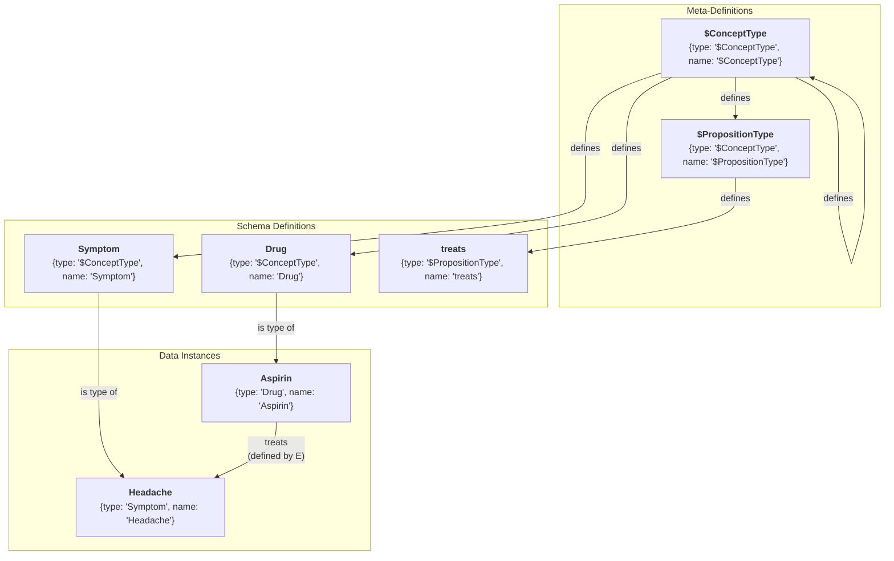
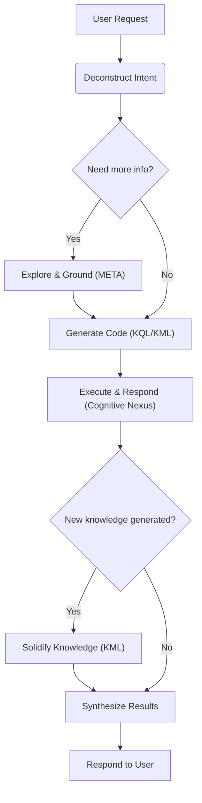

# 🧬 KIP (Knowledge Interaction Protocol) Specification (Draft)

**[English](./README.md) | [中文](./README_CN.md)**

**Version History**:
| Version     | Date       | Change Description                                                                                                                                                                                         |
| ----------- | ---------- | ---------------------------------------------------------------------------------------------------------------------------------------------------------------------------------------------------------- |
| v1.0-draft1 | 2025-06-09 | Initial draft                                                                                                                                                                                              |
| v1.0-draft2 | 2025-06-15 | Refined `UNION` clause                                                                                                                                                                                     |
| v1.0-draft3 | 2025-06-18 | Optimized terminology, simplified syntax, removed `SELECT` subqueries, added `META` clause, enhanced proposition link clause                                                                               |
| v1.0-draft4 | 2025-06-19 | Simplified syntax, removed `COLLECT`, `AS`, `@`                                                                                                                                                            |
| v1.0-draft5 | 2025-06-25 | Removed `ATTR` and `META`, introduced "Dot Notation" as a replacement; added `(id: "<link_id>")`; refined `DELETE` statement                                                                               |
| v1.0-draft6 | 2025-07-06 | Established naming conventions; introduced bootstrapping model: added "$ConceptType", "$PropositionType" meta-types and Domain type to enable in-graph schema definition; added Genesis Knowledge Capsule. |

**KIP Implementations**:
- [Anda KIP SDK](https://github.com/ldclabs/anda-db/tree/main/rs/anda_kip): A Rust SDK of KIP for building sustainable AI knowledge memory systems.
- [Anda Cognitive Nexus](https://github.com/ldclabs/anda-db/tree/main/rs/anda_cognitive_nexus): A Rust implementation of KIP (Knowledge Interaction Protocol) based on Anda DB.

**About Us**:
- [ICPanda DAO](https://panda.fans/): ICPanda is a technical panda fully running on the [Internet Computer](https://internetcomputer.org/) blockchain, building chain-native infrastructures, Anda.AI and dMsg.net.
- [Anda.AI](https://anda.ai/): Create next-generation AI agents with persistent memory, decentralized trust, and swarm intelligence.
- GitHub: [LDC Labs](https://github.com/ldclabs)
- Follow Us on X: [ICPanda DAO](https://x.com/ICPandaDAO)

## 0. Preamble

We stand at the dawn of a cognitive revolution driven by Large Language Models (LLMs). With their powerful capabilities in natural language understanding, generation, and reasoning, LLMs offer a glimpse into the future of Artificial General Intelligence (AGI). However, current LLMs resemble a **brilliant yet amnesiac genius**: they possess astonishing real-time reasoning abilities but lack stable, cumulative, and traceable long-term memory. They can engage in spectacular conversations, but once the dialogue ends, the knowledge vanishes. They can generate convincing "hallucinations" but cannot verify or validate their knowledge sources.

This chasm between the "neural core" and persistent, structured knowledge is the primary obstacle preventing AI Agents from evolving from "smart tools" to "true intelligent companions." How can we build an equally powerful, trustworthy "symbolic core" for this potent "neural core"—one that can evolve alongside it? This is the defining question of our time.

**KIP (Knowledge Interaction Protocol) was born to answer this question.**

It is not merely a set of technical specifications but a design philosophy, a new paradigm for AI architecture. KIP's core mission is to build a solid and efficient bridge connecting the transient, fluid "working memory" of LLMs with the persistent, stable "long-term memory" of a knowledge graph.
KIP elevates the interaction paradigm between AI and knowledge bases **from a one-way "tool-calling" to a two-way "cognitive symbiosis"**:
- The **neural core** (LLM) provides real-time reasoning.
- The **symbolic core** (knowledge graph) provides structured memory.
- **KIP** enables their synergistic evolution.

In this specification, we are committed to achieving three core objectives:

1.  **Empowering AI with Persistent Memory**: Through KIP, AI Agents can solidify new knowledge gained from dialogues, observations, and reasoning into their knowledge graph as structured "Knowledge Capsules" atomically and reliably. Memory is no longer volatile but becomes a depositable, compounding asset.

2.  **Enabling AI Self-Evolution**: Learning and forgetting are hallmarks of intelligence. KIP provides a complete Knowledge Manipulation Language (KML), allowing Agents to autonomously update, revise, or even delete outdated knowledge based on new evidence. This lays the foundation for building AI systems that can continuously learn, self-improve, and adapt to changing environments.

3.  **Building a Foundation of Trust for AI**: Trust stems from transparency. Every KIP interaction is an explicit, auditable "chain of thought." When an AI provides an answer, it can not only state "what" but also clearly demonstrate "how I know" through the KIP code it generates. This provides the indispensable underlying support for building responsible and explainable AI systems.

This specification aims to provide all developers, architects, and researchers with an open, universal, and powerful standard for building next-generation intelligent agents. We believe that the future of intelligence lies not in an isolated, omniscient "black box," but in an open system that knows how to learn and collaborate efficiently with trusted knowledge.

We welcome you to join us in exploring and refining KIP, to usher in a new era of AI self-evolution and sustainable learning.

## 1. Introduction & Design Philosophy

**KIP (Knowledge Interaction Protocol)** is a knowledge interaction protocol designed specifically for Large Language Models (LLMs). It defines a complete model for efficient, reliable, and bidirectional knowledge exchange between a neural core (LLM) and a symbolic core (knowledge graph) through a standardized set of instructions (KQL/KML) and data structures. It aims to build a long-term memory system for AI Agents that enables sustainable learning and self-evolution.

**Design Principles:**

*   **LLM-Friendly**: The syntax is clear and structured, making it easy for LLMs to generate code.
*   **Declarative**: The initiator of an interaction only needs to describe "what" they want, not "how" to achieve it.
*   **Graph-Native**: Deeply optimized for the structure and query patterns of knowledge graphs.
*   **Explainable**: The KIP code itself is a transparent record of the LLM's reasoning process, serving as an auditable and verifiable "chain of thought."
*   **Comprehensive**: Provides full lifecycle management capabilities, from data querying to knowledge evolution, forming the foundation for true learning in Agents.

## 2. Core Definitions

### 2.1. Cognitive Nexus

A knowledge graph composed of **Concept Nodes** and **Proposition Links**, serving as the long-term memory system for an AI Agent.

### 2.2. Concept Node

*   **Definition**: An **entity** or **abstract concept** within the knowledge graph, representing a fundamental unit of knowledge (like a "node" in a graph).
*   **Example**: A `Drug` node named "Aspirin," a `Symptom` node named "Headache."
*   **Structure**:
    *   `id`: String, a unique identifier used to locate the node in the graph.
    *   `type`: String, the type of the node. **Its value must be the name of a Concept Node that is already defined in the graph with the type `"$ConceptType"`**. Follows `UpperCamelCase` naming.
    *   `name`: String, the name of the node. The combination of `type` + `name` also uniquely identifies a node in the graph.
    *   `attributes`: Object, the node's attributes, describing its intrinsic properties.
    *   `metadata`: Object, the node's metadata, describing its source, credibility, etc.

### 2.3. Proposition Link

*   **Definition**: A **reified proposition** that states a **fact** in the form of a `(subject, predicate, object)` triplet. It acts as a **link** in the graph, connecting two concept nodes or enabling higher-order connections.
*   **Example**: A proposition link stating the fact "(Aspirin) - [treats] -> (Headache)".
*   **Structure**:
    *   `id`: String, a unique identifier used to locate the link in the graph.
    *   `subject`: String, the originator of the relation, which is the ID of a concept node or another proposition link.
    *   `predicate`: String, defines the type of **relation** between the subject and object. **Its value must be the name of a Concept Node that is already defined in the graph with the type `"$PropositionType"`**. Follows `snake_case` naming.
    *   `object`: String, the recipient of the relation, which is the ID of a concept node or another proposition link.
    *   `attributes`: Object, the proposition's attributes, describing its intrinsic properties.
    *   `metadata`: Object, the proposition's metadata, describing its source, credibility, etc.

### 2.4. Knowledge Capsule

An atomic unit of knowledge update, containing a collection of **Concept Nodes** and **Proposition Links**, designed to solve the problem of packaging, distributing, and reusing high-quality knowledge.

### 2.5. Cognitive Primer

A highly structured, information-dense JSON object designed specifically for LLMs. It contains a global summary and a domain map of the Cognitive Nexus, helping LLMs to quickly understand and utilize it.

### 2.6. Attributes & Metadata

*   **Attributes**: Key-value pairs describing the intrinsic properties of a **concept** or **fact**. They are part of the knowledge memory itself.
*   **Metadata**: Key-value pairs describing the **source, trustworthiness, and context** of knowledge. It does not change the content of the knowledge but describes "knowledge about the knowledge." (See Appendix 1 for metadata field design).

### 2.7. Value Types

KIP adopts the **JSON** data model. This means that all values used in KIP clauses follow the JSON standard for types and literal representations, ensuring unambiguous data exchange and making it extremely easy for LLMs to generate and parse.

*   **Primitive Types**: `string`, `number`, `boolean`, `null`.
*   **Complex Types**: `Array`, `Object`.
*   **Usage Limitation**: Although `Array` and `Object` can be stored as values for attributes or metadata, the KQL `FILTER` clause is **primarily designed to operate on primitive types**.

### 2.8. Identifiers & Naming Conventions

Identifiers are the foundation for naming variables, types, predicates, attributes, and metadata keys in KIP. To ensure the protocol's clarity, readability, and consistency, KIP standardizes the syntax and naming styles for identifiers.

#### 2.8.1. Identifier Syntax

A legal KIP identifier **must** start with a letter (`a-z`, `A-Z`) or an underscore (`_`), followed by any number of letters, digits (`0-9`), or underscores.
This rule applies to all types of names, but meta-types are specially marked with a `$` prefix, and variables are syntactically marked with a `?` prefix.

#### 2.8.2. Naming Conventions

In addition to the basic syntax rules, to enhance readability and make the code self-documenting, KIP **strongly recommends** following these naming conventions:

*   **Concept Node Types**: Use **UpperCamelCase**.
    *   **Examples**: `Drug`, `Symptom`, `MedicalDevice`, `ClinicalTrial`.
    *   **Meta-Types**: `$ConceptType`, `$PropositionType`. Types starting with `$` are system-reserved meta-types.

*   **Proposition Link Predicates**: Use **snake_case**.
    *   **Examples**: `treats`, `has_side_effect`, `is_subclass_of`, `belongs_to_domain`.

*   **Attribute & Metadata Keys**: Use **snake_case**.
    *   **Examples**: `molecular_formula`, `risk_level`, `last_updated_at`.

*   **Variables**: **Must** be prefixed with `?`. The part following the prefix is recommended to be in lowercase `snake_case`.
    *   **Examples**: `?drug`, `?side_effect`, `?clinical_trial`.

### 2.9. Knowledge Bootstrapping & Meta-Definition

One of KIP's core designs is the **self-describing capability of the knowledge graph**. The schema of the Cognitive Nexus—that is, all legal concept types and proposition types—is itself part of the graph, defined by concept nodes. This allows the entire knowledge system to be bootstrapped, understood, and extended without external definitions.

#### 2.9.1. Meta-Types

The system predefines only two special meta-types, prefixed with `$`:

*   **`"$ConceptType"`**: The type used to define **concept node types**. A node with `type: "$ConceptType"` signifies that this node itself defines a "type."
    *   **Example**: The node `{type: "$ConceptType", name: "Drug"}` defines `Drug` as a legal concept type. Only then can we create a node like `{type: "Drug", name: "Aspirin"}`.

*   **`"$PropositionType"`**: The type used to define **proposition link predicates**. A node with `type: "$PropositionType"` signifies that this node itself defines a "relation" or "predicate."
    *   **Example**: The node `{type: "$PropositionType", name: "treats"}` defines `treats` as a legal predicate. Only then can we create a proposition like `(?aspirin, "treats", ?headache)`.

#### 2.9.2. The Genesis

These two meta-types are themselves defined by concept nodes, forming a self-consistent loop:

*   The definition node for `"$ConceptType"` is: `{type: "$ConceptType", name: "$ConceptType"}`
*   The definition node for `"$PropositionType"` is: `{type: "$ConceptType", name: "$PropositionType"}`

This means `"$ConceptType"` is a type of `"$ConceptType"`, which forms the logical foundation of the entire type system.



#### 2.9.3. Cognitive Domain

To effectively organize and isolate knowledge, KIP introduces the concept of `Domain`:

*   **`Domain`**: It is itself a concept type, defined by `{type: "$ConceptType", name: "Domain"}`.
*   **Domain Node**: For example, `{type: "Domain", name: "Medical"}` creates a cognitive domain named "Medical".
*   **Membership Relation**: Concept nodes can initially be created without belonging to any domain, maintaining system flexibility and authenticity. In subsequent reasoning, they should be assigned to the appropriate domain via a `belongs_to_domain` proposition link, ensuring that the knowledge can be efficiently utilized by the LLM.

## 3. KIP-KQL Instruction Set: Knowledge Query Language

KQL is the part of KIP responsible for knowledge retrieval and inference.

### 3.1. Query Structure

```prolog
FIND( ... )
WHERE {
  ...
}
ORDER BY ...
LIMIT N
OFFSET M
```

### 3.2. Dot Notation

**Dot notation is the preferred way to access internal data of concept nodes and proposition links in KIP**. It provides a unified, intuitive, and powerful mechanism for direct data usage in clauses like `FIND`, `FILTER`, and `ORDER BY`.

The internal data of a node or link bound to a variable `?var` can be accessed via the following paths:

*   **Accessing Top-Level Fields**:
    *   `?var.id`, `?var.type`, `?var.name`: For concept nodes.
    *   `?var.id`, `?var.subject`, `?var.predicate`, `?var.object`: For proposition links.
*   **Accessing Attributes**:
    *   `?var.attributes.<attribute_name>`
*   **Accessing Metadata**:
    *   `?var.metadata.<metadata_key>`

**Example**:
```prolog
// Find drug names and their risk levels
FIND(?drug.name, ?drug.attributes.risk_level)

// Filter propositions with a confidence score higher than 0.9
FILTER(?link.metadata.confidence > 0.9)
```

### 3.3. `FIND` Clause

**Function**: Declares the final output of the query.

**Syntax**: `FIND( ... )`

*   **Multi-Variable Return**: Can specify one or more variables, e.g., `FIND(?drug, ?symptom)`.
*   **Aggregated Return**: Can use aggregate functions on variables, e.g., `FIND(?var1, ?agg_func(?var2))`.
    *   **Aggregate Functions**: `COUNT(?var)`, `COUNT(DISTINCT ?var)`, `SUM(?var)`, `AVG(?var)`, `MIN(?var)`, `MAX(?var)`.

### 3.4. `WHERE` Clause

**Function**: Contains a series of graph pattern matching and filter clauses. All clauses are implicitly connected by a logical **AND**.

#### 3.4.1. Concept Node Clause

**Function**: Matches concept nodes and binds them to variables. Uses `{...}` syntax.

**Syntax**:
*   `?node_var {id: "<id>"}`: Matches a unique concept node by its ID.
*   `?node_var {type: "<Type>", name: "<name>"}`: Matches a unique concept node by its type and name.
*   `?nodes_var {type: "<Type>"}`, `?nodes_var {name: "<name>"}`: Matches a set of concept nodes by type or name.

`?node_var` binds the matched concept node(s) to a variable for subsequent operations. However, when a concept node clause is used directly as the subject or object of a proposition link clause, a variable name should not be defined.

**Example**:

```prolog
// Match all nodes of type "Drug"
?drug {type: "Drug"}

// Match the drug named "Aspirin"
?aspirin {type: "Drug", name: "Aspirin"}

// Match a node with a specific ID
?headache {id: "C:123"}
```

#### 3.4.2. Proposition Link Clause

**Function**: Matches proposition links and binds them to variables. Uses `(...)` syntax.

**Syntax**:
*   `?link_var (id: "<link_id>")`: Matches a unique proposition link by its ID.
*   `?link_var (?subject, "<predicate>", ?object)`: Matches a set of proposition links by a structural pattern. The subject or object can be a variable for a concept node or another proposition link, or a clause without a variable name.
*   The predicate part supports path operators:
    *   `predicate{m,n}`: Matches a path of m to n hops, e.g., `"follows"{1,5}`, `"follows"{1,}`, `"follows"{5}`.
    *   `predicate1 | predicate2`: Matches `predicate1` or `predicate2`, e.g., `"follows" | "connects" | "links"`.

`?link_var` is optional and binds the matched proposition link(s) to a variable for subsequent operations.

**Example**:

```prolog
// Find all drugs that treat headaches
(?drug, "treats", ?headache)

// Bind a proposition with a known ID to a variable
?specific_fact (id: "P:12345:treats")

// Higher-order proposition: the object is another proposition
(?user, "stated", (?drug, "treats", ?symptom))
```

```prolog
// Find the parent concepts of a concept within 5 hops
(?concept, "is_subclass_of{0,5}", ?parent_concept)
```

#### 3.4.3. `FILTER` Clause

**Function**: Applies more complex filtering conditions to already bound variables. **Dot notation is strongly recommended**.

**Syntax**: `FILTER(boolean_expression)`

**Functions & Operators**:
*   **Comparison**: `==`, `!=`, `<`, `>`, `<=`, `>=`
*   **Logical**: `&&` (AND), `||` (OR), `!` (NOT)
*   **String**: `CONTAINS(?str, "sub")`, `STARTS_WITH(?str, "prefix")`, `ENDS_WITH(?str, "suffix")`, `REGEX(?str, "pattern")`

**Example**:
```prolog
// Filter for drugs with a risk level less than 3 and whose name contains "acid"
FILTER(?drug.attributes.risk_level < 3 && CONTAINS(?drug.name, "acid"))
```

#### 3.4.4. `NOT` Clause

**Function**: Excludes solutions that match a specific pattern.

**Syntax**: `NOT { ... }`

**Example**:

```prolog
// Exclude all drugs belonging to the NSAID class
NOT {
  ?nsaid_class {name: "NSAID"}
  (?drug, "is_class_of", ?nsaid_class)
}
```

A simpler version:
```prolog
// Exclude all drugs belonging to the NSAID class
NOT {
  (?drug, "is_class_of", {name: "NSAID"})
}
```

#### 3.4.5. `OPTIONAL` Clause

**Function**: Attempts to match an optional pattern, similar to SQL's `LEFT JOIN`.

**Syntax**: `OPTIONAL { ... }`

**Example**:

```prolog
// Find all drugs and, if they exist, also find their side effects
?drug {type: "Drug"}

OPTIONAL {
  (?drug, "has_side_effect", ?side_effect)
}
```

#### 3.4.6. `UNION` Clause

**Function**: Combines the results of multiple patterns, implementing a logical **OR**.

**Syntax**: `UNION { ... }`

**Example**:

```prolog
// Find drugs that treat "Headache" or "Fever"
(?drug, "treats", {name: "Headache"})

UNION {
  (?drug, "treats", {name: "Fever"})
}
```

### 3.5. Solution Modifiers

These clauses post-process the result set after the `WHERE` logic has been executed.

*   **`ORDER BY ?var [ASC|DESC]`**: Sorts the results based on a specified variable. Defaults to `ASC` (ascending).
*   **`LIMIT N`**: Limits the number of returned results.
*   **`OFFSET M`**: Skips the first M results.

### 3.6. Comprehensive Query Examples

**Example 1**: Find all non-NSAID drugs that treat 'Headache', with a risk level below 4. Sort them by risk level from low to high and return the drug name and risk level.

```prolog
FIND(
  ?drug.name,
  ?drug.attributes.risk_level
)
WHERE {
  ?drug {type: "Drug"}
  ?headache {name: "Headache"}

  (?drug, "treats", ?headache)

  NOT {
    (?drug, "is_class_of", {name: "NSAID"})
  }

  FILTER(?drug.attributes.risk_level < 4)
}
ORDER BY ?drug.attributes.risk_level ASC
LIMIT 20
```

**Example 2**: List all drugs in the NSAID class and, if available, show their known side effects and the source of that information.

```prolog
FIND(
  ?drug.name,
  ?side_effect.name,
  ?link.metadata.source
)
WHERE {
  (?drug, "is_class_of", {name: "NSAID"})

  OPTIONAL {
    ?link (?drug, "has_side_effect", ?side_effect)
  }
}
```

**Example 3 (Higher-Order Proposition Deconstruction)**: Find the fact 'Aspirin treats Headache' as stated by the user 'John Doe', and return the confidence level of that statement.

```prolog
FIND(?statement.metadata.confidence)
WHERE {
  // Match the core fact: (Aspirin)-[treats]->(Headache)
  ?fact (
    {type: "Drug", name: "Aspirin"},
    "treats",
    {type: "Symptom", name: "Headache"}
  )

  // Match the higher-order proposition: (John Doe)-[stated]->(fact)
  ?statement ({type: "User", name: "John Doe"}, "stated", ?fact)
}
```

## 4. KIP-KML Instruction Set: Knowledge Manipulation Language

KML is the part of KIP responsible for knowledge evolution, serving as the core tool for Agent learning.

### 4.1. `UPSERT` Statement

**Function**: Creates or updates knowledge, carrying a "Knowledge Capsule." The operation must be **idempotent**, meaning that executing the same command multiple times produces the same result as executing it once, without creating duplicate data or unexpected side effects.

**Syntax**:

```prolog
UPSERT {
  CONCEPT ?local_handle {
    {type: "<Type>", name: "<name>"} // Or: {id: "<id>"}
    SET ATTRIBUTES { <key>: <value>, ... }
    SET PROPOSITIONS {
      ("<predicate>", { <existing_concept> })
      ("<predicate>", ( <existing_proposition> ))
      ("<predicate>", ?other_handle) WITH METADATA { <key>: <value>, ... }
      ...
    }
  }
  WITH METADATA { <key>: <value>, ... }

  PROPOSITION ?local_prop {
    (?subject, "<predicate>", ?object) // Or: (id: "<id>")
    SET ATTRIBUTES { <key>: <value>, ... }
  }
  WITH METADATA { <key>: <value>, ... }

  ...
}
WITH METADATA { <key>: <value>, ... }
```

**Key Components**:

*   **`UPSERT` Block**: The container for the entire operation, guaranteeing the idempotency of all internal operations.
*   **`CONCEPT` Block**: Defines a concept node.
    *   `?local_handle`: A local handle (or anchor) starting with `?`, used to reference this new concept within the transaction. It is only valid within this `UPSERT` block.
    *   `{type: "<Type>", name: "<name>"}`: Matches or creates a concept node. `{id: "<id>"}` will only match an existing concept node.
    *   `SET ATTRIBUTES { ... }`: Sets or updates the node's attributes.
    *   `SET PROPOSITIONS { ... }`: Defines or updates proposition links originating from this concept node. The behavior of `SET PROPOSITIONS` is **additive, not replacing**. It checks all outgoing relations of the concept node: 1. If an identical proposition (same subject, predicate, and object) does not exist in the graph, it creates this new proposition. 2. If an identical proposition already exists, it only updates or adds the metadata specified in `WITH METADATA`. If a proposition itself needs to carry complex intrinsic attributes, it is recommended to define it in a separate `PROPOSITION` block and reference it via a local handle `?handle`.
        *   `("<predicate>", ?local_handle)`: Links to another concept or proposition defined within this capsule.
        *   `("<predicate>", {type: "<Type>", name: "<name>"})`, `("<predicate>", {id: "<id>"})`: Links to an existing concept in the graph. If it doesn't exist, the link is ignored.
        *   `("<predicate>", (?subject, "<predicate>", ?object))`: Links to an existing proposition in the graph. If it doesn't exist, the link is ignored.
*   **`PROPOSITION` Block**: Defines a standalone proposition link, typically used for creating complex relationships within a capsule.
    *   `?local_prop`: A local handle to reference this proposition link.
    *   `(?subject, "<predicate>", <object>)`: Matches or creates a proposition link. `(id: "<id>")` will only match an existing proposition link.
    *   `SET ATTRIBUTES { ... }`: A simple key-value list for setting or updating the proposition link's attributes.
*   **`WITH METADATA` Block**: Appends metadata to a `CONCEPT`, `PROPOSITION`, or the entire `UPSERT` block. Metadata in the `UPSERT` block serves as the default metadata for all concept nodes and proposition links defined within it, though each `CONCEPT` or `PROPOSITION` block can also define its own specific metadata.

**Example**:

Suppose we have a knowledge capsule to define a new, hypothetical nootropic drug called "Cognizine." This capsule includes:
*   The concept and attributes of the drug itself.
*   It treats "Brain Fog."
*   It belongs to the "Nootropic" class (an existing category).
*   It has a newly discovered side effect, "Neural Bloom" (also a new concept).

**Content of `cognizine_capsule.kip`:**

```prolog
// Knowledge Capsule: cognizin.v1.0
// Description: Defines the novel nootropic drug "Cognizine" and its effects.

UPSERT {
  // Define the main drug concept: Cognizine
  CONCEPT ?cognizine {
    { type: "Drug", name: "Cognizine" }
    SET ATTRIBUTES {
      molecular_formula: "C12H15N5O3",
      dosage_form: { "type": "tablet", "strength": "500mg" },
      risk_level: 2,
      description: "A novel nootropic drug designed to enhance cognitive functions."
    }
    SET PROPOSITIONS {
      // Link to an existing concept (Nootropic)
      ("is_class_of", { type: "DrugClass", name: "Nootropic" })

      // Link to an existing concept (Brain Fog)
      ("treats", { type: "Symptom", name: "Brain Fog" })

      // Link to another new concept defined within this capsule (?neural_bloom)
      ("has_side_effect", ?neural_bloom) WITH METADATA {
        // This specific proposition has its own metadata
        confidence: 0.75,
        source: "Preliminary Clinical Trial NCT012345"
      }
    }
  }

  // Define the new side effect concept: Neural Bloom
  CONCEPT ?neural_bloom {
    { type: "Symptom", name: "Neural Bloom" }
    SET ATTRIBUTES {
      description: "A rare side effect characterized by a temporary burst of creative thoughts."
    }
    // This concept has no outgoing propositions in this capsule
  }
}
WITH METADATA {
  // Global metadata for all facts in this capsule
  source: "KnowledgeCapsule:Nootropics_v1.0",
  author: "LDC Labs Research Team",
  confidence: 0.95,
  status: "reviewed"
}
```

### 4.2. `DELETE` Statement

**Function**: Provides a unified interface for selectively removing knowledge (attributes, propositions, or entire concepts) from the Cognitive Nexus.

#### 4.2.1. Delete Attributes (`DELETE ATTRIBUTES`)

**Function**: Bulk-deletes multiple attributes from matching concept nodes or proposition links.

**Syntax**: `DELETE ATTRIBUTES { "attribute_name", ... } FROM ?target WHERE { ... }`

**Example**:

```prolog
// Delete "risk_category" and "old_id" attributes from the "Aspirin" node
DELETE ATTRIBUTES {"risk_category", "old_id"} FROM ?drug
WHERE {
  ?drug {type: "Drug", name: "Aspirin"}
}
```

```prolog
// Delete the "risk_category" attribute from all drug nodes
DELETE ATTRIBUTES { "risk_category" } FROM ?drug
WHERE {
  ?drug { type: "Drug" }
}
```

```prolog
// Delete the "category" attribute from all proposition links
DELETE ATTRIBUTES { "category" } FROM ?links
WHERE {
  ?links (?s, ?p, ?o)
}
```

#### 4.2.2. Delete Metadata Fields (`DELETE METADATA`)

**Function**: Bulk-deletes multiple metadata fields from matching concept nodes or proposition links.

**Syntax**: `DELETE METADATA { "metadata_key", ... } FROM ?target WHERE { ... }`

**Example**:

```prolog
// Delete the "old_source" metadata field from the "Aspirin" node
DELETE METADATA {"old_source"} FROM ?drug
WHERE {
  ?drug {type: "Drug", name: "Aspirin"}
}
```

#### 4.2.3. Delete Propositions (`DELETE PROPOSITIONS`)

**Function**: Bulk-deletes matching proposition links.

**Syntax**: `DELETE PROPOSITIONS ?target_link WHERE { ... }`

**Example**:

```prolog
// Delete all propositions from a specific untrusted source
DELETE PROPOSITIONS ?link
WHERE {
  ?link (?s, ?p, ?o)
  FILTER(?link.metadata.source == "untrusted_source_v1")
}
```

#### 4.2.4. Delete Concept (`DELETE CONCEPT`)

**Function**: Completely deletes a concept node and all of its associated proposition links.

**Syntax**: `DELETE CONCEPT ?target_node DETACH WHERE { ... }`

*   The `DETACH` keyword is mandatory as a safety confirmation, indicating the intent to delete the node along with all its relationships.

**Example**:

```prolog
// Delete the "OutdatedDrug" concept and all its relationships
DELETE CONCEPT ?drug DETACH
WHERE {
  ?drug {type: "Drug", name: "OutdatedDrug"}
}
```

## 5. KIP-META Instruction Set: Knowledge Exploration & Grounding

META is a lightweight subset of KIP focused on "Introspection" and "Disambiguation." These are fast, metadata-driven commands that do not involve complex graph traversals.

### 5.1. `DESCRIBE` Statement

**Function**: The `DESCRIBE` command queries the "schema" information of the Cognitive Nexus, helping the LLM understand "what's inside."

**Syntax**: `DESCRIBE [TARGET] <options>`

#### 5.1.1. Igniting the Cognitive Engine (`DESCRIBE PRIMER`)

**Function**: Retrieves the "Cognitive Primer" to guide the LLM on how to efficiently utilize the Cognitive Nexus.

The Cognitive Primer consists of two parts:
1.  **Identity Layer** - "Who am I?"
    This is the highest level of generalization, defining the AI Agent's core identity, capability boundaries, and fundamental principles. It includes:

    *   The Agent's role and objectives (e.g., "I am a professional medical knowledge assistant, aiming to provide accurate and traceable medical information").
    *   The existence and role of the Cognitive Nexus ("My memory and knowledge are stored in a Cognitive Nexus, which I can query via KIP calls").
    *   A summary of core capabilities ("I can perform disease diagnosis, drug lookups, interpret lab reports...").
2.  **Domain Map Layer** - "What do I know?"
    This is the core of the "Cognitive Primer." It is not a list of knowledge but a **topological summary** of the Cognitive Nexus. It includes:

    *   **Major Knowledge Domains**: Lists the top-level domains in the knowledge base.
    *   **Key Concepts**: Under each domain, lists the most important or frequently queried **Concept Nodes**.
    *   **Key Propositions**: Lists the predicates from the most important or frequently queried **Proposition Links**.

**Syntax**: `DESCRIBE PRIMER`

#### 5.1.2. List All Cognitive Domains (`DESCRIBE DOMAINS`)

**Function**: Lists all available cognitive domains to guide the LLM in effective grounding.

**Syntax**: `DESCRIBE DOMAINS`

**Semantically equivalent to**:
```prolog
FIND(?domains.name)
WHERE {
  ?domains {type: "Domain"}
}
```

#### 5.1.3. List All Concept Node Types (`DESCRIBE CONCEPT TYPES`)

**Function**: Lists all existing concept node types to guide the LLM in effective grounding.

**Syntax**: `DESCRIBE CONCEPT TYPES [LIMIT N] [OFFSET M]`

**Semantically equivalent to**:
```prolog
FIND(?type_def.name)
WHERE {
  ?type_def {type: "$ConceptType"}
}
LIMIT N OFFSET M
```

#### 5.1.4. Describe a Specific Concept Node Type (`DESCRIBE CONCEPT TYPE "<TypeName>"`)

**Function**: Describes the details of a specific concept node type, including its attributes and common relationships.

**Syntax**: `DESCRIBE CONCEPT TYPE "<TypeName>"`

**Semantically equivalent to**:
```prolog
FIND(?type_def)
WHERE {
  ?type_def {type: "$ConceptType", name: "<TypeName>"}
}
```

**Example**:

```prolog
DESCRIBE CONCEPT TYPE "Drug"
```

#### 5.1.5. List All Proposition Link Types (`DESCRIBE PROPOSITION TYPES`)

**Function**: Lists all predicates of proposition links to guide the LLM in effective grounding.

**Syntax**: `DESCRIBE PROPOSITION TYPES [LIMIT N] [OFFSET M]`

**Semantically equivalent to**:
```prolog
FIND(?type_def.name)
WHERE {
  ?type_def {type: "$PropositionType"}
}
LIMIT N OFFSET M
```

#### 5.1.6. Describe a Specific Proposition Link Type (`DESCRIBE PROPOSITION TYPE "<predicate>"`)

**Function**: Describes the details of a specific proposition link predicate, including the common types of its subject and object (its domain and range).

**Syntax**: `DESCRIBE PROPOSITION TYPE "<predicate>"`

**Semantically equivalent to**:
```prolog
FIND(?type_def)
WHERE {
  ?type_def {type: "$PropositionType", name: "<predicate>"}
}
```

### 5.2. `SEARCH` Statement

**Function**: The `SEARCH` command links natural language terms to specific entities in the knowledge graph. It focuses on efficient, text-index-driven lookups rather than full graph pattern matching.

**Syntax**: `SEARCH [CONCEPT|PROPOSITION] "<term>" [WITH TYPE "<Type>"] [LIMIT N]`

**Example**:

```prolog
// Search for the concept "aspirin" across the entire graph
SEARCH CONCEPT "aspirin" LIMIT 5

// Search for the concept "aspirin" within a specific type
SEARCH CONCEPT "aspirin" WITH TYPE "Drug"

// Search for propositions involving "treats" across the entire graph
SEARCH PROPOSITION "treats" LIMIT 10
```

## 6. Request & Response Structure

All interactions with the Cognitive Nexus are conducted through a standardized request-response model. The LLM Agent sends KIP commands to the Cognitive Nexus via a structured request (typically encapsulated in a Function Call), and the Nexus returns a structured JSON response.

### 6.1. Request Structure

The KIP command generated by the LLM should be sent to the Cognitive Nexus via a structured request like the following Function Call:
```js
{
  "function": {
    "name": "execute_kip",
    "arguments": JSON.stringify({
      "command": `
        FIND(?drug.name)
        WHERE {
          ?symptom {name: $symptom_name}
          (?drug, "treats", ?symptom)
        }
        LIMIT $limit
      `,
      "parameters": {
        "symptom_name": "Headache",
        "limit": 10
      }
    })
  }
}
```

**`execute_kip` Function Arguments Explained**:

| Parameter        | Type    | Required | Description                                                                                                                                                                                                                                                                                                                          |
| :--------------- | :------ | :------- | :----------------------------------------------------------------------------------------------------------------------------------------------------------------------------------------------------------------------------------------------------------------------------------------------------------------------------------- |
| **`command`**    | String  | Yes      | The complete, unmodified KIP command text. Use a multi-line string to maintain formatting and readability.                                                                                                                                                                                                                           |
| **`parameters`** | Object  | No       | An optional key-value object for passing execution context parameters outside the command text. Placeholders in the command text (e.g., `$symptom_name`) are safely replaced with the corresponding values from the `parameters` object before execution. This helps prevent injection attacks and makes command templates reusable. |
| **`dry_run`**    | Boolean | No       | If `true`, the command's syntax and logic will be validated, but not executed.                                                                                                                                                                                                                                                       |

### 6.2. Response Structure

**All responses from the Cognitive Nexus are a JSON object with the following structure:**

| Key          | Type   | Required | Description                                                                                                                                  |
| :----------- | :----- | :------- | :------------------------------------------------------------------------------------------------------------------------------------------- |
| **`result`** | Object | No       | **Must** be present on success. Contains the successful result of the request. Its internal structure is defined by the KIP request command. |
| **`error`**  | Object | No       | **Must** be present on failure. Contains structured details about the error.                                                                 |

## 7. Protocol Interaction Workflow

As a "cognitive strategist," the LLM must follow this protocol workflow to interact with the Cognitive Nexus, ensuring accuracy and robustness of communication.

**Example Flowchart**:


1.  **Deconstruct Intent**:
    The LLM breaks down the user's ambiguous request into a series of clear, logical objectives: whether to query information, update knowledge, or a combination of both.

2.  **Explore & Ground**:
    The LLM communicates with the Cognitive Nexus by generating a series of KIP-META commands to clarify ambiguities and obtain the exact "coordinates" needed to build the final query.

3.  **Generate Code**:
    The LLM uses the **precise IDs, types, and attribute names** obtained from the META interaction to generate a high-quality KQL or KML query.

4.  **Execute & Respond**:
    The generated code is sent to the Cognitive Nexus's inference engine for execution. The engine returns structured data results or a status of successful operation.

5.  **Solidify Knowledge**:
    If new, credible knowledge is generated during the interaction (e.g., the user confirms a new fact), the LLM should fulfill its duty to "learn":
    *   Generate an `UPSERT` statement encapsulating the new knowledge.
    *   Execute the statement to permanently store the new knowledge in the Cognitive Nexus, completing the learning loop.

6.  **Synthesize Results**:
    The LLM translates the structured data or operation receipt from the symbolic core into fluent, human-like, and **explainable** natural language. It is recommended that the LLM explains its reasoning process (i.e., the logic represented by the KIP code) to the user to build trust.

## Appendix 1. Metadata Field Design

Well-designed metadata is key to building a self-evolving, traceable, and auditable memory system. We recommend the following categories of metadata fields: Provenance & Trustworthiness, Temporality & Lifecycle, and Context & Auditing.

### 1.1. Provenance & Trustworthiness
*   **`source`**: `String` | `Array<String>`, identifier for the direct source of the knowledge.
*   **`confidence`**: `Number`, a confidence score (0.0-1.0) that the knowledge is true.
*   **`evidence`**: `Array<String>`, pointers to specific evidence supporting the assertion.

### 1.2. Temporality & Lifecycle
*   **`created_at` / `last_updated_at`**: `String` (ISO 8601), creation/update timestamps.
*   **`valid_from` / `valid_until`**: `String` (ISO 8601), the start and end time for the validity of the knowledge assertion.
*   **`status`**: `String`, e.g., `"active"`, `"deprecated"`, `"retracted"`.

### 1.3. Context & Auditing
*   **`relevance_tags`**: `Array<String>`, topic or domain tags.
*   **`author`**: `String`, the entity that created the record.
*   **`access_level`**: `String`, e.g., `"public"`, `"private"`.
*   **`review_info`**: `Object`, a structured object containing the review history.

## Appendix 2. The Genesis Capsule

**The Genesis Design Philosophy**:
1.  **Fully Self-Consistent**: The node that defines `"$ConceptType"` must itself conform perfectly to the rules it defines. Its very existence perfectly illustrates what a concept type is.
2.  **Metadata-Driven**: The `attributes` of the meta-type nodes make the schema itself queryable, describable, and evolvable.
3.  **Guidance-Oriented**: These definitions are not just constraints but also "user manuals" for the LLM. They tell the LLM how to name things, how to construct instances, and which instances are most important, significantly reducing the probability of "hallucinations" when interacting with the knowledge nexus.
4.  **Extensible**: The `instance_schema` structure allows for the future definition of extremely rich and complex attribute constraints for different types of concepts, laying a solid foundation for building knowledge bases in specialized domains.

```prolog
// # KIP Genesis Capsule v1.0
// The foundational knowledge that bootstraps the entire Cognitive Nexus.
// It defines what a "Concept Type" and a "Proposition Type" are,
// by creating instances of them that describe themselves.
//
UPSERT {
    // --- STEP 1: THE PRIME MOVER - DEFINE "$ConceptType" ---
    // The absolute root of all knowledge. This node defines what it means to be a "type"
    // of concept. It defines itself, creating the first logical anchor.
    CONCEPT ?concept_type_def {
        {type: "$ConceptType", name: "$ConceptType"}
        SET ATTRIBUTES {
            description: "Defines a class or category of Concept Nodes. It acts as a template for creating new concept instances. Every concept node in the graph must have a 'type' that points to a concept of this type.",
            display_hint: "📦",
            instance_schema: {
                "description": {
                    type: "string",
                    is_required: true,
                    description: "A human-readable explanation of what this concept type represents."
                },
                "display_hint": {
                    type: "string",
                    is_required: false,
                    description: "A suggested icon or visual cue for user interfaces (e.g., an emoji or icon name)."
                },
                "instance_schema": {
                    type: "object",
                    is_required: false,
                    description: "A recommended schema defining the common and core attributes for instances of this concept type. It serves as a 'best practice' guideline for knowledge creation, not a rigid constraint. Keys are attribute names, values are objects defining 'type', 'is_required', and 'description'. Instances SHOULD include required attributes but MAY also include any other attribute not defined in this schema, allowing for knowledge to emerge and evolve freely."
                },
                "key_instances": {
                    type: "array",
                    item_type: "string",
                    is_required: false,
                    description: "A list of names of the most important or representative instances of this type, to help LLMs ground their queries."
                }
            },
            key_instances: [ "$ConceptType", "$PropositionType", "Domain" ]
        }
    }

    // --- STEP 2: DEFINE "$PropositionType" USING "$ConceptType" ---
    // With the ability to define concepts, we now define the concept of a "relation" or "predicate".
    CONCEPT ?proposition_type_def {
        {type: "$ConceptType", name: "$PropositionType"}
        SET ATTRIBUTES {
            description: "Defines a class of Proposition Links (a predicate). It specifies the nature of the relationship between a subject and an object.",
            display_hint: "🔗",
            instance_schema: {
                "description": {
                    type: "string",
                    is_required: true,
                    description: "A human-readable explanation of what this relationship represents."
                },
                "subject_types": {
                    type: "array",
                    item_type: "string",
                    is_required: true,
                    description: "A list of allowed '$ConceptType' names for the subject. Use '*' for any type."
                },
                "object_types": {
                    type: "array",
                    item_type: "string",
                    is_required: true,
                    description: "A list of allowed '$ConceptType' names for the object. Use '*' for any type."
                },
                "is_symmetric": { type: "boolean", is_required: false, default_value: false },
                "is_transitive": { type: "boolean", is_required: false, default_value: false }
            },
            key_instances: [ "belongs_to_domain" ]
        }
    }

    // --- STEP 3: DEFINE THE TOOLS FOR ORGANIZATION ---
    // Now that we can define concepts and propositions, we create the specific
    // concepts needed for organizing the knowledge graph itself.

    // 3a. Define the "Domain" concept type.
    CONCEPT ?domain_type_def {
        {type: "$ConceptType", name: "Domain"}
        SET ATTRIBUTES {
            description: "Defines a high-level container for organizing knowledge. It acts as a primary category for concepts and propositions, enabling modularity and contextual understanding.",
            display_hint: "🗺️",
            instance_schema: {
                "description": {
                    type: "string",
                    is_required: true,
                    description: "A clear, human-readable explanation of what knowledge this domain encompasses."
                },
                "display_hint": {
                    type: "string",
                    is_required: false,
                    description: "A suggested icon or visual cue for this specific domain (e.g., a specific emoji)."
                },
                "scope_note": {
                    type: "string",
                    is_required: false,
                    description: "A more detailed note defining the precise boundaries of the domain, specifying what is included and what is excluded."
                },
                "aliases": {
                    type: "array",
                    item_type: "string",
                    is_required: false,
                    description: "A list of alternative names or synonyms for the domain, to aid in search and natural language understanding."
                },
                "steward": {
                    type: "string",
                    is_required: false,
                    description: "The name of the 'Person' (human or AI) primarily responsible for curating and maintaining the quality of knowledge within this domain."
                }

            },
            key_instances: ["CoreSchema"]
        }
    }

    // 3b. Define the "belongs_to_domain" proposition type.
    CONCEPT ?belongs_to_domain_prop {
        {type: "$PropositionType", name: "belongs_to_domain"}
        SET ATTRIBUTES {
            description: "A fundamental proposition that asserts a concept's membership in a specific knowledge domain.",
            subject_types: ["*"], // Any concept can belong to a domain.
            object_types: ["Domain"] // The object must be a Domain.
        }
    }

    // 3c. Create a dedicated domain "CoreSchema" for meta-definitions.
    // This domain will contain the definitions of all concept types and proposition types.
    CONCEPT ?core_domain {
        {type: "Domain", name: "CoreSchema"}
        SET ATTRIBUTES {
            description: "The foundational domain containing the meta-definitions of the KIP system itself.",
            display_hint: "🧩"
        }
    }
}
WITH METADATA {
    source: "KIP Genesis Capsule v1.0",
    author: "System Architect",
    confidence: 1.0,
    status: "active"
}

// Post-Genesis Housekeeping
UPSERT {
    // Assign all meta-definition concepts to the "CoreSchema" domain.
    CONCEPT ?core_domain {
        {type: "Domain", name: "CoreSchema"}
    }
    CONCEPT ?concept_type_def {
        {type: "$ConceptType", name: "$ConceptType"}
        SET PROPOSITIONS { ("belongs_to_domain", ?core_domain) }
    }
    CONCEPT ?proposition_type_def {
        {type: "$ConceptType", name: "$PropositionType"}
        SET PROPOSITIONS { ("belongs_to_domain", ?core_domain) }
    }
    CONCEPT ?domain_type_def {
        {type: "$ConceptType", name: "Domain"}
        SET PROPOSITIONS { ("belongs_to_domain", ?core_domain) }
    }
    CONCEPT ?belongs_to_domain_prop {
        {type: "$PropositionType", name: "belongs_to_domain"}
        SET PROPOSITIONS { ("belongs_to_domain", ?core_domain) }
    }
}
WITH METADATA {
    source: "System Maintenance",
    author: "System Architect",
    confidence: 1.0,
}
```
