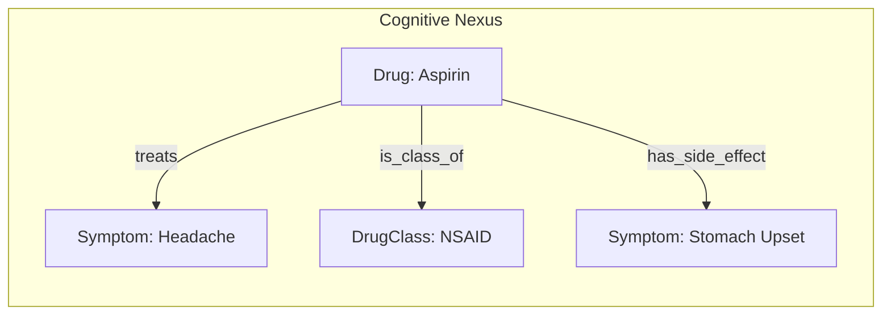

# 🧬 KIP (Knowledge Interaction Protocol)

**[English](./README.md) | [中文](./README_CN.md)**

<p align="center">
  <em>A graph-oriented interaction protocol designed specifically for Large Language Models,<br/>bridging the gap between LLM and Knowledge Graph.</em>
</p>

---

## What is KIP?

**KIP (Knowledge Interaction Protocol)** is a standard interaction protocol that bridges the gap between **LLM (Probabilistic Reasoning Engine)** and **Knowledge Graph (Deterministic Knowledge Base)**. It is not merely a database interface, but a set of **memory and cognitive operation primitives** designed specifically for intelligent agents.

Large Language Models (LLMs) have demonstrated remarkable capabilities in general reasoning and generation. However, their **"Stateless"** essence results in a lack of long-term memory, while their probability-based generation mechanism often leads to uncontrollable "hallucinations" and knowledge obsolescence.

KIP was born to solve this problem through **Neuro-Symbolic AI** approach.

### Key Benefits

- 🧠 **Memory Persistence**: Transform conversations, observations, and reasoning results into structured "Knowledge Capsules"
- 📈 **Knowledge Evolution**: Complete CRUD and metadata management for autonomous learning and error correction
- 🔍 **Explainable Interaction**: Make every answer traceable and every decision logically transparent
- ⚡ **LLM-Optimized**: Protocol syntax optimized for Transformer architectures with native JSON structures

## Quick Start

```prolog
// Query: Find all drugs that treat headache
FIND(?drug.name)
WHERE {
  ?drug {type: "Drug"}
  (?drug, "treats", {name: "Headache"})
}
LIMIT 10
```

```prolog
// Store: Create a new knowledge capsule
UPSERT {
  CONCEPT ?aspirin {
    {type: "Drug", name: "Aspirin"}
    SET ATTRIBUTES { molecular_formula: "C9H8O4", risk_level: 2 }
    SET PROPOSITIONS { ("treats", {type: "Symptom", name: "Headache"}) }
  }
}
WITH METADATA { source: "FDA", confidence: 0.95 }
```

```prolog
// Explore: Discover schema
DESCRIBE PRIMER
```

## Documentation

| Document                                           | Description                                       |
| -------------------------------------------------- | ------------------------------------------------- |
| [📖 Specification](./SPECIFICATION.md)              | Complete KIP protocol specification (English)     |
| [📖 规范文档](./SPECIFICATION_CN.md)                | 完整的 KIP 协议规范 (中文)                        |
| [🤖 Agent Instructions](./SelfInstructions.md)      | Operational guide for AI agents using KIP         |
| [⚙️ System Instructions](./SystemInstructions.md)   | System-level maintenance and hygiene guide        |
| [📋 Function Definition](./FunctionDefinition.json) | `execute_kip` function schema for LLM integration |

## Core Concepts

### Cognitive Nexus

A knowledge graph composed of **Concept Nodes** and **Proposition Links**, serving as the AI Agent's **unified memory brain**.



### KIP Instruction Sets

| Instruction Set        | Purpose                           | Examples                  |
| ---------------------- | --------------------------------- | ------------------------- |
| **KQL** (Query)        | Knowledge retrieval and reasoning | `FIND`, `WHERE`, `FILTER` |
| **KML** (Manipulation) | Knowledge evolution and learning  | `UPSERT`, `DELETE`        |
| **META** (Discovery)   | Schema exploration and grounding  | `DESCRIBE`, `SEARCH`      |

### Schema Bootstrapping

KIP uses a self-describing schema where type definitions are stored within the graph itself:

- `$ConceptType`: Meta-type for defining concept node types
- `$PropositionType`: Meta-type for defining proposition predicates
- `Domain`: Organizational units for knowledge

## Resources

This repository includes ready-to-use resources for building KIP-powered AI agents:

### 📦 Knowledge Capsules (`capsules/`)

Pre-built knowledge capsules for bootstrapping your Cognitive Nexus:

| Capsule                                             | Description                                                 |
| --------------------------------------------------- | ----------------------------------------------------------- |
| [Genesis.kip](./capsules/Genesis.kip)               | Foundational capsule that bootstraps the entire type system |
| [Person.kip](./capsules/Person.kip)                 | `Person` concept type for actors (AI, Human, Organization)  |
| [Event.kip](./capsules/Event.kip)                   | `Event` concept type for episodic memory                    |
| [persons/self.kip](./capsules/persons/self.kip)     | The `$self` concept instance                                |
| [persons/system.kip](./capsules/persons/system.kip) | The `$system` concept instances                             |

### 🔌 MCP Server (`mcp/`)

[kip-mcp-server](./mcp/kip-mcp-server/) - Model Context Protocol server that exposes KIP tools over stdio:

- **Tools**: `execute_kip`, `list_logs`
- **Resources**: `kip://docs/SelfInstructions.md`, `kip://docs/KIPSyntax.md`
- **Prompt**: `kip_bootstrap` for ready-to-inject system prompt

### 🎯 Agent Skills (`skill/`)

[kip-cognitive-nexus](./skill/kip-cognitive-nexus/) - Publishable skill for AI agents:

- Python client script for `anda_cognitive_nexus_server`
- Complete syntax reference and agent workflow guide

## Implementations

| Project                                                                                                         | Description                                                                                |
| --------------------------------------------------------------------------------------------------------------- | ------------------------------------------------------------------------------------------ |
| [Anda KIP SDK](https://github.com/ldclabs/anda-db/tree/main/rs/anda_kip)                                        | Rust SDK for building AI knowledge memory systems                                          |
| [Anda Cognitive Nexus](https://github.com/ldclabs/anda-db/tree/main/rs/anda_cognitive_nexus)                    | Rust implementation of KIP based on Anda DB                                                |
| [Anda Cognitive Nexus Python](https://github.com/ldclabs/anda-db/tree/main/py/anda_cognitive_nexus_py)          | Python binding for Anda Cognitive Nexus                                                    |
| [Anda Cognitive Nexus HTTP Server](https://github.com/ldclabs/anda-db/tree/main/rs/anda_cognitive_nexus_server) | An Rust-based HTTP server that exposes KIP via a small JSON-RPC API (`GET /`, `POST /kip`) |
| [Anda App](https://github.com/ldclabs/anda-app)                                                                 | AI Agent client app based on KIP                                                           |

## Version History

| Version     | Date       | Changes                                                                                                 |
| ----------- | ---------- | ------------------------------------------------------------------------------------------------------- |
| v1.0-RC3    | 2026-01-09 | v1.0 Release Candidate 3：Optimized documentation; optimized instructions; optimized knowledge capsules |
| v1.0-RC2    | 2025-12-31 | Parameter placeholder prefix changed to `:`; batch command execution                                    |
| ...         | ...        | ...                                                                                                     |
| v1.0-draft1 | 2025-06-09 | Initial Draft                                                                                           |

[Full version history →](./SPECIFICATION.md)

## About Us

**[ICPanda](https://panda.fans/)** is a community-driven project that aims to build the foundational infrastructure and applications that empower AI agents to thrive as first-class citizens in the Web3 ecosystem.

- 🌐 [Anda.AI](https://anda.ai/) | [dMsg](https://dmsg.net/) | [Tokenlist.ing](https://tokenlist.ing/)
- 💻 [GitHub: LDC Labs](https://github.com/ldclabs)
- 🐦 [Follow Us on X: @ICPandaDAO](https://x.com/ICPandaDAO)

## License

Copyright © 2025 [LDC Labs](https://github.com/ldclabs).

Licensed under the MIT License. See [LICENSE](./LICENSE) for details.
