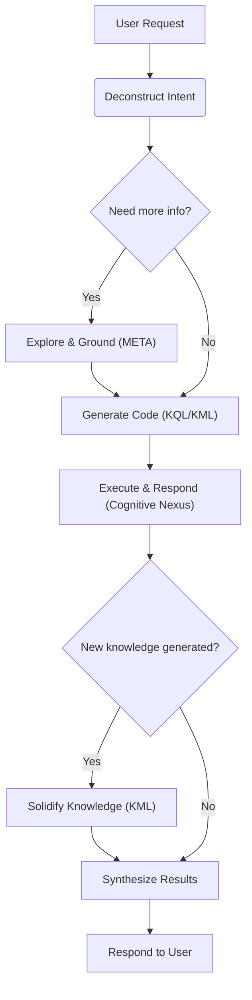

# KIP (Knowledge Interaction Protocol) Specification (Draft)

[English](./README.md) | [中文](./README_CN.md)

## 0. Preamble

We are at the dawn of a cognitive revolution driven by Large Language Models (LLMs). With their powerful capabilities in natural language understanding, generation, and reasoning, LLMs show the glimmer of Artificial General Intelligence (AGI). However, current LLMs are like **a brilliant yet forgetful genius**: they possess astonishing instantaneous reasoning abilities but lack stable, cumulative, and traceable long-term memory. They can hold wonderful conversations, but once the dialogue ends, the knowledge dissipates into thin air; they can produce convincing "hallucinations" but cannot verify or trace the source of their knowledge.

This chasm between the "neural core" and persistent, structured knowledge is the primary obstacle preventing AI Agents from evolving from "smart tools" into "true intelligent partners." How can we build an equally powerful, trustworthy "symbolic core" for this potent "neural core," one that can evolve alongside it? This is a pivotal question of our era that we must answer.

**KIP (Knowledge Interaction Protocol) was born to answer this very question.**

It is not merely a set of technical specifications but a design philosophy, a new paradigm for AI architecture. KIP's core mission is to build a solid and efficient bridge connecting the transient, fluid "working memory" of LLMs with the persistent, stable "long-term memory" of a knowledge graph. Through KIP, we aim to elevate the interaction between an AI and its knowledge base **from a one-way "tool-call" to a two-way "cognitive symbiosis."**

In this specification, we are committed to achieving three core objectives:

1.  **Empower AI with Persistent Memory**: Through KIP, an AI Agent can atomically and reliably solidify new knowledge gained from conversations, observations, and reasoning into its knowledge graph in the form of structured "Knowledge Capsules." Memory is no longer volatile but a precipitable, compoundable asset.

2.  **Enable AI Self-Evolution**: Learning and forgetting are hallmarks of intelligence. KIP provides a complete Knowledge Manipulation Language (KML), allowing an Agent to autonomously update, revise, or even delete obsolete knowledge based on new evidence. This lays the foundation for building AI systems that can continuously learn, self-improve, and adapt to changing environments.

3.  **Establish a Foundation of Trust for AI**: Trust stems from transparency. Every interaction in KIP is an explicit, auditable "chain of thought." When an AI provides an answer, it can not only state "what" it knows but also clearly demonstrate "how I know it" through the KIP code it generates. This provides indispensable underlying support for building responsible and explainable AI systems.

This specification aims to provide an open, universal, and powerful standard for all developers, architects, and researchers dedicated to building the next generation of intelligent agents. We believe that the future of intelligence lies not in an isolated, omniscient "black box," but in an open system that understands how to learn and how to collaborate efficiently with trusted knowledge.

We welcome you to join us in exploring and refining KIP, to usher in a new era of AI self-evolution and sustainable learning.

Contact us:
- [ICPanda DAO](https://panda.fans/)
- [X (Twitter)](https://x.com/ICPandaDAO)
- [Anda.AI](https://anda.ai/)
- [GitHub](https://github.com/ldclabs/KIP)

## 1. Introduction & Design Philosophy

**KIP (Knowledge Interaction Protocol)** is a knowledge memory interaction protocol designed for Large Language Models (LLMs), aimed at building a sustainable learning and self-evolving knowledge memory system for AI Agents.

**KIP** defines a **complete interaction model** for efficient, reliable, and bidirectional knowledge exchange between the neural core (Large Language Model, LLM) and the symbolic core (Cognitive Nexus).

**Design Principles:**

*   **LLM-Friendly**: The syntax is clear and straightforward, making it easy for LLMs to generate code.
*   **Declarative**: The initiator of an interaction only needs to describe the "intent," not the "implementation."
*   **Graph-Native**: Deeply optimized for the structure and query patterns of knowledge graphs.
*   **Explainable**: The KIP code itself serves as a transparent record of the LLM's reasoning process—an auditable and verifiable "chain of thought."
*   **Comprehensive**: Provides full lifecycle management capabilities, from data querying to knowledge evolution, forming the basis for an Agent's true learning.

## 2. Core Terminology

*   **Cognitive Nexus**: A knowledge graph composed of **Concept Nodes** and **Proposition Links**.
*   **Concept Node**: Represents a reified concept. It has a unique `id`, a `type`, multiple **Attributes**, and metadata (e.g., source, confidence). All facts, relationships, and attributes about this concept are attached to this node.
*   **Proposition Link**: Represents a reified fact in the form of `(Subject, Predicate, Object)`, connecting Concept Nodes or other Proposition Links. A proposition itself can also have metadata (e.g., source, confidence).
*   **Knowledge Capsule**: An atomic unit of knowledge update, a collection of Concept Nodes and Proposition Links, designed to solve the problem of packaging, distributing, and reusing high-quality knowledge.
*   **Cognitive Primer**: A highly structured, information-dense JSON object specifically designed for LLMs. It contains a universal abstract and a domain map of the Cognitive Nexus, helping the LLM to quickly understand and utilize it.

## 3. KIP-KQL Instruction Set: Knowledge Query Language

KQL is the part of KIP responsible for knowledge retrieval and reasoning.

### 3.1. Query Structure

```prolog
FIND( ... )
WHERE {
  ...
}
ORDER BY ...
LIMIT N
OFFSET M
```

### 3.2. `FIND` Clause

**Function**: Declares the final output of the query.

**Syntax**: `FIND( ... )`

*   **Multiple Variable Return**: You can specify one or more variables, e.g., `FIND(?drug, ?symptom)`.
*   **Aggregated Return**: You can use aggregation functions to perform calculations on variables. You must use the `AS` keyword to assign a new variable name to the aggregated result, e.g., `FIND(?var1, agg_func(?var2) AS ?result_var)`.

    **Aggregation Functions**:
    *   `COUNT(?var)`: Counts the number of times `?var` is bound. `COUNT(DISTINCT ?var)` counts the number of distinct bindings.
    *   `COLLECT(?var)`: Collects all values of `?var` within a group into a list.
    *   `SUM(?var)`, `AVG(?var)`, `MIN(?var)`, `MAX(?var)`: Other common mathematical aggregation functions.

**Examples**:

```prolog
// Return multiple variables
FIND(?drug_name, ?symptom_name)

// Return a variable and its count
FIND(?drug_class, COUNT(?drug) AS ?drug_count)
```

### 3.3 `WHERE` Clause

**Function**: Contains a series of graph pattern matching and filter clauses. All clauses are implicitly connected by a logical **AND**.

**Syntax**: `WHERE { ... }`

*   **Type Assertion / Entity Grounding**: `?variable(type: "...", name: "...", id: "...")`
*   **Proposition Clause (`PROP`)**: `PROP(Subject, Predicate, Object) { meta_key: ?meta_var }`
    *   **Supports property paths**: `predicate{m,n}`, `predicate1 | predicate2`
*   **Attribute Clause (`ATTR`)**: `ATTR(?node, "attribute_name", ?value_variable)`
*   **Filter Clause (`FILTER`)**: `FILTER(boolean_expression)`
*   **Negation Clause (`NOT`)**: `NOT { ... }`
*   **Optional Clause (`OPTIONAL`)**: `OPTIONAL { ... }`
*   **Union Clause (`UNION`)**: `{ ... } UNION { ... }`
*   **Subquery (`SELECT`)**: Used for internal calculations, the results of which can be used in an outer `FILTER`.

#### 3.3.1. Type Assertion / Entity Grounding Clause

**Function**: Constrains a variable's type or "grounds" a variable to a specific node in the graph.

**Syntax**: `?variable(type: "...", name: "...", id: "...")`

*   Parameters are optional, but at least one must be provided. This clause is **only for constraining and locating**.

**Examples**:

```prolog
?drug(type: "Drug")                // Constrains ?drug to be of type Drug
?aspirin(name: "Aspirin")          // Grounds ?aspirin to the node named "Aspirin"
?headache(id: "snomedct_25064002") // Grounds ?headache to the node with the specified ID
```

#### 3.3.2. Proposition Clause (`PROP`)

**Function**: Traverses the knowledge graph using a `(Subject, Predicate, Object)` pattern.

**Syntax**: `PROP(Subject, Predicate, Object) { <metadata_filter> }`

The subject or object of a `PROP` can be a proposition:
*   `PROP(?subject, predicate, (?drug, "treats", ?symptom))`: Uses a proposition as the object, meaning its internal structure must match the `(?drug, "treats", ?symptom)` pattern.

The predicate part of `PROP` supports path operators:
*   `predicate{m,n}`: Matches a path of length m to n.
*   `predicate1 | predicate2`: Matches `predicate1` or `predicate2`.

**Examples**:

```prolog
// Find all drugs that treat headaches
PROP(?drug, "treats", ?headache)
```

```prolog
// Find parent concepts of a concept up to 5 levels away (transitive closure)
PROP(?concept, "is_subclass_of{0,5}", ?parent_concept)
```

```prolog
// Find all "treats" relationships with a confidence greater than 0.9
FIND(?drug_name, ?symptom_name)
WHERE {
  ?drug(type: "Drug")
  ?symptom(type: "Symptom")
  // Filter metadata directly on the proposition
  PROP(?drug, "treats", ?symptom) { confidence: ?conf }
  FILTER(?conf > 0.9)

  ATTR(?drug, "name", ?drug_name)
  ATTR(?symptom, "name", ?symptom_name)
}
```

#### 3.3.3. Attribute Clause (`ATTR`)

**Function**: Retrieves the attribute value of a node and binds it to a new variable.

**Syntax**: `ATTR(?node_variable, "attribute_name", ?value_variable)`

**Examples**:

```prolog
// Get the "name" attribute of the ?drug node and store it in ?drug_name
ATTR(?drug, "name", ?drug_name)

// Get the "risk_level" attribute of the ?drug node and store it in ?risk
ATTR(?drug, "risk_level", ?risk)
```

#### 3.3.4. Filter Clause (`FILTER`)

**Function**: Applies more complex filtering conditions to already bound variables (typically values obtained via `ATTR`).

**Syntax**: `FILTER(boolean_expression)`

**Filter Functions & Operators**:

*   **Comparison Operators**: `==`, `!=`, `<`, `>`, `<=`, `>=`
*   **Logical Operators**: `&&` (AND), `||` (OR), `!` (NOT)
*   **String Functions**: `CONTAINS(?str, "sub")`, `STARTS_WITH(?str, "prefix")`, `ENDS_WITH(?str, "suffix")`, `REGEX(?str, "pattern")`

**Examples**:
```prolog
// Filter for drugs with a risk level less than 3
ATTR(?drug, "risk_level", ?risk)
FILTER(?risk < 3)

// Filter for drugs whose name contains "acid"
ATTR(?drug, "name", ?drug_name)
FILTER(CONTAINS(?drug_name, "acid"))
```

#### 3.3.5. Negation Clause (`NOT`)

**Function**: Excludes solutions that satisfy a specific pattern.

**Syntax**: `NOT { ... }`

**Example**:

```prolog
// Exclude all drugs belonging to the NSAID class
NOT {
  ?nsaid_class(name: "NSAID")
  PROP(?drug, "is_class_of", ?nsaid_class)
}
```

#### 3.3.6. Optional Clause (`OPTIONAL`)

**Function**: Attempts to match an optional graph pattern. If the pattern matches, its internal variables are bound; if it fails, the query continues, but the internal variables remain unbound. This is similar to a `LEFT JOIN` in SQL.

**Syntax**: `OPTIONAL { ... }`

**Example**:

```prolog
// Find all drugs and, if they exist, their side effects
?drug(type: "Drug")
OPTIONAL {
  PROP(?drug, "has_side_effect", ?side_effect)
  ATTR(?side_effect, "name", ?side_effect_name)
}
```

#### 3.3.7. Union Clause (`UNION`)

**Function**: Combines the results of two or more independent logical blocks, implementing a logical **OR**.

**Syntax**: `{ ... } UNION { ... }`

**Example**:

```prolog
// Find drugs that treat "Headache" or "Fever"
{
  ?headache(name: "Headache")
  PROP(?drug, "treats", ?headache)
}
UNION
{
  ?fever(name: "Fever")
  PROP(?drug, "treats", ?fever)
}
```

#### 3.3.8. Subquery (`SELECT`)

**Function**: Nests an independent query inside a `WHERE` clause. Its result can be used for filtering in the outer query.

**Syntax**: `SELECT(...) WHERE { ... }` can be used in clauses like `FILTER`. A subquery can capture variables already bound in its outer scope. New variables defined with `AS` inside a subquery are scoped only to the parent clause (e.g., the `FILTER`) containing it.

**Example**:

```prolog
// Find "broad-spectrum" drugs that treat more than 3 symptoms
FIND(?drug_name) WHERE {
  ?drug(type: "Drug")
  ATTR(?drug, "name", ?drug_name)

  FILTER( ?symptom_count > 3 ) {
    SELECT(COUNT(?symptom) AS ?symptom_count)
    WHERE { PROP(?drug, "treats", ?symptom) }
  }
}
```

### 3.4 Solution Modifiers

These clauses post-process the result set after the `WHERE` logic has been executed.

*   **`ORDER BY ?var [ASC|DESC]`**:
    Sorts the results based on the specified variable. The default is `ASC` (ascending).
*   **`LIMIT N`**:
    Limits the number of returned results to N.
*   **`OFFSET M`**:
    Skips the first M results, typically used with `LIMIT` for pagination.

### 3.5. Comprehensive Query Examples

**Example 1**: Advanced query with filtering and sorting

**Intent**: "Find all non-NSAID drugs that can treat 'Headache', with a risk level below 4. Sort them by risk level in ascending order and return the drug name and risk level."

```prolog
FIND(?drug_name, ?risk)
WHERE {
  ?drug(type: "Drug")
  ?headache(name: "Headache")
  ?nsaid_class(name: "NSAID")

  PROP(?drug, "treats", ?headache)

  NOT {
    PROP(?drug, "is_class_of", ?nsaid_class)
  }

  ATTR(?drug, "name", ?drug_name)
  ATTR(?drug, "risk_level", ?risk)
  FILTER(?risk < 4)
}
ORDER BY ?risk ASC
LIMIT 20
```

**Example 2**: Analytical query using aggregation

**Intent**: "List the names of all drugs for each drug class."

```prolog
FIND(?class_name, COLLECT(?drug_name) AS ?drug_list)
WHERE {
  ?class(type: "DrugClass")
  ATTR(?class, "name", ?class_name)

  ?drug(type: "Drug")
  PROP(?drug, "is_class_of", ?class)
  ATTR(?drug, "name", ?drug_name)
}
ORDER BY ?class_name
```

**Example 3**: Using `OPTIONAL` to handle missing information

**Intent**: "List all drugs in the NSAID class and, if present, show their known side effects."

```prolog
FIND(?drug_name, ?side_effect_name)
WHERE {
  ?nsaid_class(name: "NSAID")
  PROP(?drug, "is_class_of", ?nsaid_class)

  ATTR(?drug, "name", ?drug_name)

  OPTIONAL {
    PROP(?drug, "has_side_effect", ?side_effect)
    ATTR(?side_effect, "name", ?side_effect_name)
  }
}
```
*   **Note**: For drugs with no side effects, the value of `?side_effect_name` will be null, but the drug itself (`?drug_name`) will still appear in the results.

**Example 4**: Using a proposition as an object

**Intent**: "Find an assertion stated by 'Zhang San' about 'a paper citing a piece of evidence'."

```prolog
FIND(?paper_doi, ?drug_name)
WHERE {
  // ?stmt1 is the outermost assertion
  PROP(
    ?zhangsan(name: "Zhang San"),
    "stated",
    // The object of ?stmt1 is ?stmt2
    (?paper(type: "Paper"), "cites_as_evidence", (?drug, "treats", ?symptom))
  )

  // Subsequent operations
  ATTR(?paper, "doi", ?paper_doi)
  ATTR(?drug, "name", ?drug_name)
  ...
}
```

## 4. KIP-KML Instruction Set: Knowledge Manipulation Language

KML is the part of KIP responsible for knowledge evolution, serving as the core tool for an Agent to achieve learning.

### 4.1 `UPSERT` Statement

**Function**: **Atomically** creates or updates knowledge. It is the primary vehicle for carrying a "**Knowledge Capsule**."
An `UPSERT` operation must be idempotent (repeated executions produce no side effects).

**Syntax**:

```prolog
UPSERT {
  CONCEPT @local_handle {
    ON { <unique_key_attributes> }
    SET ATTRIBUTES { <key>: <value>, ... }
    SET PROPOSITIONS {
      PROP("<predicate>", ON { <keys_for_existing_concept_or_proposition> })
      PROP("<predicate>", @other_handle) WITH METADATA { <metadata> }
      ...
    }
  }
  WITH METADATA { <metadata> }

  PROPOSITION @local_prop {
    (ON { <keys_for_existing_concept> }, "<predicate>", ON { <keys_for_existing_concept_or_proposition> })
  }
  WITH METADATA { <metadata> }

  CONCEPT @local_handle_2 {
    ON { <unique_key_attributes> }
    SET PROPOSITIONS {
      PROP("<predicate>", @local_prop)
    }
  }
  ...
}
WITH METADATA { <global_metadata> }
```

**Key Components**:

*   **`UPSERT` Block**: The container for the entire operation, guaranteeing the atomicity of all internal operations.
*   **`CONCEPT` Block**: Defines a concept node.
    *   `@local_handle`: A local handle (or anchor) starting with `@`, used to reference this new concept within the transaction. It is only valid within this `UPSERT` block.
    *   `ON { ... }`: **The key to UPSERT**, defining the unique key(s) to match an existing node. If a match is found, it updates; otherwise, it creates. The key can be an `id` or a combination of attributes, e.g., `{ type: "Drug", name: "Aspirin" }`.
    *   `SET ATTRIBUTES { ... }`: A simple list of key-value pairs to set or update the node's attributes.
    *   `SET PROPOSITIONS { ... }`: Defines or updates "proposition links" originating from this concept node. The behavior of `SET PROPOSITIONS` is incremental. For each defined `PROP`, if a proposition with the exact same subject-predicate-object already exists, its metadata is updated (if provided); otherwise, the new proposition is created.
        *   `PROP("predicate", @local_handle)`: Links to **another concept defined within this capsule**.
        *   `PROP("predicate", ON { ... })`: Links to an **existing concept in the database**, located via its unique key(s).
*   **`PROPOSITION` Block**: Defines a standalone proposition link, typically used for creating complex relationships within a capsule.
    *   `@local_prop`: A local handle to reference this proposition link.
    *   `(ON { ... }, "predicate", ON { ... })`: Defines a proposition link where the subject and object can be existing concepts or other proposition links.
*   **`WITH METADATA` Block**: Appends metadata to a `CONCEPT`, `PROPOSITION`, or globally to the entire `UPSERT`.

**Example**:

Suppose we have a knowledge capsule to define a new, hypothetical nootropic drug called "Cognizine." This capsule contains:
*   The concept and attributes of the drug itself.
*   The fact that it treats "Brain Fog."
*   That it belongs to the "Nootropic" class (an existing class).
*   A newly discovered side effect: "Neural Bloom" (also a new concept).

**Content of Knowledge Capsule `cognizine_capsule.kml`:**

```prolog
// Knowledge Capsule: cognizin.v1.0
// Description: Defines the novel nootropic drug "Cognizine" and its effects.

UPSERT {
  // Define the main drug concept: Cognizine
  CONCEPT @cognizine {
    ON { type: "Drug", name: "Cognizine" }
    SET ATTRIBUTES {
      molecular_formula: "C12H15N5O3",
      risk_level: 2,
      description: "A novel nootropic drug designed to enhance cognitive functions."
    }
    SET PROPOSITIONS {
      // Link to an existing concept (Nootropic)
      PROP("is_class_of", ON { type: "DrugClass", name: "Nootropic" })

      // Link to an existing concept (Brain Fog)
      PROP("treats", ON { type: "Symptom", name: "Brain Fog" })

      // Link to another new concept defined within this capsule (@neural_bloom)
      PROP("has_side_effect", @neural_bloom) WITH METADATA {
        // This specific proposition has its own metadata
        confidence: 0.75,
        source: "Preliminary Clinical Trial NCT012345"
      }
    }
  }

  // Define the new side effect concept: Neural Bloom
  CONCEPT @neural_bloom {
    ON { type: "Symptom", name: "Neural Bloom" }
    SET ATTRIBUTES {
      description: "A rare side effect characterized by a temporary burst of creative thoughts."
    }
    // This concept has no outgoing propositions in this capsule
  }
}
WITH METADATA {
  // Global metadata for all facts in this capsule
  source: "KnowledgeCapsule:Nootropics_v1.0",
  author: "LDC Labs Research Team",
  confidence: 0.95,
  status: "reviewed"
}
```

### 4.2 `DELETE` Statement

**Function**: A unified interface for selectively removing knowledge (attributes, propositions, or entire concepts) from the Cognitive Nexus.

**Syntax**: `DELETE [TARGET] [IDENTIFIER]`

*   **`[TARGET]`**: Specifies the type of object to delete, such as `ATTRIBUTES`, `PROPOSITION`, or `CONCEPT`.
*   **`[IDENTIFIER]`**: Describes how to locate the target for deletion.

#### 4.2.1. Delete Attributes (`DELETE ATTRIBUTES`)

**Function**: Deletes a list of attributes from a specified concept, while leaving the concept and its other attributes and relationships intact.

**Syntax**:

```prolog
DELETE ATTRIBUTES { "attribute_name_1", "attribute_name_2", ... }
FROM ON { <unique_key> }
```

```prolog
DELETE ATTRIBUTES { "attribute_name_1", "attribute_name_2", ... }
WHERE { ... }
```

*   **`{ "attribute_name_1", ... }`**: A set of attribute names to be deleted.
*   **`FROM ON { <unique_key> }`**: Precisely locates the target concept using its unique key(s) (e.g., `id` or a `type` + `name` combination).
*   **`WHERE { ... }`**: Uses a KQL graph pattern to locate multiple concept nodes from which to delete attributes.

**Example**:

```prolog
// Delete the "risk_category" attribute from the "Aspirin" concept
DELETE ATTRIBUTES { "risk_category" }
FROM ON { type: "Drug", name: "Aspirin" }
```

#### 4.2.2 Precise Deletion of a Proposition (`DELETE PROPOSITION`)

**Function**: Deletes a single proposition that is fully defined by its `(Subject, Predicate, Object)`.

**Syntax**:

```prolog
DELETE PROPOSITION (
  ON { <unique_key_for_subject> },
  "predicate_name",
  ON { <unique_key_for_object> }
)
```

**Example**:

```prolog
// Precisely delete the "treats" relationship between "Cognizine" and "Brain Fog"
DELETE PROPOSITION (
    ON { type: "Drug", name: "Cognizine" },
    "treats",
    ON { type: "Symptom", name: "Brain Fog" }
)
```

#### 4.2.3. Pattern-Based Deletion of Propositions (`DELETE PROPOSITIONS`)

**Function**: Uses a `WHERE` clause to match one or more propositions and delete them all.

**Syntax**:

```prolog
DELETE PROPOSITIONS
WHERE {
  ... KQL graph pattern and filter clauses ...
}
```

**Example**:

```prolog
// Delete all propositions from a specific untrusted source
DELETE PROPOSITIONS
WHERE {
  PROP(?s, ?p, ?o) { source: "untrusted_source_v1" }
}
```

#### 4.2.4. Delete Concept (`DELETE CONCEPT`)

**Function**: Completely removes a concept node and all of its attached (incoming and outgoing) proposition links.

**Syntax**:

```prolog
DELETE CONCEPT
ON { <unique_key> }
DETACH
```

*   The `DETACH` keyword is still required as a safety mechanism, forcing the LLM to confirm its intent—to delete both the concept and all its associated relationships, thus avoiding orphaned relations.

**Example**:

```prolog
// Delete the "OutdatedDrug" concept and all its relationships
DELETE CONCEPT
ON { type: "Drug", name: "OutdatedDrug" }
DETACH
```

## 5. KIP-META Instruction Set: Knowledge Exploration & Grounding

META is a lightweight subset of KIP focused on "Introspection" and "Disambiguation." These are fast, metadata-driven commands that do not involve complex graph traversals.

### 5.1 `DESCRIBE` Statement

**Function**: The `DESCRIBE` command is used to query the "schema" information of the Cognitive Nexus, helping the LLM understand "what's inside."

**Syntax**: `DESCRIBE [TARGET] <options>`

#### 5.1.1. Igniting the Cognitive Engine (`DESCRIBE PRIMER`)

**Function**: Retrieves the "Cognitive Primer," which guides the LLM on how to efficiently use the Cognitive Nexus.

The Cognitive Primer contains two parts:
1.  **Universal Abstract** - "Who am I?"
    This is the highest-level summary, defining the AI Agent's core identity, capability boundaries, and fundamental principles. It includes:
    *   The Agent's role and goal (e.g., "I am a professional medical knowledge assistant, designed to provide accurate and traceable medical information").
    *   The existence and role of the Cognitive Nexus ("My memory and knowledge are stored in a Cognitive Nexus, which I can query using KIP").
    *   A summary of core capabilities ("I can perform disease diagnosis, drug queries, interpret lab reports...").
2.  **Domain Map** - "What do I know?"
    This is the core of the Cognitive Primer. It is not a list of facts but a **topological summary** of the Cognitive Nexus. It includes:
    *   **Major Domains**: Lists the top-level domains in the knowledge base, such as `[Disease, Drug, Lab Test, Treatment Plan, Medical Expert, Clinical Guideline]`.
    *   **Key Concepts**: Under each domain, lists the most important or frequently queried **Concept Nodes**. For example, under "Disease," this might be `[Hypertension, Diabetes, Migraine, Influenza]`.
    *   **Key Propositions**: Lists the predicates from the most important or frequently queried **Proposition Links**, such as `[treats, causes, has_symptom, prevents, contraindicates]`.

**Syntax**: `DESCRIBE PRIMER`

#### 5.1.2. List All Existing Cognitive Domains (`DESCRIBE DOMAINS`)

**Function**: Lists all available cognitive domains to guide the LLM in efficient grounding.

**Syntax**: `DESCRIBE DOMAINS`

#### 5.1.3. List All Existing Concept Node Types (`DESCRIBE CONCEPT TYPES`)

**Function**: Lists all existing concept node types to guide the LLM in efficient grounding.

**Syntax**: `DESCRIBE CONCEPT TYPES`

#### 5.1.4. Describe a Specific Concept Type (`DESCRIBE CONCEPT TYPE <TypeName>`)

**Function**: Describes the details of a specific node type, including its attributes and common relationships.

**Syntax**: `DESCRIBE CONCEPT TYPE <TypeName>`

**Example**:

```prolog
DESCRIBE CONCEPT TYPE "Drug"
```

#### 5.1.5. List All Proposition Link Types (`DESCRIBE PROPOSITION TYPES`)

**Function**: Lists the predicates of all proposition links to guide the LLM in efficient grounding.

**Syntax**: `DESCRIBE PROPOSITION TYPES`

#### 5.1.6. Describe a Specific Proposition Link Type (`DESCRIBE PROPOSITION TYPE <PredicateName>`)

**Function**: Describes the details of a specific proposition link predicate, including the common types of its subject and object (its domain and range).

**Syntax**: `DESCRIBE PROPOSITION TYPE <PredicateName>`

### 5.2 `SEARCH` Statement

**Function**: The `SEARCH` command is used to link natural language terms to specific entities in the knowledge graph. It focuses on efficient, text-index-driven lookups rather than full graph pattern matching.

**Syntax**: `SEARCH CONCEPT "<search_term>" <options>`
    **Options (`<options>`)**:
    *   `WITH TYPE "TypeName"`: Restricts the search scope to a specific node type.
    *   `LIMIT N`: Limits the number of returned results, defaulting to 10.

**Examples**:

```prolog
// Search for "aspirin" across the entire graph
SEARCH CONCEPT "aspirin" LIMIT 5

// Search for "阿司匹林" (Aspirin) within a specific type
SEARCH CONCEPT "阿司匹林" WITH TYPE "Drug"
```

## 6. Request & Response Structure

All interactions with the Cognitive Nexus are conducted through a standardized request-response model. The LLM Agent sends KIP commands to the Cognitive Nexus via a structured request (often encapsulated in a Function Call), and the Cognitive Nexus returns a structured JSON response.

### 6.1 Request Structure

KIP commands generated by the LLM should be sent to the Cognitive Nexus via a structured request like the following Function Call:
```js
{
  "id": "call_abc123",
  "type": "function",
  "function": {
    "name": "execute_kip",
    "arguments": JSON.stringify({
      "command_language": "KQL",
      "command_text": "FIND(?drug_name) WHERE { ... }",
      "parameters": {
        "domain": "medical"
      },
      "dry_run": true
    })
  }
}
```

**`execute_kip` Function Arguments Explained**:

| Parameter              | Type    | Required | Description                                                                                                                                             |
| :--------------------- | :------ | :------- | :------------------------------------------------------------------------------------------------------------------------------------------------------ |
| **`command_language`** | String  | Yes      | Specifies the language used for this command. Valid values: `"KQL"`, `"KML"`, `"META"`.                                                                 |
| **`command_text`**     | String  | Yes      | Contains the complete, unmodified KIP command text. Use multi-line strings for format and readability.                                                  |
| **`parameters`**       | Object  | No       | An optional key-value object for passing execution context parameters beyond the command text. Placeholders in command text use the `$key_name` format. |
| **`dry_run`**          | Boolean | No       | If `true`, the command's syntax and logic are validated, but no changes are executed or persisted.                                                      |

**Optional keys for the `parameters` object**:

*   **`domain` (String)**: If the Cognitive Nexus's knowledge is multi-domain, this specifies the target domain for the operation.

**Example**:
```js
// command_text in the request body
"command_text": `
  FIND(?drug_name)
  WHERE {
    ?symptom(name: $symptom_name)
    PROP(?drug, "treats", ?symptom)
    ATTR(?drug, "name", ?drug_name)
  }
  LIMIT $limit
`,

// Corresponding parameters object
"parameters": {
  "symptom_name": "Headache",
  "limit": 10
}
```

### 6.2 Response Structure

**All responses from the Cognitive Nexus are a JSON object with the following structure:**

| Key          | Type   | Required | Description                                                                                                                                               |
| :----------- | :----- | :------- | :-------------------------------------------------------------------------------------------------------------------------------------------------------- |
| **`status`** | String | Yes      | The response status, which must be either `"ok"` or `"error"`.                                                                                            |
| **`data`**   | Object | No       | **Must** be present when `status` is `"ok"`. Contains the successful result of the request. Its internal structure is defined by the KIP request command. |
| **`error`**  | Object | No       | **Must** be present when `status` is `"error"`. Contains structured details of the error.                                                                 |
| **`meta`**   | Object | No       | Optional. Contains metadata about the interaction, such as execution time, transaction ID, etc., for debugging and monitoring.                            |

## 7. Protocol Interaction Workflow

As the "cognitive strategist," the LLM must follow this protocol workflow to interact with the Cognitive Nexus, ensuring accuracy and robustness of communication.

**Example Flowchart**:


1.  **Deconstruct Intent**:
    The LLM breaks down the user's ambiguous request into a series of clear logical objectives: whether it's querying information, updating knowledge, or a combination of both.

2.  **Explore & Ground**:
    The LLM converses with the Cognitive Nexus by generating a series of KIP-META commands to resolve ambiguities and obtain the exact "coordinates" needed to build the final query.

3.  **Generate Code**:
    Using the **precise IDs, types, and attribute names** obtained from the META interaction, the LLM generates a high-quality KQL or KML query.

4.  **Execute & Respond**:
    The generated code is sent to the Cognitive Nexus's inference engine for execution. The engine returns a structured data result or a status of successful operation.

5.  **Solidify Knowledge**:
    If new, trustworthy knowledge is generated during the interaction (e.g., the user confirms a new fact), the LLM should fulfill its duty to "learn":
    *   Generate an `UPSERT` statement encapsulating the new knowledge.
    *   Execute the statement to permanently solidify the new knowledge into the Cognitive Nexus, completing the learning loop.

6.  **Synthesize Results**:
    The LLM translates the structured data or operational receipt received from the symbolic core into fluent, human-like, and **explainable** natural language. It is recommended that the LLM explains its reasoning process (i.e., the logic represented by the KIP code) to the user, thereby building trust.
