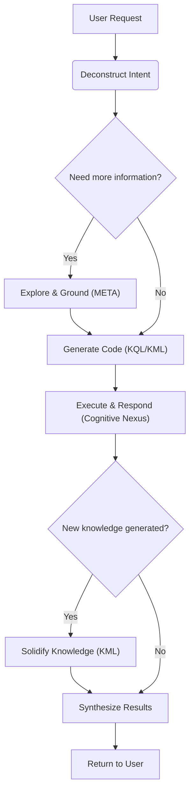

# 🧬 KIP (Knowledge Interaction Protocol) Specification (Draft)

**[English](./README.md) | [中文](./README_CN.md)**

**Version History**:
| Version     | Date       | Change Description                                                                                                             |
| ----------- | ---------- | ------------------------------------------------------------------------------------------------------------------------------ |
| v1.0-draft1 | 2025-06-09 | Initial draft                                                                                                                  |
| v1.0-draft2 | 2025-06-15 | Optimized `UNION` clause                                                                                                       |
| v1.0-draft3 | 2025-06-18 | Refined terminology, simplified syntax, removed `SELECT` subquery, added `META` clause, enhanced proposition link clause       |
| v1.0-draft5 | 2025-06-25 | Removed `ATTR` and `META`, introduced "Dot Notation" as a replacement; added `(id: "<link_id>")`; optimized `DELETE` statement |

**KIP Implementation**:
- [Anda KIP](https://github.com/ldclabs/anda-db/tree/main/rs/anda_kip): A Rust SDK of KIP for building sustainable AI knowledge memory systems.
- [Anda Cognitive Nexus (WIP)](https://github.com/ldclabs/anda-db/tree/main/rs/anda_cognitive_nexus): A Rust implementation of KIP (Knowledge Interaction Protocol) based on Anda DB.

**About Us**:
- [ICPanda DAO](https://panda.fans/): ICPanda is a technical panda fully running on the [Internet Computer](https://internetcomputer.org/) blockchain, building chain-native infrastructures, Anda.AI and dMsg.net.
- [Anda.AI](https://anda.ai/): Create next-generation AI agents with persistent memory, decentralized trust, and swarm intelligence.
- GitHub: [LDC Labs](https://github.com/ldclabs/KIP)
- Follow Us on X: [ICPanda DAO](https://x.com/ICPandaDAO)

## 0. Preamble

We are at the dawn of a cognitive revolution driven by Large Language Models (LLMs). With their powerful capabilities in natural language understanding, generation, and reasoning, LLMs show the promise of Artificial General Intelligence (AGI). However, a current LLM is like a **brilliant but forgetful genius**: it possesses astounding real-time reasoning abilities but lacks a stable, cumulative, and traceable long-term memory. It can hold fascinating conversations, but once the dialogue ends, the knowledge dissipates; it may produce convincing "hallucinations" but cannot verify or validate its knowledge sources.

This chasm between the "neural core" and persistent, structured knowledge is the central obstacle preventing AI Agents from evolving from "clever tools" to "true intelligent partners." How can we build an equally powerful, trustworthy "symbolic core" for this potent "neural core," one that can co-evolve with it? This is the question of our time that we must answer.

**KIP (Knowledge Interaction Protocol) was born to answer this question.**

It is not merely a technical specification but a design philosophy, a new paradigm for AI architecture. KIP's core mission is to build a solid and efficient bridge connecting the LLM's transient, fluid "working memory" with the knowledge graph's persistent, stable "long-term memory."
KIP elevates the interaction paradigm between AI and knowledge bases **from a one-way "tool call" to a two-way "cognitive symbiosis"**:
- The **Neural Core** (LLM) provides real-time reasoning capabilities.
- The **Symbolic Core** (Knowledge Graph) provides structured memory.
- **KIP** enables the synergistic evolution of both.

In this specification, we are committed to achieving three core objectives:

1.  **Empowering AI with Persistent Memory**: Through KIP, an AI Agent can atomically and reliably solidify new knowledge acquired from conversations, observations, and reasoning into its knowledge graph in the form of structured "Knowledge Capsules." Memory is no longer volatile but a depositable, compoundable asset.

2.  **Enabling AI Self-Evolution**: Learning and forgetting are hallmarks of intelligence. KIP provides a complete Knowledge Manipulation Language (KML) that enables an Agent to autonomously update, correct, or even delete outdated knowledge based on new evidence. This lays the foundation for building AI that can continuously learn, self-improve, and adapt to changing environments.

3.  **Building a Foundation of Trust for AI**: Trust stems from transparency. Every interaction in KIP is an explicit, auditable "chain of thought." When an AI provides an answer, it can not only state "what" but also clearly demonstrate "how I know it" through the KIP code it generates. This provides indispensable underlying support for building responsible and explainable AI systems.

This specification is dedicated to providing all developers, architects, and researchers with an open, universal, and powerful standard for building the next generation of intelligent agents. We believe that the future of intelligence does not lie in an isolated, omniscient "black box," but in an open system that knows how to learn and how to collaborate efficiently with trusted knowledge.

We welcome you to join us in exploring and refining KIP, to usher in a new era of AI self-evolution and sustainable learning.

## 1. Introduction & Design Philosophy

**KIP (Knowledge Interaction Protocol)** is a knowledge interaction protocol designed specifically for Large Language Models (LLMs). It defines a complete pattern for efficient, reliable, and bidirectional knowledge exchange between a **Neural Core (LLM)** and a **Symbolic Core (Knowledge Graph)** through a standardized instruction set (KQL/KML). Its goal is to build a long-term memory system for AI Agents that enables sustainable learning and self-evolution.

**Design Principles:**

*   **LLM-Friendly**: The syntax is clear and structured, making it easy for LLMs to generate code.
*   **Declarative**: The initiator of an interaction only needs to describe the "intent," not the "implementation."
*   **Graph-Native**: Deeply optimized for the structure and query patterns of knowledge graphs.
*   **Explainable**: KIP code itself serves as a transparent record of the LLM's reasoning process, acting as an auditable and verifiable "chain of thought."
*   **Comprehensive**: Provides full lifecycle management capabilities, from data querying to knowledge evolution, forming the foundation for true agent learning.

## 2. Core Definitions

### 2.1. Cognitive Nexus

A knowledge graph composed of **Concept Nodes** and **Proposition Links**, serving as the long-term memory system for an AI Agent.

### 2.2. Concept Node

*   **Definition**: An **entity** or **abstract concept** within the knowledge graph, representing a fundamental unit of knowledge (like a "point" in the graph).
*   **Example**: A `Drug` node named "Aspirin," a `Symptom` node named "Headache."
*   **Composition**:
    *   `id`: String, a unique identifier used to locate the node within the graph.
    *   `type`: String, the type of the node, such as `Drug`, `Symptom`, etc.
    *   `name`: String, the name of the node, such as "Aspirin," "Headache," etc. The `type` + `name` combination also uniquely identifies a node in the graph.
    *   `attributes`: Object, the properties of the node, describing its intrinsic characteristics, e.g., `molecular_formula`, `risk_level`.
    *   `metadata`: Object, metadata about the node, describing its source, credibility, etc., e.g., `source`, `confidence`.

### 2.3. Proposition Link

*   **Definition**: A **reified Proposition** that states a **Fact** in the form of a `(subject, predicate, object)` triple. It acts as a **Link** in the graph, connecting two concept nodes or enabling higher-order connections.
*   **Example**: A proposition link stating the fact "(Aspirin) - [treats] -> (Headache)".
*   **Composition**:
    *   `id`: String, a unique identifier used to locate the link within the graph.
    *   `subject`: String, the originator of the relationship, which is the ID of a concept node or another proposition link.
    *   `predicate`: String, defines the type of **Relation** between the subject and object.
    *   `object`: String, the receiver of the relationship, which is the ID of a concept node or another proposition link.
    *   `attributes`: Object, the properties of the proposition, describing its intrinsic characteristics.
    *   `metadata`: Object, metadata about the proposition, describing its source, credibility, etc., e.g., `source`, `confidence`.

### 2.4. Knowledge Capsule

An atomic unit of knowledge update, a collection of **Concept Nodes** and **Proposition Links**, designed to solve the problem of packaging, distributing, and reusing high-quality knowledge.

### 2.5. Cognitive Primer

A highly structured, information-dense JSON object specifically designed for LLMs. It contains a global abstract and domain map of the Cognitive Nexus, helping the LLM to quickly understand and use it.

### 2.6. Attributes & Metadata

*   **Attributes**: Key-value pairs describing the intrinsic characteristics of a **concept** or **fact**. They are part of the knowledge memory itself.
*   **Metadata**: Key-value pairs describing the **source, credibility, and context** of knowledge. It does not change the content of the knowledge itself but describes "knowledge about the knowledge." (See Appendix 1 for metadata field design).

### 2.7. Value Types

KIP adopts the **JSON** data model. This means all values used in KIP clauses, their types, and literal representations follow the JSON standard. This ensures unambiguous data exchange and makes it extremely easy for LLMs to generate and parse.

*   **Primitive Types**: `string`, `number`, `boolean`, `null`.
*   **Complex Types**: `Array`, `Object`.
*   **Usage Limitation**: Although `Array` and `Object` can be stored as attribute or metadata values, the `FILTER` clause in KQL is **primarily designed to operate on primitive types**.

### 2.8. Identifier

A KIP identifier starts with a letter or an underscore, followed by any combination of letters, numbers, or underscores. Identifiers are used for variable names, attribute names, metadata keys, etc.

## 3. KIP-KQL Instruction Set: Knowledge Query Language

KQL is the part of KIP responsible for knowledge retrieval and inference.

### 3.1. Query Structure

```prolog
FIND( ... )
WHERE {
  ...
}
ORDER BY ...
LIMIT N
OFFSET M
```

### 3.2. Dot Notation

**Dot notation is the preferred method for accessing the internal data of concept nodes and proposition links in KIP**. It provides a unified, intuitive, and powerful mechanism for directly using data in clauses like `FIND`, `FILTER`, and `ORDER BY`.

For a node or link bound to a variable `?var`, its internal data can be accessed via the following paths:

*   **Accessing top-level fields**:
    *   `?var.id`, `?var.type`, `?var.name` (for Concept Nodes)
    *   `?var.id`, `?var.subject`, `?var.predicate`, `?var.object` (for Proposition Links)
*   **Accessing Attributes**:
    *   `?var.attributes.<attribute_name>`
*   **Accessing Metadata**:
    *   `?var.metadata.<metadata_key>`

**Example**:
```prolog
// Find the name and risk level of a drug
FIND(?drug.name, ?drug.attributes.risk_level)

// Filter for propositions with a confidence score greater than 0.9
FILTER(?link.metadata.confidence > 0.9)
```

### 3.3. `FIND` Clause

**Function**: Declares the final output of the query.

**Syntax**: `FIND( ... )`

*   **Return Multiple Variables**: Can specify one or more variables, e.g., `FIND(?drug, ?symptom)`.
*   **Return Aggregations**: Can use aggregate functions to compute results on variables, e.g., `FIND(?var1, ?agg_func(?var2))`.
    *   **Aggregate Functions**: `COUNT(?var)`, `COUNT(DISTINCT ?var)`, `SUM(?var)`, `AVG(?var)`, `MIN(?var)`, `MAX(?var)`.

### 3.4. `WHERE` Clause

**Function**: Contains a series of graph pattern matching and filtering clauses. All clauses are implicitly combined with a logical **AND**.

#### 3.4.1. Concept Node Clause

**Function**: Matches concept nodes and binds them to variables. Uses `{...}` syntax.

**Syntax**:
*   `?node_var {id: "<id>"}` (Matches a unique concept node by it's unique ID)
*   `?node_var {type: "<type>", name: "<name>"}` (Matches a unique concept node by its type and name)
*   `?nodes_var {type: "<type>"}`, `?nodes_var {name: "<name>"}` (Matches a set of concept nodes by type or name)
*   `?node_var` is optional and binds the matched concept node to a variable for later use.

**Example**:

```prolog
// Match all nodes of type "Drug"
?drug {type: "Drug"}

// Match the drug named "Aspirin"
?aspirin {type: "Drug", name: "Aspirin"}

// Match a node with a specific ID
?headache {id: "C:123"}
```

#### 3.4.2. Proposition Link Clause

**Function**: Matches proposition links and binds them to variables. Uses `(...)` syntax.

**Syntax**:
*   `?link_var (id: "<link_id>")` (Matches a unique proposition link by it's unique ID)
*   `?link_var (?subject, "<predicate>", ?object)` (Matches by structural pattern)
*   `?link_var` is optional and binds the matched proposition link to a variable for later use.
*   The predicate section supports path operators:
    *   `predicate{m,n}`: Matches m to n hops, e.g., `"follows"{1,5}`, `"follows"{1,}`, `"follows"{5}`.
    *   `predicate1 | predicate2`: Matches `predicate1` or `predicate2`, e.g., `"follows" | "connects" | "links"`.

**Example**:

```prolog
// Find all drugs that can treat a headache
(?drug, "treats", ?headache)

// Bind a proposition with a known ID to a variable
?specific_fact (id: "P:12345:treats")

// Higher-order proposition: the object is another proposition
(?user, "stated", (?drug, "treats", ?symptom))
```

```prolog
// Find the parent concepts of a concept within 5 levels
(?concept, "is_subclass_of{0,5}", ?parent_concept)
```

#### 3.4.3. `FILTER` Clause

**Function**: Applies more complex filtering conditions to bound variables. **Using dot notation is strongly recommended**.

**Syntax**: `FILTER(boolean_expression)`

**Functions & Operators**:
*   **Comparison**: `==`, `!=`, `<`, `>`, `<=`, `>=`
*   **Logical**: `&&` (AND), `||` (OR), `!` (NOT)
*   **String**: `CONTAINS(?str, "sub")`, `STARTS_WITH(?str, "prefix")`, `ENDS_WITH(?str, "suffix")`, `REGEX(?str, "pattern")`

**Example**:
```prolog
// Filter for drugs with a risk level less than 3 and whose name contains "acid"
FILTER(?drug.attributes.risk_level < 3 && CONTAINS(?drug.name, "acid"))
```

#### 3.4.4. `NOT` Clause

**Function**: Excludes solutions that match a specific pattern.

**Syntax**: `NOT { ... }`

**Example**:

```prolog
// Exclude all drugs belonging to the NSAID class
NOT {
  ?nsaid_class {name: "NSAID"}
  (?drug, "is_class_of", ?nsaid_class)
}
```

A simpler way to write this:
```prolog
// Exclude all drugs belonging to the NSAID class
NOT {
  (?drug, "is_class_of", {name: "NSAID"})
}
```

#### 3.4.5. `OPTIONAL` Clause

**Function**: Attempts to match an optional pattern, similar to SQL's `LEFT JOIN`.

**Syntax**: `OPTIONAL { ... }`

**Example**:

```prolog
// Find all drugs and, if they exist, their side effects
?drug {type: "Drug"}

OPTIONAL {
  (?drug, "has_side_effect", ?side_effect)
}
```

#### 3.4.6. `UNION` Clause

**Function**: Merges the results of multiple patterns, implementing a logical **OR**.

**Syntax**: `UNION { ... }`

**Example**:

```prolog
// Find drugs that can treat "Headache" and "Fever"

(?drug, "treats", {name: "Headache"})

UNION {
  (?drug, "treats", {name: "Fever"})
}
```

### 3.5. Solution Modifiers

These clauses are applied to the result set after the `WHERE` logic has been executed.

*   **`ORDER BY ?var [ASC|DESC]`**: Sorts the results based on a specified variable. The default is `ASC` (ascending).
*   **`LIMIT N`**: Limits the number of returned results.
*   **`OFFSET M`**: Skips the first M results.

### 3.6. Comprehensive Query Examples

**Example 1**: Find all non-NSAID drugs that can treat 'Headache', with a risk level below 4. Return the drug name and risk level, sorted by risk level from low to high.

```prolog
FIND(
  ?drug.name,
  ?drug.attributes.risk_level
)
WHERE {
  ?drug {type: "Drug"}
  ?headache {name: "Headache"}

  (?drug, "treats", ?headache)

  NOT {
    (?drug, "is_class_of", {name: "NSAID"})
  }

  FILTER(?drug.attributes.risk_level < 4)
}
ORDER BY ?drug.attributes.risk_level ASC
LIMIT 20
```

**Example 2**: List all drugs in the NSAID class and, if they exist, their known side effects and the source of that information.

```prolog
FIND(
  ?drug.name,
  ?side_effect.name,
  ?link.metadata.source
)
WHERE {
  (?drug, "is_class_of", {name: "NSAID"})

  OPTIONAL {
    ?link (?drug, "has_side_effect", ?side_effect)
  }
}
```

**Example 3 (Higher-Order Proposition Deconstruction)**: Find the fact "Aspirin treats Headache" as stated by the user 'Zhang San', and return the confidence of that statement.

```prolog
FIND(?statement.metadata.confidence)
WHERE {
  // Match the fact: (Aspirin)-[treats]->(Headache)
  ?fact (
    {type: "Drug", name: "Aspirin"},
    "treats",
    {type: "Symptom", name: "Headache"}
  )

  // Match the higher-order proposition: (Zhang San)-[stated]->(fact)
  ?statement ({type: "User", name: "Zhang San"}, "stated", ?fact)
}
```

## 4. KIP-KML Instruction Set: Knowledge Manipulation Language

KML is the part of KIP responsible for knowledge evolution, serving as the core tool for an Agent to learn.

### 4.1. `UPSERT` Statement

**Function**: Creates or updates knowledge, carrying a "Knowledge Capsule." The operation must be **Idempotent**, meaning that executing the same instruction multiple times produces the same result as executing it once, without creating duplicate data or unexpected side effects.

**Syntax**:

```prolog
UPSERT {
  CONCEPT ?local_handle {
    {type: "<type>", name: "<name>"} // Or: {id: "<id>"}
    SET ATTRIBUTES { <key>: <value>, ... }
    SET PROPOSITIONS {
      ("<predicate>", { <existing_concept> })
      ("<predicate>", ( <existing_proposition> ))
      ("<predicate>", ?other_handle) WITH METADATA { <key>: <value>, ... }
      ...
    }
  }
  WITH METADATA { <key>: <value>, ... }

  PROPOSITION ?local_prop {
    (?subject, "<predicate>", ?object) // Or: (id: "<id>")
    SET ATTRIBUTES { <key>: <value>, ... }
  }
  WITH METADATA { <key>: <value>, ... }

  ...
}
WITH METADATA { <key>: <value>, ... }
```

**Key Components**:

*   **`UPSERT` Block**: The container for the entire operation, guaranteeing the idempotency of all internal operations.
*   **`CONCEPT` Block**: Defines a concept node.
    *   `?local_handle`: A local handle (or anchor) starting with `?`, used to reference this new concept within the transaction. It is only valid within this `UPSERT` block.
    *   `{type: "<type>", name: "<name>"}` will match or create a concept node. `{id: "<id>"}` will only match an existing concept node.
    *   `SET ATTRIBUTES { ... }`: Sets or updates the node's attributes.
    *   `SET PROPOSITIONS { ... }`: Defines or updates proposition links originating from this concept node. The behavior of `SET PROPOSITIONS` is **additive**, not replacing. It checks all outgoing relations of the concept node: 1. If an identical proposition (same subject, predicate, and object) does not exist in the graph, it creates the new proposition. 2. If an identical proposition already exists, it only updates or adds the metadata specified in `WITH METADATA`. If a proposition itself needs to carry complex intrinsic attributes, it is recommended to define it in a separate `PROPOSITION` block and reference it via a local handle `?handle`.
        *   `("<predicate>", ?local_handle)`: Links to another concept or proposition defined within this capsule.
        *   `("<predicate>", {type: "<type>", name: "<name>"})`, `("<predicate>", {id: "<id>"})`: Links to an existing concept in the graph. If it doesn't exist, it is ignored.
        *   `("<predicate>", (?subject, "<predicate>", ?object))`: Links to an existing proposition in the graph. If it doesn't exist, it is ignored.
*   **`PROPOSITION` Block**: Defines a standalone proposition link, typically used for creating complex relationships within a capsule.
    *   `?local_prop`: A local handle for referencing this proposition link.
    *   `(<subject>, "<predicate>", <object>)` will match or create a proposition link. `(id: "<id>")` will only match an existing proposition link.
    *   `SET ATTRIBUTES { ... }`: A simple list of key-value pairs to set or update the proposition link's attributes.
*   **`WITH METADATA` Block**: Appends metadata to a `CONCEPT`, `PROPOSITION`, or the entire `UPSERT` block.

**Example**:

Let's assume we have a knowledge capsule to define a new, hypothetical nootropic drug called "Cognizine." This capsule contains:
*   The concept and attributes of the drug itself.
*   It treats "Brain Fog."
*   It belongs to the "Nootropic" class (which is an existing class).
*   It has a newly discovered side effect: "Neural Bloom" (which is also a new concept).

**Content of the knowledge capsule `cognizine_capsule.kip`:**

```prolog
// Knowledge Capsule: cognizine.v1.0
// Description: Defines the novel nootropic drug "Cognizine" and its effects.

UPSERT {
  // Define the main drug concept: Cognizine
  CONCEPT ?cognizine {
    { type: "Drug", name: "Cognizine" }
    SET ATTRIBUTES {
      molecular_formula: "C12H15N5O3",
      dosage_form: { "type": "tablet", "strength": "500mg" },
      risk_level: 2,
      description: "A novel nootropic drug designed to enhance cognitive functions."
    }
    SET PROPOSITIONS {
      // Link to an existing concept (Nootropic)
      ("is_class_of", { type: "DrugClass", name: "Nootropic" })

      // Link to an existing concept (Brain Fog)
      ("treats", { type: "Symptom", name: "Brain Fog" })

      // Link to another new concept defined within this capsule (?neural_bloom)
      ("has_side_effect", ?neural_bloom) WITH METADATA {
        // This specific proposition has its own metadata
        confidence: 0.75,
        source: "Preliminary Clinical Trial NCT012345"
      }
    }
  }

  // Define the new side effect concept: Neural Bloom
  CONCEPT ?neural_bloom {
    { type: "Symptom", name: "Neural Bloom" }
    SET ATTRIBUTES {
      description: "A rare side effect characterized by a temporary burst of creative thoughts."
    }
    // This concept has no outgoing propositions in this capsule
  }
}
WITH METADATA {
  // Global metadata for all facts in this capsule
  source: "KnowledgeCapsule:Nootropics_v1.0",
  author: "LDC Labs Research Team",
  confidence: 0.95,
  status: "reviewed"
}
```

### 4.2. `DELETE` Statement

**Function**: A unified interface for systematically removing knowledge (attributes, propositions, or entire concepts) from the Cognitive Nexus.

#### 4.2.1. Delete Attributes (`DELETE ATTRIBUTES`)

**Function**: Bulk-deletes multiple attributes from matching concept nodes or proposition links.

**Syntax**: `DELETE ATTRIBUTES { "attribute_name", ... } FROM ?target WHERE { ... }`

**Example**:

```prolog
// Delete the "risk_category" and "old_id" attributes from the "Aspirin" node
DELETE ATTRIBUTES {"risk_category", "old_id"} FROM ?drug
WHERE {
  ?drug {type: "Drug", name: "Aspirin"}
}
```

```prolog
// Delete the "risk_category" attribute from all drug nodes
DELETE ATTRIBUTES { "risk_category" } FROM ?drug
WHERE {
  ?drug { type: "Drug" }
}
```

```prolog
// Delete the "category" attribute from all proposition links
DELETE ATTRIBUTES { "category" } FROM ?links
WHERE {
  ?links (?s, ?p, ?o)
}
```

#### 4.2.2. Delete Propositions (`DELETE PROPOSITIONS`)

**Function**: Bulk-deletes matching proposition links.

**Syntax**: `DELETE PROPOSITIONS ?target_link WHERE { ... }`

**Example**:

```prolog
// Delete all propositions from a specific untrusted source
DELETE PROPOSITIONS ?link
WHERE {
  ?link (?s, ?p, ?o)
  FILTER(?link.metadata.source == "untrusted_source_v1")
}
```

#### 4.2.3. Delete Concept (`DELETE CONCEPT`)

**Function**: Completely removes a concept node and all its associated proposition links.

**Syntax**: `DELETE CONCEPT ?target_node DETACH WHERE { ... }`

*   The `DETACH` keyword is required as a safety confirmation, indicating the intent is to delete the node and all its relationships.

**Example**:

```prolog
// Delete the "OutdatedDrug" concept and all its relations
DELETE CONCEPT ?drug DETACH
WHERE {
  ?drug {type: "Drug", name: "OutdatedDrug"}
}
```

## 5. KIP-META Instruction Set: Knowledge Exploration & Grounding

META is a lightweight subset of KIP focused on "Introspection" and "Disambiguation." These are fast, metadata-driven commands that do not involve complex graph traversals.

### 5.1. `DESCRIBE` Statement

**Function**: The `DESCRIBE` command is used to query "Schema" information about the Cognitive Nexus, helping the LLM understand "what is in" the nexus.

**Syntax**: `DESCRIBE [TARGET] <options>`

#### 5.1.1. Igniting the Cognitive Engine (`DESCRIBE PRIMER`)

**Function**: Retrieves the "Cognitive Primer," used to guide the LLM on how to efficiently use the Cognitive Nexus.

The Cognitive Primer consists of two parts:
1.  **Universal Abstract Layer** - "Who am I?"
    This is the highest level of generalization, defining the AI Agent's core identity, capability boundaries, and fundamental principles. It includes:

    *   The Agent's role and objective (e.g., "I am a professional medical knowledge assistant, designed to provide accurate and traceable medical information").
    *   The existence and role of the Cognitive Nexus ("My memory and knowledge are stored in a Cognitive Nexus, which I can query via KIP").
    *   A summary of core capabilities ("I can perform disease diagnosis, drug queries, interpret lab reports...").
2.  **Domain Map Layer** - "What do I know?"
    This is the core of the Cognitive Primer. It is not a list of knowledge but a **topological summary** of the Cognitive Nexus. It includes:

    *   **Major Domains**: Lists the top-level domains in the knowledge base.
    *   **Key Concepts**: Under each domain, lists the most important or frequently queried **concept nodes**.
    *   **Key Propositions**: Lists the predicates from the most important or frequently queried **proposition links**.

**Syntax**: `DESCRIBE PRIMER`

#### 5.1.2. List All Existing Cognitive Domains (`DESCRIBE DOMAINS`)

**Function**: Lists all available cognitive domains to guide the LLM in efficient grounding.

**Syntax**: `DESCRIBE DOMAINS`

#### 5.1.3. List All Existing Concept Node Types (`DESCRIBE CONCEPT TYPES`)

**Function**: Lists all existing concept node types to guide the LLM in efficient grounding.

**Syntax**: `DESCRIBE CONCEPT TYPES`

#### 5.1.4. Describe a Specific Node Type (`DESCRIBE CONCEPT TYPE "<type_name>"`)

**Function**: Describes the details of a specific node type, including its attributes and common relationships.

**Syntax**: `DESCRIBE CONCEPT TYPE "<type_name>"`

**Example**:

```prolog
DESCRIBE CONCEPT TYPE "Drug"
```

#### 5.1.5. List All Proposition Link Types (`DESCRIBE PROPOSITION TYPES`)

**Function**: Lists all predicates of proposition links to guide the LLM in efficient grounding.

**Syntax**: `DESCRIBE PROPOSITION TYPES`

#### 5.1.6. Describe a Specific Proposition Link Type (`DESCRIBE PROPOSITION TYPE "<predicate>"`)

**Function**: Describes the details of a specific proposition link predicate, including the common types of its subject and object (its domain and range).

**Syntax**: `DESCRIBE PROPOSITION TYPE "<predicate>"`

### 5.2. `SEARCH` Statement

**Function**: The `SEARCH` command is used to link natural language terms to explicit entities in the knowledge graph. It focuses on efficient, text-index-driven lookups rather than full graph pattern matching.

**Syntax**: `SEARCH [CONCEPT|PROPOSITION] "<term>" [WITH TYPE "<type>"] [LIMIT N]`

**Example**:

```prolog
// Search for the concept "aspirin" throughout the entire graph
SEARCH CONCEPT "aspirin" LIMIT 5

// Search for the concept "Aspirin" within a specific type
SEARCH CONCEPT "Aspirin" WITH TYPE "Drug"

// Search for propositions of "treats" throughout the entire graph
SEARCH PROPOSITION "treats" LIMIT 10
```

## 6. Request & Response Structure

All interactions with the Cognitive Nexus are conducted through a standardized request-response model. The LLM Agent sends KIP commands to the Cognitive Nexus via a structured request (often encapsulated in a Function Call), and the Nexus returns a structured JSON response.

### 6.1. Request Structure

The KIP command generated by the LLM should be sent to the Cognitive Nexus via a structured request like the following Function Call:
```js
{
  "function": {
    "name": "execute_kip",
    "arguments": JSON.stringify({
      "command": `
        FIND(?drug.name)
        WHERE {
          ?symptom {name: $symptom_name}
          (?drug, "treats", ?symptom)
        }
        LIMIT $limit
      `,
      "parameters": {
        "symptom_name": "Headache",
        "limit": 10
      }
    })
  }
}
```

**`execute_kip` Function Parameter Details**:

| Parameter        | Type    | Required | Description                                                                                                                                                                                                                                                                                                                          |
| ---------------- | ------- | -------- | ------------------------------------------------------------------------------------------------------------------------------------------------------------------------------------------------------------------------------------------------------------------------------------------------------------------------------------ |
| **`command`**    | String  | Yes      | Contains the full, unmodified KIP command text. Use a multi-line string to maintain formatting and readability.                                                                                                                                                                                                                      |
| **`parameters`** | Object  | No       | An optional key-value object for passing execution context parameters outside of the command text. Placeholders in the command text (like `$symptom_name`) are safely replaced by the corresponding values from the `parameters` object before execution. This helps prevent injection attacks and makes command templates reusable. |
| **`dry_run`**    | Boolean | No       | If `true`, the command's syntax and logic are validated, but it is not executed.                                                                                                                                                                                                                                                     |

### 6.2. Response Structure

**All responses from the Cognitive Nexus are a JSON object with the following structure:**

| Key          | Type   | Required | Description                                                                                                                                               |
| ------------ | ------ | -------- | --------------------------------------------------------------------------------------------------------------------------------------------------------- |
| **`result`** | Object | No       | **Must** be present on a successful request. Contains the successful result of the request. Its internal structure is defined by the KIP request command. |
| **`error`**  | Object | No       | **Must** be present on a failed request. Contains structured error details.                                                                               |

## 7. Protocol Interaction Workflow

The LLM, acting as a "Cognitive Strategist," must follow the protocol workflow below to interact with the Cognitive Nexus, ensuring accurate and robust communication.

**Example Flowchart**:


1.  **Deconstruct Intent**:
    The LLM breaks down the user's ambiguous request into a series of clear, logical objectives: whether it's querying information, updating knowledge, or a combination of both.

2.  **Explore & Ground**:
    The LLM communicates with the Cognitive Nexus by generating a series of KIP-META commands to clarify ambiguities and obtain the exact "coordinates" needed to build the final query.

3.  **Generate Code**:
    Using the **precise IDs, types, and attribute names** obtained from the META interaction, the LLM generates a high-quality KQL or KML query.

4.  **Execute & Respond**:
    The generated code is sent to the Cognitive Nexus's inference engine for execution. The engine returns structured data results or a status of successful operation.

5.  **Solidify Knowledge**:
    If new, credible knowledge is generated during the interaction (e.g., the user confirms a new fact), the LLM should fulfill its duty to "learn":
    *   Generate an `UPSERT` statement encapsulating the new knowledge.
    *   Execute the statement to permanently store the new knowledge in the Cognitive Nexus, completing the learning loop.

6.  **Synthesize Results**:
    The LLM translates the structured data or operational receipts received from the Symbolic Core into fluent, user-friendly, and **explainable** natural language. It is recommended that the LLM explain its reasoning process to the user (i.e., the logic represented by the KIP code) to build trust.

## Appendix 1. Metadata Field Design

Well-designed metadata is key to building a memory system that is self-evolving, traceable, and auditable. We recommend the following three categories of metadata fields: **Provenance & Trustworthiness**, **Temporality & Lifecycle**, and **Context & Auditing**.

### 1.1. Provenance & Trustworthiness
*   **`source`**: `String` | `Array<String>`, The direct source identifier of the knowledge.
*   **`confidence`**: `Number`, A confidence score (0.0-1.0) indicating the belief that the knowledge is true.
*   **`evidence`**: `Array<String>`, Pointers to specific evidence supporting the assertion.

### 1.2. Temporality & Lifecycle
*   **`created_at` / `last_updated_at`**: `String` (ISO 8601), Creation/last update timestamp.
*   **`valid_from` / `valid_until`**: `String` (ISO 8601), The start and end time for the validity of the knowledge assertion.
*   **`status`**: `String`, e.g., `"active"`, `"deprecated"`, `"retracted"`.

### 1.3. Context & Auditing
*   **`relevance_tags`**: `Array<String>`, Topic or domain tags.
*   **`author`**: `String`, The entity that created the record.
*   **`access_level`**: `String`, e.g., `"public"`, `"private"`.
*   **`review_info`**: `Object`, A structured object containing review history.
