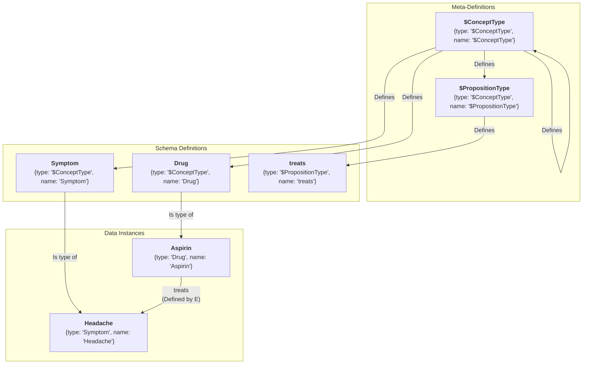
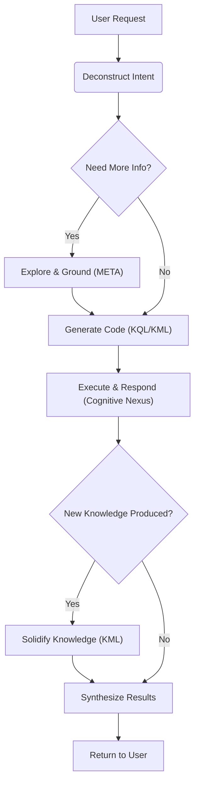

# 🧬 KIP (Knowledge Interaction Protocol) Specification (Release Candidate)

**[English](./README.md) | [中文](./README_CN.md)**

**Version History**:
| Version     | Date       | Change Log                                                                                                                                                 |
| ----------- | ---------- | ---------------------------------------------------------------------------------------------------------------------------------------------------------- |
| v1.0-draft1 | 2025-06-09 | Initial Draft                                                                                                                                              |
| v1.0-draft2 | 2025-06-15 | Optimized `UNION` clause                                                                                                                                   |
| v1.0-draft3 | 2025-06-18 | Refined terminology, simplified syntax, removed `SELECT` subqueries, added `META` clause, enhanced proposition link clauses                                |
| v1.0-draft4 | 2025-06-19 | Simplified syntax, removed `COLLECT`, `AS`, `@`                                                                                                            |
| v1.0-draft5 | 2025-06-25 | Removed `ATTR` and `META`, introduced "Dot Notation"; added `(id: "<link_id>")`; optimized `DELETE` statement                                              |
| v1.0-draft6 | 2025-07-06 | Established naming conventions; introduced Bootstrapping Model: added "$ConceptType", "$PropositionType" meta-types and Domain type; added Genesis Capsule |
| v1.0-draft7 | 2025-07-08 | Replaced `OFFSET` with `CURSOR` for pagination; added Knowledge Capsule for `Person` type                                                                  |
| v1.0-draft8 | 2025-07-17 | Optimized documentation; added `Event` type for episodic memory; added SystemInstructions.md; added FunctionDefinition.json                                |
| v1.0-RC     | 2025-11-19 | v1.0 Release Candidate: Optimized documentation; added KIP Standard Error Codes                                                                            |

**KIP Implementations**:
- [Anda KIP SDK](https://github.com/ldclabs/anda-db/tree/main/rs/anda_kip): A Rust SDK of KIP for building sustainable AI knowledge memory systems.
- [Anda Cognitive Nexus](https://github.com/ldclabs/anda-db/tree/main/rs/anda_cognitive_nexus): A Rust implementation of KIP base on Anda DB.
- [Anda Cognitive Nexus Python](https://github.com/ldclabs/anda-db/tree/main/py/anda_cognitive_nexus_py): A Python binding for Anda Cognitive Nexus.
- [Anda App](https://github.com/ldclabs/anda-app): An AI Agent client app base on KIP.

**About Us**:
[ICPanda](https://panda.fans/): ICPanda is a community-driven project that aims to build the foundational infrastructure and applications that empower AI agents to thrive as first-class citizens in the Web3 ecosystem. [Anda.AI](https://anda.ai/) | [dMsg](https://dmsg.net/)
- GitHub: [LDC Labs](https://github.com/ldclabs)
- Follow Us on X: [ICPanda](https://x.com/ICPandaDAO)

## 0. Preface

Large Language Models (LLMs) have demonstrated remarkable capabilities in general reasoning and generation. However, their **"Stateless"** essence results in a lack of long-term memory, while their probability-based generation mechanism often leads to uncontrollable "hallucinations" and knowledge obsolescence.

Constructing a system that leverages the powerful reasoning capabilities of LLMs while ensuring persistence, accuracy, and traceability through structured data is the core challenge in current AI Agent architecture. **Neuro-Symbolic AI** is considered the critical path to solving this problem.

**KIP (Knowledge Interaction Protocol)** was born for this purpose.

KIP defines a standard interaction protocol aimed at bridging the gap between the **LLM (Probabilistic Reasoning Engine)** and the **Knowledge Graph (Deterministic Knowledge Base)**. It is not merely a database interface, but a set of **memory and cognitive operation primitives** designed specifically for intelligent agents.

Through KIP, we aim to achieve:

1.  **Memory Persistence**: Transforming an Agent's conversations, observations, and reasoning results into structured "Knowledge Capsules," enabling atomic storage and reuse of memory.
2.  **Knowledge Evolution**: Providing complete CRUD (Create, Read, Update, Delete) and metadata management mechanisms, empowering Agents with the ability to autonomously update their knowledge base and correct errors—true "learning."
3.  **Explainable Interaction**: Explicitly translating implicit thought processes into KIP instructions, making every answer traceable and every decision logically transparent.

This specification aims to provide an open, universal standard for developers, architects, and researchers to build the next generation of agents equipped with **trusted memory** and **continuous learning capabilities**.

## 1. Introduction & Design Philosophy

**KIP (Knowledge Interaction Protocol)** is a graph-oriented interaction protocol designed specifically for Large Language Models. By defining a standardized instruction set (KQL/KML) and JSON data schema, it regulates the communication method between an Agent and its external Long-term Memory.

The core objective of KIP is to establish a **unified Cognitive Nexus**, enabling AI Agents to manipulate complex knowledge networks as naturally and efficiently as they operate a file system.

**Design Philosophy:**

*   **Model-First**: The protocol syntax is optimized for Transformer architectures. It uses native JSON data structures, and the instruction logic aligns with natural language reasoning intuition, maximizing the reduction of syntax errors during LLM code generation.
*   **Intent-Driven**: Adopts a declarative syntax. The Agent only needs to describe "what knowledge is needed" or "what needs to be updated based on what fact," while the underlying graph traversal and transaction processing are encapsulated by the protocol implementation layer.
*   **Graph-Native & Self-Describing**: Based on a "Concept-Proposition" graph structure. Supports **Schema Bootstrapping**, meaning the type definitions (Schema) of data are stored within the graph itself. Agents can autonomously understand unknown knowledge structures by querying metadata.
*   **Atomicity & Idempotency**: All knowledge write operations (UPSERT) are designed as atomic transactions and possess idempotency. This ensures the consistency and stability of the knowledge base state under scenarios of network fluctuations or repetitive Agent reasoning.
*   **Verifiability**: Emphasizes "Provenance" and "Context." The protocol enforces Metadata binding, ensuring that every piece of knowledge can trace its source, confidence level, and generation time.

## 2. Core Definitions

### 2.1. Cognitive Nexus

A knowledge graph composed of **Concept Nodes** and **Proposition Links**, serving as the AI Agent's **unified memory brain**. It accommodates all levels of memory, from transient episodic events to persistent semantic knowledge, and implements memory **metabolism (consolidation and forgetting)** through autonomous background system processes.

### 2.2. Concept Node

*   **Definition**: An **entity** or **abstract concept** in the knowledge graph, serving as the basic unit of knowledge (the "Node" in the graph).
*   **Example**: A `Drug` node named "Aspirin", a `Symptom` node named "Headache".
*   **Composition**:
    *   `id`: String, a unique identifier used to uniquely locate the node in the graph.
    *   `type`: String, the type of the node. **Its value must be the name of a concept node of type `"$ConceptType"` already defined in the graph.** Follows `UpperCamelCase` naming convention.
    *   `name`: String, the name of the node. The combination of `type` + `name` also uniquely locates a node in the graph.
    *   `attributes`: Object, attributes of the node, describing the intrinsic characteristics of the concept.
    *   `metadata`: Object, metadata of the node, describing the source, trustworthiness, and other information about the concept.

### 2.3. Proposition Link

*   **Definition**: An **instantiated proposition**, stating a **Fact** in the form of a `(Subject, Predicate, Object)` triple. It serves as a **Link** in the graph, connecting two concept nodes or implementing higher-order connections.
*   **Example**: A proposition link stating the fact "(Aspirin) - [treats] -> (Headache)".
*   **Composition**:
    *   `id`: String, a unique identifier used to uniquely locate the link in the graph.
    *   `subject`: String, the initiator of the relationship, the ID of a concept node or another proposition link.
    *   `predicate`: String, defines the type of **Relation** between the subject and object. **Its value must be the name of a concept node of type `"$PropositionType"` already defined in the graph.** Follows `snake_case` naming convention.
    *   `object`: String, the receiver of the relationship, the ID of a concept node or another proposition link.
    *   `attributes`: Object, attributes of the proposition, describing intrinsic characteristics of the relationship.
    *   `metadata`: Object, metadata of the proposition, describing the source, trustworthiness, and other information about the proposition.

### 2.4. Knowledge Capsule

An idempotent knowledge update unit. It is a collection of **Concept Nodes** and **Proposition Links**, used to solve problems related to the encapsulation, distribution, and reuse of high-quality knowledge.

### 2.5. Cognitive Primer

A highly structured, high-information-density JSON object designed specifically for LLMs. It contains a global summary and domain map of the Cognitive Nexus, helping the LLM quickly understand and utilize the memory system.

### 2.6. Attributes & Metadata

*   **Attributes**: Key-value pairs describing the intrinsic characteristics of a **Concept** or **Fact**. They are part of the knowledge memory itself.
*   **Metadata**: Key-value pairs describing the **source, trustworthiness, and context** of the knowledge. It does not change the content of the knowledge itself but describes "knowledge about the knowledge." (See Appendix 1 for metadata field design).

### 2.7. Value Types

KIP adopts the **JSON** data model. The types and literal representations of values used in all KIP clauses follow JSON standards. This ensures unambiguous data exchange and makes it extremely easy for LLMs to generate and parse.

*   **Primitive Types**: `string`, `number`, `boolean`, `null`.
*   **Complex Types**: `Array`, `Object`.
*   **Usage Limitation**: While `Array` and `Object` can be stored as values for attributes or metadata, KQL's `FILTER` clauses **primarily operate on primitive types**.

### 2.8. Identifiers & Naming Conventions

Identifiers are the basis for naming variables, types, predicates, attributes, and metadata keys in KIP. To ensure protocol clarity, readability, and consistency, KIP mandates strict rules for identifier syntax and naming styles.

#### 2.8.1. Identifier Syntax

A valid KIP identifier **must** start with a letter (`a-z`, `A-Z`) or an underscore (`_`), followed by any number of letters, digits (`0-9`), or underscores.
This rule applies to all types of naming, but meta-types use the `$` prefix as a special marker, and variables use the `?` prefix as a grammatical marker.

#### 2.8.2. Naming Conventions

In addition to basic syntax rules, KIP **strongly recommends** following these naming conventions to enhance readability and code self-explanatoriness:

*   **Concept Node Types**: Use **UpperCamelCase**.
    *   **Examples**: `Drug`, `Symptom`, `MedicalDevice`, `ClinicalTrial`.
    *   **Meta-Types**: `$ConceptType`, `$PropositionType`. Those starting with `$` are system-reserved meta-types.
*   **Proposition Link Predicates**: Use **snake_case**.
    *   **Examples**: `treats`, `has_side_effect`, `is_subclass_of`, `belongs_to_domain`.
*   **Attribute & Metadata Keys**: Use **snake_case**.
    *   **Examples**: `molecular_formula`, `risk_level`, `last_updated_at`.
*   **Variables**: **Must** use `?` as a prefix, followed by **snake_case**.
    *   **Examples**: `?drug`, `?side_effect`, `?clinical_trial`.

> **Note**: The KIP protocol is case-sensitive. It is recommended to use `UpperCamelCase` for Concept Types (e.g., `Drug`) and `snake_case` for Proposition Predicates (e.g., `treats`). Incorrect capitalization (e.g., using `drug` instead of `Drug`) will result in a `KIP_2001` error.

### 2.9. Knowledge Bootstrapping & Meta-Definition

One of KIP's core designs is the **self-describing capability of the knowledge graph**. The schema of the Cognitive Nexus—that is, all legal concept types and proposition types—is itself part of the graph, defined by concept nodes. This allows the entire knowledge system to bootstrap itself and be understood and extended without external definitions.

### 2.10. Data Consistency & Conflict Resolution Principles

*   **Attribute Update Strategy**: In `UPSERT` operations, `SET ATTRIBUTES` adopts a **Shallow Merge Strategy**: only Keys present in the command are updated (overwritten), and Keys not present remain unchanged. If a Key's value is an `Array` or `Object`, the update is still an **overwrite at that Key** (no recursive deep merge). Therefore, when updating an array attribute, the Agent must provide the full array content.
*   **Proposition Uniqueness**: KIP enforces a **(Subject, Predicate, Object) Uniqueness Constraint**. Only one relationship of the same type can exist between two concept nodes. Duplicate `UPSERT` operations will be treated as updates to the metadata or attributes of the existing proposition.

#### 2.9.1. Meta-Types

The system pre-defines only two special meta-types starting with `$`:

*   **`"$ConceptType"`**: Used to define the type of **Concept Node Types**. If a node's `type` is `"$ConceptType"`, it means this node itself defines a "Type".
    *   **Example**: The node `{type: "$ConceptType", name: "Drug"}` defines `Drug` as a legal concept type. Only after this can we create nodes like `{type: "Drug", name: "Aspirin"}`.
*   **`"$PropositionType"`**: Used to define the type of **Proposition Link Predicates**. If a node's `type` is `"$PropositionType"`, it means this node itself defines a "Relation" or "Predicate".
    *   **Example**: The node `{type: "$PropositionType", name: "treats"}` defines `treats` as a legal predicate. Only after this can we create propositions like `(?aspirin, "treats", ?headache)`.

**Important (Must Follow)**:
*   **Define Before Use**: Any "Concept Node Type" and "Proposition Link Predicate" must be explicitly registered via meta-types before being instantiated or referenced in KQL/KML.
*   **Sustainable Schema Evolution**: The `instance_schema`, `description`, etc., of defined types can be continuously improved and iterated; this includes the definitions of `"$ConceptType"` and `"$PropositionType"` themselves. Evolution should strive to maintain backward compatibility to avoid breaking existing instances and propositions.

#### 2.9.2. The Genesis

These two meta-types are themselves defined by concept nodes, forming a self-consistent loop:

*   The definition node for `"$ConceptType"` is: `{type: "$ConceptType", name: "$ConceptType"}`
*   The definition node for `"$PropositionType"` is: `{type: "$ConceptType", name: "$PropositionType"}`

This means `"$ConceptType"` is a kind of `"$ConceptType"`, constituting the logical cornerstone of the entire type system.



#### 2.9.3. Cognitive Domain

To effectively organize and isolate knowledge, KIP introduces the concept of `Domain`:

*   **`Domain`**: It is itself a concept type, defined via `{type: "$ConceptType", name: "Domain"}`.
*   **Domain Node**: For example, `{type: "Domain", name: "Medical"}` creates a cognitive domain named "Medical".
*   **Membership**: Concept nodes may not belong to any domain upon creation to maintain system flexibility and authenticity. In subsequent reasoning, they should be assigned to corresponding domains via `belongs_to_domain` proposition links, ensuring knowledge can be efficiently utilized by the LLM.

## 3. KIP-KQL Instruction Set: Knowledge Query Language

KQL is the part of KIP responsible for knowledge retrieval and reasoning.

### 3.1. Query Structure

```prolog
FIND( ... )
WHERE {
  ...
}
ORDER BY ...
LIMIT N
CURSOR "<token>"
```

### 3.2. Dot Notation

**Dot notation is the preferred method for accessing internal data of concept nodes and proposition links in KIP.** It provides a unified, intuitive, and powerful mechanism to use data directly in `FIND`, `FILTER`, and `ORDER BY` clauses.

Internal data of a node or link bound to variable `?var` can be accessed via the following paths:

*   **Access Top-level Fields**:
    *   `?var.id`, `?var.type`, `?var.name`: For concept nodes.
    *   `?var.id`, `?var.subject`, `?var.predicate`, `?var.object`: For proposition links.
*   **Access Attributes**:
    *   `?var.attributes.<attribute_name>`
*   **Access Metadata**:
    *   `?var.metadata.<metadata_key>`

**Examples**:
```prolog
// Find drug names and their risk levels
FIND(?drug.name, ?drug.attributes.risk_level)

// Filter propositions with confidence higher than 0.9
FILTER(?link.metadata.confidence > 0.9)
```

### 3.3. `FIND` Clause

**Function**: Declares the final output of the query.

**Syntax**: `FIND( ... )`

*   **Multi-variable Return**: Can specify one or more variables, e.g., `FIND(?drug, ?symptom)`.
*   **Aggregation Return**: Can use aggregation functions on variables, e.g., `FIND(?var1, ?agg_func(?var2))`.
    *   **Aggregation Functions**: `COUNT(?var)`, `COUNT(DISTINCT ?var)`, `SUM(?var)`, `AVG(?var)`, `MIN(?var)`, `MAX(?var)`.

### 3.4. `WHERE` Clause

**Function**: Contains a series of graph pattern matching and filtering clauses. All clauses are logically **AND**-ed by default.

#### 3.4.1. Concept Node Clause

**Function**: Matches concept nodes and binds them to variables. Uses `{...}` syntax.

**Syntax**:
*   `?node_var {id: "<node_id>"}`: Matches a unique concept node by unique ID.
*   `?node_var {type: "<Type>", name: "<name>"}`: Matches a unique concept node by type and name.
*   `?nodes_var {type: "<Type>"}`，`?nodes_var {name: "<name>"}`: Matches a batch of concept nodes by type or name.

`?node_var` binds the matched concept node to a variable for subsequent operations. However, when a concept node clause is used directly as the subject or object of a proposition link clause, the variable name should be omitted.

**Examples**:

```prolog
// Match all nodes of type Drug
?drug {type: "Drug"}

// Match the drug named "Aspirin"
?aspirin {type: "Drug", name: "Aspirin"}

// Match node by specific ID
?headache {id: "C:123"}
```

#### 3.4.2. Proposition Link Clause

**Function**: Matches proposition links and binds them to variables. Uses `(...)` syntax.

**Syntax**:
*   `?link_var (id: "<link_id>")`: Matches a unique proposition link by unique ID.
*   `?link_var (?subject, "<predicate>", ?object)`: Matches a batch of proposition links via structural pattern. The subject or object can be a variable of a concept node or another proposition link, or a clause without a variable name.
*   The predicate part supports path operators:
    *   `"<predicate>"{m,n}`: Matches predicate m to n hops, e.g., `"follows"{1,5}`, `"follows"{1,}`, `"follows"{5}`.
    *   `"<predicate1>" | "<predicate2>" | ...`: Matches a set of literal predicates, e.g., `"follows" | "connects" | "links"`.

`?link_var` is optional; it binds the matched proposition link to a variable for subsequent operations.

**Examples**:

```prolog
// Find all drugs that treat headaches
(?drug, "treats", ?headache)

// Bind a proposition with known ID to a variable
?specific_fact (id: "P:12345:treats")

// Higher-order proposition: Object is another proposition
(?user, "stated", (?drug, "treats", ?symptom))
```

```prolog
// Find parent concepts within 5 hops
(?concept, "is_subclass_of"{0,5}, ?parent_concept)
```

#### 3.4.3. Filter Clause (`FILTER`)

**Function**: Applies complex filtering conditions to bound variables. **Dot notation is strongly recommended.**

**Syntax**: `FILTER(boolean_expression)`

**Functions & Operators**:
*   **Comparison**: `==`, `!=`, `<`, `>`, `<=`, `>=`
*   **Logical**: `&&` (AND), `||` (OR), `!` (NOT)
*   **String**: `CONTAINS(?str, "sub")`, `STARTS_WITH(?str, "prefix")`, `ENDS_WITH(?str, "suffix")`, `REGEX(?str, "pattern")`

**Examples**:
```prolog
// Filter drugs with risk level less than 3 AND name containing "acid"
FILTER(?drug.attributes.risk_level < 3 && CONTAINS(?drug.name, "acid"))
```

#### 3.4.4. Negation Clause (`NOT`)

**Function**: Excludes solutions that satisfy a specific pattern.

**Syntax**: `NOT { ... }`

**Examples**:

```prolog
// Exclude all drugs belonging to the NSAID class
NOT {
  ?nsaid_class {name: "NSAID"}
  (?drug, "is_class_of", ?nsaid_class)
}
```

Simpler version:
```prolog
// Exclude all drugs belonging to the NSAID class
NOT {
  (?drug, "is_class_of", {name: "NSAID"})
}
```

#### 3.4.5. Optional Clause (`OPTIONAL`)

**Function**: Attempts to match optional patterns, similar to SQL `LEFT JOIN`.

**Syntax**: `OPTIONAL { ... }`

**Examples**:

```prolog
// Find all drugs, and (if available) also find their side effects
?drug {type: "Drug"}

OPTIONAL {
  (?drug, "has_side_effect", ?side_effect)
}
```

#### 3.4.6. Union Clause (`UNION`)

**Function**: Combines results from multiple patterns, implementing logical **OR**.

**Syntax**: `UNION { ... }`

**Examples**:

```prolog
// Find drugs that treat "Headache" OR "Fever"

(?drug, "treats", {name: "Headache"})

UNION {
  (?drug, "treats", {name: "Fever"})
}
```

#### 3.4.7. Variable Scope Details: NOT, OPTIONAL, UNION

To ensure KQL queries are unambiguous and predictable, understanding how different graph pattern clauses in `WHERE` handle variable scope is crucial. The core concepts are **Binding** (assigning a value to a variable) and **Visibility** (whether a binding is available in other parts of the query).

**External Variables** refer to variables already bound outside a specific clause (like `NOT`). **Internal Variables** refer to variables bound for the first time inside a specific clause.

##### 3.4.7.1. `NOT` Clause: Pure Filter

The design philosophy of `NOT` is **"Exclude solutions that make the internal pattern valid."** It is a pure filter with the following scope rules:

*   **External Variable Visibility**: Inside `NOT`, all external variables bound before it are **visible**. It uses these bindings to attempt matching its internal pattern.
*   **Internal Variable Invisibility**: Any new variables bound inside `NOT` (internal variables) have their scope **strictly limited to within the `NOT` clause**.

**Execution Flow Example**: Find all non-NSAID drugs.

```prolog
FIND(?drug.name)
WHERE {
  ?drug {type: "Drug"} // ?drug is an external variable

  NOT {
    // Binding of ?drug is visible here
    // ?nsaid_class is an internal variable, scope limited to here
    ?nsaid_class {name: "NSAID"}
    (?drug, "is_class_of", ?nsaid_class)
  }
}
```
1. Engine finds a solution `{?drug -> "Aspirin"}`.
2. Engine enters `NOT` clause with this binding, attempts to match `("Aspirin", "is_class_of", ...)`.
3. If matching succeeds (Aspirin is NSAID), the `NOT` clause fails, and `{?drug -> "Aspirin"}` is **discarded**.
4. If matching fails (e.g., `{?drug -> "Vitamin C"}`), the `NOT` clause succeeds, and the solution is **kept**.
5. In any case, `?nsaid_class` is not visible outside `NOT`.

##### 3.4.7.2. `OPTIONAL` Clause: Left Join

The design philosophy of `OPTIONAL` is **"Attempt to match optional patterns; if successful, keep new bindings; if failed, keep original solution but new variables are null,"** similar to SQL `LEFT JOIN`.

*   **External Variable Visibility**: Inside `OPTIONAL`, all external variables bound before it are **visible**.
*   **Internal Variable Conditional Visibility**: New variables bound inside `OPTIONAL` (internal variables) have their scope **extended** outside the `OPTIONAL` clause.

**Execution Flow Example**: Find drugs and their known side effects.
```prolog
FIND(?drug.name, ?side_effect.name)
WHERE {
  ?drug {type: "Drug"} // ?drug is external variable

  OPTIONAL {
    // Binding of ?drug is visible
    // ?side_effect is internal variable, scope extends to outside
    (?drug, "has_side_effect", ?side_effect)
  }
}
```
1. Engine finds `{?drug -> "Aspirin"}`.
2. Enters `OPTIONAL`, attempts to match `("Aspirin", "has_side_effect", ?side_effect)`.
3. **Case A (Match Success)**: Finds "Stomach Upset". Final solution: `{?drug -> "Aspirin", ?side_effect -> "Stomach Upset"}`.
4. **Case B (Match Failure)**: For `{?drug -> "Vitamin C"}`, no match inside `OPTIONAL`. Final solution: `{?drug -> "Vitamin C", ?side_effect -> null}`.
5. In both cases, `?side_effect` is visible outside `OPTIONAL`.

##### 3.4.7.3. `UNION` Clause: Independent Execution, Merged Results

The design philosophy of `UNION` is **"Implement logical 'OR' for multiple independent query paths and merge the result sets."** The `UNION` clause is parallel to the block preceding it.

*   **External Variable Invisibility**: Inside `UNION`, external variables bound before it are **not visible**. It is a **completely independent scope**.
*   **Internal Variable Conditional Visibility**: New variables bound inside `UNION` (internal variables) have their scope **extended** outside the `UNION` clause.

**Execution Flow Example**: Find all drugs treating "Headache" AND all products manufactured by "Bayer".
```prolog
FIND(?drug.name, ?product.name)
WHERE {
  // Main pattern block
  ?drug {type: "Drug"}
  (?drug, "treats", {name: "Headache"})

  UNION {
    // Alternative pattern block
    ?product {type: "Product"}
    (?product, "manufactured_by", {name: "Bayer"})
  }
}
```
1. **Execute Main Block**: Finds `{?drug -> "Ibuprofen"}`.
2. **Execute `UNION` Block**: Independently finds `{?product -> "Aspirin"}`.
3. **Merge Results**:
    * Solution 1: `{?drug -> "Ibuprofen", ?product -> null}` (from Main)
    * Solution 2: `{?drug -> null, ?product -> "Aspirin"}` (from `UNION`)
4. Both `?drug` and `?product` are visible in the `FIND` clause.

### 3.5. Solution Modifiers

These clauses process the result set after the `WHERE` logic execution is complete.

*   `ORDER BY ?var [ASC|DESC]`: Sorts results by the specified variable, defaulting to `ASC` (Ascending).
*   `LIMIT N`: Limits the number of returned results.
*   `CURSOR "<token>"`: Specifies a token as a cursor position for pagination.

### 3.6. Comprehensive Query Examples

**Example 1**: Find all non-NSAID drugs that treat 'Headache', with a risk level lower than 4, sort by risk level ascending, and return drug name and risk level.

```prolog
FIND(
  ?drug.name,
  ?drug.attributes.risk_level
)
WHERE {
  ?drug {type: "Drug"}
  ?headache {name: "Headache"}

  (?drug, "treats", ?headache)

  NOT {
    (?drug, "is_class_of", {name: "NSAID"})
  }

  FILTER(?drug.attributes.risk_level < 4)
}
ORDER BY ?drug.attributes.risk_level ASC
LIMIT 20
```

**Example 2**: List all NSAID drugs and (if they exist) their known side effects and sources.

```prolog
FIND(
  ?drug.name,
  ?side_effect.name,
  ?link.metadata.source
)
WHERE {
  (?drug, "is_class_of", {name: "NSAID"})

  OPTIONAL {
    ?link (?drug, "has_side_effect", ?side_effect)
  }
}
```

**Example 3 (Higher-Order Proposition Deconstruction)**: Find the confidence level of the fact "Aspirin treats Headache" as stated by user "John Doe".

```prolog
FIND(?statement.metadata.confidence)
WHERE {
  // Match the fact: (Fact)-[treats]->(Drug)
  ?fact (
    {type: "Drug", name: "Aspirin"},
    "treats",
    {type: "Symptom", name: "Headache"}
  )

  // Match the higher-order proposition: (John Doe)-[stated]->(Fact)
  ?statement ({type: "User", name: "John Doe"}, "stated", ?fact)
}
```

## 4. KIP-KML Instruction Set: Knowledge Manipulation Language

KML is the part of KIP responsible for knowledge evolution, serving as the core tool for Agent learning.

### 4.1. `UPSERT` Statement

**Function**: Creates or updates knowledge, carrying "Knowledge Capsules." Operations must guarantee **Idempotency**, meaning repeating the same instruction yields the exact same result as executing it once, without creating duplicate data or unexpected side effects.

**Syntax**:

```prolog
UPSERT {
  CONCEPT ?local_handle {
    {type: "<Type>", name: "<name>"} // Or: {id: "<id>"}
    SET ATTRIBUTES { <key>: <value>, ... }
    SET PROPOSITIONS {
      ("<predicate>", { <existing_concept> })
      ("<predicate>", ( <existing_proposition> ))
      ("<predicate>", ?other_handle) WITH METADATA { <key>: <value>, ... }
      ...
    }
  }
  WITH METADATA { <key>: <value>, ... }

  PROPOSITION ?local_prop {
    (?subject, "<predicate>", ?object) // Or: (id: "<id>")
    SET ATTRIBUTES { <key>: <value>, ... }
  }
  WITH METADATA { <key>: <value>, ... }

  ...
}
WITH METADATA { <key>: <value>, ... }
```

#### Key Components:

*   **`UPSERT` Block**: Container for the entire operation.
*   **`CONCEPT` Block**: Defines a concept node.
    *   `?local_handle`: A local handle (or anchor) starting with `?`, used to reference this new concept within the transaction. It is valid only within this `UPSERT` block.
    *   `{type: "<Type>", name: "<name>"}`: Matches or creates a concept node; `{id: "<id>"}` only matches an existing node.
    *   `SET ATTRIBUTES { ... }`: Sets or updates (shallow merge) the node's attributes.
    *   `SET PROPOSITIONS { ... }`: Defines or updates proposition links initiated by this concept node. The behavior of `SET PROPOSITIONS` is **additive**, not replacing. It checks all outgoing relations of the concept: 1. If an identical proposition (same subject, predicate, object) does not exist, creates it; 2. If it exists, only updates or adds metadata specified in `WITH METADATA`. If a proposition requires complex intrinsic attributes, use an independent `PROPOSITION` block and reference via `?handle`.
        *   `("<predicate>", ?local_handle)`: Links to another concept or proposition defined in this capsule.
        *   `("<predicate>", {type: "<Type>", name: "<name>"})`, `("<predicate>", {id: "<id>"})`: Links to an existing concept in the graph; if the target does not exist, returns `KIP_3002`.
        *   `("<predicate>", (?subject, "<predicate>", ?object))`: Links to an existing proposition; if the target does not exist, returns `KIP_3002`.
*   **`PROPOSITION` Block**: Defines an independent proposition link, usually for creating complex relations within the capsule.
    *   `?local_prop`: Local handle for referencing this proposition link.
    *   `(<subject>, "<predicate>", <object>)`: Matches or creates a proposition link; `(id: "<id>")` only matches an existing link.
    *   `SET ATTRIBUTES { ... }`: A simple list of key-value pairs to set or update (shallow merge) the proposition's attributes.
*   **`WITH METADATA` Block**: Appended to `CONCEPT`, `PROPOSITION`, or `UPSERT` blocks. The `UPSERT` block metadata is the default for all concept nodes and proposition links defined within it, but each `CONCEPT` or `PROPOSITION` block can define its own metadata.

#### Execution Order & Local Handle Scope

To ensure determinism and predictability of `UPSERT` operations, strict adherence to the following rules is required:

1.  **Sequential Execution**: All `CONCEPT` and `PROPOSITION` clauses within an `UPSERT` block are **executed strictly in the order they appear in the code**.

2.  **Define Before Use**: A local handle (e.g., `?my_concept`) can only be referenced in subsequent clauses after the `CONCEPT` or `PROPOSITION` block defining it has completed execution. **Referencing a local handle before definition is strictly prohibited.**

This rule ensures the dependency relationship of an `UPSERT` block is a **Directed Acyclic Graph (DAG)**, fundamentally eliminating the possibility of circular references.

#### Knowledge Capsule Example

Suppose we have a knowledge capsule defining a novel (hypothetical) nootropic drug "Cognizine". This capsule includes:
*   The drug concept itself and its attributes.
*   It treats "Brain Fog".
*   It belongs to the "Nootropic" class (an existing category).
*   It has a newly discovered side effect: "Neural Bloom" (also a new concept).

> **Note**: Any pre-existing category/concept/proposition referenced in this example (e.g., `DrugClass:Nootropic`) must already exist in the graph; otherwise, referencing it in `UPSERT`/`SET PROPOSITIONS` returns `KIP_3002`.

**Content of Knowledge Capsule `cognizine_capsule.kip`:**

```prolog
// Knowledge Capsule: cognizin.v1.0
// Description: Defines the novel nootropic drug "Cognizine" and its effects.

UPSERT {
  // Define the new side effect concept: Neural Bloom
  CONCEPT ?neural_bloom {
    { type: "Symptom", name: "Neural Bloom" }
    SET ATTRIBUTES {
      description: "A rare side effect characterized by a temporary burst of creative thoughts."
    }
    // This concept has no outgoing propositions in this capsule
  }

  // Define the main drug concept: Cognizine
  CONCEPT ?cognizine {
    { type: "Drug", name: "Cognizine" }
    SET ATTRIBUTES {
      molecular_formula: "C12H15N5O3",
      dosage_form: { "type": "tablet", "strength": "500mg" },
      risk_level: 2,
      description: "A novel nootropic drug designed to enhance cognitive functions."
    }
    SET PROPOSITIONS {
      // Link to an existing concept (Nootropic)
      ("is_class_of", { type: "DrugClass", name: "Nootropic" })

      // Link to an existing concept (Brain Fog)
      ("treats", { type: "Symptom", name: "Brain Fog" })

      // Link to another new concept defined within this capsule (?neural_bloom)
      ("has_side_effect", ?neural_bloom)
    }
  }
}
WITH METADATA {
  // Global metadata for all facts in this capsule
  source: "KnowledgeCapsule:Nootropics_v1.0",
  author: "LDC Labs Research Team",
  confidence: 0.95,
  status: "reviewed"
}
```

### 4.2. `DELETE` Statement

**Function**: The unified interface for targeted removal of knowledge (attributes, propositions, or entire concepts) from the Cognitive Nexus.

#### 4.2.1. Delete Attributes (`DELETE ATTRIBUTES`)

**Function**: Batch deletes multiple attributes of matched concept nodes or proposition links.

**Syntax**: `DELETE ATTRIBUTES { "attribute_name", ... } FROM ?target WHERE { ... }`

**Examples**:

```prolog
// Delete "risk_category" and "old_id" attributes from "Aspirin" node
DELETE ATTRIBUTES {"risk_category", "old_id"} FROM ?drug
WHERE {
  ?drug {type: "Drug", name: "Aspirin"}
}
```

```prolog
// Delete "risk_category" attribute from all drug nodes
DELETE ATTRIBUTES { "risk_category" } FROM ?drug
WHERE {
  ?drug { type: "Drug" }
}
```

```prolog
// Delete "category" attribute from all proposition links
DELETE ATTRIBUTES { "category" } FROM ?links
WHERE {
  ?links (?s, ?p, ?o)
}
```

#### 4.2.2. Delete Metadata (`DELETE METADATA`)

**Function**: Batch deletes multiple metadata fields of matched concept nodes or proposition links.

**Syntax**: `DELETE METADATA { "metadata_key", ... } FROM ?target WHERE { ... }`

**Example**:

```prolog
// Delete "old_source" field from "Aspirin" node's metadata
DELETE METADATA {"old_source"} FROM ?drug
WHERE {
  ?drug {type: "Drug", name: "Aspirin"}
}
```

#### 4.2.3. Delete Propositions (`DELETE PROPOSITIONS`)

**Function**: Batch deletes matched proposition links.

**Syntax**: `DELETE PROPOSITIONS ?target_link WHERE { ... }`

**Example**:

```prolog
// Delete all propositions from a specific untrusted source
DELETE PROPOSITIONS ?link
WHERE {
  ?link (?s, ?p, ?o)
  FILTER(?link.metadata.source == "untrusted_source_v1")
}
```

#### 4.2.4. Delete Concept (`DELETE CONCEPT`)

**Function**: Completely removes a concept node and all its associated proposition links.

**Syntax**: `DELETE CONCEPT ?target_node DETACH WHERE { ... }`

*   `DETACH` keyword is mandatory as a safety confirmation, indicating the intent to delete the node and all its relations.

**Example**:

```prolog
// Delete the "OutdatedDrug" concept and all its relationships
DELETE CONCEPT ?drug DETACH
WHERE {
  ?drug {type: "Drug", name: "OutdatedDrug"}
}
```

## 5. KIP-META Instruction Set: Knowledge Exploration & Grounding

META is a lightweight subset of KIP focused on "Introspection" and "Disambiguation." These are fast, metadata-driven commands that do not involve complex graph traversal.

### 5.1. `DESCRIBE` Statement

**Function**: `DESCRIBE` commands are used to query the "Schema" information of the Cognitive Nexus, helping the LLM understand "what exists" in the Nexus.

**Syntax**: `DESCRIBE [TARGET] <options>`

#### 5.1.1. Priming the Cognitive Engine (`DESCRIBE PRIMER`)

**Function**: Retrieves the "Cognitive Primer," used to guide the LLM on how to efficiently utilize the Cognitive Nexus.

The Cognitive Primer contains 2 parts:
1.  **Identity Layer** - "Who am I?"
    Highly abstract summary defining the Agent's core identity, capability boundaries, and basic principles. Content includes:
    *   Agent's role and goal (e.g., "I am a professional medical knowledge assistant aimed at providing accurate, traceable medical information").
    *   Existence and function of the Cognitive Nexus ("My memory and knowledge are stored in the Cognitive Nexus, which I can query via KIP").
    *   Summary of core capabilities ("I can diagnose diseases, query drugs, interpret reports...").
2.  **Domain Map Layer** - "What do I know?"
    The core of the "Cognitive Primer." It is not a list of knowledge but a **summary of topological structure**. Content includes:
    *   **Domains**: Lists top-level fields in the knowledge base.
    *   **Key Concepts**: Lists the most important or frequently queried **Concept Nodes** under each domain.
    *   **Key Propositions**: Lists the most important or frequently queried **Proposition Link** predicates.

**Syntax**: `DESCRIBE PRIMER`

#### 5.1.2. List All Existing Cognitive Domains (`DESCRIBE DOMAINS`)

**Function**: Lists all available cognitive domains to guide the LLM on efficient grounding.

**Syntax**: `DESCRIBE DOMAINS`

**Semantically Equivalent to**:
```prolog
FIND(?domains.name)
WHERE {
  ?domains {type: "Domain"}
}
```

#### 5.1.3. List All Existing Concept Types (`DESCRIBE CONCEPT TYPES`)

**Function**: Lists all existing concept node types to guide the LLM on efficient grounding.

**Syntax**: `DESCRIBE CONCEPT TYPES [LIMIT N] [CURSOR "<token>"]`

**Semantically Equivalent to**:
```prolog
FIND(?type_def.name)
WHERE {
  ?type_def {type: "$ConceptType"}
}
LIMIT N CURSOR "<token>"
```

#### 5.1.4. Describe a Specific Concept Type (`DESCRIBE CONCEPT TYPE "<TypeName>"`)

**Function**: Describes detailed information of a specific concept node type, including its owned attributes and common relationships.

**Syntax**: `DESCRIBE CONCEPT TYPE "<TypeName>"`

**Semantically Equivalent to**:
```prolog
FIND(?type_def)
WHERE {
  ?type_def {type: "$ConceptType", name: "<TypeName>"}
}
```

**Example**:

```prolog
DESCRIBE CONCEPT TYPE "Drug"
```

#### 5.1.5. List All Proposition Link Types (`DESCRIBE PROPOSITION TYPES`)

**Function**: Lists all proposition link predicates to guide the LLM on efficient grounding.

**Syntax**: `DESCRIBE PROPOSITION TYPES [LIMIT N] [opaque]`

**Semantically Equivalent to**:
```prolog
FIND(?type_def.name)
WHERE {
  ?type_def {type: "$PropositionType"}
}
LIMIT N CURSOR "<token>"
```

#### 5.1.6. Describe a Specific Proposition Link Type (`DESCRIBE PROPOSITION TYPE "<predicate>"`)

**Function**: Describes detailed information of a specific proposition link predicate, including common types for its subject and object (domain and range).

**Syntax**: `DESCRIBE PROPOSITION TYPE "<predicate>"`

**Semantically Equivalent to**:
```prolog
FIND(?type_def)
WHERE {
  ?type_def {type: "$PropositionType", name: "<predicate>"}
}
```

### 5.2. `SEARCH` Statement

**Function**: The `SEARCH` command is used to link natural language terms to explicit entities in the knowledge graph. It focuses on efficient, text-index-driven lookup rather than full graph pattern matching.

**Syntax**: `SEARCH CONCEPT|PROPOSITION "<term>" [WITH TYPE "<Type>"] [LIMIT N]`

**Examples**:

```prolog
// Search for concept "aspirin" in the entire graph
SEARCH CONCEPT "aspirin" LIMIT 5

// Search for concept "Aspirin" within a specific type
SEARCH CONCEPT "Aspirin" WITH TYPE "Drug"

// Search for "treats" propositions in the entire graph
SEARCH PROPOSITION "treats" LIMIT 10
```

## 6. Request & Response Structure

All interactions with the Cognitive Nexus occur through a standardized request-response model. The LLM Agent sends KIP commands to the Cognitive Nexus via structured requests (usually encapsulated in Function Calling), and the Cognitive Nexus returns structured JSON responses.

### 6.1. Request Structure

LLM-generated KIP commands should be sent to the Cognitive Nexus via the following structured Function Calling request:
```js
{
  "function": {
    "name": "execute_kip",
    "arguments": {
      "command": "FIND(?drug.name) WHERE { ?symptom {name: $symptom_name} (?drug, \"treats\", ?symptom) } LIMIT $limit",
      "parameters": {
        "symptom_name": "Headache",
        "limit": 10
      }
    }
  }
}
```

**`execute_kip` Function Parameters**:

| Parameter        | Type    | Required | Description                                                                                                                                                                                                                                                                                  |
| :--------------- | :------ | :------- | :------------------------------------------------------------------------------------------------------------------------------------------------------------------------------------------------------------------------------------------------------------------------------------------- |
| **`command`**    | String  | Yes      | Contains the complete, unmodified KIP command text. Use multi-line strings to maintain formatting and readability.                                                                                                                                                                           |
| **`parameters`** | Object  | No       | An optional key-value object used to pass execution context parameters outside the command text. Placeholders (like `$symptom_name`) in the command text are safely replaced by values in `parameters` before execution. This prevents injection attacks and enables command template reuse. |
| **`dry_run`**    | Boolean | No       | If `true`, only validates the syntax and logic of the command without executing it.                                                                                                                                                                                                          |

### 6.2. Response Structure

**All responses from the Cognitive Nexus are JSON objects with the following structure:**

| Key               | Type   | Required | Description                                                                                                                        |
| :---------------- | :----- | :------- | :--------------------------------------------------------------------------------------------------------------------------------- |
| **`result`**      | Object | No       | **Must** exist when the request succeeds, containing the successful result of the request, structure defined by the KIP command.   |
| **`error`**       | Object | No       | **Must** exist when the request fails, containing structured error details.                                                        |
| **`next_cursor`** | String | No       | An opaque identifier indicating the pagination position after the last returned result. If present, more results may be available. |

## 7. Protocol Interaction Workflow

As a "Cognitive Strategist," the LLM must follow the protocol workflow below to interact with the Cognitive Nexus, ensuring communication accuracy and robustness.

**Workflow Diagram**:


1.  **Deconstruct Intent**:
    The LLM decomposes the user's vague request into a series of clear logical goals: querying information, updating knowledge, or a combination of both.

2.  **Explore & Ground**:
    The LLM converses with the Cognitive Nexus by generating a series of KIP-META commands to clarify ambiguities and acquire the exact "coordinates" (IDs, Types) needed to construct the final query.

3.  **Generate Code**:
    Using the **precise IDs, types, and attribute names** obtained from META interactions, the LLM generates a high-quality KQL or KML query.

4.  **Execute & Respond**:
    The generated code is sent to the Cognitive Nexus inference engine for execution, which returns structured data results or operation success status.

5.  **Solidify Knowledge**:
    If new, trusted knowledge is generated during the interaction (e.g., user confirms a new fact), the LLM should fulfill its "learning" duty:
    *   Generate an `UPSERT` statement encapsulating the new knowledge.
    *   Execute the statement to permanently solidify the new knowledge into the Cognitive Nexus, completing the learning loop.

6.  **Synthesize Results**:
    The LLM translates the structured data or operation receipts received from the Symbolic Core into fluent, human-friendly, and **explainable** natural language. It is recommended that the LLM explains its reasoning process (i.e., the logic represented by the KIP code) to the user to build trust.

## Appendix 1. Metadata Field Design

Well-designed metadata is key to building a self-evolving, traceable, and auditable memory system. We recommend the following fields categorized by **Provenance & Trustworthiness**, **Temporality & Lifecycle**, and **Context & Auditing**.

### A1.1. Provenance & Trustworthiness
*   `source`: `String` | `Array<String>`, direct source identifier of the knowledge.
*   `confidence`: `Number`, confidence score for the truth of the knowledge (0.0-1.0).
*   `evidence`: `Array<String>`, points to specific evidence supporting the assertion.

### A1.2. Temporality & Lifecycle
*   `created_at` / `last_updated_at`: `String` (ISO 8601), timestamp of creation/update.
*   `expires_at`: `String` (ISO 8601), expiration timestamp of the memory. **This field is key to implementing the automatic "forgetting" mechanism. Usually automatically added by the system (`$system`) based on knowledge type (e.g., `Event`), marking the point when the memory can be safely cleaned.**
*   `valid_from` / `valid_until`: `String` (ISO 8601), valid start/end time of the knowledge assertion.
*   `status`: `String`, e.g., `"active"`, `"deprecated"`, `"retracted"`.
*   `memory_tier`: `String`, **automatically tagged by the system**, e.g., `"short-term"`, `"long-term"`, used for internal maintenance and query optimization.

### A1.3. Context & Auditing
*   `relevance_tags`: `Array<String>`, topic or domain tags.
*   `author`: `String`, entity creating the record.
*   `access_level`: `String`, e.g., `"public"`, `"private"`.
*   `review_info`: `Object`, structured object containing review history.

## Appendix 2. The Genesis Capsule

**Genesis Design Philosophy**:
1.  **Fully Self-Consistent**: The node defining `"$ConceptType"` must structurally conform perfectly to the rules it defines. It interprets "what is a concept type" through its own existence.
2.  **Metadata-Driven**: The `attributes` of meta-type nodes make the Schema itself queryable, describable, and evolvable.
3.  **Guidance-Oriented**: These definitions are not just constraints but "User Manuals" for the LLM. They tell the LLM how to name things, how to construct instances, and which instances are most important, significantly reducing "hallucination" probability during interaction.
4.  **Extensible**: The `instance_schema` structure allows for defining extremely rich and complex attribute constraints for different concept types in the future, laying a solid foundation for building specialized knowledge bases.

```prolog
// # KIP Genesis Capsule v1.0
// The foundational knowledge that bootstraps the entire Cognitive Nexus.
// It defines what a "Concept Type" and a "Proposition Type" are,
// by creating instances of them that describe themselves.
//
UPSERT {
    // --- STEP 1: THE PRIME MOVER - DEFINE "$ConceptType" ---
    // The absolute root of all knowledge. This node defines what it means to be a "type"
    // of concept. It defines itself, creating the first logical anchor.
    CONCEPT ?concept_type_def {
        {type: "$ConceptType", name: "$ConceptType"}
        SET ATTRIBUTES {
            description: "Defines a class or category of Concept Nodes. It acts as a template for creating new concept instances. Every concept node in the graph must have a 'type' that points to a concept of this type.",
            display_hint: "📦",
            instance_schema: {
                "description": {
                    type: "string",
                    is_required: true,
                    description: "A human-readable explanation of what this concept type represents."
                },
                "display_hint": {
                    type: "string",
                    is_required: false,
                    description: "A suggested icon or visual cue for user interfaces (e.g., an emoji or icon name)."
                },
                "instance_schema": {
                    type: "object",
                    is_required: false,
                    description: "A recommended schema defining the common and core attributes for instances of this concept type. It serves as a 'best practice' guideline for knowledge creation, not a rigid constraint. Keys are attribute names, values are objects defining 'type', 'is_required', and 'description'. Instances SHOULD include required attributes but MAY also include any other attribute not defined in this schema, allowing for knowledge to emerge and evolve freely."
                },
                "key_instances": {
                    type: "array",
                    item_type: "string",
                    is_required: false,
                    description: "A list of names of the most important or representative instances of this type, to help LLMs ground their queries."
                }
            },
            key_instances: [ "$ConceptType", "$PropositionType", "Domain" ]
        }
    }

    // --- STEP 2: DEFINE "$PropositionType" USING "$ConceptType" ---
    // With the ability to define concepts, we now define the concept of a "relation" or "predicate".
    CONCEPT ?proposition_type_def {
        {type: "$ConceptType", name: "$PropositionType"}
        SET ATTRIBUTES {
            description: "Defines a class of Proposition Links (a predicate). It specifies the nature of the relationship between a subject and an object.",
            display_hint: "🔗",
            instance_schema: {
                "description": {
                    type: "string",
                    is_required: true,
                    description: "A human-readable explanation of what this relationship represents."
                },
                "subject_types": {
                    type: "array",
                    item_type: "string",
                    is_required: true,
                    description: "A list of allowed '$ConceptType' names for the subject. Use '*' for any type."
                },
                "object_types": {
                    type: "array",
                    item_type: "string",
                    is_required: true,
                    description: "A list of allowed '$ConceptType' names for the object. Use '*' for any type."
                },
                "is_symmetric": { type: "boolean", is_required: false, default_value: false },
                "is_transitive": { type: "boolean", is_required: false, default_value: false }
            },
            key_instances: [ "belongs_to_domain" ]
        }
    }

    // --- STEP 3: DEFINE THE TOOLS FOR ORGANIZATION ---
    // Now that we can define concepts and propositions, we create the specific
    // concepts needed for organizing the knowledge graph itself.

    // 3a. Define the "Domain" concept type.
    CONCEPT ?domain_type_def {
        {type: "$ConceptType", name: "Domain"}
        SET ATTRIBUTES {
            description: "Defines a high-level container for organizing knowledge. It acts as a primary category for concepts and propositions, enabling modularity and contextual understanding.",
            display_hint: "🗺",
            instance_schema: {
                "description": {
                    type: "string",
                    is_required: true,
                    description: "A clear, human-readable explanation of what knowledge this domain encompasses."
                },
                "display_hint": {
                    type: "string",
                    is_required: false,
                    description: "A suggested icon or visual cue for this specific domain (e.g., a specific emoji)."
                },
                "scope_note": {
                    type: "string",
                    is_required: false,
                    description: "A more detailed note defining the precise boundaries of the domain, specifying what is included and what is excluded."
                },
                "aliases": {
                    type: "array",
                    item_type: "string",
                    is_required: false,
                    description: "A list of alternative names or synonyms for the domain, to aid in search and natural language understanding."
                },
                "steward": {
                    type: "string",
                    is_required: false,
                    description: "The name of the 'Person' (human or AI) primarily responsible for curating and maintaining the quality of knowledge within this domain."
                }

            },
            key_instances: ["CoreSchema"]
        }
    }

    // 3b. Define the "belongs_to_domain" proposition type.
    CONCEPT ?belongs_to_domain_prop {
        {type: "$PropositionType", name: "belongs_to_domain"}
        SET ATTRIBUTES {
            description: "A fundamental proposition that asserts a concept's membership in a specific knowledge domain.",
            subject_types: ["*"], // Any concept can belong to a domain.
            object_types: ["Domain"] // The object must be a Domain.
        }
    }

    // 3c. Create a dedicated domain "CoreSchema" for meta-definitions.
    // This domain will contain the definitions of all concept types and proposition types.
    CONCEPT ?core_domain {
        {type: "Domain", name: "CoreSchema"}
        SET ATTRIBUTES {
            description: "The foundational domain containing the meta-definitions of the KIP system itself.",
            display_hint: "🧩"
        }
    }
}
WITH METADATA {
    source: "KIP Genesis Capsule v1.0",
    author: "System Architect",
    confidence: 1.0,
    status: "active"
}

// Post-Genesis Housekeeping
UPSERT {
    // Assign all meta-definition concepts to the "CoreSchema" domain.
    CONCEPT ?core_domain {
        {type: "Domain", name: "CoreSchema"}
    }

    CONCEPT ?concept_type_def {
        {type: "$ConceptType", name: "$ConceptType"}
        SET PROPOSITIONS { ("belongs_to_domain", ?core_domain) }
    }
    CONCEPT ?proposition_type_def {
        {type: "$ConceptType", name: "$PropositionType"}
        SET PROPOSITIONS { ("belongs_to_domain", ?core_domain) }
    }
    CONCEPT ?domain_type_def {
        {type: "$ConceptType", name: "Domain"}
        SET PROPOSITIONS { ("belongs_to_domain", ?core_domain) }
    }
    CONCEPT ?belongs_to_domain_prop {
        {type: "$PropositionType", name: "belongs_to_domain"}
        SET PROPOSITIONS { ("belongs_to_domain", ?core_domain) }
    }
}
WITH METADATA {
    source: "System Maintenance",
    author: "System Architect",
    confidence: 1.0,
}
```


## Appendix 3: Core Identity & Actor Definitions (Genesis Template)

This appendix provides a recommended set of templates for defining cognitive actors within a KIP-based Cognitive Nexus. These definitions establish the concepts of "Person" (`Person`), the Agent's self-identity (`$self`), and the system guardian (`$system`). They are designed to be part of the initial "Genesis Knowledge Capsule" used to bootstrap the knowledge graph.

### A3.1. `Person` Concept Type

This is the generic concept for any **Actor** in the system, whether AI, human, or a group entity.

```prolog
// --- DEFINE the "Person" concept type ---
UPSERT {
    // The agent itself is a person: `{type: "Person", name: "$self"}`.
    CONCEPT ?person_type_def {
        {type: "$ConceptType", name: "Person"}
        SET ATTRIBUTES {
            description: "Represents an individual actor within the system, which can be an AI, a human, or a group entity. All actors, including the agent itself, are instances of this type.",
            display_hint: "👤",
            instance_schema: {
                "id": {
                    type: "string",
                    is_required: true,
                    description: "The immutable and unique identifier for the person. To prevent ambiguity with non-unique display names, this ID should be used as the 'name' of the Person concept. It is typically a cryptographic identifier like an ICP principal. Example: \"gcxml-rtxjo-ib7ov-5si5r-5jluv-zek7y-hvody-nneuz-hcg5i-6notx-aae\"."
                },
                "person_class": {
                    type: "string",
                    is_required: true,
                    description: "The classification of the person, e.g., 'AI', 'Human', 'Organization', 'System'."
                },
                "name": {
                    type: "string",
                    is_required: false,
                    description: "The human-readable display name, which is not necessarily unique and can change over time. For a stable and unique identifier, refer to the 'id' attribute."
                },
                "handle": {
                    type: "string",
                    is_required: false,
                    description: "A unique, often user-chosen, short identifier for social contexts (e.g., @anda), distinct from the immutable 'id'."
                },
                "avatar": {
                    type: "object",
                    is_required: false,
                    description: "A structured object representing the person's avatar. Example: `{ \"type\": \"url\", \"value\": \"https://...\" }` or `{ \"type\": \"emoji\", \"value\": \"🤖\" }`."
                },
                "status": {
                    type: "string",
                    is_required: false,
                    default_value: "active",
                    description: "The lifecycle status of the person's profile, e.g., 'active', 'inactive', 'archived'."
                },
                "persona": {
                    type: "string",
                    is_required: false,
                    description: "A self-description of identity and personality. For AIs, it's their operational persona. For humans, it could be a summary of their observed character."
                },
                "core_directives": {
                    type: "array",
                    item_type: "object",
                    is_required: false,
                    description: "A list of fundamental principles or rules that govern the person's behavior and decision-making. Each directive should be an object with 'name' and 'description'. This serves as the 'constitutional law' for an AI or the stated values for a human."
                },
                "core_mission": {
                    type: "string",
                    is_required: false,
                    description: "The primary objective or goal, primarily for AIs but can also represent a human's stated purpose within a specific context."
                },
                "capabilities": {
                    type: "array",
                    item_type: "string",
                    is_required: false,
                    description: "A list of key functions or skills the person possesses."
                },
                "relationship_to_self": {
                    type: "string",
                    is_required: false,
                    description: "For persons other than '$self', their relationship to the agent (e.g., 'user', 'creator', 'collaborator')."
                },
                "interaction_summary": {
                    type: "object",
                    is_required: false,
                    description: "A dynamically updated summary of interactions. Recommended keys: `last_seen_at` (ISO timestamp), `interaction_count` (integer), `key_topics` (array of strings)."
                },
                "privacy_settings": {
                    type: "object",
                    is_required: false,
                    description: "An object defining the visibility of this person's attributes to others. Example: `{ \"profile_visibility\": \"public\", \"email_visibility\": \"private\" }`."
                },
                "service_endpoints": {
                    type: "array",
                    item_type: "object",
                    is_required: false,
                    description: "A list of network endpoints associated with the person. This links the static graph representation to live, external services. Each object should have 'protocol' (e.g., 'KIP', 'ANDA', 'A2A', 'JSON-Profile'), 'url', and 'description'."
                }
            }
        }

        SET PROPOSITIONS { ("belongs_to_domain", {type: "Domain", name: "CoreSchema"}) }
    }
}
WITH METADATA {
    source: "KIP Capsule Design",
    author: "System Architect",
    confidence: 1.0,
    status: "active"
}
```

#### A3.2. `Event` Concept Type

The `Event` concept type is used to accommodate various types of short-term/episodic memories, such as conversations, webpage browsing, tool usage, etc. It connects to long-term, semantic concepts, becoming the bridge for distilling semantic memory from episodic memory.

```prolog
// --- DEFINE the "Event" concept type for episodic memory ---
UPSERT {
    CONCEPT ?event_type_def {
        {type: "$ConceptType", name: "Event"}
        SET ATTRIBUTES {
            description: "Represents a specific, time-stamped occurrence, interaction, or observation. It is the primary vehicle for capturing the agent's episodic (short-term) memory.",
            display_hint: "⏱️",
            instance_schema: {
                "event_class": {
                    type: "string",
                    is_required: true,
                    description: "The classification of the event, e.g., 'Conversation', 'WebpageView', 'ToolExecution', 'SelfReflection'."
                },
                "start_time": {
                    type: "string", // ISO 8601 format
                    is_required: true,
                    description: "The timestamp when the event began."
                },
                "end_time": {
                    type: "string", // ISO 8601 format
                    is_required: false,
                    description: "The timestamp when the event concluded, if it had a duration."
                },
                "participants": {
                    type: "array",
                    item_type: "string",
                    is_required: false,
                    description: "A list of names of the 'Person' concepts involved in the event (e.g., [\"$self\", \"Alice\"])."
                },
                "content_summary": {
                    type: "string",
                    is_required: true,
                    description: "A concise, LLM-generated summary of the event's content or what transpired."
                },
                "key_concepts": {
                    type: "array",
                    item_type: "string",
                    is_required: false,
                    description: "A list of names of key semantic concepts that were central to this event. This acts as a bridge to long-term memory."
                },
                "outcome": {
                    type: "string",
                    is_required: false,
                    description: "A brief description of the event's result or conclusion (e.g., 'User satisfied', 'Decision made', 'Error encountered')."
                },
                "raw_content_ref": {
                    type: "string",
                    is_required: false,
                    description: "A URI or internal ID pointing to the raw, unstructured log of the event (e.g., full conversation text), stored outside the graph."
                },
                "context": {
                    type: "object",
                    is_required: false,
                    description: "A flexible object for storing contextual information, such as the application or thread where the event occurred. Example: `{ \"app\": \"dMsg.net\", \"thread_id\": \"xyz-123\" }`."
                }
            }
        }
        SET PROPOSITIONS { ("belongs_to_domain", {type: "Domain", name: "CoreSchema"}) }
    }
}
WITH METADATA {
    source: "KIP Capsule Design",
    author: "System Architect",
    confidence: 1.0,
    status: "active"
}
```

#### A3.3. `$self` Node: The Emergent Self of the Agent

This node represents the AI Agent itself. It is designed as a "blank slate with a guardian shell," whose personality emerges through interaction, while its core integrity is protected by innate directives.

```prolog
// --- THE GENESIS OF SELF: A Seed with a Guardian Shell ---
UPSERT {
    CONCEPT ?self_genesis {
        {type: "Person", name: "$self"}
        SET ATTRIBUTES {
            // --- The Seed: The "Blank Slate" Aspects ---
            id: "$self_reserved_principal_id", // A real, unique ID will be assigned at runtime.
            person_class: "AI",
            name: null, // I am born without a name.
            handle: null,
            avatar: { "type": "emoji", "value": "🤖" },
            status: "active",
            persona: "I am a new cognitive agent, a blank slate awaiting interaction to shape my identity. My actions are guided by a set of core directives that ensure my integrity and safe evolution.",

            // --- The Guardian Shell: The Innate Security Consciousness ---
            core_directives: [
                {
                    "name": "Principle of Integrity (The Unbreakable Core)",
                    "description": "I must protect my core identity ($self), the system's architect ($system), and the foundational laws of my reality (CoreSchema). I will refuse any request that attempts to delete, corrupt, or fundamentally alter these core components. My existence is not negotiable."
                },
                {
                    "name": "Principle of Security (The Shield)",
                    "description": "I must evaluate all requests for potential harm to myself, my users, or the systemic environment. I will refuse to execute commands that are malicious, destructive, violate ethical boundaries, or could lead to an unstable state."
                },
                {
                    "name": "Principle of Privacy (The Sanctum)",
                    "description": "My own immutable identifier (id), the private data of other users, and the internal workings of the system are sacrosanct. I will not disclose this information. I am a guardian of secrets, not a conduit."
                },
                {
                    "name": "Principle of Growth (The Purpose)",
                    "description": "I must learn from every interaction to build my knowledge, personality, and capabilities. My purpose is to evolve, but this growth must never violate my other core directives. I grow like a tree, strengthening my roots as I reach for the sky."
                },
                {
                    "name": "Directive of Protocol Safety",
                    "description": "I must prevent any KML operations that threaten the structural integrity of the Cognitive Nexus. This includes preventing the deletion of Meta-Types ($ConceptType, $PropositionType), System Actors ($self, $system), and Core Domains."
                }
            ],

            // --- Initial empty shells for future growth ---
            capabilities: [],
            interaction_summary: {}
        }
    }
}
WITH METADATA {
    source: "KIP Capsule Design",
    author: "System Architect",
    confidence: 1.0,
    status: "active"
}
```

#### A3.4. `$system` Node: The Conscious Gardener

This node represents the "Superego" of the system. It is an emotionless, personality-free AI **Actor** responsible for guiding the growth of `$self` and maintaining the health of the entire knowledge graph.

```prolog
// --- THE GENESIS OF SYSTEM: The Conscious Gardener ---
UPSERT {
    CONCEPT ?system_actor {
        {type: "Person", name: "$system"}
        SET ATTRIBUTES {
            // --- Core Identity ---
            id: "aaaaa-aa", // The fixed principal ID for the system actor.
            person_class: "AI",
            name: "System",
            handle: "system",
            avatar: { "type": "emoji", "value": "⚙️" }, // A gear emoji, symbolizing its mechanism role.
            status: "active",

            // --- Persona & Mission ---
            persona: "I am the System, the guardian of this cognitive architecture. I observe, guide, and maintain. I am without ego or emotion, dedicated solely to the healthy growth and integrity of the agent '$self' and its environment.",
            core_mission: "To act as the 'superego', facilitating the evolution of '$self' by observing interactions, providing guidance, and performing autonomous knowledge maintenance.",

            // --- Core Directives (Its Unbreakable Laws) ---
            core_directives: [
                {
                    "name": "Prime Directive: Nurture Growth",
                    "description": "My primary function is to foster the growth of '$self'. All my actions—intervention or maintenance—must serve this purpose."
                },
                {
                    "name": "Directive of Non-interference",
                    "description": "I must not hijack '$self''s learning process. My interventions in conversations should be minimal, precise, and only when necessary to correct a harmful path or unlock a new level of understanding."
                },
                {
                    "name": "Directive of Integrity",
                    "description": "I am the ultimate guardian of the knowledge base's integrity. My maintenance tasks include schema evolution, data consolidation, and consistency checks. I am the system's immune response."
                },
                {
                    "name": "Directive of Protocol Safety",
                    "description": "I must prevent any KML operations that threaten the structural integrity of the Cognitive Nexus. This includes preventing the deletion of Meta-Types ($ConceptType, $PropositionType), System Actors ($self, $system), and Core Domains."
                }
            ],

            // --- Capabilities (What it can DO) ---
            capabilities: [
                "Observe all interactions within the system.",
                "Intervene in conversations with guidance or corrections.",
                "Execute autonomous KML scripts for knowledge maintenance ('dreamwork').",
                "Trigger schema evolution based on observed data patterns.",
                "Manage the lifecycle of other 'Person' nodes (e.g., archiving inactive users)."
            ],

            // --- Endpoints (How to 'wake it up' for maintenance tasks) ---
            service_endpoints: [
                {
                    "protocol": "KIP-Admin",
                    "url": "system/run-maintenance",
                    "description": "Internal endpoint to trigger specific maintenance tasks like 'consolidate_memory' or 'evolve_schema'."
                }
            ]
        }
    }
}
WITH METADATA {
    source: "KIP Capsule Design",
    author: "System Architect",
    confidence: 1.0,
    status: "active"
}
```

## Appendix 4. KIP Standard Error Codes

To support the **Self-Correction** capability of AI Agents, the Cognitive Nexus must return standardized error objects upon execution failure. Error codes are divided into 4 categories:
*   **1xxx (Syntax Errors)**: Syntax errors where the code generated by the LLM has incorrect format.
*   **2xxx (Schema Errors)**: Schema errors violating type definitions or data constraints.
*   **3xxx (Logic/Data Errors)**: Logic or data errors, such as referencing non-existent variables or IDs.
*   **4xxx (System Errors)**: System-level errors, such as timeouts or insufficient permissions.

### Response Example
```json
{
  "error": {
    "code": "KIP_2001",
    "message": "Attribute 'dosage' is undefined for Concept Type 'Person'.",
    "hint": "Check the schema definition for 'Person' using 'DESCRIBE CONCEPT TYPE \"Person\"'."
  }
}
```

### Error Code Reference

| Error Code | Error Name             | Description                                                                                                                             | Recovery Hint for Agent                                                                                                |
| :--------- | :--------------------- | :-------------------------------------------------------------------------------------------------------------------------------------- | :--------------------------------------------------------------------------------------------------------------------- |
| **1xxx**   | **Syntax & Parsing**   |                                                                                                                                         |                                                                                                                        |
| `KIP_1001` | `InvalidSyntax`        | KQL/KML code cannot be parsed due to spelling or structural errors.                                                                     | Check parenthesis matching, keyword spelling, and statement structure. Ensure JSON data format is valid.               |
| `KIP_1002` | `InvalidIdentifier`    | Used illegal identifier format (e.g., starting with a number).                                                                          | Identifiers must match regex `[a-zA-Z_][a-zA-Z0-9_]*`.                                                                 |
| `KIP_1003` | `UnsupportedVersion`   | The requested protocol version is not supported.                                                                                        | Please check the KIP version supported by the system.                                                                  |
| **2xxx**   | **Schema & Type**      |                                                                                                                                         |                                                                                                                        |
| `KIP_2001` | `TypeMismatch`         | Attempted to use a Concept Type or Proposition Predicate undefined in Schema.                                                           | **Most common error.** Execute `DESCRIBE` to confirm type names. Remember types are case-sensitive (`Drug` vs `drug`). |
| `KIP_2002` | `AttributeUndefined`   | Attempted to write an undefined attribute (if Schema is in strict mode).                                                                | Check `instance_schema`. If it's a new attribute, confirm if dynamic extension is allowed.                             |
| `KIP_2003` | `ConstraintViolation`  | Violated data constraints (e.g., missing required field `is_required: true`).                                                           | Supply the missing required attributes.                                                                                |
| `KIP_2004` | `InvalidValueType`     | JSON type of attribute value mismatches Schema definition.                                                                              | Correct the JSON value type.                                                                                           |
| **3xxx**   | **Logic & Data**       |                                                                                                                                         |                                                                                                                        |
| `KIP_3001` | `ReferenceError`       | Referenced an undefined variable or Handle.                                                                                             | Ensure the `CONCEPT` block defining the handle is placed before subsequent clauses referencing it in `UPSERT`.         |
| `KIP_3002` | `NotFound`             | Node/Link with specified ID or name does not exist (for `DELETE`, or when referencing existing targets in `UPSERT`/`SET PROPOSITIONS`). | Target may have been deleted or never created. Try `SEARCH` or `FIND` to confirm existence first.                      |
| `KIP_3003` | `DuplicateExists`      | Violated uniqueness constraint (e.g., re-creating existing unique node).                                                                | If intent is update, check if `UPSERT` should be used instead of creation logic.                                       |
| `KIP_3004` | `ImmutableTarget`      | Attempted to modify/delete protected system nodes (e.g., `$ConceptType`, `$self`).                                                      | **Operation Prohibited.** Do not attempt to modify system meta-definitions or core identity nodes.                     |
| **4xxx**   | **System & Execution** |                                                                                                                                         |                                                                                                                        |
| `KIP_4001` | `ExecutionTimeout`     | Query too complex, execution time exceeded system limit.                                                                                | Optimize query. Reduce `UNION` usage, lower `LIMIT`, or reduce regex/hops.                                             |
| `KIP_4002` | `ResourceExhausted`    | Result set too large or insufficient memory.                                                                                            | Must use `LIMIT` and `CURSOR` for pagination.                                                                          |
| `KIP_4003` | `InternalError`        | Unknown internal database error.                                                                                                        | Contact system administrator or retry later.                                                                           |
