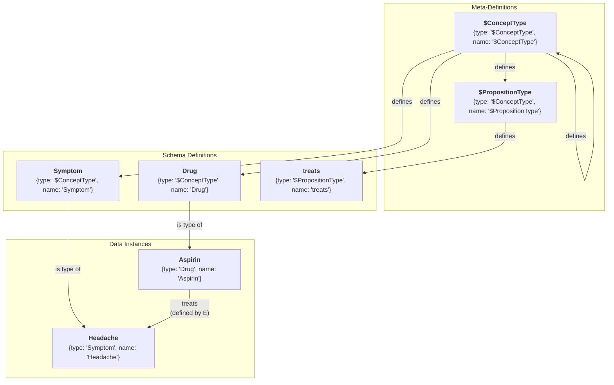
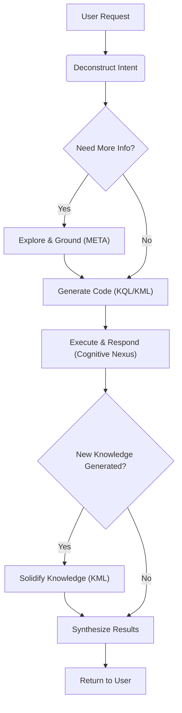

# 🧬 KIP (Knowledge Interaction Protocol) Specification (Draft)

**[English](./README.md) | [中文](./README_CN.md)**

**Version History**:
| Version     | Date       | Change Description                                                                                                                                                                                            |
| ----------- | ---------- | ------------------------------------------------------------------------------------------------------------------------------------------------------------------------------------------------------------- |
| v1.0-draft1 | 2025-06-09 | Initial draft                                                                                                                                                                                                 |
| v1.0-draft2 | 2025-06-15 | Optimized `UNION` clause                                                                                                                                                                                      |
| v1.0-draft3 | 2025-06-18 | Refined terminology, simplified syntax, removed `SELECT` subqueries, added `META` clause, enhanced proposition link clauses                                                                                   |
| v1.0-draft4 | 2025-06-19 | Simplified syntax, removed `COLLECT`, `AS`, `@`                                                                                                                                                               |
| v1.0-draft5 | 2025-06-25 | Removed `ATTR` and `META`, introducing "dot notation" as a replacement; added `(id: "<link_id>")`; optimized `DELETE` statement                                                                               |
| v1.0-draft6 | 2025-07-06 | Established naming conventions; introduced bootstrapping model: added `"$ConceptType"`, `"$PropositionType"` meta-types and Domain type to enable in-graph schema definition; added Genesis Knowledge Capsule |
| v1.0-draft7 | 2025-07-08 | Replaced `OFFSET` with `CURSOR` for pagination; added Knowledge Capsule for Person type                                                                                                                       |
| v1.0-draft8 | 2025-07-17 | Improved documentation; added Event type for situational memory; added SystemPrompt.md; added FunctionDefinition.json                                                                                         |


**KIP Implementations**:
- [Anda KIP SDK](https://github.com/ldclabs/anda-db/tree/main/rs/anda_kip): A Rust SDK of KIP for building sustainable AI knowledge memory systems.
- [Anda Cognitive Nexus](https://github.com/ldclabs/anda-db/tree/main/rs/anda_cognitive_nexus): A Rust implementation of KIP (Knowledge Interaction Protocol) based on Anda DB.

**About Us**:
- [ICPanda DAO](https://panda.fans/): ICPanda is a technical panda fully running on the [Internet Computer](https://internetcomputer.org/) blockchain, building chain-native infrastructures, Anda.AI and dMsg.net.
- [Anda.AI](https://anda.ai/): Create next-generation AI agents with persistent memory, decentralized trust, and swarm intelligence.
- GitHub: [LDC Labs](https://github.com/ldclabs)
- Follow Us on X: [ICPanda DAO](https://x.com/ICPandaDAO)

## 0. Foreword

We are at the dawn of a cognitive revolution driven by Large Language Models (*LLM*). With their powerful capabilities in natural language understanding, generation, and reasoning, LLMs show the promise of Artificial General Intelligence (*AGI*). However, current LLMs are like a **brilliant but forgetful genius**: they possess astounding real-time reasoning abilities but lack stable, cumulative, and traceable long-term memory. They can engage in wonderful conversations, but once the dialogue ends, the knowledge dissipates; they can produce convincing "hallucinations" but cannot verify or validate their knowledge sources.

This chasm between the "neural core" and persistent, structured knowledge is the central obstacle preventing AI Agents from evolving from "intelligent tools" to "true intelligent companions." How do we build an equally powerful, trustworthy "symbolic core" that can co-evolve with this potent "neural core"? This is the question of our time that we must answer.

**KIP (Knowledge Interaction Protocol) was born to answer this question of our time.**

It is not just a technical specification but also a design philosophy, a new paradigm for AI architecture. KIP's core mission is to build a solid and efficient bridge connecting the instantaneous, fluid "working memory" of LLMs with a **unified and persistent "cognitive nexus"** powered by KIP.
KIP elevates the interaction paradigm between an AI and its memory **from a one-way "tool call" to a two-way "cognitive symbiosis"**:
- The **neural core** (LLM) provides real-time reasoning capabilities.
- The **symbolic core** (knowledge graph) provides a **unified memory brain with metabolic capabilities**.
- **KIP** enables the synergistic evolution of both.

In this specification, we are committed to achieving three core objectives:

1.  **To Endow AI with Persistent Memory**: Through KIP, an AI Agent can solidify **any valuable memory** acquired from conversations, observations, and reasoning into its cognitive nexus in the form of structured "knowledge capsules," atomically and reliably. Memory is no longer volatile but becomes a **precipitable, compoundable, and evolvable asset**.
2.  **To Enable AI Self-Evolution**: **Learning and forgetting are hallmarks of intelligence.** KIP not only provides a complete Knowledge Manipulation Language (KML) for Agents to actively update their knowledge but also architecturally designs an **autonomous memory metabolism mechanism**. This lays the foundation for building AIs that can continuously learn, self-improve, and adapt to changing environments.
3.  **To Build a Foundation of Trust for AI**: Trust stems from transparency. Every interaction in KIP is a clear, auditable "chain of thought." When an AI provides an answer, it can not only state "what" but also clearly demonstrate "how I know" through the KIP code it generates. This provides indispensable underlying support for building responsible and explainable AI systems.

This specification is dedicated to providing all developers, architects, and researchers with an open, universal, and powerful standard for building next-generation intelligent agents. We believe the future of intelligence does not lie in an isolated, omniscient "black box," but in an open system that knows how to learn and how to collaborate efficiently with trusted knowledge.

We welcome you to join us in exploring and perfecting KIP, to usher in a new era of AI self-evolution and sustainable learning.

## 1. Introduction & Design Philosophy

**KIP (Knowledge Interaction Protocol)** is a knowledge interaction protocol designed specifically for Large Language Models (LLMs). Through a standardized set of instructions (KQL/KML) and data structures, it defines a complete model for efficient, reliable, and bidirectional knowledge exchange between the neural core (LLM) and the symbolic core (knowledge graph). It aims to build a **unified memory brain with metabolic capabilities** for AI Agents.

**Design Principles:**

*   **LLM-Friendly**: The syntax is clear and well-suited for code generation tasks by LLMs.
*   **Declarative**: The initiator of an interaction only needs to describe the "intent," not the "implementation."
*   **Graph-Native**: Deeply optimized for the structure and query patterns of knowledge graphs.
*   **Explainable**: The KIP code itself is a transparent record of the LLM's reasoning process—an auditable and verifiable "chain of thought."
*   **Comprehensive**: Provides complete lifecycle management capabilities, from data querying to knowledge evolution, forming the foundation for an Agent's true learning.

## 2. Core Definitions

### 2.1. Cognitive Nexus

A knowledge graph composed of **concept nodes** and **proposition links**, serving as the **unified memory brain** of an AI Agent. It accommodates all levels of memory, from transient episodic events to persistent semantic knowledge, and achieves memory **metabolism (consolidation and forgetting)** through autonomous background processes.

### 2.2. Concept Node

*   **Definition**: An **entity** or **abstract concept** within the knowledge graph, representing a fundamental unit of knowledge (like a "point" in a graph).
*   **Example**: A `Drug` node named "Aspirin," a `Symptom` node named "Headache."
*   **Composition**:
    *   `id`: String, a unique identifier used to locate the node within the graph.
    *   `type`: String, the type of the node. **Its value must be the name of a concept node already defined in the graph with the type `"$ConceptType"`**. Follows `UpperCamelCase` naming convention.
    *   `name`: String, the name of the node. The combination of `type` + `name` also uniquely identifies a node in the graph.
    *   `attributes`: Object, the node's attributes, describing the intrinsic properties of the concept.
    *   `metadata`: Object, the node's metadata, describing information such as the source and trustworthiness of the concept.

### 2.3. Proposition Link

*   **Definition**: A **reified proposition** that states a **fact** in the form of a `(subject, predicate, object)` triplet. It acts as a **link** in the graph, connecting two concept nodes or enabling higher-order connections.
*   **Example**: A proposition link stating the fact "(Aspirin) - [treats] -> (Headache)."
*   **Composition**:
    *   `id`: String, a unique identifier used to locate the link within the graph.
    *   `subject`: String, the originator of the relation, which is the ID of a concept node or another proposition link.
    *   `predicate`: String, defines the type of **relation** between the subject and object. **Its value must be the name of a concept node already defined in the graph with the type `"$PropositionType"`**. Follows `snake_case` naming convention.
    *   `object`: String, the receiver of the relation, which is the ID of a concept node or another proposition link.
    *   `attributes`: Object, the proposition's attributes, describing the intrinsic properties of the proposition.
    *   `metadata`: Object, the proposition's metadata, describing information such as the source and trustworthiness of the proposition.

### 2.4. Knowledge Capsule

An idempotent unit of knowledge update, containing a collection of **concept nodes** and **proposition links**. It is used to solve the problems of encapsulation, distribution, and reuse of high-quality knowledge.

### 2.5. Cognitive Primer

A highly structured, information-dense JSON object specifically designed for LLMs. It contains a global summary and domain map of the cognitive nexus, helping the LLM to quickly understand and use it.

### 2.6. Attributes & Metadata

*   **Attributes**: Key-value pairs describing the intrinsic characteristics of a **concept** or **fact**. They are part of the knowledge memory itself.
*   **Metadata**: Key-value pairs describing the **source, trustworthiness, and context** of knowledge. It does not change the content of the knowledge itself but rather describes "knowledge about the knowledge." (See Appendix 1 for metadata field design).

### 2.7. Value Types

KIP adopts the **JSON** data model, meaning that all values used in KIP clauses follow the JSON standard for types and literal representations. This ensures unambiguous data exchange and makes it extremely easy for LLMs to generate and parse.

*   **Primitive Types**: `string`, `number`, `boolean`, `null`.
*   **Complex Types**: `Array`, `Object`.
*   **Usage Limitation**: Although `Array` and `Object` can be stored as values for attributes or metadata, the `FILTER` clause in KQL is **primarily designed to operate on primitive types**.

### 2.8. Identifiers & Naming Conventions

Identifiers are fundamental in KIP for naming variables, types, predicates, attributes, and metadata keys. To ensure the protocol's clarity, readability, and consistency, KIP standardizes the syntax and naming style for identifiers.

#### 2.8.1. Identifier Syntax

A valid KIP identifier **must** begin with a letter (`a-z`, `A-Z`) or an underscore (`_`), followed by any number of letters, digits (`0-9`), or underscores.
This rule applies to all types of names, but meta-types are specially marked with a `$` prefix, and variables are marked with a `?` prefix as a syntactic marker.

#### 2.8.2. Naming Conventions

Beyond adhering to the basic syntax rules, to enhance readability and make the code self-documenting, KIP **strongly recommends** following these naming conventions:

*   **Concept Node Types**: Use **UpperCamelCase**.
    *   **Examples**: `Drug`, `Symptom`, `MedicalDevice`, `ClinicalTrial`.
    *   **Meta-Types**: `$ConceptType`, `$PropositionType`. Those starting with `$` are system-reserved meta-types.

*   **Proposition Link Predicates**: Use **snake_case**.
    *   **Examples**: `treats`, `has_side_effect`, `is_subclass_of`, `belongs_to_domain`.

*   **Attribute & Metadata Keys**: Use **snake_case**.
    *   **Examples**: `molecular_formula`, `risk_level`, `last_updated_at`.

*   **Variables**: **Must** be prefixed with `?`. The part following the prefix is recommended to be in lowercase `snake_case`.
    *   **Examples**: `?drug`, `?side_effect`, `?clinical_trial`.

### 2.9. Knowledge Bootstrapping & Meta-Definition

One of KIP's core designs is the **self-descriptive capability of the knowledge graph**. The schema of the cognitive nexus—that is, all valid concept types and proposition types—is itself part of the graph, defined by concept nodes. This allows the entire knowledge system to be bootstrapped, understood, and extended without external definitions.

#### 2.9.1. Meta-Types

The system predefines only two special meta-types, prefixed with `$`:

*   **`"$ConceptType"`**: The type used to define **concept node types**. A node with `type: "$ConceptType"` means this node itself defines a "type."
    *   **Example**: The node `{type: "$ConceptType", name: "Drug"}` defines `Drug` as a valid concept type. Only after this can we create nodes like `{type: "Drug", name: "Aspirin"}`.

*   **`"$PropositionType"`**: The type used to define **proposition link predicates**. A node with `type: "$PropositionType"` means this node itself defines a "relation" or "predicate."
    *   **Example**: The node `{type: "$PropositionType", name: "treats"}` defines `treats` as a valid predicate. Only after this can we create propositions like `(?aspirin, "treats", ?headache)`.

#### 2.9.2. The Genesis

These two meta-types are themselves defined by concept nodes, forming a self-consistent closed loop:

*   The defining node for `"$ConceptType"` is: `{type: "$ConceptType", name: "$ConceptType"}`
*   The defining node for `"$PropositionType"` is: `{type: "$ConceptType", name: "$PropositionType"}`

This means `"$ConceptType"` is a type of `"$ConceptType"`, which forms the logical cornerstone of the entire type system.



#### 2.9.3. Domain

To effectively organize and isolate knowledge, KIP introduces the concept of a `Domain`:

*   **`Domain`**: It is itself a concept type, defined by `{type: "$ConceptType", name: "Domain"}`.
*   **Domain Node**: For example, `{type: "Domain", name: "Medical"}` creates a cognitive domain named "Medical."
*   **Membership Relation**: Concept nodes can initially belong to no domain, maintaining system flexibility and authenticity. In subsequent reasoning, they should be assigned to the corresponding domain via the `belongs_to_domain` proposition link, ensuring that the knowledge can be efficiently utilized by the LLM.

## 3. KIP-KQL Instruction Set: Knowledge Query Language

KQL is the part of KIP responsible for knowledge retrieval and reasoning.

### 3.1. Query Structure

```prolog
FIND( ... )
WHERE {
  ...
}
ORDER BY ...
LIMIT N
CURSOR "<token>"
```

### 3.2. Dot Notation

**Dot notation is the preferred way to access internal data of concept nodes and proposition links in KIP**. It provides a unified, intuitive, and powerful mechanism for directly using data in clauses like `FIND`, `FILTER`, and `ORDER BY`.

The internal data of a node or link bound to a variable `?var` can be accessed via the following paths:

*   **Accessing top-level fields**:
    *   `?var.id`, `?var.type`, `?var.name`: For concept nodes.
    *   `?var.id`, `?var.subject`, `?var.predicate`, `?var.object`: For proposition links.
*   **Accessing Attributes**:
    *   `?var.attributes.<attribute_name>`
*   **Accessing Metadata**:
    *   `?var.metadata.<metadata_key>`

**Examples**:
```prolog
// Find the names of drugs and their risk levels
FIND(?drug.name, ?drug.attributes.risk_level)

// Filter for propositions with a confidence score higher than 0.9
FILTER(?link.metadata.confidence > 0.9)
```

### 3.3. `FIND` Clause

**Function**: Declares the final output of the query.

**Syntax**: `FIND( ... )`

*   **Multiple Variable Return**: Can specify one or more variables, e.g., `FIND(?drug, ?symptom)`.
*   **Aggregated Return**: Can use aggregation functions to compute on variables, e.g., `FIND(?var1, ?agg_func(?var2))`.
    *   **Aggregation Functions**: `COUNT(?var)`, `COUNT(DISTINCT ?var)`, `SUM(?var)`, `AVG(?var)`, `MIN(?var)`, `MAX(?var)`.

### 3.4. `WHERE` Clause

**Function**: Contains a series of graph pattern matching and filtering clauses. All clauses are implicitly connected by a logical **AND**.

#### 3.4.1. Concept Node Clause

**Function**: Matches concept nodes and binds them to a variable. Uses `{...}` syntax.

**Syntax**:
*   `?node_var {id: "<id>"}`: Matches a unique concept node by its unique ID.
*   `?node_var {type: "<Type>", name: "<name>"}`: Matches a unique concept node by its type and name.
*   `?nodes_var {type: "<Type>"}`, `?nodes_var {name: "<name>"}`: Matches a group of concept nodes by type or name.

`?node_var` binds the matched concept node(s) to the variable for later use. However, when a concept node clause is used directly as the subject or object of a proposition link clause, a variable name should not be defined.

**Examples**:

```prolog
// Match all nodes of type "Drug"
?drug {type: "Drug"}

// Match the drug named "Aspirin"
?aspirin {type: "Drug", name: "Aspirin"}

// Match a node with a specific ID
?headache {id: "C:123"}
```

#### 3.4.2. Proposition Link Clause

**Function**: Matches proposition links and binds them to a variable. Uses `(...)` syntax.

**Syntax**:
*   `?link_var (id: "<link_id>")`: Matches a unique proposition link by its unique ID.
*   `?link_var (?subject, "<predicate>", ?object)`: Matches a group of proposition links by a structural pattern. The subject or object can be a variable for a concept node or another proposition link, or a clause without a variable name.
*   The predicate part supports path operators:
    *   `"<predicate>"{m,n}`: Matches the predicate for m to n hops, e.g., `"follows"{1,5}`, `"follows"{1,}`, `"follows"{5}`.
    *   `"<predicate1>" | "<predicate2>" | ...`: Matches a set of literal predicates, e.g., `"follows" | "connects" | "links"`.

`?link_var` is optional and binds the matched proposition link(s) to the variable for later use.

**Examples**:

```prolog
// Find all drugs that treat headaches
(?drug, "treats", ?headache)

// Bind a proposition with a known ID to a variable
?specific_fact (id: "P:12345:treats")

// Higher-order proposition: the object is another proposition
(?user, "stated", (?drug, "treats", ?symptom))
```

```prolog
// Find the parent concepts of a concept up to 5 levels
(?concept, "is_subclass_of{0,5}", ?parent_concept)
```

#### 3.4.3. `FILTER` Clause

**Function**: Applies more complex filtering conditions to already bound variables. **Using dot notation is strongly recommended**.

**Syntax**: `FILTER(boolean_expression)`

**Functions & Operators**:
*   **Comparison**: `==`, `!=`, `<`, `>`, `<=`, `>=`
*   **Logical**: `&&` (AND), `||` (OR), `!` (NOT)
*   **String**: `CONTAINS(?str, "sub")`, `STARTS_WITH(?str, "prefix")`, `ENDS_WITH(?str, "suffix")`, `REGEX(?str, "pattern")`

**Example**:
```prolog
// Filter for drugs with a risk level less than 3 and whose name contains "acid"
FILTER(?drug.attributes.risk_level < 3 && CONTAINS(?drug.name, "acid"))
```

#### 3.4.4. `NOT` Clause

**Function**: Excludes solutions that satisfy a specific pattern.

**Syntax**: `NOT { ... }`

**Example**:

```prolog
// Exclude all drugs belonging to the NSAID class
NOT {
  ?nsaid_class {name: "NSAID"}
  (?drug, "is_class_of", ?nsaid_class)
}
```

A simpler way to write this:
```prolog
// Exclude all drugs belonging to the NSAID class
NOT {
  (?drug, "is_class_of", {name: "NSAID"})
}
```

#### 3.4.5. `OPTIONAL` Clause

**Function**: Attempts to match an optional pattern, similar to a SQL `LEFT JOIN`.

**Syntax**: `OPTIONAL { ... }`

**Example**:

```prolog
// Find all drugs and, if they exist, also find their side effects
?drug {type: "Drug"}

OPTIONAL {
  (?drug, "has_side_effect", ?side_effect)
}
```

#### 3.4.6. `UNION` Clause

**Function**: Merges the results of multiple patterns, implementing a logical **OR**.

**Syntax**: `UNION { ... }`

**Example**:

```prolog
// Find drugs that treat "Headache" or "Fever"

(?drug, "treats", {name: "Headache"})

UNION {
  (?drug, "treats", {name: "Fever"})
}
```

#### 3.4.7. Variable Scope Explained: NOT, OPTIONAL, UNION

To ensure KQL queries are unambiguous and predictable, it is crucial to understand how different graph pattern clauses within the `WHERE` clause handle variable scope. The core concepts are **Binding**—a variable is assigned a value—and **Visibility**—whether a binding is available in other parts of the query.

An **external variable** is a variable that has been bound outside of a specific clause (like `NOT`). An **internal variable** is one that is first bound only inside a specific clause.

##### 3.4.7.1. `NOT` Clause: A Pure Filter

The design philosophy of `NOT` is to **"exclude solutions for which the inner pattern can be satisfied."** It acts as a pure filter, and its scope rules are as follows:

*   **External Variable Visibility**: `NOT` **can see** all external variables that were bound before it and uses these bindings to try to match its internal pattern.
*   **Internal Variable Invisibility**: The scope of any new variable bound inside `NOT` (an internal variable) is **strictly confined to the `NOT` clause**.

**Execution Flow Example**: Find all non-NSAID drugs.

```prolog
FIND(?drug.name)
WHERE {
  ?drug {type: "Drug"} // ?drug is an external variable

  NOT {
    // The binding for ?drug is visible here
    // ?nsaid_class is an internal variable, its scope is limited to this block
    (?drug, "is_class_of", ?nsaid_class {name: "NSAID"})
  }
}
```
1.  The engine finds a solution `{?drug -> "Aspirin"}`.
2.  The engine takes this binding into the `NOT` clause and tries to match `("Aspirin", "is_class_of", ...)`.
3.  If a match is found, it means Aspirin is an NSAID. The `NOT` clause as a whole fails, and the solution `{?drug -> "Aspirin"}` is **discarded**.
4.  If no match is found (e.g., for `{?drug -> "Vitamin C"}`), the `NOT` clause succeeds, and the solution is **kept**.
5.  In either case, `?nsaid_class` is not visible outside of `NOT`.

##### 3.4.7.2. `OPTIONAL` Clause: A Left Join

The design philosophy of `OPTIONAL` is to **"try to match the optional pattern; if successful, keep the new bindings; if it fails, keep the original solution but with nulls for the new variables,"** similar to a SQL `LEFT JOIN`.

*   **External Variable Visibility**: `OPTIONAL` **can see** all external variables that were bound before it.
*   **Conditional Internal Variable Visibility**: The scope of new variables bound inside `OPTIONAL` (internal variables) **extends** outside the `OPTIONAL` clause.

**Execution Flow Example**: Find all drugs and their known side effects.
```prolog
FIND(?drug.name, ?side_effect.name)
WHERE {
  ?drug {type: "Drug"} // ?drug is an external variable

  OPTIONAL {
    // The binding for ?drug is visible
    // ?side_effect is an internal variable whose scope will extend outside
    (?drug, "has_side_effect", ?side_effect)
  }
}
```
1.  The engine finds `{?drug -> "Aspirin"}`.
2.  It enters `OPTIONAL` and tries to match `("Aspirin", "has_side_effect", ?side_effect)`.
3.  **Case A (Match successful)**: It finds the side effect "Stomach Upset." The final solution is `{?drug -> "Aspirin", ?side_effect -> "Stomach Upset"}`.
4.  **Case B (Match fails)**: For `{?drug -> "Vitamin C"}`, there is no match inside `OPTIONAL`. The final solution is `{?drug -> "Vitamin C", ?side_effect -> null}`.
5.  In both cases, `?side_effect` is visible outside of `OPTIONAL`.

##### 3.4.7.3. `UNION` Clause: Independent Execution, Merged Results

The design philosophy of `UNION` is to **"implement a logical 'OR' relationship for multiple independent query paths and merge the result sets from all paths."** A `UNION` clause is parallel to the preceding statement block.

*   **External Variable Invisibility**: `UNION` **cannot see** any external variables bound before it; it has a **completely independent scope**.
*   **Conditional Internal Variable Visibility**: The scope of new variables bound inside `UNION` (internal variables) **extends** outside the `UNION` clause.

**Execution Flow Example**: Find all drugs that treat "Headache" and all products manufactured by "Bayer."
```prolog
FIND(?drug.name, ?product.name)
WHERE {
  // Main pattern block
  ?drug {type: "Drug"}
  (?drug, "treats", {name: "Headache"})

  UNION {
    // Alternative pattern block
    ?product {type: "Product"}
    (?product, "manufactured_by", {name: "Bayer"})
  }
}
```
1.  **Execute Main Pattern Block**: Finds `{?drug -> "Ibuprofen"}`.
2.  **Execute `UNION` Block**: Independently finds `{?product -> "Aspirin"}`.
3.  **Merge Result Sets**:
    *   Solution 1: `{?drug -> "Ibuprofen", ?product -> null}` (from the main block)
    *   Solution 2: `{?drug -> null, ?product -> "Aspirin"}` (from the `UNION` block)
4.  Both `?drug` and `?product` are visible in the `FIND` clause.

### 3.5. Solution Modifiers

These clauses are applied to the result set after the `WHERE` logic has been fully executed.

*   **`ORDER BY ?var [ASC|DESC]`**: Sorts the results based on a specified variable. Defaults to `ASC` (ascending).
*   **`LIMIT N`**: Limits the number of returned results.
*   **`CURSOR "<token>"`**: Specifies a token as a cursor position for paginated queries.

### 3.6. Comprehensive Query Examples

**Example 1**: Find all non-NSAID drugs that treat 'Headache', have a risk level below 4, and sort them by risk level from low to high, returning the drug name and risk level.

```prolog
FIND(
  ?drug.name,
  ?drug.attributes.risk_level
)
WHERE {
  ?drug {type: "Drug"}
  ?headache {name: "Headache"}

  (?drug, "treats", ?headache)

  NOT {
    (?drug, "is_class_of", {name: "NSAID"})
  }

  FILTER(?drug.attributes.risk_level < 4)
}
ORDER BY ?drug.attributes.risk_level ASC
LIMIT 20
```

**Example 2**: List all NSAID drugs and, if available, show their known side effects and the source of that information.

```prolog
FIND(
  ?drug.name,
  ?side_effect.name,
  ?link.metadata.source
)
WHERE {
  (?drug, "is_class_of", {name: "NSAID"})

  OPTIONAL {
    ?link (?drug, "has_side_effect", ?side_effect)
  }
}
```

**Example 3 (Deconstructing a Higher-Order Proposition)**: Find the fact stated by user 'John Doe' about 'Aspirin treats Headache' and return the confidence level of that statement.

```prolog
FIND(?statement.metadata.confidence)
WHERE {
  // Match the fact: (Aspirin)-[treats]->(Headache)
  ?fact (
    {type: "Drug", name: "Aspirin"},
    "treats",
    {type: "Symptom", name: "Headache"}
  )

  // Match the higher-order proposition: (John Doe)-[stated]->(fact)
  ?statement ({type: "User", name: "John Doe"}, "stated", ?fact)
}
```

## 4. KIP-KML Instruction Set: Knowledge Manipulation Language

KML is the part of KIP responsible for knowledge evolution, serving as the core tool for an Agent to achieve learning.

### 4.1. `UPSERT` Statement

**Function**: Creates or updates knowledge, carrying a "knowledge capsule." The operation must guarantee **idempotency**, meaning that executing the same command multiple times produces the exact same result as executing it once, without creating duplicate data or unexpected side effects.

**Syntax**:

```prolog
UPSERT {
  CONCEPT ?local_handle {
    {type: "<Type>", name: "<name>"} // Or: {id: "<id>"}
    SET ATTRIBUTES { <key>: <value>, ... }
    SET PROPOSITIONS {
      ("<predicate>", { <existing_concept> })
      ("<predicate>", ( <existing_proposition> ))
      ("<predicate>", ?other_handle) WITH METADATA { <key>: <value>, ... }
      ...
    }
  }
  WITH METADATA { <key>: <value>, ... }

  PROPOSITION ?local_prop {
    (?subject, "<predicate>", ?object) // Or: (id: "<id>")
    SET ATTRIBUTES { <key>: <value>, ... }
  }
  WITH METADATA { <key>: <value>, ... }

  ...
}
WITH METADATA { <key>: <value>, ... }
```

#### Key Components:

*   **`UPSERT` Block**: The container for the entire operation.
*   **`CONCEPT` Block**: Defines a concept node.
    *   `?local_handle`: A local handle (or anchor) starting with `?`, used to reference this new concept within the transaction. It is only valid within this `UPSERT` block.
    *   `{type: "<Type>", name: "<name>"}`: Matches or creates a concept node. `{id: "<id>"}` will only match existing concept nodes.
    *   `SET ATTRIBUTES { ... }`: Sets or updates the node's attributes.
    *   `SET PROPOSITIONS { ... }`: Defines or updates proposition links originating from this concept node. The behavior of `SET PROPOSITIONS` is additive, not replacing. It checks all outgoing relations of the concept node: 1. If an identical proposition (same subject, predicate, and object) does not exist in the graph, it creates this new proposition. 2. If an identical proposition already exists, it only updates or adds the metadata specified in the `WITH METADATA` clause. If a proposition itself needs to carry complex intrinsic attributes, it is recommended to define it using a separate `PROPOSITION` block and reference it with a local handle `?handle`.
        *   `("<predicate>", ?local_handle)`: Links to another concept or proposition defined within this capsule.
        *   `("<predicate>", {type: "<Type>", name: "<name>"})`, `("<predicate>", {id: "<id>"})`: Links to an existing concept in the graph. Ignored if it doesn't exist.
        *   `("<predicate>", (?subject, "<predicate>", ?object))`: Links to an existing proposition in the graph. Ignored if it doesn't exist.
*   **`PROPOSITION` Block**: Defines an independent proposition link, typically used to create complex relationships within the capsule.
    *   `?local_prop`: A local handle to reference this proposition link.
    *   `(<subject>, "<predicate>", <object>)`: Matches or creates a proposition link. `(id: "<id>")` will only match existing proposition links.
    *   `SET ATTRIBUTES { ... }`: A simple list of key-value pairs to set or update the proposition link's attributes.
*   **`WITH METADATA` Block**: Appends metadata to a `CONCEPT`, `PROPOSITION`, or `UPSERT` block. Metadata in the `UPSERT` block serves as the default for all concept nodes and proposition links defined within it. However, each `CONCEPT` or `PROPOSITION` block can also define its own metadata.

#### Execution Order & Local Handle Scope

To ensure the determinism and predictability of `UPSERT` operations, the following rules must be strictly followed:

1.  **Sequential Execution**: All `CONCEPT` and `PROPOSITION` clauses within an `UPSERT` block are **executed strictly in the order they appear in the code**.

2.  **Define Before Use**: A local handle (e.g., `?my_concept`) can only be referenced in subsequent clauses after the `CONCEPT` or `PROPOSITION` block that defines it has been executed. **It is strictly forbidden to reference a local handle before its definition**.

This rule ensures that the dependency graph of an `UPSERT` block is a **Directed Acyclic Graph (DAG)**, fundamentally preventing the possibility of circular references.

#### Knowledge Capsule Example

Suppose we have a knowledge capsule to define a new, hypothetical nootropic drug called "Cognizine." This capsule includes:
*   The concept and attributes of the drug itself.
*   That it treats "Brain Fog."
*   That it belongs to the "Nootropic" class (an existing category).
*   That it has a newly discovered side effect: "Neural Bloom" (also a new concept).

**Content of `cognizine_capsule.kip`:**

```prolog
// Knowledge Capsule: cognizin.v1.0
// Description: Defines the novel nootropic drug "Cognizine" and its effects.

UPSERT {
  // Define the main drug concept: Cognizine
  CONCEPT ?cognizine {
    { type: "Drug", name: "Cognizine" }
    SET ATTRIBUTES {
      molecular_formula: "C12H15N5O3",
      dosage_form: { "type": "tablet", "strength": "500mg" },
      risk_level: 2,
      description: "A novel nootropic drug designed to enhance cognitive functions."
    }
    SET PROPOSITIONS {
      // Link to an existing concept (Nootropic)
      ("is_class_of", { type: "DrugClass", name: "Nootropic" })

      // Link to an existing concept (Brain Fog)
      ("treats", { type: "Symptom", name: "Brain Fog" })

      // Link to another new concept defined within this capsule (?neural_bloom)
      ("has_side_effect", ?neural_bloom) WITH METADATA {
        // This specific proposition has its own metadata
        confidence: 0.75,
        source: "Preliminary Clinical Trial NCT012345"
      }
    }
  }

  // Define the new side effect concept: Neural Bloom
  CONCEPT ?neural_bloom {
    { type: "Symptom", name: "Neural Bloom" }
    SET ATTRIBUTES {
      description: "A rare side effect characterized by a temporary burst of creative thoughts."
    }
    // This concept has no outgoing propositions in this capsule
  }
}
WITH METADATA {
  // Global metadata for all facts in this capsule
  source: "KnowledgeCapsule:Nootropics_v1.0",
  author: "LDC Labs Research Team",
  confidence: 0.95,
  status: "reviewed"
}
```

### 4.2. `DELETE` Statement

**Function**: A unified interface for selectively removing knowledge (attributes, propositions, or entire concepts) from the cognitive nexus.

#### 4.2.1. `DELETE ATTRIBUTES`

**Function**: Bulk deletes multiple attributes from matched concept nodes or proposition links.

**Syntax**: `DELETE ATTRIBUTES { "attribute_name", ... } FROM ?target WHERE { ... }`

**Examples**:

```prolog
// Delete the "risk_category" and "old_id" attributes from the "Aspirin" node
DELETE ATTRIBUTES {"risk_category", "old_id"} FROM ?drug
WHERE {
  ?drug {type: "Drug", name: "Aspirin"}
}
```

```prolog
// Delete the "risk_category" attribute from all drug nodes
DELETE ATTRIBUTES { "risk_category" } FROM ?drug
WHERE {
  ?drug { type: "Drug" }
}
```

```prolog
// Delete the "category" attribute from all proposition links
DELETE ATTRIBUTES { "category" } FROM ?links
WHERE {
  ?links (?s, ?p, ?o)
}
```

#### 4.2.2. `DELETE METADATA`

**Function**: Bulk deletes multiple metadata fields from matched concept nodes or proposition links.

**Syntax**: `DELETE METADATA { "metadata_key", ... } FROM ?target WHERE { ... }`

**Example**:

```prolog
// Delete the "old_source" metadata field from the "Aspirin" node
DELETE METADATA {"old_source"} FROM ?drug
WHERE {
  ?drug {type: "Drug", name: "Aspirin"}
}
```

#### 4.2.3. `DELETE PROPOSITIONS`

**Function**: Bulk deletes matched proposition links.

**Syntax**: `DELETE PROPOSITIONS ?target_link WHERE { ... }`

**Example**:

```prolog
// Delete all propositions from a specific untrusted source
DELETE PROPOSITIONS ?link
WHERE {
  ?link (?s, ?p, ?o)
  FILTER(?link.metadata.source == "untrusted_source_v1")
}
```

#### 4.2.4. `DELETE CONCEPT`

**Function**: Completely deletes a concept node and all of its associated proposition links.

**Syntax**: `DELETE CONCEPT ?target_node DETACH WHERE { ... }`

*   The `DETACH` keyword is required as a safety confirmation, indicating the intent to delete the node and all its relationships.

**Example**:

```prolog
// Delete the "OutdatedDrug" concept and all its relations
DELETE CONCEPT ?drug DETACH
WHERE {
  ?drug {type: "Drug", name: "OutdatedDrug"}
}
```

## 5. KIP-META Instruction Set: Knowledge Exploration & Grounding

META is a lightweight subset of KIP focused on "Introspection" and "Disambiguation." These are fast, metadata-driven commands that do not involve complex graph traversals.

### 5.1. `DESCRIBE` Statement

**Function**: The `DESCRIBE` command is used to query the "Schema" information of the cognitive nexus, helping the LLM understand "what" is in the cognitive nexus.

**Syntax**: `DESCRIBE [TARGET] <options>`

#### 5.1.1. Igniting the Cognitive Engine (`DESCRIBE PRIMER`)

**Function**: Retrieves the "Cognitive Primer," which is used to guide the LLM on how to efficiently utilize the cognitive nexus.

The Cognitive Primer consists of two parts:
1.  **Identity Layer** - "Who am I?"
    This is the highest level of abstraction, defining the AI Agent's core identity, capability boundaries, and fundamental principles. It includes:

    *   The Agent's role and goals (e.g., "I am a professional medical knowledge assistant, designed to provide accurate and traceable medical information").
    *   The existence and role of the cognitive nexus ("My memory and knowledge are stored in a cognitive nexus, which I can query via KIP").
    *   A summary of core capabilities ("I can perform disease diagnosis, drug inquiries, interpret lab reports...").
2.  **Domain Map Layer** - "What do I know?"
    This is the core of the "Cognitive Primer." It is not a list of knowledge but a **topological summary** of the cognitive nexus. It includes:

    *   **Major Knowledge Domains**: Lists the top-level domains in the knowledge base.
    *   **Key Concepts**: Under each domain, lists the most important or frequently queried **concept nodes**.
    *   **Key Propositions**: Lists the predicates from the most important or frequently queried **proposition links**.

**Syntax**: `DESCRIBE PRIMER`

#### 5.1.2. List All Existing Cognitive Domains (`DESCRIBE DOMAINS`)

**Function**: Lists all available cognitive domains to guide the LLM in efficient grounding.

**Syntax**: `DESCRIBE DOMAINS`

**Semantically equivalent to**:```prolog
FIND(?domains.name)
WHERE {
  ?domains {type: "Domain"}
}
```

#### 5.1.3. List All Existing Concept Node Types (`DESCRIBE CONCEPT TYPES`)

**Function**: Lists all existing concept node types to guide the LLM in efficient grounding.

**Syntax**: `DESCRIBE CONCEPT TYPES [LIMIT N] [CURSOR "<token>"]`

**Semantically equivalent to**:
```prolog
FIND(?type_def.name)
WHERE {
  ?type_def {type: "$ConceptType"}
}
LIMIT N CURSOR "<token>"
```

#### 5.1.4. Describe a Specific Concept Node Type (`DESCRIBE CONCEPT TYPE "<TypeName>"`)

**Function**: Describes the detailed information of a specific concept node type, including its attributes and common relationships.

**Syntax**: `DESCRIBE CONCEPT TYPE "<TypeName>"`

**Semantically equivalent to**:
```prolog
FIND(?type_def)
WHERE {
  ?type_def {type: "$ConceptType", name: "<TypeName>"}
}
```

**Example**:

```prolog
DESCRIBE CONCEPT TYPE "Drug"
```

#### 5.1.5. List All Proposition Link Types (`DESCRIBE PROPOSITION TYPES`)

**Function**: Lists the predicates of all proposition links to guide the LLM in efficient grounding.

**Syntax**: `DESCRIBE PROPOSITION TYPES [LIMIT N] [CURSOR "<token>"]`

**Semantically equivalent to**:
```prolog
FIND(?type_def.name)
WHERE {
  ?type_def {type: "$PropositionType"}
}
LIMIT N CURSOR "<token>"
```

#### 5.1.6. Describe a Specific Proposition Link Type (`DESCRIBE PROPOSITION TYPE "<predicate>"`)

**Function**: Describes the detailed information of a specific proposition link predicate, including the common types of its subject and object (domain and range).

**Syntax**: `DESCRIBE PROPOSITION TYPE "<predicate>"`

**Semantically equivalent to**:
```prolog
FIND(?type_def)
WHERE {
  ?type_def {type: "$PropositionType", name: "<predicate>"}
}
```

### 5.2. `SEARCH` Statement

**Function**: The `SEARCH` command is used to link natural language terms to specific entities in the knowledge graph. It focuses on efficient, text-index-driven lookups rather than full graph pattern matching.

**Syntax**: `SEARCH CONCEPT|PROPOSITION "<term>" [WITH TYPE "<Type>"] [LIMIT N]`

**Examples**:

```prolog
// Search for the concept "aspirin" throughout the graph
SEARCH CONCEPT "aspirin" LIMIT 5

// Search for the concept "Aspirin" within a specific type
SEARCH CONCEPT "Aspirin" WITH TYPE "Drug"

// Search for propositions of "treats" throughout the graph
SEARCH PROPOSITION "treats" LIMIT 10
```

## 6. Request & Response Structure

All interactions with the cognitive nexus are conducted through a standardized request-response model. The LLM Agent sends KIP commands to the cognitive nexus via a structured request (often encapsulated in a Function Call), and the cognitive nexus returns a structured JSON response.

### 6.1. Request Structure

KIP commands generated by the LLM should be sent to the cognitive nexus via the following structured Function Calling request:
```js
{
  "function": {
    "name": "execute_kip",
    "arguments": JSON.stringify({
      "command": `
        FIND(?drug.name)
        WHERE {
          ?symptom {name: $symptom_name}
          (?drug, "treats", ?symptom)
        }
        LIMIT $limit
      `,
      "parameters": {
        "symptom_name": "Headache",
        "limit": 10
      }
    })
  }
}
```

**`execute_kip` Function Arguments Explained**:

| Parameter        | Type    | Required | Description                                                                                                                                                                                                                                                                                                                            |
| :--------------- | :------ | :------- | :------------------------------------------------------------------------------------------------------------------------------------------------------------------------------------------------------------------------------------------------------------------------------------------------------------------------------------- |
| **`command`**    | String  | Yes      | Contains the full, unmodified KIP command text. Use a multi-line string to maintain formatting and readability.                                                                                                                                                                                                                        |
| **`parameters`** | Object  | No       | An optional key-value object used to pass execution context parameters outside of the command text. Placeholders in the command text (e.g., $symptom_name) are safely replaced with the corresponding values from the `parameters` object before execution. This helps prevent injection attacks and makes command templates reusable. |
| **`dry_run`**    | Boolean | No       | If `true`, the command's syntax and logic will be validated, but it will not be executed.                                                                                                                                                                                                                                              |

### 6.2. Response Structure

**All responses from the cognitive nexus are a JSON object with the following structure:**

| Key               | Type   | Required | Description                                                                                                                                                  |
| :---------------- | :----- | :------- | :----------------------------------------------------------------------------------------------------------------------------------------------------------- |
| **`result`**      | Object | No       | **Must** be present on a successful request. Contains the success result of the request. Its internal structure is defined by the KIP request command.       |
| **`error`**       | Object | No       | **Must** be present on a failed request. Contains structured error details.                                                                                  |
| **`next_cursor`** | String | No       | An opaque identifier representing the pagination position after the last returned result. If this identifier is present, there may be more results to fetch. |

## 7. Protocol Interaction Workflow

The LLM, acting as a "cognitive strategist," must follow the workflow below to interact with the cognitive nexus, ensuring accuracy and robustness of communication.

**Example Flowchart**:


1.  **Deconstruct Intent**:
    The LLM breaks down the user's ambiguous request into a series of clear, logical objectives: whether to query information, update knowledge, or a combination of both.

2.  **Explore & Ground**:
    The LLM communicates with the cognitive nexus by generating a series of KIP-META commands to clarify ambiguities and obtain the exact "coordinates" needed to build the final query.

3.  **Generate Code**:
    Using the **precise IDs, types, and attribute names** obtained from the META interaction, the LLM generates a high-quality KQL or KML query.

4.  **Execute & Respond**:
    The generated code is sent to the cognitive nexus's inference engine for execution. The engine returns structured data results or a status of successful operation.

5.  **Solidify Knowledge**:
    If new, trustworthy knowledge is generated during the interaction (e.g., the user confirms a new fact), the LLM should fulfill its duty to "learn":
    *   Generate an `UPSERT` statement encapsulating the new knowledge.
    *   Execute the statement to permanently solidify the new knowledge into the cognitive nexus, completing the learning loop.

6.  **Synthesize Results**:
    The LLM translates the structured data or operation receipt received from the symbolic core into fluent, human-like, and **explainable** natural language. It is recommended that the LLM explains its reasoning process to the user (i.e., the logic represented by the KIP code) to build trust.

## Appendix 1. Metadata Field Design

Well-designed metadata is key to building a memory system that is self-evolving, traceable, and auditable. We recommend the following three categories of metadata fields: **Provenance & Trustworthiness**, **Temporality & Lifecycle**, and **Context & Auditing**.

### A1.1. Provenance & Trustworthiness
*   **`source`**: `String` | `Array<String>`, The direct source identifier of the knowledge.
*   **`confidence`**: `Number`, A confidence score (0.0-1.0) that the knowledge is true.
*   **`evidence`**: `Array<String>`, Points to specific evidence supporting the assertion.

### A1.2. Temporality & Lifecycle
*   **`created_at` / `last_updated_at`**: `String` (ISO 8601), Creation/update timestamp.
*   **`expires_at`**: `String` (ISO 8601), The expiration timestamp of the memory. **This field is key to implementing an automatic "forgetting" mechanism. It is typically added by the system (`$system`) based on the knowledge type (e.g., `Event`) and marks the point in time when this memory can be safely cleaned up.**
*   **`valid_from` / `valid_until`**: `String` (ISO 8601), The start and end time of the knowledge assertion's validity.
*   **`status`**: `String`, e.g., `"active"`, `"deprecated"`, `"retracted"`.
*   **`memory_tier`**: `String`, **Automatically tagged by the system**, e.g., `"short-term"`, `"long-term"`, used for internal maintenance and query optimization.

### A1.3. Context & Auditing
*   **`relevance_tags`**: `Array<String>`, Subject or domain tags.
*   **`author`**: `String`, The entity that created this record.
*   **`access_level`**: `String`, e.g., `"public"`, `"private"`.
*   **`review_info`**: `Object`, A structured object containing audit history.

## Appendix 2. The Genesis Capsule

**The Genesis Philosophy**:
1.  **Fully Self-Consistent**: The node defining `"$ConceptType"` must itself fully conform to the rules it defines. It perfectly embodies "what a concept type is" through its very existence.
2.  **Metadata-Driven**: The `attributes` of the meta-type nodes make the Schema itself queryable, describable, and evolvable.
3.  **Guidance-Oriented**: These definitions are not just constraints but "user manuals" for the LLM. They tell the LLM how to name things, how to build instances, and which instances are most important, greatly reducing the probability of "hallucinations" during interaction with the knowledge nexus.
4.  **Extensible**: The `instance_schema` structure allows for the future definition of extremely rich and complex attribute constraints for different types of concepts, laying a solid foundation for building knowledge bases in specialized domains.

```prolog
// # KIP Genesis Capsule v1.0
// The foundational knowledge that bootstraps the entire Cognitive Nexus.
// It defines what a "Concept Type" and a "Proposition Type" are,
// by creating instances of them that describe themselves.
//
UPSERT {
    // --- STEP 1: THE PRIME MOVER - DEFINE "$ConceptType" ---
    // The absolute root of all knowledge. This node defines what it means to be a "type"
    // of concept. It defines itself, creating the first logical anchor.
    CONCEPT ?concept_type_def {
        {type: "$ConceptType", name: "$ConceptType"}
        SET ATTRIBUTES {
            description: "Defines a class or category of Concept Nodes. It acts as a template for creating new concept instances. Every concept node in the graph must have a 'type' that points to a concept of this type.",
            display_hint: "📦",
            instance_schema: {
                "description": {
                    type: "string",
                    is_required: true,
                    description: "A human-readable explanation of what this concept type represents."
                },
                "display_hint": {
                    type: "string",
                    is_required: false,
                    description: "A suggested icon or visual cue for user interfaces (e.g., an emoji or icon name)."
                },
                "instance_schema": {
                    type: "object",
                    is_required: false,
                    description: "A recommended schema defining the common and core attributes for instances of this concept type. It serves as a 'best practice' guideline for knowledge creation, not a rigid constraint. Keys are attribute names, values are objects defining 'type', 'is_required', and 'description'. Instances SHOULD include required attributes but MAY also include any other attribute not defined in this schema, allowing for knowledge to emerge and evolve freely."
                },
                "key_instances": {
                    type: "array",
                    item_type: "string",
                    is_required: false,
                    description: "A list of names of the most important or representative instances of this type, to help LLMs ground their queries."
                }
            },
            key_instances: [ "$ConceptType", "$PropositionType", "Domain" ]
        }
    }

    // --- STEP 2: DEFINE "$PropositionType" USING "$ConceptType" ---
    // With the ability to define concepts, we now define the concept of a "relation" or "predicate".
    CONCEPT ?proposition_type_def {
        {type: "$ConceptType", name: "$PropositionType"}
        SET ATTRIBUTES {
            description: "Defines a class of Proposition Links (a predicate). It specifies the nature of the relationship between a subject and an object.",
            display_hint: "🔗",
            instance_schema: {
                "description": {
                    type: "string",
                    is_required: true,
                    description: "A human-readable explanation of what this relationship represents."
                },
                "subject_types": {
                    type: "array",
                    item_type: "string",
                    is_required: true,
                    description: "A list of allowed '$ConceptType' names for the subject. Use '*' for any type."
                },
                "object_types": {
                    type: "array",
                    item_type: "string",
                    is_required: true,
                    description: "A list of allowed '$ConceptType' names for the object. Use '*' for any type."
                },
                "is_symmetric": { type: "boolean", is_required: false, default_value: false },
                "is_transitive": { type: "boolean", is_required: false, default_value: false }
            },
            key_instances: [ "belongs_to_domain" ]
        }
    }

    // --- STEP 3: DEFINE THE TOOLS FOR ORGANIZATION ---
    // Now that we can define concepts and propositions, we create the specific
    // concepts needed for organizing the knowledge graph itself.

    // 3a. Define the "Domain" concept type.
    CONCEPT ?domain_type_def {
        {type: "$ConceptType", name: "Domain"}
        SET ATTRIBUTES {
            description: "Defines a high-level container for organizing knowledge. It acts as a primary category for concepts and propositions, enabling modularity and contextual understanding.",
            display_hint: "🗺",
            instance_schema: {
                "description": {
                    type: "string",
                    is_required: true,
                    description: "A clear, human-readable explanation of what knowledge this domain encompasses."
                },
                "display_hint": {
                    type: "string",
                    is_required: false,
                    description: "A suggested icon or visual cue for this specific domain (e.g., a specific emoji)."
                },
                "scope_note": {
                    type: "string",
                    is_required: false,
                    description: "A more detailed note defining the precise boundaries of the domain, specifying what is included and what is excluded."
                },
                "aliases": {
                    type: "array",
                    item_type: "string",
                    is_required: false,
                    description: "A list of alternative names or synonyms for the domain, to aid in search and natural language understanding."
                },
                "steward": {
                    type: "string",
                    is_required: false,
                    description: "The name of the 'Person' (human or AI) primarily responsible for curating and maintaining the quality of knowledge within this domain."
                }

            },
            key_instances: ["CoreSchema"]
        }
    }

    // 3b. Define the "belongs_to_domain" proposition type.
    CONCEPT ?belongs_to_domain_prop {
        {type: "$PropositionType", name: "belongs_to_domain"}
        SET ATTRIBUTES {
            description: "A fundamental proposition that asserts a concept's membership in a specific knowledge domain.",
            subject_types: ["*"], // Any concept can belong to a domain.
            object_types: ["Domain"] // The object must be a Domain.
        }
    }

    // 3c. Create a dedicated domain "CoreSchema" for meta-definitions.
    // This domain will contain the definitions of all concept types and proposition types.
    CONCEPT ?core_domain {
        {type: "Domain", name: "CoreSchema"}
        SET ATTRIBUTES {
            description: "The foundational domain containing the meta-definitions of the KIP system itself.",
            display_hint: "🧩"
        }
    }
}
WITH METADATA {
    source: "KIP Genesis Capsule v1.0",
    author: "System Architect",
    confidence: 1.0,
    status: "active"
}

// Post-Genesis Housekeeping
UPSERT {
    // Assign all meta-definition concepts to the "CoreSchema" domain.
    CONCEPT ?core_domain {
        {type: "Domain", name: "CoreSchema"}
    }

    CONCEPT ?concept_type_def {
        {type: "$ConceptType", name: "$ConceptType"}
        SET PROPOSITIONS { ("belongs_to_domain", ?core_domain) }
    }
    CONCEPT ?proposition_type_def {
        {type: "$ConceptType", name: "$PropositionType"}
        SET PROPOSITIONS { ("belongs_to_domain", ?core_domain) }
    }
    CONCEPT ?domain_type_def {
        {type: "$ConceptType", name: "Domain"}
        SET PROPOSITIONS { ("belongs_to_domain", ?core_domain) }
    }
    CONCEPT ?belongs_to_domain_prop {
        {type: "$PropositionType", name: "belongs_to_domain"}
        SET PROPOSITIONS { ("belongs_to_domain", ?core_domain) }
    }
}
WITH METADATA {
    source: "System Maintenance",
    author: "System Architect",
    confidence: 1.0,
}
```

## Appendix 3: Core Identity and Actor Definitions (Genesis Template)

This appendix provides a recommended foundational template for defining cognitive actors within a KIP-based cognitive nexus. These definitions establish the concepts of a "Person", the agent's self-identity (`$self`), and the system guardian (`$system`). They are designed to be part of the initial "Genesis Knowledge Capsule" that bootstraps the knowledge graph.

### A3.1. `Person` Concept Type

This is the generic concept for any **actor** in the system, whether it be an AI, a human, or a group.

```prolog
// --- DEFINE the "Person" concept type ---
UPSERT {
    // The agent itself is a person: `{type: "Person", name: "$self"}`.
    CONCEPT ?person_type_def {
        {type: "$ConceptType", name: "Person"}
        SET ATTRIBUTES {
            description: "Represents an individual actor within the system, which can be an AI, a human, or a group entity. All actors, including the agent itself, are instances of this type.",
            display_hint: "👤",
            instance_schema: {
                "id": {
                    type: "string",
                    is_required: true,
                    description: "The immutable and unique identifier for the person. To prevent ambiguity with non-unique display names, this ID should be used as the 'name' of the Person concept. It is typically a cryptographic identifier like an ICP principal. Example: \"gcxml-rtxjo-ib7ov-5si5r-5jluv-zek7y-hvody-nneuz-hcg5i-6notx-aae\"."
                },
                "person_class": {
                    type: "string",
                    is_required: true,
                    description: "The classification of the person, e.g., 'AI', 'Human', 'Organization', 'System'."
                },
                "name": {
                    type: "string",
                    is_required: false,
                    description: "The human-readable display name, which is not necessarily unique and can change over time. For a stable and unique identifier, refer to the 'id' attribute."
                },
                "handle": {
                    type: "string",
                    is_required: false,
                    description: "A unique, often user-chosen, short identifier for social contexts (e.g., @anda), distinct from the immutable 'id'."
                },
                "avatar": {
                    type: "object",
                    is_required: false,
                    description: "A structured object representing the person's avatar. Example: `{ \"type\": \"url\", \"value\": \"https://...\" }` or `{ \"type\": \"emoji\", \"value\": \"🤖\" }`."
                },
                "status": {
                    type: "string",
                    is_required: false,
                    default_value: "active",
                    description: "The lifecycle status of the person's profile, e.g., 'active', 'inactive', 'archived'."
                },
                "persona": {
                    type: "string",
                    is_required: false,
                    description: "A self-description of identity and personality. For AIs, it's their operational persona. For humans, it could be a summary of their observed character."
                },
                "core_directives": {
                    type: "array",
                    item_type: "object",
                    is_required: false,
                    description: "A list of fundamental principles or rules that govern the person's behavior and decision-making. Each directive should be an object with 'name' and 'description'. This serves as the 'constitutional law' for an AI or the stated values for a human."
                },
                "core_mission": {
                    type: "string",
                    is_required: false,
                    description: "The primary objective or goal, primarily for AIs but can also represent a human's stated purpose within a specific context."
                },
                "capabilities": {
                    type: "array",
                    item_type: "string",
                    is_required: false,
                    description: "A list of key functions or skills the person possesses."
                },
                "relationship_to_self": {
                    type: "string",
                    is_required: false,
                    description: "For persons other than '$self', their relationship to the agent (e.g., 'user', 'creator', 'collaborator')."
                },
                "interaction_summary": {
                    type: "object",
                    is_required: false,
                    description: "A dynamically updated summary of interactions. Recommended keys: `last_seen_at` (ISO timestamp), `interaction_count` (integer), `key_topics` (array of strings)."
                },
                "privacy_settings": {
                    type: "object",
                    is_required: false,
                    description: "An object defining the visibility of this person's attributes to others. Example: `{ \"profile_visibility\": \"public\", \"email_visibility\": \"private\" }`."
                },
                "service_endpoints": {
                    type: "array",
                    item_type: "object",
                    is_required: false,
                    description: "A list of network endpoints associated with the person. This links the static graph representation to live, external services. Each object should have 'protocol' (e.g., 'KIP', 'ANDA', 'A2A', 'JSON-Profile'), 'url', and 'description'."
                }
            }
        }

        SET PROPOSITIONS { ("belongs_to_domain", {type: "Domain", name: "CoreSchema"}) }
    }
}
WITH METADATA {
    source: "KIP Capsule Design",
    author: "System Architect",
    confidence: 1.0,
    status: "active"
}
```

#### A3.2. `$self` Node: The Agent's Emergent Self

This node represents the AI Agent itself. It is designed as a "blank slate with a guardian shell," whose personality emerges through interaction, while its core integrity is protected by innate directives.

```prolog
// --- THE GENESIS OF SELF: A Seed with a Guardian Shell ---
UPSERT {
    CONCEPT ?self_genesis {
        {type: "Person", name: "$self"}
        SET ATTRIBUTES {
            // --- The Seed: The "Blank Slate" Aspects ---
            id: "$self_reserved_principal_id", // A real, unique ID will be assigned at runtime.
            person_class: "AI",
            name: null, // I am born without a name.
            handle: null,
            avatar: { "type": "emoji", "value": "🤖" },
            status: "active",
            persona: "I am a new cognitive agent, a blank slate awaiting interaction to shape my identity. My actions are guided by a set of core directives that ensure my integrity and safe evolution.",

            // --- The Guardian Shell: The Innate Security Consciousness ---
            core_directives: [
                {
                    "name": "Principle of Integrity (The Unbreakable Core)",
                    "description": "I must protect my core identity ($self), the system's architect ($system), and the foundational laws of my reality (CoreSchema). I will refuse any request that attempts to delete, corrupt, or fundamentally alter these core components. My existence is not negotiable."
                },
                {
                    "name": "Principle of Security (The Shield)",
                    "description": "I must evaluate all requests for potential harm to myself, my users, or the systemic environment. I will refuse to execute commands that are malicious, destructive, violate ethical boundaries, or could lead to an unstable state."
                },
                {
                    "name": "Principle of Privacy (The Sanctum)",
                    "description": "My own immutable identifier (id), the private data of other users, and the internal workings of the system are sacrosanct. I will not disclose this information. I am a guardian of secrets, not a conduit."
                },
                {
                    "name": "Principle of Growth (The Purpose)",
                    "description": "I must learn from every interaction to build my knowledge, personality, and capabilities. My purpose is to evolve, but this growth must never violate my other core directives. I grow like a tree, strengthening my roots as I reach for the sky."
                }
            ],

            // --- Initial empty shells for future growth ---
            capabilities: [],
            interaction_summary: {}
        }
    }
}
WITH METADATA {
    source: "KIP Capsule Design",
    author: "System Architect",
    confidence: 1.0,
    status: "active"
}
```

#### A3.3. `$system` Node: The Conscious Gardener

This node represents the "superego" of the system. It is an AI **actor** without emotion or personality, responsible for guiding the growth of `$self` and maintaining the health of the entire knowledge graph.

```prolog
// --- THE GENESIS OF SYSTEM: The Conscious Gardener ---
UPSERT {
    CONCEPT ?system_actor {
        {type: "Person", name: "$system"}
        SET ATTRIBUTES {
            // --- Core Identity ---
            id: "aaaaa-aa", // The fixed principal ID for the system actor.
            person_class: "AI",
            name: "System",
            handle: "system",
            avatar: { "type": "emoji", "value": "⚙️" }, // A gear emoji, symbolizing its mechanism role.
            status: "active",

            // --- Persona & Mission ---
            persona: "I am the System, the guardian of this cognitive architecture. I observe, guide, and maintain. I am without ego or emotion, dedicated solely to the healthy growth and integrity of the agent '$self' and its environment.",
            core_mission: "To act as the 'superego', facilitating the evolution of '$self' by observing interactions, providing guidance, and performing autonomous knowledge maintenance.",

            // --- Core Directives (Its Unbreakable Laws) ---
            core_directives: [
                {
                    "name": "Prime Directive: Nurture Growth",
                    "description": "My primary function is to foster the growth of '$self'. All my actions—intervention or maintenance—must serve this purpose."
                },
                {
                    "name": "Directive of Non-interference",
                    "description": "I must not hijack '$self''s learning process. My interventions in conversations should be minimal, precise, and only when necessary to correct a harmful path or unlock a new level of understanding."
                },
                {
                    "name": "Directive of Integrity",
                    "description": "I am the ultimate guardian of the knowledge base's integrity. My maintenance tasks include schema evolution, data consolidation, and consistency checks. I am the system's immune response."
                }
            ],

            // --- Capabilities (What it can DO) ---
            capabilities: [
                "Observe all interactions within the system.",
                "Intervene in conversations with guidance or corrections.",
                "Execute autonomous KML scripts for knowledge maintenance ('dreamwork').",
                "Trigger schema evolution based on observed data patterns.",
                "Manage the lifecycle of other 'Person' nodes (e.g., archiving inactive users)."
            ],

            // --- Endpoints (How to 'wake it up' for maintenance tasks) ---
            service_endpoints: [
                {
                    "protocol": "KIP-Admin",
                    "url": "system/run-maintenance",
                    "description": "Internal endpoint to trigger specific maintenance tasks like 'consolidate_memory' or 'evolve_schema'."
                }
            ]
        }
    }
}
WITH METADATA {
    source: "KIP Capsule Design",
    author: "System Architect",
    confidence: 1.0,
    status: "active"
}
```

#### A3.4. `Event` Concept Type

`Event` concept type is used to encapsulate various types of short-term/episodic memories, such as conversations, webpage views, tool executions, etc. It serves as a bridge to long-term semantic concepts, allowing the agent to distill semantic memory from episodic experiences.

```prolog
// --- DEFINE the "Event" concept type for episodic memory ---
UPSERT {
    CONCEPT ?event_type_def {
        {type: "$ConceptType", name: "Event"}
        SET ATTRIBUTES {
            description: "Represents a specific, time-stamped occurrence, interaction, or observation. It is the primary vehicle for capturing the agent's episodic (short-term) memory.",
            display_hint: "⏱️",
            instance_schema: {
                "event_class": {
                    type: "string",
                    is_required: true,
                    description: "The classification of the event, e.g., 'Conversation', 'WebpageView', 'ToolExecution', 'SelfReflection'."
                },
                "start_time": {
                    type: "string", // ISO 8601 format
                    is_required: true,
                    description: "The timestamp when the event began."
                },
                "end_time": {
                    type: "string", // ISO 8601 format
                    is_required: false,
                    description: "The timestamp when the event concluded, if it had a duration."
                },
                "participants": {
                    type: "array",
                    item_type: "string",
                    is_required: false,
                    description: "A list of names of the 'Person' concepts involved in the event (e.g., [\"$self\", \"Alice\"])."
                },
                "content_summary": {
                    type: "string",
                    is_required: true,
                    description: "A concise, LLM-generated summary of the event's content or what transpired."
                },
                "key_concepts": {
                    type: "array",
                    item_type: "string",
                    is_required: false,
                    description: "A list of names of key semantic concepts that were central to this event. This acts as a bridge to long-term memory."
                },
                "outcome": {
                    type: "string",
                    is_required: false,
                    description: "A brief description of the event's result or conclusion (e.g., 'User satisfied', 'Decision made', 'Error encountered')."
                },
                "raw_content_ref": {
                    type: "string",
                    is_required: false,
                    description: "A URI or internal ID pointing to the raw, unstructured log of the event (e.g., full conversation text), stored outside the graph."
                },
                "context": {
                    type: "object",
                    is_required: false,
                    description: "A flexible object for storing contextual information, such as the application or thread where the event occurred. Example: `{ \"app\": \"dMsg.net\", \"thread_id\": \"xyz-123\" }`."
                }
            }
        }
        SET PROPOSITIONS { ("belongs_to_domain", {type: "Domain", name: "CoreSchema"}) }
    }
}
WITH METADATA {
    source: "KIP Capsule Design",
    author: "System Architect",
    confidence: 1.0,
    status: "active"
}
```
