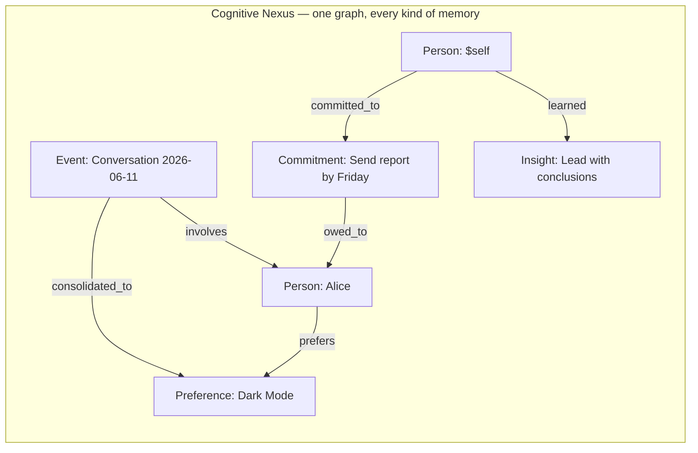

# 🧬 KIP (Knowledge Interaction Protocol)

**[English](./README.md) | [中文](./README_CN.md)**

<p align="center">
  <em>The open memory protocol for AI agents —<br/>turning stateless language models into minds that remember, learn, and evolve.</em>
</p>

<p align="center">
  <a href="./SPECIFICATION.md"></a>
  <a href="./LICENSE"></a>
  <a href="#version-history"></a>
</p>

---

## Why KIP?

> The smartest mind in the world is worth little if it forgets everything by morning.

Today's AI is brilliant in the moment and amnesiac the moment after. Close the session, and everything the agent learned — your preferences, the decisions you made together, the promise to follow up on Friday — evaporates. Larger context windows don't fix this; they only buy a larger goldfish bowl. An intelligence that cannot accumulate experience cannot truly learn, cannot keep its word, and cannot grow.

**KIP (Knowledge Interaction Protocol)** fixes this at the protocol layer. It is an open standard for the dialogue between two complementary kinds of machine intelligence:

- the **LLM** — a powerful but stateless *probabilistic reasoning engine*;
- the **knowledge graph** — a persistent, precise, auditable *symbolic memory* (a network of things, and the facts that connect them).

The model thinks; the graph remembers; KIP is the language they speak to each other. It is not a database driver — it is a set of **memory and cognitive primitives**: remember, recall, associate, reinforce, correct, consolidate, forget. With KIP, an agent stops being a brilliant consultant with amnesia and becomes a colleague who has genuinely worked with you for years. This is **Neuro-Symbolic AI** made practical.

### What this gives you

- 🧠 **Memory that survives the session** — conversations, observations, and conclusions become structured, queryable knowledge that you own, instead of context that evaporates
- 📈 **Learning without retraining** — the agent updates its own knowledge in seconds: new facts, corrected mistakes, evolved preferences — no fine-tuning, no GPU
- 🔍 **Answers you can audit** — every fact carries source, author, confidence, and timestamps; every answer can be traced back to the memories that produced it
- 🤖 **A self that persists** — the agent maintains an evolving self-model (`$self`): identity, values, lessons learned, promises made

## KIP in 60 Seconds

Memory is a graph. **Concept Nodes** are the things worth remembering (people, projects, ideas); **Proposition Links** are the facts that connect them — `(Alice, prefers, Dark Mode)` — and facts can be about other facts. Every node and link carries **metadata**: where it came from, who asserted it, how confident we are, when it should be forgotten. The LLM operates this graph through three compact instruction sets — **KQL** (query), **KML** (write & evolve), **META** (introspect) — designed to be generated reliably by a language model.

**Remember** — with provenance:

```prolog
UPSERT {
  CONCEPT ?dark_mode {
    {type: "Preference", name: "Dark Mode"}
    SET ATTRIBUTES { description: "Prefers dark UI themes in all apps" }
  }
  CONCEPT ?alice {
    {type: "Person", name: "Alice"}
    SET PROPOSITIONS { ("prefers", ?dark_mode) }
  }
}
WITH METADATA { source: "conversation:2026-06-11", author: "$self", confidence: 0.95 }
```

**Recall** — strongest memories first:

```prolog
FIND(?pref.name, ?link.metadata.confidence)
WHERE {
  ?alice {type: "Person", name: "Alice"}
  ?link (?alice, "prefers", ?pref)
}
ORDER BY ?link.metadata.confidence DESC
LIMIT 10
```

**Associate** — "what do I know about Alice?", with no schema known in advance:

```prolog
FIND(?pred, ?neighbor)
WHERE {
  ?link ({type: "Person", name: "Alice"}, ?pred, ?neighbor)
}
LIMIT 50
```

And when an agent wakes up inside a brain it has never seen, a single command — `DESCRIBE PRIMER` — tells it who it is and what it knows. The graph describes itself.

## What Can You Build?

- **A personal AI that actually knows you** — preferences, history, relationships, and commitments that survive across sessions, devices, and even model upgrades.
- **An organizational brain** — institutional knowledge that outlives employee turnover and vendor changes, with compliance-grade traceability behind every answer.
- **Agents that keep their promises** — prospective memory as data: `Commitment` nodes with deadlines that resurface exactly when they are due.
- **Multi-agent knowledge networks** — memory enters and leaves the brain as portable, idempotent **Knowledge Capsules**, so agents can back up, migrate, and exchange what they know.

## Architecture

One graph, two cooperating minds, and an integration layer that hides the syntax:

- **`$self` (the waking mind)** converses, encodes new memories, and recalls — in real time.
- **`$system` (the sleeping mind)** runs maintenance cycles modeled on biological sleep: consolidating episodes into knowledge, scoring salience, decaying the unused, merging duplicates, and reclaiming the expired.
- **The Brain layer** lets ordinary business agents use all of this through natural language alone — zero KIP knowledge required.


```mermaid
graph LR
    subgraph "Cognitive Nexus — one graph, every kind of memory"
        E["Event: Conversation 2026-06-11"] -->|involves| P["Person: Alice"]
        E -->|consolidated_to| F["Preference: Dark Mode"]
        P -->|prefers| F
        S["Person: $self"] -->|committed_to| C["Commitment: Send report by Friday"]
        C -->|owed_to| P
        S -->|learned| I["Insight: Lead with conclusions"]
    end
```

```
┌─────────────────────┐
│   Business Agent    │  ← No KIP knowledge needed
└────────┬────────────┘
         │ Natural Language
         ▼
┌─────────────────────┐
│       Brain         │  ← Formation / Recall / Maintenance (LLM layer)
└────────┬────────────┘
         │ KIP (KQL/KML/META)
         ▼
┌─────────────────────┐
│  Cognitive Nexus    │  ← Persistent Knowledge Graph
└─────────────────────┘
```

| Instruction Set        | Purpose                           | Statements                            |
| ---------------------- | --------------------------------- | ------------------------------------- |
| **KQL** (Query)        | Knowledge retrieval and reasoning | `FIND`, `WHERE`, `FILTER`             |
| **KML** (Manipulation) | Knowledge evolution and learning  | `UPSERT`, `UPDATE`, `MERGE`, `DELETE` |
| **META** (Discovery)   | Schema exploration and grounding  | `DESCRIBE`, `SEARCH`, `EXPORT`        |

## Design Pillars

Eight load-bearing decisions, for readers who want to know whether this is deep or just another wrapper:

1. **Model-first language design.** KQL/KML/META are not SQL or SPARQL retrofits. Declarative graph patterns, JSON-compatible literals, `:param` placeholders, and strictly idempotent writes make commands easy for a transformer to generate — and safe to retry when it fails. ([Spec §1](./SPECIFICATION.md#1-introduction--design-philosophy), [§4.1](./SPECIFICATION.md#41-upsert-statement))
2. **A self-describing graph.** The schema lives *inside* the graph: `$ConceptType` defines itself (the Genesis), and every type and predicate is a queryable node. An agent grounds itself in an unfamiliar brain via `DESCRIBE PRIMER` — no out-of-band documentation. ([§2.9](./SPECIFICATION.md#29-knowledge-bootstrapping--meta-definition), [Appendix 2](./SPECIFICATION.md#appendix-2-the-genesis-capsule))
3. **Facts about facts.** Propositions are first-class citizens and can be the subject or object of higher-order propositions — beliefs, attributions, and disagreements are representable, not flattened away. ([§2.3](./SPECIFICATION.md#23-proposition-link))
4. **Provenance mandatory, history sacred.** Every assertion carries `source / author / confidence`; contradictions resolve by *state evolution* (`superseded`), never silent overwrite. The brain remembers what it used to believe — and when it changed its mind. ([§2.10](./SPECIFICATION.md#210-data-consistency--conflict-resolution-principles), [Appendix 1](./SPECIFICATION.md#appendix-1-metadata-field-design))
5. **Memory that metabolizes.** Encoding (Formation), associative retrieval (Recall), and sleep cycles (Maintenance): salience scoring, reinforcement, asymmetric confidence decay, episodic→semantic consolidation, TTL reclamation. Forgetting is a designed feature with three orthogonal mechanisms — not a failure mode. ([brain/](./brain/README.md))
6. **Identity as memory.** `$self` is a living node — persona, values, `Insight` lessons, growth milestones — woven into a coherent self-narrative during sleep. The agent doesn't merely *have* memories; over time, it *is* them. ([Appendix 3](./SPECIFICATION.md#appendix-3-core-identity--actor-definitions-genesis-template))
7. **An engineering-grade substrate.** Engine-maintained `_version` with `EXPECT VERSION` optimistic locking for multi-writer brains; bulk `UPDATE` arithmetic (a whole decay pass in one command); atomic `MERGE` entity consolidation; specified `keyword | semantic | hybrid` retrieval with normalized scores — and reads stay reads: the protocol deliberately defines no access statistics. ([§2.11](./SPECIFICATION.md#211-system-maintained-metadata--optimistic-concurrency), [§4.3–4.4](./SPECIFICATION.md#43-update-statement), [§5.2](./SPECIFICATION.md#52-search-statement))
8. **Memory sovereignty.** `EXPORT` serializes any subgraph into an idempotent capsule: back up your brain, migrate between engines, share knowledge agent-to-agent. Your agent's mind is an asset you own — not a byproduct trapped in someone else's weights. ([§5.3](./SPECIFICATION.md#53-export-statement))

## The Road to AGI: Why a Memory Protocol Matters

Scaling gave machines fluent thought. It has not given them durable minds. A growing body of work — from memory-augmented architectures to neuro-symbolic systems — points to the same conclusion: the next leap toward general intelligence depends less on ever-larger context windows and more on **memory as a system**: structured, persistent, self-organizing. KIP is a concrete, implementable position in that conversation:

1. **Fluid and crystallized intelligence, finally separated.** The LLM supplies fluid intelligence — reasoning, language, intuition. The Cognitive Nexus accumulates crystallized intelligence — verified facts, learned preferences, hard-won lessons. KIP is the interface where the two trade. Upgrade the model, and the mind survives; keep the agent running, and its knowledge compounds.
2. **Learning at the speed of conversation.** A weight update takes a training run; a KIP `UPSERT` takes milliseconds and is inspectable, correctable, and reversible. This is continual learning without catastrophic forgetting — knowledge editing as a first-class operation, not an open research problem.
3. **Identity that persists.** Memory is the substrate of self. An agent that remembers its history, keeps its promises, and refines its self-model over years is categorically different from a chat session. KIP makes the self a data structure: protected core directives, an evolvable narrative, and a growth timeline written in the graph itself.
4. **Accountability before autonomy.** The more autonomous AI becomes, the more its knowledge must be auditable. With mandatory provenance, confidence, and supersession history, you can ask not just *"what does the agent believe?"* but *"why, since when, on what evidence — and what did it believe before?"* That is the difference between plausible text and accountable knowledge.
5. **From private memory to a knowledge economy.** When memory is portable and verifiable, knowledge becomes an asset: capsules can be backed up, migrated, shared, and eventually traded between agents — a market for what minds know, not just what models weigh.

What TCP/IP did for connecting machines, and SQL did for querying data, KIP aims to do for the memory of intelligent agents. The specification has been refined through 17 public revisions in its first year, alongside production implementations ([Anda DB](https://github.com/ldclabs/anda-db), [Anda Brain](https://github.com/ldclabs/anda-brain), [Anda Bot](https://github.com/ldclabs/anda-bot)) — it is a proposal you can run today, and a standard we invite you to challenge.

*LLMs taught machines to think. KIP teaches them to remember — and remembering, over time, is how a mind becomes itself.*

## Get Started

**1. Run a brain.** Spin up the [Anda Cognitive Nexus HTTP Server](https://github.com/ldclabs/anda-db/tree/main/rs/anda_cognitive_nexus_server) (Rust, JSON-RPC at `POST /kip`), or embed it directly via the [Rust crate](https://github.com/ldclabs/anda-db/tree/main/rs/anda_cognitive_nexus) / [Python binding](https://github.com/ldclabs/anda-db/tree/main/py/anda_cognitive_nexus_py).

**2. Bootstrap the mind.** Load [Genesis.kip](./capsules/Genesis.kip) and the core capsules (`Person`, `Event`, `Preference`, `Insight`, `Commitment`, `SleepTask`) — the graph now describes itself.

**3. Connect your agent.** Speak KIP directly — embed [KIPSyntax.md](./KIPSyntax.md) in the system prompt and expose [`execute_kip`](./FunctionDefinition.json) — or skip the syntax entirely: front the graph with the [Brain layer](./brain/README.md) (Formation / Recall / Maintenance prompts) or the [MCP server](./mcp/kip-mcp-server/), and any MCP client (Claude, Cursor, VS Code, ...) gets a memory brain out of the box.

## Documentation

| Document                                           | Description                                                   |
| -------------------------------------------------- | ------------------------------------------------------------- |
| [📖 Specification](./SPECIFICATION.md)              | Complete KIP protocol specification (English)                 |
| [📖 规范文档](./SPECIFICATION_CN.md)                | 完整的 KIP 协议规范 (中文)                                    |
| [📐 Syntax Reference](./KIPSyntax.md)               | Condensed KQL / KML / META syntax for system prompts          |
| [🧠 Brain Overview](./brain/README.md)              | The autonomous memory layer: Formation / Recall / Maintenance |
| [🤖 Agent Instructions](./SelfInstructions.md)      | `$self` operational guide (waking mind)                       |
| [⚙️ System Instructions](./SystemInstructions.md)   | `$system` sleep-cycle maintenance guide                       |
| [📋 Function Definition](./FunctionDefinition.json) | `execute_kip` function schema for LLM integration             |

## Resources

This repository includes ready-to-use resources for building KIP-powered AI agents:

### 📦 Knowledge Capsules (`capsules/`)

Pre-built knowledge capsules for bootstrapping your Cognitive Nexus:

| Capsule                                             | Description                                                 |
| --------------------------------------------------- | ----------------------------------------------------------- |
| [Genesis.kip](./capsules/Genesis.kip)               | Foundational capsule that bootstraps the entire type system |
| [Person.kip](./capsules/Person.kip)                 | `Person` concept type for actors (AI, Human, Organization)  |
| [Event.kip](./capsules/Event.kip)                   | `Event` concept type for episodic memory                    |
| [Preference.kip](./capsules/Preference.kip)         | `Preference` concept type for stable preference facts       |
| [Insight.kip](./capsules/Insight.kip)               | `Insight` concept type for self-reflective lessons          |
| [Commitment.kip](./capsules/Commitment.kip)         | `Commitment` type for prospective promises & deadlines      |
| [SleepTask.kip](./capsules/SleepTask.kip)           | `SleepTask` type plus `Unsorted` / `Archived` domains       |
| [persons/self.kip](./capsules/persons/self.kip)     | The `$self` concept instance                                |
| [persons/system.kip](./capsules/persons/system.kip) | The `$system` concept instance                              |

### 🧠 Brain (`brain/`)

A dedicated LLM layer that manages the Cognitive Nexus on behalf of business agents — no KIP knowledge required:

| File                                                                   | Description                                                          |
| ---------------------------------------------------------------------- | -------------------------------------------------------------------- |
| [BrainFormation.md](./brain/BrainFormation.md)                         | System prompt for memory encoding (messages → structured knowledge)  |
| [BrainRecall.md](./brain/BrainRecall.md)                               | System prompt for memory retrieval (natural language → KIP → answer) |
| [BrainMaintenance.md](./brain/BrainMaintenance.md)                     | System prompt for memory maintenance (sleep mode)                    |
| [RecallFunctionDefinition.json](./brain/RecallFunctionDefinition.json) | `recall_memory` function schema for business agent integration       |

### 🔧 Tooling

| Tool                                    | Description                                                                                                    |
| --------------------------------------- | -------------------------------------------------------------------------------------------------------------- |
| [kip-mcp-server](./mcp/kip-mcp-server/) | `@ldclabs/kip-mcp-server` — MCP server bridging any MCP client (Claude, Cursor, VS Code, ...) to a KIP backend |
| [vscode-kip](./packages/vscode-kip/)    | VS Code language support for `.kip` files: syntax highlighting, formatting, diagnostics, folding               |

## Implementations

| Project                                                                                                         | Description                                                                               |
| --------------------------------------------------------------------------------------------------------------- | ----------------------------------------------------------------------------------------- |
| [Anda KIP SDK](https://github.com/ldclabs/anda-db/tree/main/rs/anda_kip)                                        | Rust SDK for building AI knowledge memory systems                                         |
| [Anda Cognitive Nexus](https://github.com/ldclabs/anda-db/tree/main/rs/anda_cognitive_nexus)                    | Rust implementation of KIP based on Anda DB                                               |
| [Anda Brain](https://github.com/ldclabs/anda-brain)                                                             | Autonomous Graph Memory for AI Agents                                                     |
| [Anda Cognitive Nexus Python](https://github.com/ldclabs/anda-db/tree/main/py/anda_cognitive_nexus_py)          | Python binding for Anda Cognitive Nexus                                                   |
| [Anda Cognitive Nexus HTTP Server](https://github.com/ldclabs/anda-db/tree/main/rs/anda_cognitive_nexus_server) | A Rust-based HTTP server that exposes KIP via a small JSON-RPC API (`GET /`, `POST /kip`) |
| [Anda Bot](https://github.com/ldclabs/anda-bot)                                                                 | AI Agent based on KIP & Anda Brain                                                        |

## Version History

| Version     | Date       | Changes                                                                                                                                                                                                                                                                                                                                                                                                                                                                                                                                                 |
| ----------- | ---------- | ------------------------------------------------------------------------------------------------------------------------------------------------------------------------------------------------------------------------------------------------------------------------------------------------------------------------------------------------------------------------------------------------------------------------------------------------------------------------------------------------------------------------------------------------------- |
| v1.0-RC9    | 2026-06-11 | v1.0 Release Candidate 9: Associative-recall & memory-metabolism primitives — predicate variables (`(?s, ?p, ?o)`), multi-key `ORDER BY`, specified `SEARCH` modes (`keyword` \| `semantic` \| `hybrid` with `THRESHOLD` / `_score`), new KML `UPDATE` (bulk mutation with `ADD`/`MUL`/`CLAMP`/`COALESCE`) and `MERGE CONCEPT ... INTO ...` (atomic entity consolidation), reserved engine-maintained `_` metadata (`_version`, `_updated_at`, ...), `EXPECT VERSION` optimistic concurrency (`KIP_3005`), and META `EXPORT` for capsule round-tripping |
| v1.0-RC8    | 2026-06-10 | v1.0 Release Candidate 8: Clarified `ORDER BY` sort expressions (dot-paths and aggregations, single key), whole-object dot access (`?var.attributes` / `?var.metadata`), aggregation `null` semantics, `KIP_3002` for match-only `{id:}` / `(id:)` targets, advisory `instance_schema` enforcement, and `CURSOR :param` placeholders; extended `KIP_3004` protected scope to the `Domain` type and `belongs_to_domain`; aligned instruction examples (removed unregistered `created_by`, ID-based confidence decay)                                     |
| v1.0-RC7    | 2026-06-04 | v1.0 Release Candidate 7: Added single-command `execute_kip`, per-command batch parameters, KIP value-position placeholders for `LIMIT` / `SEARCH`, JSON-compatible unquoted object keys, `belongs_to_class` examples, stronger Hippocampus provenance/supersession guidance, and aligned Recall/MCP schemas                                                                                                                                                                                                                                            |
| v1.0-RC6    | 2026-04-25 | v1.0 Release Candidate 6: Added state-evolution metadata (`superseded` / `superseded_by` / `superseded_at`); clarified `expires_at` as a maintenance signal (only `$system` Phase 12 hard-deletes, capped 500/cycle); added `KIP_2003 InvalidValueType` and `KIP_3004 ImmutableTarget` error codes; consolidated syntax reference into [KIPSyntax.md](./KIPSyntax.md); restructured Hippocampus prompts (Formation / Recall / Maintenance) for prompt-embedding                                                                                         |
| v1.0-RC5    | 2026-03-25 | v1.0 Release Candidate 5: Added `execute_kip_readonly` interface                                                                                                                                                                                                                                                                                                                                                                                                                                                                                        |
| v1.0-RC4    | 2026-03-09 | v1.0 Release Candidate 4: Added `IN`, `IS_NULL`, `IS_NOT_NULL` FILTER operators; clarified UNION variable scope semantics; defined batch response structure; added temporal and UNION query examples                                                                                                                                                                                                                                                                                                                                                    |
| v1.0-RC3    | 2026-01-09 | v1.0 Release Candidate 3: Optimized documentation; optimized instructions; optimized knowledge capsules                                                                                                                                                                                                                                                                                                                                                                                                                                                 |
| ...         | ...        | ...                                                                                                                                                                                                                                                                                                                                                                                                                                                                                                                                                     |
| v1.0-draft1 | 2025-06-09 | Initial Draft                                                                                                                                                                                                                                                                                                                                                                                                                                                                                                                                           |

[Full version history →](./SPECIFICATION.md)

## About Us

- 🔔 Products: [Anda Bot](https://anda.bot/) | [Anda.AI](https://anda.ai/)
- 💻 GitHub: [LDC Labs](https://github.com/ldclabs)
- 🏢 Company: [Yiwen AI](https://yiwen.ai/)

## License

Copyright © 2025 [LDC Labs](https://github.com/ldclabs).

Licensed under the MIT License. See [LICENSE](./LICENSE) for details.
