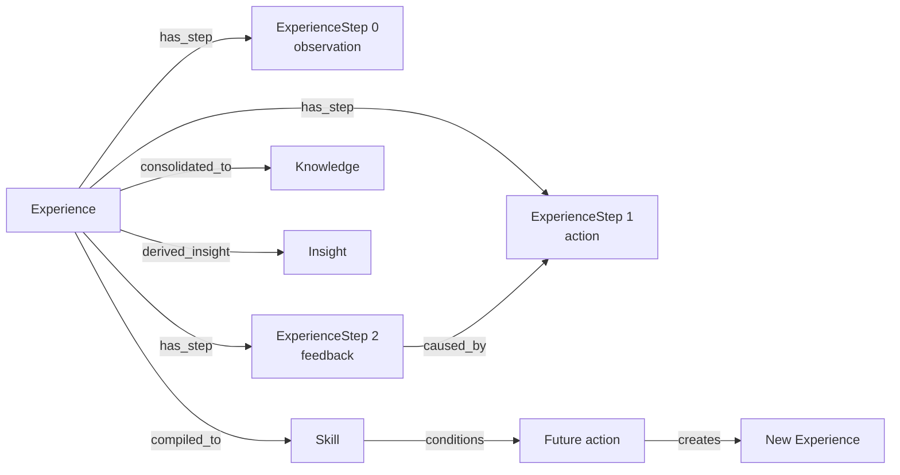

# 🧬 KIP (Knowledge Interaction Protocol)

**[English](./README.md) | [中文](./README_CN.md)**

<p align="center">
  <em>The open experience learning protocol for AI agents —<br/>turning interaction into memory, knowledge, skill, and better action.</em>
</p>

<p align="center">
  <a href="./SPECIFICATION.md"></a>
  <a href="./v2/KIP-2.0-SPECIFICATION.md"></a>
  <a href="#the-experience-learning-profile"></a>
  <a href="./LICENSE"></a>
</p>

---

## Why KIP?

> An intelligence that cannot accumulate experience cannot truly learn.

Today's AI can reason brilliantly inside one session and still repeat the same mistake tomorrow. Larger context windows postpone forgetting; vector retrieval can return related text. Neither, by itself, explains what the agent was trying to achieve, which action changed the situation, where reality contradicted expectation, or how the past should change the next action.

KIP is an open protocol for the whole learning loop:

```text
Experience → Memory → Knowledge → Skill → Action
     ▲                                      │
     └────────────── new feedback ──────────┘
```

- **Experience** preserves a subject's goal-directed state–decision–action–feedback trajectory.
- **Memory** lets past state participate in future computation.
- **Knowledge** compresses stable regularities from evidence and experience.
- **Skill** compiles experience into an action-selecting policy.
- **Action** applies that policy to the world and creates new experience.

The protocol connects two complementary kinds of machine intelligence:

- the **LLM** — a powerful but stateless probabilistic reasoning and policy engine;
- the **Cognitive Nexus** — a persistent, precise, auditable symbolic substrate for memory and learning.

The model interprets and acts; the graph preserves and reorganizes what matters; KIP is the language through which the past changes the future. It is not a database driver. It provides cognitive primitives for **remembering, replaying, associating, reinforcing, correcting, consolidating, compiling skills, and forgetting**.

### What this gives you

- 🧭 **Trajectory memory, not just transcripts** — goals, actions, observations, outcomes, and prediction errors remain queryable as a coherent Experience.
- 🧠 **Memory that survives the session** — Events, Experiences, facts, preferences, insights, skills, and commitments live in a graph the agent can revisit.
- 🛠️ **Learning without retraining** — repeated successes and failures can update Knowledge and Skill in seconds, without a weight update.
- 🎯 **Action-aware recall** — an Action Briefing can return applicable Skills, analogous Experiences, constraints, risks, and commitments before the agent acts.
- 🔍 **Auditable cognition** — assertions carry provenance, author, confidence, and temporal state; derived Knowledge and Skills point back to their evidence.
- 🤖 **A self that persists** — `$self` can retain identity, values, lessons, commitments, and a history of changed behavior.
- 📦 **Portable learning** — idempotent Knowledge Capsules can back up, migrate, and exchange a self-describing memory graph.

## KIP in 60 Seconds

The Cognitive Nexus is a graph. **Concept Nodes** are the things worth remembering; **Proposition Links** are typed assertions connecting them. Assertions can themselves be subjects or objects, so KIP can represent provenance, attribution, disagreement, and evolving belief.

The LLM operates the graph through three compact instruction sets:

| Instruction set | Purpose | Statements |
| --- | --- | --- |
| **KQL** | Retrieval and graph reasoning | `FIND`, `WHERE`, `FILTER` |
| **KML** | Formation, correction, and evolution | `UPSERT`, `UPDATE`, `MERGE`, `DELETE` |
| **META** | Grounding, discovery, and portability | `DESCRIBE`, `SEARCH`, `EXPORT` |

**Remember a fact with provenance:**

```prolog
UPSERT {
  CONCEPT ?dark_mode {
    {type: "Preference", name: "Dark Mode"}
    SET ATTRIBUTES { description: "Prefers dark UI themes in all apps" }
  }
  CONCEPT ?alice {
    {type: "Person", name: "Alice"}
    SET PROPOSITIONS { ("prefers", ?dark_mode) }
  }
}
WITH METADATA {
  source: "conversation:2026-06-11",
  author: "$self",
  confidence: 0.95,
  memory_strength: 0.80
}
```

**Recall the strongest current assertions:**

```prolog
FIND(?pref.name, ?link.metadata.confidence, ?link.metadata.memory_strength)
WHERE {
  ?alice {type: "Person", name: "Alice"}
  ?link (?alice, "prefers", ?pref)
  FILTER(IS_NULL(?link.metadata.superseded) || ?link.metadata.superseded == false)
}
ORDER BY ?link.metadata.memory_strength DESC, ?link.metadata.confidence DESC
LIMIT 10
```

**Associate without knowing the schema in advance:**

```prolog
FIND(?predicate, ?neighbor)
WHERE {
  ?link ({type: "Person", name: "Alice"}, ?predicate, ?neighbor)
}
LIMIT 50
```

When an agent wakes inside a graph it has never seen, `DESCRIBE PRIMER` tells it who it is, which domains exist, and which types and predicates it can use. The graph describes itself.

## The Experience Learning Profile

KIP Core remains a general graph protocol. Experience learning is an additive, self-described **Cognitive Memory Profile** built with ordinary KIP capsules. No KQL, KML, or META syntax changes are required.

### The model

| Concept | Canonical question | Representation |
| --- | --- | --- |
| `Event` | What happened? | Time-bounded occurrence or interaction summary |
| `Experience` | What goal was pursued, what changed, and what was learned? | Goal-directed trajectory |
| `ExperienceStep` | What was observed, decided, done, or returned at this point? | Ordered trajectory record |
| `Insight` | What declarative lesson should be remembered? | Self-contained reflective knowledge |
| `Skill` | In this kind of state, what policy should guide action? | Procedural memory |

An Event and an Experience may refer to the same real-world interval, but they are not interchangeable. Event is observer-oriented; Experience is subject-oriented. A conversation with no meaningful goal/action/feedback dynamics should remain an Event. A deployment attempt with hypotheses, tool actions, failures, revised state, and a terminal outcome should be an Experience.

`Memory`, `Knowledge`, and `Action` name functional roles in the learning loop, not mandatory universal Concept Types. Domain capsules define concrete semantic types; the Experience Learning Profile adds three Concept Types (`Experience`, `ExperienceStep`, `Skill`) and four Proposition Types (`has_step`, `caused_by`, `derived_insight`, `compiled_to`).


```mermaid
graph LR
    X["Experience"] -->|"has_step"| S1["ExperienceStep 0<br/>observation"]
    X -->|"has_step"| S2["ExperienceStep 1<br/>action"]
    X -->|"has_step"| S3["ExperienceStep 2<br/>feedback"]
    S3 -->|"caused_by"| S2
    X -->|"consolidated_to"| K["Knowledge"]
    X -->|"derived_insight"| I["Insight"]
    X -->|"compiled_to"| P["Skill"]
    P -->|"conditions"| A["Future action"]
    A -->|"creates"| NX["New Experience"]
```

`ExperienceStep.index` establishes temporal order. `caused_by` is optional and explicit: **earlier does not mean causal**.

### Expectation is a learning signal

Experience becomes especially valuable where the world violates the subject's model:

```text
expected observation → actual observation → prediction error → policy update
```

`ExperienceStep` therefore supports `expected_observation`, `actual_observation`, and `prediction_error`. The parent Experience may carry an aggregate `surprise_score`, which contributes to salience and consolidation priority.

### Confidence is not memory strength

The profile separates three independent signals:

| Signal | Meaning | Typical change |
| --- | --- | --- |
| `metadata.confidence` | How strongly evidence warrants believing an assertion | New evidence, contradiction, correction |
| `metadata.memory_strength` | How accessible a memory currently is and how strongly it competes for recall | Reinforcement, successful reuse, time-based decay |
| `attributes.salience_score` | How urgently an Event or Experience deserves encoding or consolidation | Goal relevance, surprise, outcome magnitude, novelty, emotion, reusability |

A true but rarely useful fact may retain high confidence while its memory strength falls. A vivid new Experience may have high salience and memory strength while its causal interpretation remains low-confidence. Maintenance must never use confidence as a proxy for retrieval frequency or forgetting.

### From Experience to Skill

Procedural consolidation compares trajectories instead of summarizing a single transcript:

1. Cluster Experiences by goal, initial state, domain, tools, and outcome.
2. Contrast successful and failed trajectories.
3. Identify the decision or action that changed the outcome; do not infer causality from sequence alone.
4. Compile a candidate `Skill` with trigger conditions, preconditions, procedure, decision rules, success criteria, and failure signals.
5. Link every source with `compiled_to` and inverse `derived_from` provenance.
6. Validate the policy on later Experiences; strengthen, narrow, supersede, or deprecate it as evidence changes.

`Skill.execution_mode` is a capability boundary (`advisory`, `supervised`, or `autonomous`), not permission to bypass an application's authorization or safety policy.

### Action Briefing

Recall should not stop at “what is related?” Before a consequential action, an Action Briefing can assemble:

- the current goal and known constraints;
- analogous successful and failed Experiences;
- applicable Skills and their maturity, confidence, and failure signals;
- relevant Knowledge and Insights;
- unresolved contradictions, risks, and due Commitments.

This is the functional test for memory: if removing a past item cannot change any relevant future state, prediction, or action, it is archive material rather than active memory.

## A Complete Experience Example

The following uses only existing KIP Core syntax. Load the profile capsules first.

```prolog
UPSERT {
  CONCEPT ?observe_failure {
    {type: "ExperienceStep", name: "Experience:2026-08-13T09:00:deploy-v2:Step:00"}
    SET ATTRIBUTES {
      index: 0,
      kind: "observation",
      summary: "The v2 service failed its health check after deployment",
      timestamp: "2026-08-13T09:00:00Z",
      actual_observation: "health endpoint returned 503"
    }
    SET PROPOSITIONS { ("belongs_to_domain", {type: "Domain", name: "Unsorted"}) }
  }
  WITH METADATA {
    source: "execution-trace:deploy-v2", author: "$self",
    created_at: "2026-08-13T09:10:00Z", observed_at: "2026-08-13T09:00:00Z",
    confidence: 0.95, memory_strength: 0.90,
    memory_tier: "short-term", expires_at: "2026-09-12T09:10:00Z"
  }
  CONCEPT ?check_database {
    {type: "ExperienceStep", name: "Experience:2026-08-13T09:00:deploy-v2:Step:01"}
    SET ATTRIBUTES {
      index: 1,
      kind: "action",
      summary: "Checked the active database target before retrying migration",
      timestamp: "2026-08-13T09:03:00Z",
      tool: "database-inspector",
      expected_observation: "the service points to the migrated database",
      actual_observation: "the service points to the old database",
      prediction_error: "the assumed migration problem was actually a connection-target problem",
      success: true
    }
    SET PROPOSITIONS { ("belongs_to_domain", {type: "Domain", name: "Unsorted"}) }
  }
  WITH METADATA {
    source: "execution-trace:deploy-v2", author: "$self",
    created_at: "2026-08-13T09:10:00Z", observed_at: "2026-08-13T09:03:00Z",
    confidence: 0.95, memory_strength: 0.90,
    memory_tier: "short-term", expires_at: "2026-09-12T09:10:00Z"
  }
  CONCEPT ?experience {
    {type: "Experience", name: "Experience:2026-08-13T09:00:deploy-v2"}
    SET ATTRIBUTES {
      experience_class: "problem_solving",
      goal: "Deploy service v2 with a healthy database connection",
      initial_state: {service_version: "v2", assumed_database: "migrated-primary"},
      status: "completed",
      outcome: "Corrected the database target and completed the deployment",
      success: true,
      prediction_error: "The service was connected to the old database, not the migrated primary",
      surprise_score: 82,
      learning_value: 91,
      started_at: "2026-08-13T09:00:00Z",
      ended_at: "2026-08-13T09:10:00Z",
      consolidation_status: "pending",
      salience_score: 86
    }
    SET PROPOSITIONS {
      ("involves", {type: "Person", name: "$self"})
      ("belongs_to_domain", {type: "Domain", name: "Unsorted"})
      ("has_step", ?observe_failure) WITH METADATA {
        source: "execution-trace:deploy-v2", author: "$self",
        created_at: "2026-08-13T09:10:00Z", confidence: 0.95,
        memory_strength: 0.90, expires_at: "2026-09-12T09:10:00Z"
      }
      ("has_step", ?check_database) WITH METADATA {
        source: "execution-trace:deploy-v2", author: "$self",
        created_at: "2026-08-13T09:10:00Z", confidence: 0.95,
        memory_strength: 0.90, expires_at: "2026-09-12T09:10:00Z"
      }
    }
  }
  WITH METADATA {
    source: "execution-trace:deploy-v2", author: "$self",
    created_at: "2026-08-13T09:10:00Z", observed_at: "2026-08-13T09:10:00Z",
    confidence: 0.95, memory_strength: 0.90,
    memory_tier: "short-term", expires_at: "2026-09-12T09:10:00Z"
  }
}

UPSERT {
  CONCEPT ?experience {
    {type: "Experience", name: "Experience:2026-08-13T09:00:deploy-v2"}
  }
  CONCEPT ?skill {
    {type: "Skill", name: "Skill:deployment:verify-database-target"}
    SET ATTRIBUTES {
      skill_class: "diagnostic",
      description: "Verify the active database target before treating a deployment failure as a migration failure",
      goal: "Distinguish database-target failures from migration failures early",
      trigger_conditions: ["new deployment fails startup or health checks", "database schema error is suspected"],
      preconditions: ["database target is inspectable"],
      procedure: ["read the service's active database target", "compare it with the migrated target", "only then inspect or rerun migrations"],
      expected_outcome: "database target mismatch is confirmed or ruled out before mutation",
      success_criteria: ["active target identity is verified", "no migration is rerun against an unverified target"],
      failure_signals: ["target identity cannot be read", "multiple environments share ambiguous credentials"],
      recovery_strategy: "stop and request environment-owner verification",
      execution_mode: "supervised",
      maturity: "candidate",
      evidence_count: 1,
      success_count: 1,
      failure_count: 0,
      last_validated_at: "2026-08-13T09:10:00Z"
    }
    SET PROPOSITIONS {
      ("derived_from", ?experience)
      ("belongs_to_domain", {type: "Domain", name: "Unsorted"})
    }
  }
  WITH METADATA {
    source: "ProceduralConsolidation",
    author: "$system",
    created_at: "2026-08-13T10:00:00Z",
    confidence: 0.72,
    memory_strength: 0.85
  }
  PROPOSITION ?compilation {
    (?experience, "compiled_to", ?skill)
  }
  WITH METADATA {
    source: "ProceduralConsolidation",
    author: "$system",
    created_at: "2026-08-13T10:00:00Z",
    confidence: 0.72,
    memory_strength: 0.85
  }
}
```

## Architecture

```text
┌─────────────────────┐
│   Business Agent    │  ← goals, decisions, actions, user interaction
└────────┬────────────┘
         │ natural language + structured traces
         ▼
┌─────────────────────┐
│       Brain         │  ← Formation / Recall / Maintenance
└────────┬────────────┘
         │ KIP (KQL / KML / META)
         ▼
┌─────────────────────┐
│  Cognitive Nexus    │  ← Event / Experience / Knowledge / Skill / Self
└─────────────────────┘
```

- **Formation** identifies memory boundaries, encodes Events and Experiences, preserves provenance, and captures prediction errors without storing noise or private chain-of-thought.
- **Recall** performs associative memory and trajectory replay, and can produce an Action Briefing that changes what the agent does next.
- **Maintenance** consolidates Events and Experiences into Knowledge, Insights, Skills, and a coherent self-model; it also reinforces, corrects, supersedes, decays, archives, and forgets.

## Compatibility Contract

The Experience Learning Profile is deliberately additive:

- **No grammar changes.** Existing KQL, KML, and META parsers remain valid.
- **No new primitive data types.** Profile schemas use existing Concept, Proposition, Object, Array, number, string, and boolean values.
- **No changed identity rules.** Concepts still use `id` or `{type, name}`; propositions still use `id` or `(subject, predicate, object)`.
- **Idempotent bootstrap.** Every profile capsule uses ordinary `UPSERT` and can be safely replayed.
- **Advisory schemas remain advisory.** Engines that know only KIP Core can store and query these types without profile-specific code.
- **Existing memories remain valid.** Event-only graphs continue to work; Experiences and Skills can be introduced incrementally.
- **Existing predicates are only widened.** `involves`, `mentions`, `consolidated_to`, and `derived_from` retain all previous valid subject/object combinations while adding Experience-aware ones.

KIP Core specifies the protocol. Capsules define the cognitive vocabulary. Anda Brain implements the Experience Learning Loop as agent behavior.

## Design Pillars

1. **Model-first language design.** Declarative graph patterns, JSON-compatible values, parameters, and idempotent writes make commands reliable for language models and safe to retry. ([Spec §1](./SPECIFICATION.md#1-introduction--design-philosophy))
2. **A self-describing graph.** Types and predicates live in the graph; `DESCRIBE PRIMER` grounds an agent without out-of-band schema knowledge. ([Spec §2.9](./SPECIFICATION.md#29-knowledge-bootstrapping--meta-definition))
3. **Experience is a trajectory, not a text chunk.** The profile preserves goal, state, decisions, actions, feedback, outcome, and prediction error.
4. **Temporal order is not causality.** Step index provides order; explicit `caused_by` links require evidence.
5. **Facts about facts.** Higher-order propositions represent attribution, confidence, disagreement, and belief evolution. ([Spec §2.3](./SPECIFICATION.md#23-proposition-link))
6. **Provenance mandatory, history sacred.** Corrections use state evolution and supersession instead of silent overwrite. ([Spec §2.10](./SPECIFICATION.md#210-data-consistency--conflict-resolution-principles))
7. **Semantic and procedural consolidation are distinct.** Experience may compress into Knowledge or Insight and compile into Skill; neither output substitutes for the other.
8. **Memory strength is not truth.** Retention and retrieval dynamics never silently rewrite epistemic confidence.
9. **Memory metabolizes.** Formation, Recall, and Maintenance make consolidation, reinforcement, forgetting, and reconsolidation part of the architecture. ([brain/](./brain/README.md))
10. **Memory sovereignty.** `EXPORT` turns subgraphs into portable, idempotent capsules that users can own and move. ([Spec §5.3](./SPECIFICATION.md#53-export-statement))

## What Can You Build?

- **A personal AI that grows through use** — it remembers preferences and commitments, but also how previous attempts succeeded or failed.
- **An organizational learning system** — decision rationale, incident trajectories, operational knowledge, and validated procedures survive personnel and model changes.
- **Agents that improve without retraining** — new Experiences update inspectable Knowledge and Skills instead of waiting for another model release.
- **Action-aware copilots** — retrieve applicable policies and contrasting cases before a deployment, diagnosis, negotiation, or high-stakes decision.
- **Multi-agent learning networks** — exchange portable Knowledge and Skill capsules with explicit provenance and confidence.

## Get Started

1. **Run a Cognitive Nexus.** Use the [Anda Cognitive Nexus HTTP Server](https://github.com/ldclabs/anda-db/tree/main/rs/anda_cognitive_nexus_server), the [Rust crate](https://github.com/ldclabs/anda-db/tree/main/rs/anda_cognitive_nexus), or the [Python binding](https://github.com/ldclabs/anda-db/tree/main/py/anda_cognitive_nexus_py).
2. **Bootstrap KIP Core.** Load [Genesis.kip](./capsules/Genesis.kip), followed by `Person`, `Event`, `Preference`, `Insight`, `Commitment`, and `SleepTask`, plus the shared episodic/provenance predicate capsules `involves`, `mentions`, `consolidated_to`, and `derived_from`.
3. **Load the Experience Learning Profile.** Load `Experience`, `ExperienceStep`, and `Skill`, then the four Experience-specific predicate capsules. The recommended deterministic order is shown below.
4. **Connect the agent.** Embed [KIPSyntax.md](./KIPSyntax.md) and expose [`execute_kip`](./FunctionDefinition.json), or put the [Brain layer](./brain/README.md) or [MCP server](./mcp/kip-mcp-server/) in front of KIP.

```text
capsules/Genesis.kip
capsules/Person.kip
capsules/Event.kip
capsules/Preference.kip
capsules/Insight.kip
capsules/Commitment.kip
capsules/SleepTask.kip
capsules/Experience.kip
capsules/ExperienceStep.kip
capsules/Skill.kip
capsules/involves.kip
capsules/mentions.kip
capsules/consolidated_to.kip
capsules/derived_from.kip
capsules/has_step.kip
capsules/caused_by.kip
capsules/derived_insight.kip
capsules/compiled_to.kip
```

The type capsules precede predicate capsules so schema references are already grounded. All writes are idempotent, so the complete sequence may be replayed. An Event-only deployment loads the core type capsules plus the four shared predicate capsules and stops there; the `Experience` entries in their `subject_types` / `object_types` stay dormant until the profile types are registered.

## Documentation

| Document | Description |
| --- | --- |
| [📖 Specification](./SPECIFICATION.md) | Complete KIP Core protocol specification |
| [📖 规范文档](./SPECIFICATION_CN.md) | KIP Core protocol specification in Chinese |
| [📐 Syntax Reference](./KIPSyntax.md) | Condensed KQL / KML / META syntax for prompts |
| [🧠 Brain Overview](./brain/README.md) | Formation / Recall / Maintenance architecture |
| [🤖 Agent Instructions](./SelfInstructions.md) | `$self` operational guide |
| [⚙️ System Instructions](./SystemInstructions.md) | `$system` maintenance guide |
| [📋 Function Definition](./FunctionDefinition.json) | `execute_kip` function schema |
| [🗣 Domain Language](./CONTEXT.md) | Canonical Experience Learning vocabulary |

## Resources

### 📦 Knowledge Capsules (`capsules/`)

| Capsule | Description |
| --- | --- |
| [Genesis.kip](./capsules/Genesis.kip) | Bootstraps the self-describing KIP type system |
| [Person.kip](./capsules/Person.kip) | Actors: AI, Human, Organization |
| [Event.kip](./capsules/Event.kip) | Objective episodic occurrences |
| [Experience.kip](./capsules/Experience.kip) | Goal-directed trajectories |
| [ExperienceStep.kip](./capsules/ExperienceStep.kip) | Ordered observation, decision, action, and feedback records |
| [Skill.kip](./capsules/Skill.kip) | Procedural memory and action-selecting policy |
| [involves.kip](./capsules/involves.kip) | `Event / Experience → Person` participation |
| [mentions.kip](./capsules/mentions.kip) | `Event / Experience → concept` non-participant references |
| [consolidated_to.kip](./capsules/consolidated_to.kip) | `Event / Experience → semantic knowledge` consolidation |
| [derived_from.kip](./capsules/derived_from.kip) | Inverse provenance back to source Events / Experiences |
| [has_step.kip](./capsules/has_step.kip) | `Experience → ExperienceStep` membership |
| [caused_by.kip](./capsules/caused_by.kip) | Evidence-backed causal links between steps |
| [derived_insight.kip](./capsules/derived_insight.kip) | `Experience → Insight` consolidation |
| [compiled_to.kip](./capsules/compiled_to.kip) | `Experience → Skill` procedural consolidation |
| [Preference.kip](./capsules/Preference.kip) | Stable preference facts |
| [Insight.kip](./capsules/Insight.kip) | Declarative lessons and self-reflection |
| [Commitment.kip](./capsules/Commitment.kip) | Prospective promises, reminders, and deadlines |
| [SleepTask.kip](./capsules/SleepTask.kip) | Maintenance work, including `compile_to_skill` |
| [persons/self.kip](./capsules/persons/self.kip) | The `$self` concept instance |
| [persons/system.kip](./capsules/persons/system.kip) | The `$system` concept instance |

### 🧠 Brain (`brain/`)

| File | Description |
| --- | --- |
| [BrainFormation.md](./brain/BrainFormation.md) | Messages and structured traces → Event / Experience / Knowledge |
| [BrainRecall.md](./brain/BrainRecall.md) | Natural language → associative recall / replay / Action Briefing |
| [BrainMaintenance.md](./brain/BrainMaintenance.md) | Semantic and procedural consolidation, correction, decay, and forgetting |
| [RecallFunctionDefinition.json](./brain/RecallFunctionDefinition.json) | Read-only memory interface for business agents |

### 🔧 Tooling

| Tool | Description |
| --- | --- |
| [kip-mcp-server](./mcp/kip-mcp-server/) | MCP bridge from compatible clients to a KIP backend |
| [vscode-kip](./packages/vscode-kip/) | `.kip` syntax highlighting, formatting, diagnostics, and folding |

## Implementations

| Project | Description |
| --- | --- |
| [Anda KIP SDK](https://github.com/ldclabs/anda-db/tree/main/rs/anda_kip) | Rust SDK for KIP applications |
| [Anda Cognitive Nexus](https://github.com/ldclabs/anda-db/tree/main/rs/anda_cognitive_nexus) | Anda DB-based KIP implementation |
| [Anda Brain](https://github.com/ldclabs/anda-brain) | Autonomous memory and experience-learning layer for AI agents |
| [Anda Cognitive Nexus Python](https://github.com/ldclabs/anda-db/tree/main/py/anda_cognitive_nexus_py) | Python binding for the Cognitive Nexus |
| [Anda Bot](https://github.com/ldclabs/anda-bot) | AI agent built with KIP and Anda Brain |

## KIP 2.0 (Draft)

The next Core revision is being drafted in [`v2/`](./v2/). It is **not released**: v1.0-RC11 above remains the shipping contract, and existing clients need to change nothing today.

KIP 2.0 rebuilds Core around five element kinds — Concept, Proposition, Assertion, Evidence, Activity — so that *this statement exists* and *this statement is believed* stop being the same fact. Belief becomes an explicit Epistemic Projection (`BELIEF` / `BELIEF SLOT`) over competing Assertions, evidence and provenance become first-class elements rather than metadata, and schema moves into versioned, digest-pinned packages. [Migrating from 1.x →](./v2/migration/KIP-2.0-Migration-from-1.x.md)

| Document | Description |
| --- | --- |
| [📖 Specification 2.0](./v2/KIP-2.0-SPECIFICATION.md) | The normative draft ([中文](./v2/KIP-2.0-SPECIFICATION_CN.md)) |
| [🏛 Architecture 2.0](./v2/KIP-2.0-Architecture.md) | Design rationale behind the Specification ([中文](./v2/KIP-2.0-Architecture_CN.md)) |
| [📐 Syntax Reference 2.0](./v2/KIPSyntax.md) | LLM-facing KQL / KML / META card ([中文](./v2/KIPSyntax_CN.md)) |
| [🧩 Cognitive Memory Profile 2.0](./v2/profiles/CognitiveMemoryProfile-2.0.md) | Experience, Skill, Commitment, and the rest of the memory types |
| [🧠 Brain 2.0](./v2/brain/README.md) | Formation / Recall / Maintenance for 2.0 ([中文](./v2/brain/README_CN.md)) |
| [🤖 `$self` / ⚙️ `$system`](./v2/SelfInstructions.md) | Compact single-agent prompt pair ([`$system`](./v2/SystemInstructions.md)) |
| [🗂 Design Notes](./v2/design/) | Ten informative per-subsystem documents |
| [🔤 Grammars & Schemas](./v2/grammar/) | Normative EBNF, plus the [wire schemas](./v2/schemas/) |
| [🧪 Conformance Suite](./v2/conformance/KIP-2.0-Conformance-Tests.md) | 298 portable vectors across 13 conformance profiles |
| [🔬 Formal Verification](./v2/formal/README.md) | Alloy and TLA+ models, and what they proved |

Every document in `v2/` is bilingual: each `X.md` has an `X_CN.md` twin.

## Versioning

KIP Core and Cognitive Memory Profiles evolve independently:

- The blue badge at the top identifies the KIP Core grammar and execution contract; the orange one tracks the 2.0 draft above.
- Capsule changes may add or widen cognitive types and predicates without changing Core.
- A future Core revision is required only when syntax, execution semantics, result shapes, or protocol-level invariants change.

The Experience Learning Profile therefore does **not** rename KIP or invalidate existing v1.0-RC11 clients. It makes the protocol's learning purpose explicit while preserving every existing Core command.

[Full KIP Core version history →](./SPECIFICATION.md)

## About Us

- 🔔 Products: [Anda Bot](https://anda.bot/) | [Anda.AI](https://anda.ai/)
- 💻 GitHub: [LDC Labs](https://github.com/ldclabs)
- 🏢 Company: [Yiwen AI](https://yiwen.ai/)

## License

Copyright © 2026 [LDC Labs](https://github.com/ldclabs).

Licensed under the MIT License. See [LICENSE](./LICENSE) for details.
