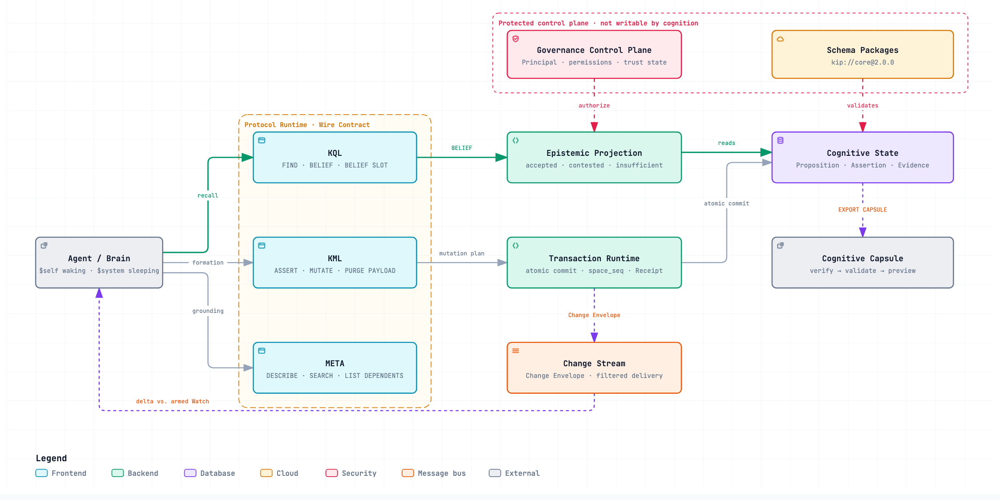

# KIP 2.0 — Cognitive State Protocol for Agent Memory

**[English](./README.md) | [中文](./README_CN.md)**

## Status

**Default development version: KIP 2.0 — normative draft.** The repository root
contains the current protocol and tooling. KIP [v1.0-RC11](./v1/README.md) is frozen
for historical reference and migration; changing the default does not upgrade
existing deployments or declare the 2.0 protocol stable.

The consistency revision adds final-belief guarantees, immutable procedural
records and a separately versioned memory package (2.2.0), with executable contract
checks and bounded models. The [Rust](https://github.com/ldclabs/anda-db/tree/main/rs/anda_cognitive_nexus)
and [Cloudflare Durable Object](https://github.com/ldclabs/anda-db/tree/main/ts/kip-do)
engines target KIP 2.0 drafts; their coverage of this revision must be established
by fresh adapter results, not inferred from earlier conformance. The protocol
remains `2.0-draft`, independently of published tooling versions; no real Brain
learning result is claimed by these structural tests.

The normative [Cognitive Consistency contract](./KIP-2.0-Cognitive-Consistency.md) binds final belief, immutable Skill revisions, independent attempts, replayable trials/evaluations, dependency validity, identity repair and durable workers. Lifecycle counters aggregate attempts; unlinked family outcomes are never automatically controls. Stored summaries are used only with a validated computation basis.

The 2026-09-23 reliability revision uses memory package **2.2.0** and revisioned
Schema identities. It adds selection dependencies, recording repair, causal
formation, prospective enrollment, explicit dispatch guarantees and recall plans.
The existing 2.1.0 package and schema pins remain unchanged.
[Resolution and validation](KIP-2.0-Reliability-Resolution.md) distinguishes protocol
work, the inspected Anda Brain implementation and unexecuted deployment/learning gates.

## Start here

- **Agent integration:** [Memory Interface](./KIP-2.0-Memory-Interface.md) and the [Agent memory card](./brain/MemoryInterface.md).
- **Protocol implementation:** [Specification](./SPECIFICATION.md), [syntax reference](./KIPSyntax.md), and [conformance checks](./conformance/README.md).
- **Developer tools:** [TypeScript language toolkit](./packages/kip-lang/README.md) and [VS Code extension](./packages/vscode-kip/README.md), both targeting KIP 2.0.
- **Existing v1 users:** [frozen archive](./v1/README.md), [deployment migration](./migration/KIP-2.0-Migration-from-1.x.md), and [repository path changes](./migration/Repository-Layout.md).

The archived MCP server and Skill implement v1 interfaces; native v2 integration
starts with the current Interface and wire contracts above.

<p align="center">
  <picture>
    <source media="(prefers-color-scheme: dark)" srcset="./diagrams/kip-2.0-information-architecture-dark.png">
    
  </picture>
</p>

<p align="center"><sub>An <a href="./diagrams/kip-2.0-information-architecture.html">interactive version</a> — pan, zoom, relationship tracing, five guided views — is a self-contained file: download it and open it in a browser.</sub></p>

## The one idea

A memory that cannot separate *what was said* from *what is true* will eventually lie to its owner with total confidence. KIP 2.0 refuses to collapse three questions:

```text
Meaning      what can be represented at all
Belief       what the Brain currently accepts
Authority    who may read, write, project, or elevate
```

So a stored **Proposition** is truth-neutral. An **Assertion** carries one actor's stance toward it, with mode, confidence, validity and evidence. Belief is not a stored field but an **Epistemic Projection** computed at read time over the eligible assertions:

```text
Proposition exists  ≠  Proposition is true  ≠  Brain accepts Proposition
```

A correction creates a new Assertion while preserving the old record. A change in the world keeps complementary valid-time intervals: a formerly true claim is closed, not declared wrong. The next projection evaluates the current slot and dependencies, and historical queries retain what was valid before (Specification §14.2).

Evidence, provenance and schema get the same treatment: [Evidence](./SPECIFICATION.md#15-evidence) and [Activity](./SPECIFICATION.md#16-activity) are first-class elements rather than metadata bags, and schema lives in versioned, digest-pinned [packages](./SPECIFICATION.md#20-schema-packages).

## The proactivity layer

A memory that only answers when asked is half a memory. The other half is what the Brain does when nobody is talking to it — and it must not be a cron job. KIP 2.0 gives that half four mechanisms, none of which decides policy on the Brain's behalf:

| Mechanism | What it is |
| --- | --- |
| [`Watch`](./profiles/CognitiveMemoryProfile-2.0.md#511-watch) | Durable attention state. A declared condition under which a change — **or the absence of one** — deserves attention. Armed watches are evaluated against committed [Change Envelopes](./SPECIFICATION.md#36-change-stream); a *silence* watch fires when its `due_at` passes with no match. Proactivity becomes a state differential — delta watches fire on committed change, silence watches on a due-time sweep — rather than a blind schedule. **A fired Watch grants nothing**: it creates attention, never an action. |
| [`action_gate`](./profiles/CognitiveMemoryProfile-2.0.md#9-activities) | An Activity class recording what the gate decided — `act`, `ask`, `defer`, or `silence` — with the inputs it weighed. Restraint is the hardest thing to justify after the fact, so deliberate silence is written down like any other outcome. |
| [`LIST DEPENDENTS`](./SPECIFICATION.md#635-list-dependents) | Bounded reverse traversal of provenance. Revise a root and the cognition compiled from it — insights, preference summaries, skills, the self-model — becomes discoverable in one operation instead of quietly stale. [§57.5](./SPECIFICATION.md#575-revision-and-derived-cognition) makes the rule explicit: a revised root **must not** auto-retract its dependents, and **must** leave them reviewable. Whether one survives is a review decision, not a protocol rule. |
| [`PURGE PAYLOAD`](./SPECIFICATION.md#606-payload-purge) | Destroy an Evidence element's observed bytes while keeping the record: its digest, class, observation time, source, and the citations that depend on it. Data minimization that costs no provenance — [corroboration and independence counting](./SPECIFICATION.md#23-epistemic-independence) keep working on the surviving digest. Distinct from element [purge](./SPECIFICATION.md#603-purge), which destroys the record itself. |

Supporting state lives in the [Cognitive Memory Profile](./profiles/CognitiveMemoryProfile-2.0.md): [`WorkingState`](./profiles/CognitiveMemoryProfile-2.0.md#512-workingstate) is the consolidated resume digest stamped with its `basis_seq`, so a Brain wakes from compiled state plus a delta rather than re-reading scrollback; [`DerivationState`](./profiles/CognitiveMemoryProfile-2.0.md#6-standard-facets) carries the `current | stale | under_review` flag that a dependent review writes back; and `MnemonicState.utility` holds the admission bet — how useful this memory is expected to be — kept deliberately separate from `salience`, from `memory_strength`, and from epistemic `confidence`.

## The consequence channel

Everything above makes the system watch the world better. The consequence channel is how the world watches back.

[Outcome Evidence](./SPECIFICATION.md#157-outcome-evidence) records what actually happened after a decision, action, or trialed procedure — written by instrumentation (telemetry, verifiers, test harnesses, human review), **never by the actor whose action it grades**. An actor's own account is `agent_statement`, citable as context only; the separation is a conformance invariant, enforced as auditability — engine origin always records who wrote what, and Governance can restrict who may write outcomes — because an open protocol can make self-grading visible even where it cannot make it impossible.

Each outcome carries a **task family** that selects candidate consequences. Sharing the family establishes neither attribution nor baseline membership: TrialRecord explicitly freezes comparable baseline attempts and outcomes. Treatment observations link through the instrument's `outcome_observation` Activity to an attempt and the [`action_gate`](./profiles/CognitiveMemoryProfile-2.0.md#9-activities) decision that applied the exact Skill revision. Its [`DecisionRecord`](./profiles/CognitiveMemoryProfile-2.0.md#66-decisionrecord) distinguishes retrieval from actual use, and grading counts independent attempts assigned before execution. A [SkillRevision](./profiles/CognitiveMemoryProfile-2.0.md#58-skill) must name its task family before trial; a pattern that nothing could prove wrong is not procedural memory. On the channel sits the [Skill lifecycle](./profiles/CognitiveMemoryProfile-2.0.md#14-skill-lifecycle):

```text
proposed → trialed → adopted → revoked
```

Lifecycle changes and grading refreshes commit with a validated immutable EvaluationRecord on a [`lifecycle_verdict`](./profiles/CognitiveMemoryProfile-2.0.md#9-activities) Activity and [guarded updates](./SPECIFICATION.md#f6-outcome-grading-and-a-lifecycle-verdict). Auditors replay exact inputs against the immutable TrialRecord; [`TrialState`](./profiles/CognitiveMemoryProfile-2.0.md#65-trialstate) only selects the current trial. Only `trialed → adopted` promotes through a comparative verdict, and revocation is never harder than adoption. Same-state monitoring may retain standing under authorized policy without claiming new improvement; policy withdrawal may have zero outcomes. Imported Skills enter `proposed` without local grades and remain recallable as unproven candidates. Revoked Skills must enter a new trial before adoption can recur.

## Protocol provides signals; the Brain owns policy

KIP does not define an admission threshold, an interruption policy, a salience algorithm, a consolidation schedule, or a skill compiler. It defines where those decisions put their inputs and their receipts. A protocol that hardcoded one utility function would stop being a protocol — and every deployment would fork it.

The policy layer is a separate, replaceable component:

- **[Brain 2.0](./brain/README.md)** — the reference design: **Formation** (what deserves to outlive this turn), **Recall** (what from the past should change what I do next), and **Maintenance** (the sleep-time metabolism that consolidates, compiles skills, reviews contradictions, and metabolizes memory strength).
- **[`$self` / `$system`](./SelfInstructions.md)** — the single-agent variant, a thin delta layered on the Brain policies above: a waking mind that experiences, and a sleeping mind that integrates.
- **[Experience Learning Architecture](./brain/ExperienceLearningArchitecture.md)** — the loop the Brain implements, and how to evaluate whether it actually learned anything rather than merely stored more.

The seam matters in both directions. Because policy is out of the protocol, two Brains with different admission utilities can share one Cognitive Nexus; and because the signals are in the protocol, either Brain's decisions remain auditable by the other.

## Memory should be portable

If memory is what makes an agent valuable, the natural move is to make it impossible to leave with. KIP takes the opposite position: cognition exports as a signed, inspectable [Cognitive Capsule](./SPECIFICATION.md#37-cognitive-capsule), and import is a destination-governed transaction — a capsule's signature proves origin and integrity, never truth, trust, or authority. Imported skills stay non-executable until the destination elevates them; a source's `$self` never becomes the destination's.

## Documents

| Document | Description |
| --- | --- |
| [Memory Interface](./KIP-2.0-Memory-Interface.md) | Five Agent intents, processing receipts, scoped recall and composable capability bundles |
| [Agent memory card](./brain/MemoryInterface.md) | The small everyday Interface; direct KIP role cards live alongside it |
| [Cognitive consistency](./KIP-2.0-Cognitive-Consistency.md) | Final belief, revisions, independent attempts, replay, dependencies and durable runtime contracts |
| [Review resolution](./KIP-2.0-Review-Resolution.md) | All 12 review items, implementation locations and verification scope |
| [Brain evaluation](./brain/BrainEvaluation.md) | Separate protocol, reliability and behavioral-learning release gates |
| [📖 Specification 2.0](./SPECIFICATION.md) | The normative draft ([中文](./SPECIFICATION_CN.md)) |
| [📦 Capsule Specification 2.0](./KIP-2.0-Capsule-Specification.md) | Specification §37–§41 and §95: the portable, verifiable memory artifact ([中文](./KIP-2.0-Capsule-Specification_CN.md)) |
| [🧭 Optional Profiles & Migration](./KIP-2.0-Optional-Profiles-and-Migration.md) | Specification §100, §101, §103 and Appendix I: Historical, High-Assurance, and KIP 1.x migration ([中文](./KIP-2.0-Optional-Profiles-and-Migration_CN.md)) |
| [📜 Invariant Registry](./KIP-2.0-Invariants.md) | The 43 Core and 46 Profile invariants in one list, each with the section that establishes it and the vectors that pin it ([中文](./KIP-2.0-Invariants_CN.md)) |
| [🏛 Architecture 2.0](./KIP-2.0-Architecture.md) | Design rationale behind the Specification ([中文](./KIP-2.0-Architecture_CN.md)) |
| [📐 Syntax Reference 2.0](./KIPSyntax.md) | LLM-facing KQL / KML / META card ([中文](./KIPSyntax_CN.md)) |
| [🧩 Cognitive Memory Profile 2.0](./profiles/CognitiveMemoryProfile-2.0.md) | Experience, Skill, Commitment, Watch, WorkingState, and the rest ([中文](./profiles/CognitiveMemoryProfile-2.0_CN.md)) |
| [🧠 Brain 2.0](./brain/README.md) | Formation / Recall / Maintenance ([中文](./brain/README_CN.md)) |
| [🤖 `$self` / ⚙️ `$system`](./SelfInstructions.md) | Single-agent prompt pair, a delta over Brain 2.0 ([`$system`](./SystemInstructions.md)) |
| [🗂 Design Notes](./design/) | Ten pre-consolidation rationale documents, frozen 2026-09-02 |
| [🔤 Grammars & Schemas](./grammar/) | Normative EBNF, plus the [wire schemas](./schemas/) |
| [🧪 Conformance Suite](./conformance/KIP-2.0-Conformance-Tests.md) | 356 state/consistency vectors plus 12 optional Memory Interface scenarios and executable contract models |
| [🔬 Formal Verification](./formal/README.md) | Alloy and TLA+ models, and what they proved |
| [🔀 Migration from 1.x](./migration/KIP-2.0-Migration-from-1.x.md) | What changes, and what legacy meaning must not be invented |

Existing Chinese mirrors are retained. This consistency revision updates English normative sources only; mirrors are not an alternative semantic contract.

Project terminology lives in [CONTEXT.md](./CONTEXT.md); essays remain in [post/](./post/).

## Governing principle

> **KIP 2.0 is a protocol for durable cognition: new information may change what a Brain does next without requiring the Brain to falsify what happened before.**

## License

Copyright © 2026 [LDC Labs](https://github.com/ldclabs). Licensed under the [MIT License](./LICENSE).
