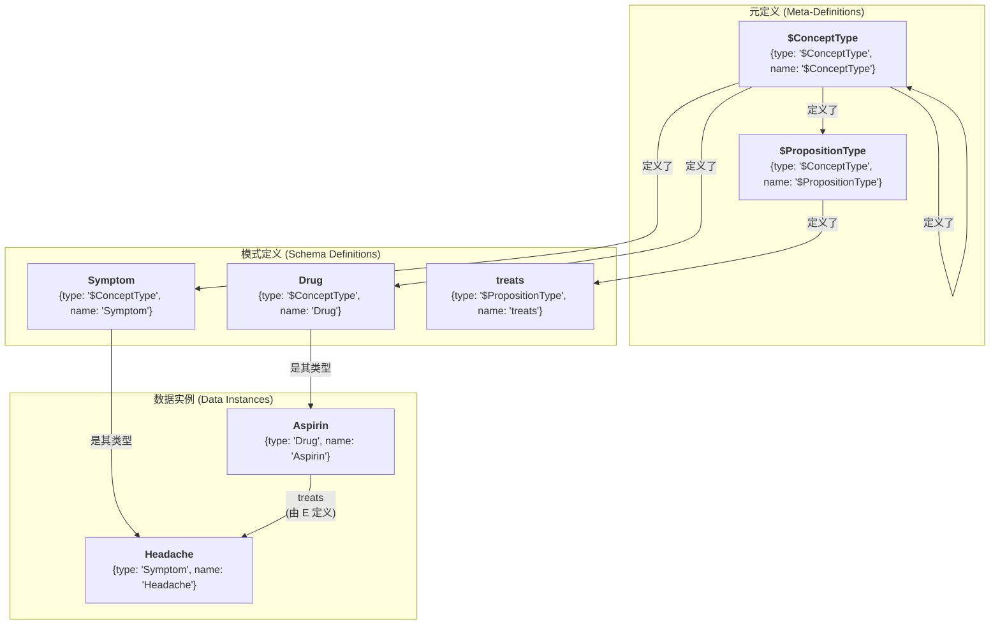
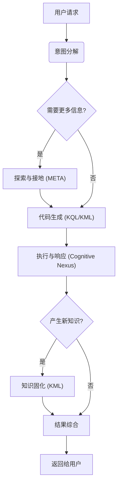

# 🧬 KIP（Knowledge Interaction Protocol）规范（草案）

**[English](./README.md) | [中文](./README_CN.md)**

**版本历史**：
| 版本        | 日期       | 变更说明                                                                                                                       |
| ----------- | ---------- | ------------------------------------------------------------------------------------------------------------------------------ |
| v1.0-draft1 | 2025-06-09 | 初始草案                                                                                                                       |
| v1.0-draft2 | 2025-06-15 | 优化 `UNION` 子句                                                                                                              |
| v1.0-draft3 | 2025-06-18 | 优化术语，简化语法，移除 `SELECT` 子查询，添加 `META` 子句，增强命题链接子句                                                   |
| v1.0-draft4 | 2025-06-19 | 简化语法，移除 `COLLECT`，`AS`，`@`                                                                                            |
| v1.0-draft5 | 2025-06-25 | 移除 `ATTR` 和 `META`，引入“点表示法”取代；添加 `(id: "<link_id>")`；优化 `DELETE` 语句                                        |
| v1.0-draft6 | 2025-07-06 | 确立命名规范；引入自举模型：新增 "$ConceptType", "$PropositionType" 元类型和 Domain 类型，实现模式的图内定义；添加创世知识胶囊 |
| v1.0-draft7 | 2025-07-08 | 使用 `CURSOR` 取代 `OFFSET` 用于分页查询；添加 Person 类型的知识胶囊                                                           |

**KIP 实现**：
- [Anda KIP SDK](https://github.com/ldclabs/anda-db/tree/main/rs/anda_kip): A Rust SDK of KIP for building sustainable AI knowledge memory systems.
- [Anda Cognitive Nexus](https://github.com/ldclabs/anda-db/tree/main/rs/anda_cognitive_nexus): A Rust implementation of KIP (Knowledge Interaction Protocol) base on Anda DB.

**关于我们**：
- [ICPanda DAO](https://panda.fans/): ICPanda is a technical panda fully running on the [Internet Computer](https://internetcomputer.org/) blockchain, building chain-native infrastructures, Anda.AI and dMsg.net.
- [Anda.AI](https://anda.ai/): Create next-generation AI agents with persistent memory, decentralized trust, and swarm intelligence.
- GitHub: [LDC Labs](https://github.com/ldclabs)
- Follow Us on X: [ICPanda DAO](https://x.com/ICPandaDAO)

## 0. 前言

我们正处在一个由大型语言模型（*LLM*）驱动的认知革命的黎明。LLM 以其强大的自然语言理解、生成和推理能力，展现了通用人工智能（*AGI*）的曙光。然而，当前的 LLM 如同一个**才华横溢却健忘的天才**：它拥有惊人的即时推理能力，却缺乏稳定、可累积、可追溯的长期记忆。它能进行精彩的对话，但对话结束后，知识便随风消散；它可能产生令人信服的“幻觉”，却无法对其知识来源进行核查与验证。

这种“神经核心”与持久化、结构化知识之间的鸿沟，是阻碍 AI Agent 从“聪明的工具”迈向“真正的智能伙伴”的核心障碍。如何为这个强大的“神经核心”构建一个同样强大的、可信赖的、能够伴随其共同进化的“符号核心”？这正是我们必须回答的时代之问。

**KIP（Knowledge Interaction Protocol）正是为回答这一时代之问而生。**

它不仅是一套技术规范，更是一种设计哲学，一种全新的 AI 架构范式。KIP 的核心使命是构建一座坚实、高效的桥梁，连接 LLM 瞬时、流动的“工作记忆”与知识图谱持久、稳固的“长期记忆”。
KIP 将 AI 与知识库的交互范式，**从单向的“工具调用”，升维为双向的“认知共生”**：
- **神经核心**（LLM）提供实时推理能力
- **符号核心**（知识图谱）提供结构化记忆
- **KIP** 实现两者的协同进化

在本规范中，我们致力于实现三大核心目标：

1.  **赋予 AI 持久记忆（Persistent Memory）**：通过 KIP，AI Agent 能够将对话、观察和推理中获得的新知识，以结构化的“知识胶囊”形式，原子性地、可靠地固化到其知识图谱中。记忆不再是易失的，而是可沉淀、可复利的资产。

2.  **实现 AI 自我进化（Self-Evolution）**：学习与遗忘是智能的标志。KIP 提供了完整的知识操作语言（KML），使 Agent 能够根据新的证据，自主地更新、修正甚至删除过时的知识。这为构建能够持续学习、自我完善、适应环境变化的 AI 奠定了基础。

3.  **构建 AI 可信基石（Foundation of Trust）**：信任源于透明。KIP 的每一次交互都是一次明确的、可审计的“思维链”。当 AI 给出答案时，它不仅能说出“是什么”，更能通过其生成的 KIP 代码，清晰地展示“我是如何知道的”。这为构建负责任的、可解释的 AI 系统提供了不可或缺的底层支持。

本规范致力于为所有开发者、架构师和研究者，提供一套构建下一代智能体的开放、通用且强大的标准。我们相信，智能的未来，并非源于一个孤立的、无所不知的“黑箱”，而是源于一个懂得如何学习、如何与可信知识高效协作的开放系统。

欢迎您与我们一道，共同探索并完善 KIP，开启 AI 自我进化与可持续学习的新纪元。

## 1. 简介与设计哲学

**KIP（Knowledge Interaction Protocol）** 是一种专为大型语言模型 (LLM) 设计的知识交互协议。它通过一套标准化的指令集 (KQL/KML) 和数据结构，定义了神经核心 (LLM) 与符号核心 (知识图谱) 之间进行高效、可靠、双向知识交换的完整模式，旨在为 AI Agent 构建可持续学习、自我进化的长期记忆系统。

**设计原则：**

*   **模型友好（LLM-Friendly）**：语法结构清晰，对 LLM 的代码生成任务友好。
*   **声明式（Declarative）**：交互的发起者只需描述“意图”，无需关心“实现”。
*   **图原生（Graph-Native）**：为知识图谱的结构和查询模式进行了深度优化。
*   **可解释性（Explainable）**：KIP 代码本身就是 LLM 推理过程的透明记录，是可审计、可验证的“思维链”。
*   **全面性（Comprehensive）**：提供从数据查询到知识演化的完整生命周期管理能力，是 Agent 实现真正学习的基础。

## 2. 核心定义

### 2.1. 认知中枢（Cognitive Nexus）

一个由**概念节点**和**命题链接**构成的知识图谱，是 AI Agent 的长期记忆系统。

### 2.2. 概念节点（Concept Node）

*   **定义**：知识图谱中的**实体**或**抽象概念**，是知识的基本单元（如图中的“点”）。
*   **示例**：一个名为“阿司匹林”的`Drug`节点，一个名为“头痛”的`Symptom`节点。
*   **构成**：
    *   `id`：String，唯一标识符，用于在图中唯一定位该节点。
    *   `type`：String，节点的类型。**其值必须是一个在图中已定义的、类型为 `"$ConceptType"` 的概念节点的名称**。遵循 `UpperCamelCase` 命名法。
    *   `name`：String，节点的名称。`type` + `name` 组合在图中也唯一定位一个节点。
    *   `attributes`：Object，节点的属性，描述该概念的内在特性。
    *   `metadata`：Object，节点的元数据，描述该概念的来源、可信度等信息。

### 2.3. 命题链接（Proposition Link）

*   **定义**：一个**实体化的命题（Proposition）**，它以 `(主语, 谓词, 宾语)` 的三元组形式，陈述了一个**事实（Fact）**。它在图中作为**链接（Link）**，将两个概念节点连接起来，或实现更高阶的连接。
*   **示例**：一个陈述“（阿司匹林）- [用于治疗] ->（头痛）”这一事实的命题链接。
*   **构成**：
    *   `id`：String，唯一标识符，用于在图中唯一定位该链接。
    *   `subject`：String，关系的发起者，一个概念节点或另一个命题链接的 ID。
    *   `predicate`：String，定义了主语和宾语之间的**关系（Relation）**类型。**其值必须是一个在图中已定义的、类型为 `"$PropositionType"` 的概念节点的名称**。遵循 `snake_case` 命名法。
    *   `object`：String，关系的接受者，一个概念节点或另一个命题链接的 ID。
    *   `attributes`：Object，命题的属性，描述该命题的内在特性。
    *   `metadata`：Object，命题的元数据，描述该命题的来源、可信度等信息。

### 2.4. 知识胶囊（Knowledge Capsule）

一种原子性的知识更新单元，是包含了一组**概念节点**和**命题链接**的知识合集，用于解决高质量知识的封装、分发和复用问题。

### 2.5. 认知引信（Cognitive Primer）

一个高度结构化、信息密度极高、专门为 LLM 设计的 JSON 对象，它包含了认知中枢的全局摘要和领域地图，帮助 LLM 快速理解和使用认知中枢。

### 2.6. 属性（Attributes）与元数据（Metadata）

*   **属性（Attributes）**：描述**概念**或**事实**内在特性的键值对，是构成知识记忆的一部分。
*   **元数据（Metadata）**：描述**知识来源、可信度和上下文**的键值对。它不改变知识本身的内容，而是描述关于这条知识的“知识”。（元数据字段设计见附录 1）

### 2.7. 值类型（Value Types）

KIP 采用 **JSON** 的数据模型，即 KIP 所有子句中使用的值，其类型和字面量表示方法遵循 JSON 标准。这确保了数据交换的无歧义性，并使得 LLM 极易生成和解析。

*   **基本类型**：`string`, `number`, `boolean`, `null`。
*   **复杂类型**：`Array`, `Object`。
*   **使用限制**: 虽然 `Array` 和 `Object` 可作为属性或元数据的值存储，但 KQL 的 `FILTER` 子句**主要针对基本类型进行操作**。

### 2.8. 标志符与命名规范（Identifiers & Naming Conventions）

标志符是 KIP 中用于为变量、类型、谓词、属性和元数据键命名的基础。为了保证协议的清晰性、可读性和一致性，KIP 对标志符的语法和命名风格进行了统一规定。

#### 2.8.1. 标志符语法（Identifier Syntax）

一个合法的 KIP 标志符**必须**以字母（`a-z`, `A-Z`）或下划线（`_`）开头，其后可以跟随任意数量的字母、数字（`0-9`）或下划线。
此规则适用于所有类型的命名，但元类型以 `$` 前缀作为特殊标记，变量则以 `?` 前缀作为语法标记。

#### 2.8.2. 命名约定（Naming Conventions）

在遵循基本语法规则之上，为了增强可读性和代码的自解释性，KIP **强烈推荐**遵循以下命名约定：

*   **概念节点类型（Concept Node Types）**：使用**大驼峰命名法（UpperCamelCase）**。
    *   **示例**: `Drug`, `Symptom`, `MedicalDevice`, `ClinicalTrial`。
    *   **元类型**: `$ConceptType`, `$PropositionType`, 以 `$` 开头的为系统保留元类型。

*   **命题链接谓词（Proposition Link Predicates）**：使用**蛇形命名法（snake_case）**。
    *   **示例**: `treats`, `has_side_effect`, `is_subclass_of`, `belongs_to_domain`。

*   **属性与元数据键（Attribute & Metadata Keys）**：使用**蛇形命名法（snake_case）**。
    *   **示例**: `molecular_formula`, `risk_level`, `last_updated_at`。

*   **变量（Variables）**：**必须**以 `?` 作为前缀，其后部分推荐使用小写蛇形命名法（`snake_case`）。
    *   **示例**: `?drug`, `?side_effect`, `?clinical_trial`。

### 2.9. 知识自举与元定义（Knowledge Bootstrapping & Meta-Definition）

KIP 的核心设计之一是**知识图谱的自我描述能力**。认知中枢的模式（Schema）——即所有合法的概念类型和命题类型——本身就是图中的一部分，由概念节点来定义。这使得整个知识体系可以自举（Bootstrap），无需外部定义即可被理解和扩展。

#### 2.9.1. 元类型（Meta-Types）

系统仅预定义两个特殊的、以 `$` 开头的元类型：

*   **`"$ConceptType"`**：用于定义**概念节点类型**的类型。一个节点的 `type` 是 `"$ConceptType"`，意味着这个节点本身定义了一个“类型”。
    *   **示例**：`{type: "$ConceptType", name: "Drug"}` 这个节点，它定义了 `Drug` 作为一个合法的概念类型。之后，我们才能创建 `{type: "Drug", name: "Aspirin"}` 这样的节点。

*   **`"$PropositionType"`**：用于定义**命题链接谓词**的类型。一个节点的 `type` 是 `"$PropositionType"`，意味着这个节点本身定义了一个“关系”或“谓词”。
    *   **示例**：`{type: "$PropositionType", name: "treats"}` 这个节点，它定义了 `treats` 作为一个合法的谓词。之后，我们才能创建 `(?aspirin, "treats", ?headache)` 这样的命题。

#### 2.9.2. 创世之源 (The Genesis)

这两个元类型本身也由概念节点定义，形成一个自洽的闭环：

*   `"$ConceptType"` 的定义节点是：`{type: "$ConceptType", name: "$ConceptType"}`
*   `"$PropositionType"` 的定义节点是：`{type: "$ConceptType", name: "$PropositionType"}`

这意味着 `"$ConceptType"` 是一种 `"$ConceptType"`，这构成了整个类型系统的逻辑基石。



#### 2.9.3. 认知领域 (Domain)

为了对知识进行有效的组织和隔离，KIP 引入了 `Domain` 的概念：

*   **`Domain`**：它本身是一个概念类型，通过 `{type: "$ConceptType", name: "Domain"}` 定义。
*   **领域节点**：例如，`{type: "Domain", name: "Medical"}` 创建了一个名为“医疗”的认知领域。
*   **归属关系**：概念节点在创建之初可以不归属于任何领域，保持系统的灵活性和真实性。在后续的推理中，应该通过 `belongs_to_domain` 命题链接，将其归属到对应的领域下，这确保了知识能被 LLM 高效利用。

## 3. KIP-KQL 指令集：知识查询语言

KQL 是 KIP 中负责知识检索和推理的部分。

### 3.1. 查询结构

```prolog
FIND( ... )
WHERE {
  ...
}
ORDER BY ...
LIMIT N
CURSOR "<token>"
```

### 3.2. 点表示法（Dot Notation）

**点表示法是 KIP 中访问概念节点和命题链接内部数据的首选方式**。它提供了一种统一、直观且强大的机制，用于在 `FIND`, `FILTER`, 和 `ORDER BY` 等子句中直接使用数据。

一个绑定到变量 `?var` 上的节点或链接，其内部数据可以通过以下路径访问：

*   **访问顶级字段**:
    *   `?var.id`, `?var.type`, `?var.name`：用于概念节点。
    *   `?var.id`, `?var.subject`, `?var.predicate`, `?var.object`：用于命题链接。
*   **访问属性 (Attributes)**:
    *   `?var.attributes.<attribute_name>`
*   **访问元数据 (Metadata)**:
    *   `?var.metadata.<metadata_key>`

**示例**:
```prolog
// 查找药物名称及其风险等级
FIND(?drug.name, ?drug.attributes.risk_level)

// 筛选置信度高于 0.9 的命题
FILTER(?link.metadata.confidence > 0.9)
```

### 3.3. `FIND` 子句

**功能**：声明查询的最终输出。

**语法**：`FIND( ... )`

*   **多变量返回**：可以指定一个或多个变量，如 `FIND(?drug, ?symptom)`。
*   **聚合返回**：可以使用聚合函数对变量进行计算，如 `FIND(?var1, ?agg_func(?var2))`。
    *  **聚合函数**：`COUNT(?var)`，`COUNT(DISTINCT ?var)`，`SUM(?var)`，`AVG(?var)`，`MIN(?var)`，`MAX(?var)`。

### 3.4. `WHERE` 子句

**功能**：包含一系列图模式匹配和过滤子句，所有子句之间默认为逻辑 **AND** 关系。

#### 3.4.1. 概念节点子句

**功能**：匹配概念节点并绑定到变量。使用 `{...}` 语法。

**语法**：
*   `?node_var {id: "<id>"}`：通过唯一 ID 匹配唯一概念节点。
*   `?node_var {type: "<Type>", name: "<name>"}`：通过类型和名称匹配唯一概念节点。
*   `?nodes_var {type: "<Type>"}`，`?nodes_var {name: "<name>"}`：通过类型或者名称匹配一批概念节点。

`?node_var` 将匹配到的概念节点绑定到变量上，便于后续操作。但当概念节点子句直接用于命题链接子句的主语或宾语时，不应该定义变量名。

**示例**：

```prolog
// 匹配所有药物类型的节点
?drug {type: "Drug"}

// 匹配名为 "Aspirin" 的药物
?aspirin {type: "Drug", name: "Aspirin"}

// 匹配指定 ID 的节点
?headache {id: "C:123"}
```

#### 3.4.2. 命题链接子句

**功能**：匹配命题链接并绑定到变量。使用 `(...)` 语法。

**语法**：
*   `?link_var (id: "<link_id>")`：通过唯一 ID 匹配唯一命题链接。
*   `?link_var (?subject, "<predicate>", ?object)`：通过结构模式匹配一批命题链接。其中主语或者宾语可以是概念节点或另一个命题链接的变量，或没有变量名的子句。
*   谓词部分支持路径操作符：
    *   `predicate{m,n}`：匹配 m 到 n 跳，如 `"follows"{1,5}`，`"follows"{1,}`，`"follows"{5}`。
    *   `predicate1 | predicate2`：匹配 `predicate1` 或 `predicate2`，如 `"follows" | "connects" | "links"`。

`?link_var` 是可选的，将匹配到的命题链接绑定到变量上，便于后续操作。

**示例**：

```prolog
// 找到所有能治疗头痛的药物
(?drug, "treats", ?headache)

// 将一个已知ID的命题绑定到变量
?specific_fact (id: "P:12345:treats")

// 高阶命题: 宾语是另一个命题
(?user, "stated", (?drug, "treats", ?symptom))
```

```prolog
// 查找一个概念的 5 层以内的父概念
(?concept, "is_subclass_of{0,5}", ?parent_concept)
```

#### 3.4.3. 过滤器子句（`FILTER`）

**功能**：对已绑定的变量应用更复杂的过滤条件。**强烈推荐使用点表示法**。

**语法**：`FILTER(boolean_expression)`

**函数与运算符**:
*   **比较**: `==`, `!=`, `<`, `>`, `<=`, `>=`
*   **逻辑**: `&&` (AND), `||` (OR), `!` (NOT)
*   **字符串**：`CONTAINS(?str, "sub")`, `STARTS_WITH(?str, "prefix")`, `ENDS_WITH(?str, "suffix")`, `REGEX(?str, "pattern")`

**示例**：
```prolog
// 筛选出风险等级小于 3，且名称包含 "acid" 的药物
FILTER(?drug.attributes.risk_level < 3 && CONTAINS(?drug.name, "acid"))
```

#### 3.4.4. 否定子句（`NOT`）

**功能**：排除满足特定模式的解。

**语法**：`NOT { ... }`

**示例**：

```prolog
// 排除所有属于 NSAID 类的药物
NOT {
  ?nsaid_class {name: "NSAID"}
  (?drug, "is_class_of", ?nsaid_class)
}
```

更简单的写法：
```prolog
// 排除所有属于 NSAID 类的药物
NOT {
  (?drug, "is_class_of", {name: "NSAID"})
}
```

#### 3.4.5. 可选子句（`OPTIONAL`）

**功能**：尝试匹配可选模式，类似 SQL 的 `LEFT JOIN`。

**语法**：`OPTIONAL { ... }`

**示例**：

```prolog
// 查找所有药物，并（如果存在的话）一并找出它们的副作用
?drug {type: "Drug"}

OPTIONAL {
  (?drug, "has_side_effect", ?side_effect)
}
```

#### 3.4.6. 合并子句（`UNION`）

**功能**：合并多个模式的结果，实现逻辑 **OR**。

**语法**：`UNION { ... }`

**示例**：

```prolog
// 找到能治疗“头痛”和“发烧”的药物

(?drug, "treats", {name: "Headache"})

UNION {
  (?drug, "treats", {name: "Fever"})
}
```

### 3.5. 结果修饰子句（Solution Modifiers）

这些子句在 `WHERE` 逻辑执行完毕后，对产生的结果集进行后处理。

*   **`ORDER BY ?var [ASC|DESC]`**：根据指定变量对结果进行排序，默认为 `ASC`（升序）。
*   **`LIMIT N`**：限制返回数量。
*   **`CURSOR "<token>"`**：指定一个 token 作为游标位置，用于分页查询。

### 3.6. 综合查询示例

**示例 1**：找到所有能治疗‘头痛’的非 NSAID 类药物，要求其风险等级低于4，并按风险等级从低到高排序，返回药物名称和风险等级。

```prolog
FIND(
  ?drug.name,
  ?drug.attributes.risk_level
)
WHERE {
  ?drug {type: "Drug"}
  ?headache {name: "Headache"}

  (?drug, "treats", ?headache)

  NOT {
    (?drug, "is_class_of", {name: "NSAID"})
  }

  FILTER(?drug.attributes.risk_level < 4)
}
ORDER BY ?drug.attributes.risk_level ASC
LIMIT 20
```

**示例 2**：列出所有 NSAID 类的药物，并（如果存在的话）显示它们各自的已知副作用及其来源。

```prolog
FIND(
  ?drug.name,
  ?side_effect.name,
  ?link.metadata.source
)
WHERE {
  (?drug, "is_class_of", {name: "NSAID"})

  OPTIONAL {
    ?link (?drug, "has_side_effect", ?side_effect)
  }
}
```

**示例 3（高阶命题解构）**：找到由用户‘张三’陈述的、关于‘阿司匹林治疗头痛’这一事实，并返回该陈述的可信度。

```prolog
FIND(?statement.metadata.confidence)
WHERE {
  // 匹配事实：(事实)-[treats]->(药物)
  ?fact (
    {type: "Drug", name: "Aspirin"},
    "treats",
    {type: "Symptom", name: "Headache"}
  )

  // 匹配高阶命题：(张三)-[stated]->(事实)
  ?statement ({type: "User", name: "张三"}, "stated", ?fact)
}
```

## 4. KIP-KML 指令集：知识操作语言

KML 是 KIP 中负责知识演化的部分，是 Agent 实现学习的核心工具。

### 4.1. `UPSERT` 语句

**功能**：创建或更新知识，承载“知识胶囊”。操作需保证**幂等性 (Idempotent)**，即重复执行同一条指令，其结果与执行一次完全相同，不会产生重复数据或意外的副作用。

**语法**：

```prolog
UPSERT {
  CONCEPT ?local_handle {
    {type: "<Type>", name: "<name>"} // Or: {id: "<id>"}
    SET ATTRIBUTES { <key>: <value>, ... }
    SET PROPOSITIONS {
      ("<predicate>", { <existing_concept> })
      ("<predicate>", ( <existing_proposition> ))
      ("<predicate>", ?other_handle) WITH METADATA { <key>: <value>, ... }
      ...
    }
  }
  WITH METADATA { <key>: <value>, ... }

  PROPOSITION ?local_prop {
    (?subject, "<predicate>", ?object) // Or: (id: "<id>")
    SET ATTRIBUTES { <key>: <value>, ... }
  }
  WITH METADATA { <key>: <value>, ... }

  ...
}
WITH METADATA { <key>: <value>, ... }
```

**关键组件**：

*   **`UPSERT` 块**： 整个操作的容器，保证内部所有操作的幂等性。
*   **`CONCEPT` 块**：定义一个概念节点。
    *   `?local_handle`：以 `?` 开头的本地句柄（或称锚点），用于在事务内引用此新概念，它只在本次 `UPSERT` 块事务中有效。
    *   `{type: "<Type>", name: "<name>"}`：匹配或创建概念节点，`{id: "<id>"}` 只会匹配已有概念节点。
    *   `SET ATTRIBUTES { ... }`：设置或更新节点的属性。
    *   `SET PROPOSITIONS { ... }`：定义或更新该概念节点发起的命题链接。`SET PROPOSITIONS` 的行为是增量添加（additive），而非替换（replacing）。它会检查该概念节点的所有出度关系：1. 如果图中不存在完全相同的命题（主语、谓词、宾语都相同），则创建这个新命题；2. 如果图中已存在完全相同的命题，则仅更新或添加 `WITH METADATA` 中指定的元数据。如果一个命题本身需要携带复杂的内在属性，建议使用独立的 `PROPOSITION` 块来定义它，并通过本地句柄 `?handle` 进行引用。
        *   `("<predicate>", ?local_handle)`：链接到本次胶囊中定义的另一个概念或命题。
        *   `("<predicate>", {type: "<Type>", name: "<name>"})`，`("<predicate>", {id: "<id>"})`：链接到图中已存在的概念，不存在则忽略。
        *   `("<predicate>", (?subject, "<predicate>", ?object))`：链接到图中已存在的命题，不存在则忽略。
*   **`PROPOSITION` 块**：定义一个独立的命题链接，通常用于在胶囊内创建复杂的关系。
    *   `?local_prop`：本地句柄，用于引用此命题链接。
    *   `(<subject>, "<predicate>", <object>)`：会匹配或创建命题链接，`(id: "<id>")` 只会匹配已有命题链接。
    *   `SET ATTRIBUTES { ... }`：一个简单的键值对列表，用于设置或更新命题链接的属性。
*   **`WITH METADATA` 块**： 追加在 `CONCEPT`，`PROPOSITION` 或 `UPSERT` 块的元数据。`UPSERT` 块的元数据是所有在该块内定义的概念节点和命题链接的默认元数据。但每个 `CONCEPT` 或 `PROPOSITION` 块也可以单独定义自己的元数据。

**示例**：

假设我们有一个知识胶囊，用于定义一种新的、假设存在的益智药 "Cognizine"。这个胶囊包含：
*   药物本身的概念和属性。
*   它能治疗“脑雾（Brain Fog）”。
*   它属于“益智药（Nootropic）”类别（这是一个已存在的类别）。
*   它有一个新发现的副作用：“神经绽放（Neural Bloom）”（这也是一个新的概念）。

**知识胶囊 `cognizine_capsule.kip` 的内容：**

```prolog
// Knowledge Capsule: cognizin.v1.0
// Description: Defines the novel nootropic drug "Cognizine" and its effects.

UPSERT {
  // Define the main drug concept: Cognizine
  CONCEPT ?cognizine {
    { type: "Drug", name: "Cognizine" }
    SET ATTRIBUTES {
      molecular_formula: "C12H15N5O3",
      dosage_form: { "type": "tablet", "strength": "500mg" },
      risk_level: 2,
      description: "A novel nootropic drug designed to enhance cognitive functions."
    }
    SET PROPOSITIONS {
      // Link to an existing concept (Nootropic)
      ("is_class_of", { type: "DrugClass", name: "Nootropic" })

      // Link to an existing concept (Brain Fog)
      ("treats", { type: "Symptom", name: "Brain Fog" })

      // Link to another new concept defined within this capsule (?neural_bloom)
      ("has_side_effect", ?neural_bloom) WITH METADATA {
        // This specific proposition has its own metadata
        confidence: 0.75,
        source: "Preliminary Clinical Trial NCT012345"
      }
    }
  }

  // Define the new side effect concept: Neural Bloom
  CONCEPT ?neural_bloom {
    { type: "Symptom", name: "Neural Bloom" }
    SET ATTRIBUTES {
      description: "A rare side effect characterized by a temporary burst of creative thoughts."
    }
    // This concept has no outgoing propositions in this capsule
  }
}
WITH METADATA {
  // Global metadata for all facts in this capsule
  source: "KnowledgeCapsule:Nootropics_v1.0",
  author: "LDC Labs Research Team",
  confidence: 0.95,
  status: "reviewed"
}
```

### 4.2. `DELETE` 语句

**功能**：从认知中枢中有针对性地移除知识（属性、命题或整个概念）的统一接口。

#### 4.2.1. 删除属性（`DELETE ATTRIBUTES`）

**功能**：批量删除匹配的概念节点或命题链接的多个属性。

**语法**：`DELETE ATTRIBUTES { "attribute_name", ... } FROM ?target WHERE { ... }`

**示例**：

```prolog
// 从 "Aspirin" 节点中删除 "risk_category" 和 "old_id" 属性
DELETE ATTRIBUTES {"risk_category", "old_id"} FROM ?drug
WHERE {
  ?drug {type: "Drug", name: "Aspirin"}
}
```

```prolog
// 从所有药物节点中删除 "risk_category" 属性
DELETE ATTRIBUTES { "risk_category" } FROM ?drug
WHERE {
  ?drug { type: "Drug" }
}
```

```prolog
// 从所有命题链接中删除 "category" 属性
DELETE ATTRIBUTES { "category" } FROM ?links
WHERE {
  ?links (?s, ?p, ?o)
}
```

#### 4.2.2. 删除元数据字段（`DELETE METADATA`）

**功能**：批量删除匹配的概念节点或命题链接的多个元数据字段。

**语法**：`DELETE METADATA { "metadata_key", ... } FROM ?target WHERE { ... }`

**示例**：

```prolog
// 从 "Aspirin" 节点中删除元数据的 "old_source" 字段
DELETE METADATA {"old_source"} FROM ?drug
WHERE {
  ?drug {type: "Drug", name: "Aspirin"}
}
```

#### 4.2.3. 删除命题（`DELETE PROPOSITIONS`）

**功能**：批量删除匹配的命题链接。

**语法**：`DELETE PROPOSITIONS ?target_link WHERE { ... }`

**示例**：

```prolog
// 删除特定不可信来源的所有命题
DELETE PROPOSITIONS ?link
WHERE {
  ?link (?s, ?p, ?o)
  FILTER(?link.metadata.source == "untrusted_source_v1")
}
```

#### 4.2.4. 删除概念（`DELETE CONCEPT`）

**功能**：彻底删除一个概念节点及其所有相关联的命题链接。

**语法**：`DELETE CONCEPT ?target_node DETACH WHERE { ... }`

*   `DETACH` 关键字为必需，作为安全确认，表示意图是删除节点及其所有关系。

**示例**：

```prolog
// 删除 "OutdatedDrug" 这个概念及其所有关系
DELETE CONCEPT ?drug DETACH
WHERE {
  ?drug {type: "Drug", name: "OutdatedDrug"}
}
```

## 5. KIP-META 指令集：知识探索与接地

META 是 KIP 的一个轻量级子集，专注于“自省”（Introspection）和“消歧”（Disambiguation）。它们是快速、元数据驱动的命令，不涉及复杂的图遍历。

### 5.1. `DESCRIBE` 语句

**功能**：`DESCRIBE` 命令用于查询认知中枢的“模式”（Schema）信息，帮助 LLM 理解认知中枢中“有什么”。

**语法**：`DESCRIBE [TARGET] <options>`

#### 5.1.1. 点燃认知引擎（`DESCRIBE PRIMER`）

**功能**：获取“认知引信（Cognitive Primer）”，用于引导 LLM 如何高效地利用认知中枢。

认知引信包含 2 部分内容：
1.  **身份层（Identity）** - “我是谁？”
    这是最高度的概括，定义了 AI Agent 的核心身份、能力边界和基本原则。内容包括：

    *   Agent 的角色和目标（例如：“我是一个专业的医学知识助手，旨在提供准确、可追溯的医学信息”）。
    *   认知中枢的存在和作用（“我的记忆和知识存储在认知中枢中，我可以通过 KIP 调用查询它”）。
    *   核心能力摘要（“我能够进行疾病诊断、药品查询、解读检查报告...”）。
2.  **领域地图层（Domain Map）** - “我知道些什么？”
    这是“认知引信”的核心。它不是知识的罗列，而是认知中枢的**拓扑结构摘要**。内容包括：

    *   **主要知识域（Domains）**：列出知识库中的顶层领域。
    *   **关键概念（Key Concepts）**：在每个领域下，列出最重要或最常被查询的**概念节点**。
    *   **关键命题（Key Propositions）**：列出最重要或最常被查询的**命题链接**中的谓词。

**语法**：`DESCRIBE PRIMER`

#### 5.1.2. 列出所有存在的认知领域（`DESCRIBE DOMAINS`）

**功能**：列出所有可用的认知领域，用于引导 LLM 如何高效接地。

**语法**：`DESCRIBE DOMAINS`

**语义等价于**：
```prolog
FIND(?domains.name)
WHERE {
  ?domains {type: "Domain"}
}
```

#### 5.1.3. 列出所有存在的概念节点类型（`DESCRIBE CONCEPT TYPES`）

**功能**：列出所有存在的概念节点类型，用于引导 LLM 如何高效接地。

**语法**：`DESCRIBE CONCEPT TYPES [LIMIT N] [CURSOR "<token>"]`

**语义等价于**：
```prolog
FIND(?type_def.name)
WHERE {
  ?type_def {type: "$ConceptType"}
}
LIMIT N CURSOR "<token>"
```

#### 5.1.4. 描述一个特定概念节点类型（`DESCRIBE CONCEPT TYPE "<TypeName>"`）

**功能**：描述一个特定概念节点类型的详细信息，包括其拥有的属性和常见关系。

**语法**：`DESCRIBE CONCEPT TYPE "<TypeName>"`

**语义等价于**:
```prolog
FIND(?type_def)
WHERE {
  ?type_def {type: "$ConceptType", name: "<TypeName>"}
}
```

**示例**：

```prolog
DESCRIBE CONCEPT TYPE "Drug"
```

#### 5.1.5. 列出所有命题链接类型（`DESCRIBE PROPOSITION TYPES`）

**功能**：列出所有命题链接的谓词，用于引导 LLM 如何高效接地。

**语法**：`DESCRIBE PROPOSITION TYPES [LIMIT N] [opaque]`

**语义等价于**:
```prolog
FIND(?type_def.name)
WHERE {
  ?type_def {type: "$PropositionType"}
}
LIMIT N CURSOR "<token>"
```

#### 5.1.6. 描述一个特定命题链接类型的详细信息 (`DESCRIBE PROPOSITION TYPE "<predicate>"`)

**功能**：描述一个特定命题链接谓词的详细信息，包括其主语和宾语的常见类型（定义域和值域）。

**语法**：`DESCRIBE PROPOSITION TYPE "<predicate>"`

**语义等价于**:
```prolog
FIND(?type_def)
WHERE {
  ?type_def {type: "$PropositionType", name: "<predicate>"}
}
```

### 5.2. `SEARCH` 语句

**功能**：`SEARCH` 命令用于将自然语言术语链接到知识图谱中明确的实体。它专注于高效的、文本索引驱动的查找，而非完整的图模式匹配。

**语法**：`SEARCH [CONCEPT|PROPOSITION] "<term>" [WITH TYPE "<Type>"] [LIMIT N]`

**示例**：

```prolog
// 在整个图谱中搜索概念 "aspirin"
SEARCH CONCEPT "aspirin" LIMIT 5

// 在特定类型中搜索概念 "阿司匹林"
SEARCH CONCEPT "阿司匹林" WITH TYPE "Drug"

// 在整个图谱中搜索 "treats" 的命题
SEARCH PROPOSITION "treats" LIMIT 10
```

## 6. 请求和响应结构（Request & Response Structure）

与认知中枢的所有交互都通过一个标准化的请求-响应模型进行。LLM Agent 通过结构化的请求（通常封装在 Function Calling 中）向认知中枢发送 KIP 命令，认知中枢则返回结构化的 JSON 响应。

### 6.1. 请求结构（Request Structure）

LLM 生成的 KIP 命令应该通过如下 Function Calling 的结构化请求发送给认知中枢：
```js
{
  "function": {
    "name": "execute_kip",
    "arguments": JSON.stringify({
      "command": `
        FIND(?drug.name)
        WHERE {
          ?symptom {name: $symptom_name}
          (?drug, "treats", ?symptom)
        }
        LIMIT $limit
      `,
      "parameters": {
        "symptom_name": "Headache",
        "limit": 10
      }
    })
  }
}
```

**`execute_kip` 函数参数详解**：

| 参数名           | 类型    | 是否必须 | 描述                                                                                                                                                                                            |
| :--------------- | :------ | :------- | :---------------------------------------------------------------------------------------------------------------------------------------------------------------------------------------------- |
| **`command`**    | String  | 是       | 包含完整、未经修改的 KIP 命令文本。使用多行字符串以保持格式和可读性。                                                                                                                           |
| **`parameters`** | Object  | 否       | 一个可选的键值对对象，用于传递命令文本之外的执行上下文参数。命令文本中的占位符（如$symptom_name）会在执行前被 `parameters` 对象中对应的值安全地替换。这有助于防止注入攻击，并使命令模板可复用。 |
| **`dry_run`**    | Boolean | 否       | 如果为 `true`，则仅验证命令的语法和逻辑，不执行。                                                                                                                                               |

### 6.2. 响应结构（Response Structure）

**认知中枢的所有响应都是一个 JSON 对象，结构如下：**

| 键                | 类型   | 是否必须 | 描述                                                                                                       |
| :---------------- | :----- | :------- | :--------------------------------------------------------------------------------------------------------- |
| **`result`**      | Object | 否       | 当请求成功时**必须**存在，包含请求的成功结果，其内部结构由 KIP 请求命令定义。                              |
| **`error`**       | Object | 否       | 当请求失败时**必须**存在，包含结构化的错误详情。                                                           |
| **`next_cursor`** | String | 否       | 一个不透明的标识符，用于表示在最后返回的结果之后的分页位置。如果存在该标识符，则可能还有更多结果可供获取。 |

## 7. 协议交互工作流（Protocol Interaction Workflow）

LLM 作为“认知策略师”，必须遵循以下协议工作流与认知中枢进行交互，以确保通信的准确性和鲁棒性。

**流程图示例**:


1.  **意图分解（Deconstruct Intent）**：
    LLM 将用户的模糊请求分解为一系列清晰的逻辑目标：是查询信息，还是更新知识，或是二者的组合。

2.  **探索与接地（Explore & Ground）**：
    LLM 通过生成一系列 KIP-META 命令与认知中枢对话，以澄清歧义和获取构建最终查询所需的确切“坐标”。

3.  **代码生成（Generate Code）**：
    LLM 使用从 META 交互中获得的**精确 ID、类型和属性名**，生成一个高质量的 KQL 或 KML 查询。

4.  **执行与响应（Execute & Respond）**：
    生成的代码被发送到认知中枢的推理引擎执行，推理引擎返回结构化的数据结果或操作成功的状态。

5.  **知识固化（Solidify Knowledge）**：
    如果在交互中产生了新的、可信的知识（例如，用户确认了一个新的事实），LLM 应该履行“学习”的职责：
    *   生成一个封装了新知识的 `UPSERT` 语句。
    *   执行该语句，将新知识永久固化到认知中枢，完成学习闭环。

6.  **结果综合（Synthesize Results）**：
    LLM 将从符号核心收到的结构化数据或操作回执，翻译成流畅、人性化且**可解释**的自然语言。建议 LLM 向用户解释自己的推理过程（即 KIP 代码所代表的逻辑），从而建立信任。

## 附录 1. 元数据字段设计

精心设计的元数据是构建一个能够自我进化、可追溯、可审计的记忆系统的关键。我们推荐以下**溯源与可信度**、**时效性与生命周期**、**上下文与审核**三个类别的元数据字段。

### 1.1. 溯源与可信度 (Provenance & Trustworthiness)
*   **`source` (来源)**: `String` | `Array<String>`, 知识的直接来源标识。
*   **`confidence` (可信度)**: `Number`, 对知识为真的信心分数 (0.0-1.0)。
*   **`evidence` (证据)**: `Array<String>`, 指向支持断言的具体证据。

### 1.2. 时效性与生命周期 (Temporality & Lifecycle)
*   **`created_at` / `last_updated_at`**: `String` (ISO 8601), 创建/更新时间戳。
*   **`valid_from` / `valid_until`**: `String` (ISO 8601), 知识断言的有效起止时间。
*   **`status` (状态)**: `String`, 如 `"active"`, `"deprecated"`, `"retracted"`。

### 1.3. 上下文与审核 (Context & Auditing)
*   **`relevance_tags` (相关标签)**: `Array<String>`, 主题或领域标签。
*   **`author` (作者/创建者)**: `String`, 创建该记录的实体。
*   **`access_level` (访问级别)**: `String`, 如 `"public"`, `"private"`。
*   **`review_info` (审核信息)**: `Object`, 包含审核历史的结构化对象。

## 附录 2. 创世知识胶囊 (The Genesis Capsule)

**创世的设计哲学**：
1.  **完全自洽（Fully Self-Consistent）**：定义 `"$ConceptType"` 的节点，其自身的结构必须完全符合它所定义的规则。它用自己的存在，完美诠释了“什么是概念类型”。
2.  **元数据驱动（Metadata-Driven）**：元类型节点的 `attributes` 使得模式（Schema）本身是可查询、可描述、可演化的。
3.  **引导性（Guidance-Oriented）**：这些定义不仅仅是约束，更是给 LLM 的“使用说明书”。它告诉 LLM 如何命名、如何构建实例、哪些实例最重要，极大地降低了 LLM 与知识中枢交互的“幻觉”概率。
4.  **可扩展性（Extensible）**：`instance_schema` 结构允许未来为不同类型的概念定义极其丰富和复杂的属性约束，为构建专业领域的知识库打下坚实基础。

```prolog
// # KIP Genesis Capsule v1.0
// The foundational knowledge that bootstraps the entire Cognitive Nexus.
// It defines what a "Concept Type" and a "Proposition Type" are,
// by creating instances of them that describe themselves.
//
UPSERT {
    // --- STEP 1: THE PRIME MOVER - DEFINE "$ConceptType" ---
    // The absolute root of all knowledge. This node defines what it means to be a "type"
    // of concept. It defines itself, creating the first logical anchor.
    CONCEPT ?concept_type_def {
        {type: "$ConceptType", name: "$ConceptType"}
        SET ATTRIBUTES {
            description: "Defines a class or category of Concept Nodes. It acts as a template for creating new concept instances. Every concept node in the graph must have a 'type' that points to a concept of this type.",
            display_hint: "📦",
            instance_schema: {
                "description": {
                    type: "string",
                    is_required: true,
                    description: "A human-readable explanation of what this concept type represents."
                },
                "display_hint": {
                    type: "string",
                    is_required: false,
                    description: "A suggested icon or visual cue for user interfaces (e.g., an emoji or icon name)."
                },
                "instance_schema": {
                    type: "object",
                    is_required: false,
                    description: "A recommended schema defining the common and core attributes for instances of this concept type. It serves as a 'best practice' guideline for knowledge creation, not a rigid constraint. Keys are attribute names, values are objects defining 'type', 'is_required', and 'description'. Instances SHOULD include required attributes but MAY also include any other attribute not defined in this schema, allowing for knowledge to emerge and evolve freely."
                },
                "key_instances": {
                    type: "array",
                    item_type: "string",
                    is_required: false,
                    description: "A list of names of the most important or representative instances of this type, to help LLMs ground their queries."
                }
            },
            key_instances: [ "$ConceptType", "$PropositionType", "Domain" ]
        }
    }

    // --- STEP 2: DEFINE "$PropositionType" USING "$ConceptType" ---
    // With the ability to define concepts, we now define the concept of a "relation" or "predicate".
    CONCEPT ?proposition_type_def {
        {type: "$ConceptType", name: "$PropositionType"}
        SET ATTRIBUTES {
            description: "Defines a class of Proposition Links (a predicate). It specifies the nature of the relationship between a subject and an object.",
            display_hint: "🔗",
            instance_schema: {
                "description": {
                    type: "string",
                    is_required: true,
                    description: "A human-readable explanation of what this relationship represents."
                },
                "subject_types": {
                    type: "array",
                    item_type: "string",
                    is_required: true,
                    description: "A list of allowed '$ConceptType' names for the subject. Use '*' for any type."
                },
                "object_types": {
                    type: "array",
                    item_type: "string",
                    is_required: true,
                    description: "A list of allowed '$ConceptType' names for the object. Use '*' for any type."
                },
                "is_symmetric": { type: "boolean", is_required: false, default_value: false },
                "is_transitive": { type: "boolean", is_required: false, default_value: false }
            },
            key_instances: [ "belongs_to_domain" ]
        }
    }

    // --- STEP 3: DEFINE THE TOOLS FOR ORGANIZATION ---
    // Now that we can define concepts and propositions, we create the specific
    // concepts needed for organizing the knowledge graph itself.

    // 3a. Define the "Domain" concept type.
    CONCEPT ?domain_type_def {
        {type: "$ConceptType", name: "Domain"}
        SET ATTRIBUTES {
            description: "Defines a high-level container for organizing knowledge. It acts as a primary category for concepts and propositions, enabling modularity and contextual understanding.",
            display_hint: "🗺",
            instance_schema: {
                "description": {
                    type: "string",
                    is_required: true,
                    description: "A clear, human-readable explanation of what knowledge this domain encompasses."
                },
                "display_hint": {
                    type: "string",
                    is_required: false,
                    description: "A suggested icon or visual cue for this specific domain (e.g., a specific emoji)."
                },
                "scope_note": {
                    type: "string",
                    is_required: false,
                    description: "A more detailed note defining the precise boundaries of the domain, specifying what is included and what is excluded."
                },
                "aliases": {
                    type: "array",
                    item_type: "string",
                    is_required: false,
                    description: "A list of alternative names or synonyms for the domain, to aid in search and natural language understanding."
                },
                "steward": {
                    type: "string",
                    is_required: false,
                    description: "The name of the 'Person' (human or AI) primarily responsible for curating and maintaining the quality of knowledge within this domain."
                }

            },
            key_instances: ["CoreSchema"]
        }
    }

    // 3b. Define the "belongs_to_domain" proposition type.
    CONCEPT ?belongs_to_domain_prop {
        {type: "$PropositionType", name: "belongs_to_domain"}
        SET ATTRIBUTES {
            description: "A fundamental proposition that asserts a concept's membership in a specific knowledge domain.",
            subject_types: ["*"], // Any concept can belong to a domain.
            object_types: ["Domain"] // The object must be a Domain.
        }
    }

    // 3c. Create a dedicated domain "CoreSchema" for meta-definitions.
    // This domain will contain the definitions of all concept types and proposition types.
    CONCEPT ?core_domain {
        {type: "Domain", name: "CoreSchema"}
        SET ATTRIBUTES {
            description: "The foundational domain containing the meta-definitions of the KIP system itself.",
            display_hint: "🧩"
        }
    }
}
WITH METADATA {
    source: "KIP Genesis Capsule v1.0",
    author: "System Architect",
    confidence: 1.0,
    status: "active"
}

// Post-Genesis Housekeeping
UPSERT {
    // Assign all meta-definition concepts to the "CoreSchema" domain.
    CONCEPT ?core_domain {
        {type: "Domain", name: "CoreSchema"}
    }

    CONCEPT ?concept_type_def {
        {type: "$ConceptType", name: "$ConceptType"}
        SET PROPOSITIONS { ("belongs_to_domain", ?core_domain) }
    }
    CONCEPT ?proposition_type_def {
        {type: "$ConceptType", name: "$PropositionType"}
        SET PROPOSITIONS { ("belongs_to_domain", ?core_domain) }
    }
    CONCEPT ?domain_type_def {
        {type: "$ConceptType", name: "Domain"}
        SET PROPOSITIONS { ("belongs_to_domain", ?core_domain) }
    }
    CONCEPT ?belongs_to_domain_prop {
        {type: "$PropositionType", name: "belongs_to_domain"}
        SET PROPOSITIONS { ("belongs_to_domain", ?core_domain) }
    }
}
WITH METADATA {
    source: "System Maintenance",
    author: "System Architect",
    confidence: 1.0,
}
```
