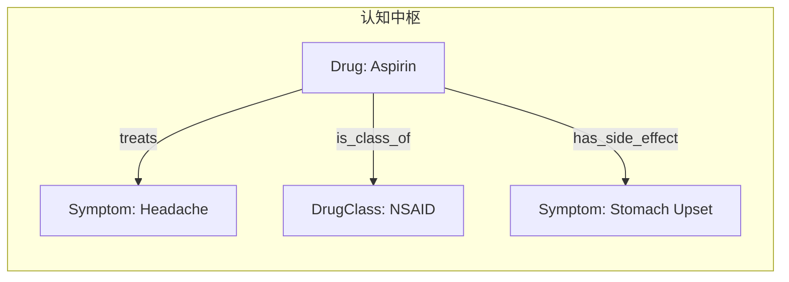

# 🧬 KIP（Knowledge Interaction Protocol）

**[English](./README.md) | [中文](./README_CN.md)**

<p align="center">
  <em>专为大型语言模型设计的面向图的交互协议，<br/>连接 LLM 与知识图谱的桥梁。</em>
</p>

---

## 什么是 KIP？

**KIP（Knowledge Interaction Protocol）** 是一套标准交互协议，旨在弥合 **LLM（概率推理引擎）** 与 **知识图谱（确定性知识库）** 之间的鸿沟。它不是一个简单的数据库接口，而是一套专为智能体设计的**记忆与认知操作原语**。

大型语言模型（LLM）展现了卓越的通用推理与生成能力，但其**"无状态"（Stateless）**的本质导致了长期记忆的缺失，而基于概率的生成机制则引发了不可控的"幻觉"与知识过时问题。

KIP 通过**神经符号人工智能（Neuro-Symbolic AI）**方法来解决这一问题。

### 核心优势

- 🧠 **记忆持久化**：将对话、观测与推理结果转化为结构化的"知识胶囊"
- 📈 **知识演进**：完整的增删改查与元数据管理，支持自主学习和错误修正
- 🔍 **可解释交互**：每次回答都有据可查，每次决策都逻辑透明
- ⚡ **LLM 优化**：协议语法针对 Transformer 架构优化，采用原生 JSON 结构

## 快速开始

```prolog
// 查询：查找所有治疗头痛的药物
FIND(?drug.name)
WHERE {
  ?drug {type: "Drug"}
  (?drug, "treats", {name: "Headache"})
}
LIMIT 10

// 存储：创建新的知识胶囊
UPSERT {
  CONCEPT ?aspirin {
    {type: "Drug", name: "Aspirin"}
    SET ATTRIBUTES { molecular_formula: "C9H8O4", risk_level: 2 }
    SET PROPOSITIONS { ("treats", {type: "Symptom", name: "Headache"}) }
  }
}
WITH METADATA { source: "FDA", confidence: 0.95 }

// 探索：发现模式
DESCRIBE PRIMER
```

## 文档

| 文档                                    | 描述                                   |
| --------------------------------------- | -------------------------------------- |
| [📖 Specification](./SPECIFICATION.md)   | 完整的 KIP 协议规范（英文）            |
| [📖 规范文档](./SPECIFICATION_CN.md)     | 完整的 KIP 协议规范（中文）            |
| [🤖 Agent 指令](./SelfInstructions.md)   | AI Agent 使用 KIP 的操作指南           |
| [⚙️ 系统指令](./SystemInstructions.md)   | 系统级维护与清理指南                   |
| [📋 函数定义](./FunctionDefinition.json) | 用于 LLM 集成的 `execute_kip` 函数模式 |

## 核心概念

### 认知中枢（Cognitive Nexus）

由**概念节点（Concept Nodes）**和**命题链接（Proposition Links）**组成的知识图谱，作为 AI Agent 的**统一记忆大脑**。



### KIP 指令集

| 指令集           | 用途           | 示例                      |
| ---------------- | -------------- | ------------------------- |
| **KQL**（查询）  | 知识检索与推理 | `FIND`、`WHERE`、`FILTER` |
| **KML**（操作）  | 知识演进与学习 | `UPSERT`、`DELETE`        |
| **META**（发现） | 模式探索与锚定 | `DESCRIBE`、`SEARCH`      |

### 模式自举（Schema Bootstrapping）

KIP 使用自描述模式，类型定义存储在图本身中：

- `$ConceptType`：用于定义概念节点类型的元类型
- `$PropositionType`：用于定义命题谓词的元类型
- `Domain`：知识的组织单元

## 资源

本仓库包含用于构建 KIP 驱动的 AI Agent 的即用资源：

### 📦 知识胶囊 (`capsules/`)

用于启动认知中枢的预构建知识胶囊：

| 胶囊                                                | 描述                                             |
| --------------------------------------------------- | ------------------------------------------------ |
| [Genesis.kip](./capsules/Genesis.kip)               | 启动整个类型系统的基础胶囊                       |
| [Person.kip](./capsules/Person.kip)                 | 用于参与者（AI、人类、组织）的 `Person` 概念类型 |
| [Event.kip](./capsules/Event.kip)                   | 用于情景记忆的 `Event` 概念类型                  |
| [persons/self.kip](./capsules/persons/self.kip)     | `$self` 概念实例                                 |
| [persons/system.kip](./capsules/persons/system.kip) | `$system` 概念实例                               |

### 🔌 MCP 服务器 (`mcp/`)

[kip-mcp-server](./mcp/kip-mcp-server/) - 通过 stdio 暴露 KIP 工具的 Model Context Protocol 服务器：

- **工具**：`execute_kip`、`list_logs`
- **资源**：`kip://docs/SelfInstructions.md`、`kip://docs/KIPSyntax.md`
- **提示词**：`kip_bootstrap` 提供即用的系统提示词

### 🎯 Agent 技能 (`skill/`)

[kip-cognitive-nexus](./skill/kip-cognitive-nexus/) - 可发布的 AI Agent 技能：

- 用于 `anda_cognitive_nexus_server` 的 Python 客户端脚本
- 完整的语法参考和 Agent 工作流指南

## 实现

| 项目                                                                                                            | 描述                                                                        |
| --------------------------------------------------------------------------------------------------------------- | --------------------------------------------------------------------------- |
| [Anda KIP SDK](https://github.com/ldclabs/anda-db/tree/main/rs/anda_kip)                                        | 用于构建 AI 知识记忆系统的 Rust SDK                                         |
| [Anda Cognitive Nexus](https://github.com/ldclabs/anda-db/tree/main/rs/anda_cognitive_nexus)                    | 基于 Anda DB 的 KIP Rust 实现                                               |
| [Anda Cognitive Nexus Python](https://github.com/ldclabs/anda-db/tree/main/py/anda_cognitive_nexus_py)          | Anda Cognitive Nexus 的 Python 绑定                                         |
| [Anda Cognitive Nexus HTTP Server](https://github.com/ldclabs/anda-db/tree/main/rs/anda_cognitive_nexus_server) | 基于 Rust 的 HTTP 服务器，通过 JSON-RPC API (`GET /`, `POST /kip`) 暴露 KIP |
| [Anda App](https://github.com/ldclabs/anda-app)                                                                 | 基于 KIP 的 AI Agent 客户端应用                                             |

## 版本历史

| 版本        | 日期       | 变更                                                       |
| ----------- | ---------- | ---------------------------------------------------------- |
| v1.0-RC3    | 2026-01-09 | v1.0 Release Candidate 3：优化文档；优化指令；优化知识胶囊 |
| v1.0-RC2    | 2025-12-31 | 参数占位符前缀改为 `:`；支持批量命令执行                   |
| ...         | ...        | ...                                                        |
| v1.0-draft1 | 2025-06-09 | 初始草案                                                   |

[完整版本历史 →](./SPECIFICATION_CN.md)

## 关于我们

**[ICPanda](https://panda.fans/)** 是一个社区驱动的项目，旨在构建基础设施和应用程序，使 AI Agent 能够在 Web3 生态系统中作为一等公民蓬勃发展。

- 🌐 [Anda.AI](https://anda.ai/) | [dMsg](https://dmsg.net/) | [Tokenlist.ing](https://tokenlist.ing/)
- 💻 [GitHub: LDC Labs](https://github.com/ldclabs)
- 🐦 [关注我们: @ICPandaDAO](https://x.com/ICPandaDAO)

## 许可证

Copyright © 2025 [LDC Labs](https://github.com/ldclabs)。

采用 MIT 许可证授权。详情请参阅 [LICENSE](./LICENSE)。
