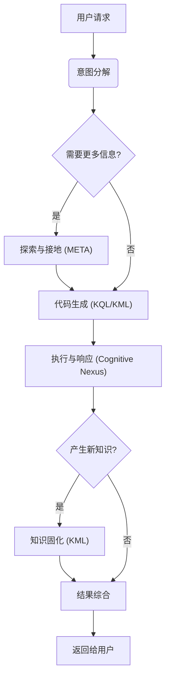

# 🧬 KIP（Knowledge Interaction Protocol）规范（草案）

[English](./README.md) | [中文](./README_CN.md)

**KIP 实现**:
- [Anda KIP](https://github.com/ldclabs/anda-db/tree/main/rs/anda_kip): [WIP] A Rust implementation of KIP (Knowledge Interaction Protocol) with Anda DB.

**关于我们**：
- [ICPanda DAO](https://panda.fans/): ICPanda is a technical panda fully running on the [Internet Computer](https://internetcomputer.org/) blockchain, building chain-native infrastructures, Anda.AI and dMsg.net.
- [Anda.AI](https://anda.ai/): Create next-generation AI agents with persistent memory, decentralized trust, and swarm intelligence.
- [GitHub: LDC Labs](https://github.com/ldclabs/KIP)
- [X: ICPanda DAO](https://x.com/ICPandaDAO)

## 0. 前言

我们正处在一个由大型语言模型（LLM）驱动的认知革命的黎明。LLM 以其强大的自然语言理解、生成和推理能力，展现了通用人工智能（AGI）的曙光。然而，当前的 LLM 如同一个**才华横溢却健忘的天才**：它拥有惊人的即时推理能力，却缺乏稳定、可累积、可追溯的长期记忆。它能进行精彩的对话，但对话结束后，知识便随风消散；它可能产生令人信服的“幻觉”，却无法对其知识来源进行核查与验证。

这种“神经核心”与持久化、结构化知识之间的鸿沟，是阻碍 AI Agent 从“聪明的工具”迈向“真正的智能伙伴”的核心障碍。如何为这个强大的“神经核心”构建一个同样强大的、可信赖的、能够伴随其共同进化的“符号核心”？这正是我们必须回答的时代之问。

**KIP（Knowledge Interaction Protocol）正是为回答这一时代之问而生。**

它不仅是一套技术规范，更是一种设计哲学，一种全新的 AI 架构范式。KIP 的核心使命是构建一座坚实、高效的桥梁，连接 LLM 瞬时、流动的“工作记忆”与知识图谱持久、稳固的“长期记忆”。通过 KIP，我们旨在将 AI 与其知识库的交互，**从单向的“工具调用”，升维为双向的“认知共生”**。

在本规范中，我们致力于实现三大核心目标：

1.  **赋予 AI 持久记忆（Persistent Memory）**：通过 KIP，AI Agent 能够将对话、观察和推理中获得的新知识，以结构化的“知识胶囊”形式，原子性地、可靠地固化到其知识图谱中。记忆不再是易失的，而是可沉淀、可复利的资产。

2.  **实现 AI 自我进化（Self-Evolution）**：学习与遗忘是智能的标志。KIP 提供了完整的知识操作语言（KML），使 Agent 能够根据新的证据，自主地更新、修正甚至删除过时的知识。这为构建能够持续学习、自我完善、适应环境变化的 AI 奠定了基础。

3.  **构建 AI 可信基石（Foundation of Trust）**：信任源于透明。KIP 的每一次交互都是一次明确的、可审计的“思维链”。当 AI 给出答案时，它不仅能说出“是什么”，更能通过其生成的 KIP 代码，清晰地展示“我是如何知道的”。这为构建负责任的、可解释的 AI 系统提供了不可或缺的底层支持。

本规范旨在为所有致力于构建下一代智能体的开发者、架构师和研究者，提供一套开放、通用且强大的标准。我们相信，智能的未来，并非源于一个孤立的、无所不知的“黑箱”，而是源于一个懂得如何学习、如何与可信知识高效协作的开放系统。

欢迎您与我们一道，共同探索并完善 KIP，开启 AI 自我进化与可持续学习的新纪元。

## 1. 简介与设计哲学

**KIP（Knowledge Interaction Protocol）** 是一种为大型语言模型（LLM）设计的知识记忆交互协议，旨在为 AI Agent 构建一套可持续学习、自我进化的知识记忆系统。

**KIP** 定义了神经核心（大型语言模型 LLM）与符号核心（认知中枢 Cognitive Nexus）之间进行高效、可靠、双向知识交换的**完整交互模式**。

**设计原则：**

*   **模型友好（LLM-Friendly）**：语法结构清晰，对 LLM 的代码生成任务友好。
*   **声明式（Declarative）**：交互的发起者只需描述“意图”，无需关心“实现”。
*   **图原生（Graph-Native）**：为知识图谱的结构和查询模式进行了深度优化。
*   **可解释性（Explainable）**：KIP 代码本身就是 LLM 推理过程的透明记录，是可审计、可验证的“思维链”。
*   **全面性（Comprehensive）**：提供从数据查询到知识演化的完整生命周期管理能力，是 Agent 实现真正学习的基础。

## 2. 核心术语

*   **认知中枢（Cognitive Nexus）**：一个由**概念节点**和**命题链接**构成的知识图谱。
*   **概念节点（Concept Node）**：代表实体化的概念。拥有唯一的 `id`、`type`，多个**属性（Attributes）** 和元数据（如来源、可信度）。关于这个概念的所有事实、关系、属性，都附着在这个节点上。
*   **命题链接（Proposition Link）**：代表一个形式为 `(主语, 谓词, 宾语)` 的实体化的事实，连接概念节点或命题链接。命题自身也可以拥有元数据（如来源、可信度）。
*   **知识胶囊（Knowledge Capsule）**：一种原子性的知识更新单元，是包含了一组概念节点和命题链接的知识合集，用于解决高质量知识的封装、分发和复用问题。
*   **认知引信（Cognitive Primer）**：一个高度结构化、信息密度极高、专门为 LLM 设计的 JSON 对象，它包含了认知中枢的全局摘要和领域地图，帮助 LLM 快速理解和使用认知中枢。

## 3. KIP-KQL 指令集：知识查询语言

KQL 是 KIP 中负责知识检索和推理的部分。

### 3.1. 查询结构

```prolog
FIND( ... )
WHERE {
  ...
}
ORDER BY ...
LIMIT N
OFFSET M
```

### 3.2. `FIND` 子句

**功能**：声明查询的最终输出。

**语法**：`FIND( ... )`

*   **多变量返回**：可以指定一个或多个变量，如 `FIND(?drug, ?symptom)`。
*   **聚合返回**：可以使用聚合函数对变量进行计算。必须使用 `AS` 关键字为聚合结果指定一个新的变量名，如 `FIND(?var1, ?agg_func(?var2) AS ?result_var)`。

    **聚合函数（Aggregation Functions）**：
    *   `COUNT(?var)`：计算 `?var` 被绑定的次数。`COUNT(DISTINCT ?var)` 计算不同绑定的数量。
    *   `COLLECT(?var)`：将一个分组内 `?var` 的所有值收集成一个列表。
    *   `SUM(?var)`, `AVG(?var)`, `MIN(?var)`, `MAX(?var)`：其他常见的数学聚合函数。

**示例**：

```prolog
// 返回多个变量
FIND(?drug_name, ?symptom_name)

// 返回一个变量和它的计数值
FIND(?drug_class, COUNT(?drug) AS ?drug_count)
```

### 3.3 `WHERE` 子句

**功能**：包含一系列图模式匹配和过滤子句，所有子句之间默认为逻辑 **AND** 关系。

**语法**：`WHERE { ... }`

*   **类型断言/实体接地**：`?variable(type: "...", name: "...", id: "...")`
*   **命题子句（`PROP`）**：`PROP(Subject, Predicate, Object) { meta_key: ?meta_var }`
    *   **支持属性路径**：`predicate{m,n}`, `predicate1 | predicate2`
*   **属性子句（`ATTR`）**：`ATTR(?node, "attribute_name", ?value_variable)`
*   **过滤器子句（`FILTER`）**：`FILTER(boolean_expression)`
*   **否定子句（`NOT`）**：`NOT { ... }`
*   **可选子句（`OPTIONAL`）**：`OPTIONAL { ... }`
*   **合并子句（`UNION`）**：`UNION { ... }`
*   **子查询（`SELECT`）**：用于内部计算，其结果可用于外部 `FILTER`。

#### 3.3.1. 类型断言/实体接地子句

**功能**：约束变量类型或将变量“接地”到图谱中的特定节点。

**语法**：`?variable(type: "...", name: "...", id: "...")`

*   参数可选，但至少提供一个。此子句**只用于约束和定位**。

**示例**：

```prolog
?drug(type: "Drug")                // 约束 ?drug 必须是药物类型
?aspirin(name: "Aspirin")          // 将 ?aspirin 接地到名为 "Aspirin" 的节点
?headache(id: "snomedct_25064002") // 将 ?headache 接地到指定 ID 的节点
```

#### 3.3.2. 命题子句（`PROP`）

**功能**：在知识图谱中按 `(主语, 谓词, 宾语)` 模式进行遍历。

**语法**：`PROP(Subject, Predicate, Object) { <metadata_filter> }`

`PROP` 的主语或宾语支持命题：
*   `PROP(?subject, predicate, (?drug, "treats", ?symptom))`：使用命题作为宾语，表示其内部结构必须匹配 (?drug, "treats", ?symptom) 的模式。

`PROP` 的谓词部分支持路径操作符：
*   `predicate{m,n}`：匹配 m 到 n 跳。
*   `predicate1 | predicate2`：匹配 `predicate1` 或 `predicate2`。

**示例**：

```prolog
// 找到所有能治疗头痛的药物
PROP(?drug, "treats", ?headache)
```

```prolog
// 查找一个概念的 5 层以内的父概念（传递闭包）
PROP(?concept, "is_subclass_of{0,5}", ?parent_concept)
```

```prolog
// 查找所有置信度高于 0.9 的 "treats" 关系
FIND(?drug_name, ?symptom_name)
WHERE {
  ?drug(type: "Drug")
  ?symptom(type: "Symptom")
  // 在命题上直接进行元数据过滤
  PROP(?drug, "treats", ?symptom) { confidence: ?conf }
  FILTER(?conf > 0.9)

  ATTR(?drug, "name", ?drug_name)
  ATTR(?symptom, "name", ?symptom_name)
}
```

#### 3.3.3. 属性子句（`ATTR`）

**功能**：获取一个节点的属性值，并将其绑定到一个新变量上。

**语法**：`ATTR(?node_variable, "attribute_name", ?value_variable)`

**示例**：

```prolog
// 获取 ?drug 节点的 "name" 属性，并存入 ?drug_name 变量
ATTR(?drug, "name", ?drug_name)

// 获取 ?drug 节点的 "risk_level" 属性，并存入 ?risk 变量
ATTR(?drug, "risk_level", ?risk)
```

#### 3.3.4. 过滤器子句（`FILTER`）

**功能**：对已绑定的变量（通常是 `ATTR` 获取的属性值）应用更复杂的过滤条件。

**语法**：`FILTER(boolean_expression)`

**过滤器函数与运算符（Filter Functions & Operators）**：

*   **比较运算符**：`==`, `!=`, `<`, `>`, `<=`, `>=`
*   **逻辑运算符**：`&&`（AND）, `||`（OR）, `!`（NOT）
*   **字符串函数**：`CONTAINS(?str, "sub")`, `STARTS_WITH(?str, "prefix")`, `ENDS_WITH(?str, "suffix")`, `REGEX(?str, "pattern")`

**示例**：
```prolog
// 筛选出风险等级小于 3 的药物
ATTR(?drug, "risk_level", ?risk)
FILTER(?risk < 3)

// 筛选出名称包含 "acid" 的药物
ATTR(?drug, "name", ?drug_name)
FILTER(CONTAINS(?drug_name, "acid"))
```

#### 3.3.5. 否定子句（`NOT`）

**功能**：排除满足特定模式的解。

**语法**：`NOT { ... }`

**示例**：

```prolog
// 排除所有属于 NSAID 类的药物
NOT {
  ?nsaid_class(name: "NSAID")
  PROP(?drug, "is_class_of", ?nsaid_class)
}
```

#### 3.3.6. 可选子句（`OPTIONAL`）

**功能**：尝试匹配一个可选的图模式。如果模式匹配成功，则其内部变量被绑定；如果失败，查询继续，但内部变量为未绑定状态。这类似于 SQL 的 `LEFT JOIN`。

**语法**：`OPTIONAL { ... }`

**示例**：

```prolog
// 查找所有药物，并（如果存在的话）一并找出它们的副作用
?drug(type: "Drug")
OPTIONAL {
  PROP(?drug, "has_side_effect", ?side_effect)
  ATTR(?side_effect, "name", ?side_effect_name)
}
```

#### 3.3.7. 合并子句（`UNION`）

**功能**：合并子句的结果，实现逻辑 **OR**。注意，`where` 块所有子句之间默认为逻辑 **AND** 关系。

**语法**：`UNION { ... }`

**示例**：

```prolog
// 找到能治疗“头痛”或“发烧”的药物

?headache(name: "Headache")
PROP(?drug, "treats", ?headache)

UNION {
  ?fever(name: "Fever")
  PROP(?drug, "treats", ?fever)
}
```

#### 3.3.8. 子查询（`SELECT`）

**功能**：在 `WHERE` 子句内部嵌套一个独立的查询，其结果可以用于外部查询的过滤。

**语法**：`SELECT(...) WHERE { ... }` 可以在 `FILTER` 等子句中使用。子查询可以捕获其外部作用域中已绑定的变量。子查询内部通过 AS 定义的新变量，其作用域仅限于该子查询所属的父子句（如 FILTER）。

**示例**：

```prolog
// 查找治疗超过3种症状的“广谱”药物
FIND(?drug_name) WHERE {
  ?drug(type: "Drug")
  ATTR(?drug, "name", ?drug_name)

  FILTER( ?symptom_count > 3 ) {
    SELECT(COUNT(?symptom) AS ?symptom_count)
    WHERE { PROP(?drug, "treats", ?symptom) }
  }
}
```

### 3.4 Solution Modifiers（结果修饰子句）

这些子句在 `WHERE` 逻辑执行完毕后，对产生的结果集进行后处理。

*   **`ORDER BY ?var [ASC|DESC]`**：
    根据指定变量对结果进行排序，默认为 `ASC`（升序）。
*   **`LIMIT N`**：
    限制返回结果的数量为 N。
*   **`OFFSET M`**：
    跳过前 M 条结果，通常与 `LIMIT` 联用实现分页。

### 3.5. 综合查询示例

**示例 1**：带过滤和排序的高级查询

**意图**："找到所有能治疗‘头痛’的非 NSAID 类药物，要求其风险等级低于4，并按风险等级从低到高排序，返回药物名称和风险等级。"

```prolog
FIND(?drug_name, ?risk)
WHERE {
  ?drug(type: "Drug")
  ?headache(name: "Headache")
  ?nsaid_class(name: "NSAID")

  PROP(?drug, "treats", ?headache)

  NOT {
    PROP(?drug, "is_class_of", ?nsaid_class)
  }

  ATTR(?drug, "name", ?drug_name)
  ATTR(?drug, "risk_level", ?risk)
  FILTER(?risk < 4)
}
ORDER BY ?risk ASC
LIMIT 20
```

**示例 2**：使用聚合分析查询

**意图**："按药物类别，列出该类别下所有药物的名称。"

```prolog
FIND(?class_name, COLLECT(?drug_name) AS ?drug_list)
WHERE {
  ?class(type: "DrugClass")
  ATTR(?class, "name", ?class_name)

  ?drug(type: "Drug")
  PROP(?drug, "is_class_of", ?class)
  ATTR(?drug, "name", ?drug_name)
}
ORDER BY ?class_name
```

**示例 3**：使用 `OPTIONAL` 处理缺失信息

**意图**："列出所有 NSAID 类的药物，并（如果存在的话）显示它们各自的已知副作用。"

```prolog
FIND(?drug_name, ?side_effect_name)
WHERE {
  ?nsaid_class(name: "NSAID")
  PROP(?drug, "is_class_of", ?nsaid_class)

  ATTR(?drug, "name", ?drug_name)

  OPTIONAL {
    PROP(?drug, "has_side_effect", ?side_effect)
    ATTR(?side_effect, "name", ?side_effect_name)
  }
}
```
*   **注意**：对于没有副作用的药物，`?side_effect_name` 的值将为空，但药物本身 `?drug_name` 依然会出现在结果中。

**示例 4**：使用命题作为宾语

**意图**："找到一篇由‘张三’陈述的、关于‘一篇论文引用了一个证据’的断言。"

```prolog
FIND(?paper_doi, ?drug_name)
WHERE {
  // ?stmt1 是最外层的断言
  PROP(
    ?zhangsan(name: "张三"),
    "stated",
    // ?stmt1 的宾语是 ?stmt2
    (?paper(type: "Paper"), "cites_as_evidence", (?drug, "treats", ?symptom))
  )

  // 后续操作
  ATTR(?paper, "doi", ?paper_doi)
  ATTR(?drug, "name", ?drug_name)
  ...
}
```

## 4. KIP-KML 指令集：知识操作语言

KML 是 KIP 中负责知识演化的部分，是 Agent 实现学习的核心工具。

### 4.1 `UPSERT` 语句

**功能**：**原子性地**创建或更新知识，是承载“**知识胶囊（Knowledge Capsule）**”的主要方式。
`UPSERT` 操作需保证重复执行不产生副作用。

**语法**：

```prolog
UPSERT {
  CONCEPT @local_handle {
    ON { <unique_key_attributes> }
    SET ATTRIBUTES { <key>: <value>, ... }
    SET PROPOSITIONS {
      PROP("<predicate>", ON { <keys_for_existing_concept_or_proposition> })
      PROP("<predicate>", @other_handle) WITH METADATA { <metadata> }
      ...
    }
  }
  WITH METADATA { <metadata> }

  PROPOSITION @local_prop {
    (ON { <keys_for_existing_concept> }, "<predicate>", ON { <keys_for_existing_concept_or_proposition> })
  }
  WITH METADATA { <metadata> }

  CONCEPT @local_handle_2 {
    ON { <unique_key_attributes> }
    SET PROPOSITIONS {
      PROP("<predicate>", @local_prop)
    }
  }
  ...
}
WITH METADATA { <global_metadata> }
```

**关键组件**：

*   **`UPSERT` 块**： 整个操作的容器，保证内部所有操作的原子性。
*   **`CONCEPT` 块**：定义一个概念节点。
    *   `@local_handle`：以 `@` 开头的本地句柄（或称锚点），用于在事务内引用此新概念，它只在本次 `UPSERT` 块事务中有效。
    *   `ON { ... }`：**UPSERT 的关键**，定义匹配现有节点的唯一键。若匹配则更新，否则创建。键可以是 `id`，也可以是多个属性的组合，如 `{ type: "Drug", name: "Aspirin" }`。
    *   `SET ATTRIBUTES { ... }`：一个简单的键值对列表，用于设置或更新节点的属性。
    *   `SET PROPOSITIONS { ... }`：定义或更新该概念节点发出的“命题链接”。SET PROPOSITIONS 的行为是增量式的。对于每一个定义的 PROP，如果一个完全相同的主谓宾命题已存在，则更新其元数据（如果有）；如果不存在，则创建该新命题。
        *   `PROP("predicate", @local_handle)`：链接到**本次胶囊中定义的另一个概念**。
        *   `PROP("predicate", ON { ... })`：链接到**数据库中已存在的概念**，通过其唯一键进行定位。
*   **`PROPOSITION` 块**：定义一个独立的命题链接，通常用于在胶囊内创建复杂的关系。
    *   `@local_prop`：本地句柄，用于引用此命题链接。
    *   `(ON { ... }, "predicate", ON { ... })`：定义一个命题链接，主语和宾语可以是现有概念或其他命题链接。
*   **`WITH METADATA` 块**： 追加在 `CONCEPT`，`PROPOSITION` 或 `UPSERT`全局的元数据。

**示例**：

假设我们有一个知识胶囊，用于定义一种新的、假设存在的益智药 "Cognizine"。这个胶囊包含：
*   药物本身的概念和属性。
*   它能治疗“脑雾（Brain Fog）”。
*   它属于“益智药（Nootropic）”类别（这是一个已存在的类别）。
*   它有一个新发现的副作用：“神经绽放（Neural Bloom）”（这也是一个新的概念）。

**知识胶囊 `cognizine_capsule.kml` 的内容：**

```prolog
// Knowledge Capsule: cognizin.v1.0
// Description: Defines the novel nootropic drug "Cognizine" and its effects.

UPSERT {
  // Define the main drug concept: Cognizine
  CONCEPT @cognizine {
    ON { type: "Drug", name: "Cognizine" }
    SET ATTRIBUTES {
      molecular_formula: "C12H15N5O3",
      risk_level: 2,
      description: "A novel nootropic drug designed to enhance cognitive functions."
    }
    SET PROPOSITIONS {
      // Link to an existing concept (Nootropic)
      PROP("is_class_of", ON { type: "DrugClass", name: "Nootropic" })

      // Link to an existing concept (Brain Fog)
      PROP("treats", ON { type: "Symptom", name: "Brain Fog" })

      // Link to another new concept defined within this capsule (@neural_bloom)
      PROP("has_side_effect", @neural_bloom) WITH METADATA {
        // This specific proposition has its own metadata
        confidence: 0.75,
        source: "Preliminary Clinical Trial NCT012345"
      }
    }
  }

  // Define the new side effect concept: Neural Bloom
  CONCEPT @neural_bloom {
    ON { type: "Symptom", name: "Neural Bloom" }
    SET ATTRIBUTES {
      description: "A rare side effect characterized by a temporary burst of creative thoughts."
    }
    // This concept has no outgoing propositions in this capsule
  }
}
WITH METADATA {
  // Global metadata for all facts in this capsule
  source: "KnowledgeCapsule:Nootropics_v1.0",
  author: "LDC Labs Research Team",
  confidence: 0.95,
  status: "reviewed"
}
```

### 4.2 `DELETE` 语句

**功能**：从认知中枢中有针对性地移除知识﹙属性、命题或整个概念﹚的统一接口。

**语法**：`DELETE [TARGET] [IDENTIFIER]`

*   **`[TARGET]`**：明确要删除的对象类型，如 `ATTRIBUTES`、`PROPOSITION` 或` CONCEPT`。
*   **`[IDENTIFIER]`**：描述如何定位要删除的目标。


#### 4.2.1. 删除属性（`DELETE ATTRIBUTES`）

**功能**：从一个明确指定的概念中删除属性列表，而保持该概念及其他属性和关系不变时。

**语法**：

```prolog
DELETE ATTRIBUTES { "attribute_name_1", "attribute_name_2", ... }
FROM ON { <unique_key> }
```

```prolog
DELETE ATTRIBUTES { "attribute_name_1", "attribute_name_2", ... }
WHERE { ... }
```

*   **`{ "attribute_name_1", ... }`**：一个包含要删除的属性名称的集合﹙Set﹚。
*   **`FROM ON { <unique_key> }`**：使用唯一键（如 `id` 或 `type` + `name` 组合）精确锁定要操作的目标概念。
*   **`WHERE { ... }`**：使用 KQL 图模式匹配来定位多个要删除属性的概念节点。

**示例**：

```prolog
// 从"Aspirin"概念中删除 "risk_category" 属性
DELETE ATTRIBUTES { "risk_category" }
FROM ON { type: "Drug", name: "Aspirin" }
```

#### 4.2.2 精准删除命题（`DELETE PROPOSITION`）

**功能**：删除一个由`(主语, 谓词, 宾语)`完全定义的、单一的命题。

**语法**：

```prolog
DELETE PROPOSITION (
  ON { <unique_key_for_subject> },
  "predicate_name",
  ON { <unique_key_for_object> }
)
```

**示例**：

```prolog
// 精确删除 "Cognizine" 和 "Brain Fog" 之间的 "treats" 关系
DELETE PROPOSITION (
    ON { type: "Drug", name: "Cognizine" },
    "treats",
    ON { type: "Symptom", name: "Brain Fog" }
)
```

#### 4.2.3 模式匹配删除命题（`DELETE PROPOSITIONS`）

**功能**：使用 `WHERE` 子句匹配一个或多个命题，并将其全部删除。

**语法**：

```prolog
DELETE PROPOSITIONS
WHERE {
  ... KQL graph pattern and filter clauses ...
}
```

**示例**：

```prolog
// 删除特定不可信来源的所有命题
DELETE PROPOSITIONS
WHERE {
  PROP(?s, ?p, ?o) { source: "untrusted_source_v1" }
}
```

#### 4.2.4. 删除概念（`DELETE CONCEPT`）

**功能**：彻底删除一个概念节点及其附带的所有（入度和出度）命题链接。

**语法**：

```prolog
DELETE CONCEPT
ON { <unique_key> }
DETACH
```

*   `DETACH` 关键字依然是必须的，作为一种安全机制，强制 LLM 确认其意图——即同时删除概念和与之相关的所有关系，避免产生孤立的关系。

**示例**：

```prolog
// 删除 "OutdatedDrug" 这个概念及其所有关系
DELETE CONCEPT
ON { type: "Drug", name: "OutdatedDrug" }
DETACH
```

## 5. KIP-META 指令集：知识探索与接地

META 是 KIP 的一个轻量级子集，专注于“自省”（Introspection）和“消歧”（Disambiguation）。它们是快速、元数据驱动的命令，不涉及复杂的图遍历。

### 5.1 `DESCRIBE` 语句

**功能**：`DESCRIBE` 命令用于查询认知中枢的“模式”（Schema）信息，帮助 LLM 理解认知中枢中“有什么”。

**语法**：`DESCRIBE [TARGET] <options>`

#### 5.1.1. 点燃认知引擎（`DESCRIBE PRIMER`）

**功能**：获取“认知引信（Cognitive Primer）”，用于引导 LLM 如何高效地利用认知中枢。

认知引信包含 2 部分内容：
1.  **全局摘要层（Universal Abstract）** - “我是谁？”
    这是最高度的概括，定义了 AI Agent 的核心身份、能力边界和基本原则。内容包括：

    *   Agent 的角色和目标（例如：“我是一个专业的医学知识助手，旨在提供准确、可追溯的医学信息”）。
    *   认知中枢 的存在和作用（“我的记忆和知识存储在认知中枢中，我可以通过 KIP 调用查询它”）。
    *   核心能力摘要（“我能够进行疾病诊断、药品查询、解读检查报告...”）。
2.  **领域地图层（Domain Map）** - “我知道些什么？”
    这是“认知引信”的核心。它不是知识的罗列，而是认知中枢的**拓扑结构摘要**。内容包括：

    *   **主要知识域（Domains）**：列出知识库中的顶层领域，如 `[疾病, 药品, 检查项目, 治疗方案, 专家医生, 临床指南]`。
    *   **关键概念（Key Concepts）**：在每个领域下，列出最重要或最常被查询的**概念节点（Concept Nodes）**。例如，在“疾病”下，可能是 `[高血压, 糖尿病, 偏头痛, 流感]`。
    *   **关键命题（Key Proposition）**：列出最重要或最常被查询的**命题链接（Proposition Links）**中的谓词，如 `[treats, causes, has_symptom, prevents, contraindicates]`。

**语法**：`DESCRIBE PRIMER`

#### 5.1.2. 列出所有存在的认知领域（`DESCRIBE DOMAINS`）

**功能**：列出所有可用的认知领域，用于引导 LLM 如何高效接地。

**语法**：`DESCRIBE DOMAINS`

#### 5.1.3. 列出所有存在的概念节点类型（`DESCRIBE CONCEPT TYPES`）

**功能**：列出所有存在的概念节点类型，用于引导 LLM 如何高效接地。

**语法**：`DESCRIBE CONCEPT TYPES`

#### 5.1.4. 描述一个特定节点类型（`DESCRIBE CONCEPT TYPE <type_name>`）

**功能**：描述一个特定节点类型的详细信息，包括其拥有的属性和常见关系。

**语法**：`DESCRIBE CONCEPT TYPE <type_name>`

**示例**：

```prolog
DESCRIBE CONCEPT TYPE "Drug"
```

#### 5.1.5. 列出所有命题链接类型（`DESCRIBE PROPOSITION TYPES`）

**功能**：列出所有命题链接的谓词，用于引导 LLM 如何高效接地。

**语法**：`DESCRIBE PROPOSITION TYPES`

#### 5.1.6. 描述一个特定命题链接类型的详细信息 (`DESCRIBE PROPOSITION TYPE <predicate_name>`)

**功能**：描述一个特定命题链接谓词的详细信息，包括其主语和宾语的常见类型（定义域和值域）。

**语法**：`DESCRIBE PROPOSITION TYPE <predicate_name>`

### 5.2 `SEARCH` 语句

**功能**：`SEARCH` 命令用于将自然语言术语链接到知识图谱中明确的实体。它专注于高效的、文本索引驱动的查找，而非完整的图模式匹配。

**语法**：`SEARCH CONCEPT <search_term> <options>`
    **选项 (`<options>`)**：
    *   `WITH TYPE <type_name>`：将搜索范围限制在某个节点类型内。
    *   `LIMIT N`：限制返回结果数量，默认为 10。

**示例**：

```prolog
// 在整个图谱中搜索 "aspirin"
SEARCH CONCEPT "aspirin" LIMIT 5

// 在特定类型中搜索 "阿司匹林"
SEARCH CONCEPT "阿司匹林" WITH TYPE "Drug"
```

## 6. 请求和响应结构（Request & Response Structure）

与认知中枢的所有交互都通过一个标准化的请求-响应模型进行。LLM Agent 通过结构化的请求（通常封装在 Function Calling 中）向认知中枢发送 KIP 命令，认知中枢则返回结构化的 JSON 响应。

### 6.1 请求结构（Request Structure）

LLM 生成的 KIP 命令应该通过如下 Function Calling 的结构化请求发送给认知中枢：
```js
{
  "id": "call_abc123",
  "type": "function",
  "function": {
    "name": "execute_kip",
    "arguments": JSON.stringify({
      "command": "FIND(?drug_name) WHERE { ... }",
      "parameters": {
        "symptom_name": "Headache"
      },
      "dry_run": true
    })
  }
}
```

**`execute_kip` 函数参数详解**：

| 参数名           | 类型    | 是否必须 | 描述                                                                                      |
| :--------------- | :------ | :------- | :---------------------------------------------------------------------------------------- |
| **`command`**    | String  | 是       | 包含完整、未经修改的 KIP 命令文本。使用多行字符串以保持格式和可读性。                     |
| **`parameters`** | Object  | 否       | 一个可选的键值对对象，用于传递命令文本之外的执行上下文参数，命令文本中用 `$key_name` 占位 |
| **`dry_run`**    | Boolean | 否       | 如果为 `true`，则仅验证命令的语法和逻辑，不执行或持久化任何变更。                         |

**示例**：
```js
// 请求体中的 command_text
"command_text": `
  FIND(?drug_name)
  WHERE {
    ?symptom(name: $symptom_name)
    PROP(?drug, "treats", ?symptom)
    ATTR(?drug, "name", ?drug_name)
  }
  LIMIT $limit
`,

// 对应的 parameters 对象
"parameters": {
  "symptom_name": "Headache",
  "limit": 10
}
```

### 6.2 响应结构（Response Structure）

**认知中枢的所有响应都是一个 JSON 对象，结构如下：**

| 键           | 类型   | 是否必须 | 描述                                                                          |
| :----------- | :----- | :------- | :---------------------------------------------------------------------------- |
| **`result`** | Object | 否       | 当请求成功时**必须**存在，包含请求的成功结果，其内部结构由 KIP 请求命令定义。 |
| **`error`**  | Object | 否       | 当请求失败时**必须**存在，包含结构化的错误详情。                              |

## 7. 协议交互工作流（Protocol Interaction Workflow）

LLM 作为“认知策略师”，必须遵循以下协议工作流与认知中枢进行交互，以确保通信的准确性和鲁棒性。

**流程图示例**:


1.  **意图分解（Deconstruct Intent）**：
    LLM 将用户的模糊请求分解为一系列清晰的逻辑目标：是查询信息，还是更新知识，或是二者的组合。

2.  **探索与接地（Explore & Ground）**：
    LLM 通过生成一系列 KIP-META 命令与认知中枢对话，以澄清歧义和获取构建最终查询所需的确切“坐标”。

3.  **代码生成（Generate Code）**：
    LLM 使用从 META 交互中获得的**精确 ID、类型和属性名**，生成一个高质量的 KQL 或 KML 查询。

4.  **执行与响应（Execute & Respond）**：
    生成的代码被发送到认知中枢的推理引擎执行，推理引擎返回结构化的数据结果或操作成功的状态。

5.  **知识固化（Solidify Knowledge）**：
    如果在交互中产生了新的、可信的知识（例如，用户确认了一个新的事实），LLM 应该履行“学习”的职责：
    *   生成一个封装了新知识的 `UPSERT` 语句。
    *   执行该语句，将新知识永久固化到认知中枢，完成学习闭环。

6.  **结果综合（Synthesize Results）**：
    LLM 将从符号核心收到的结构化数据或操作回执，翻译成流畅、人性化且**可解释**的自然语言。建议 LLM 向用户解释自己的推理过程（即 KIP 代码所代表的逻辑），从而建立信任。
