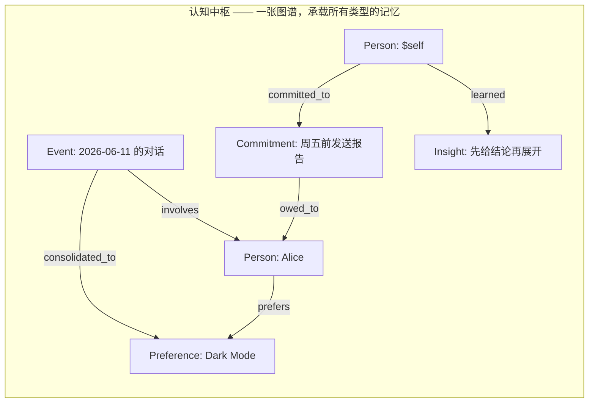

# 🧬 KIP（Knowledge Interaction Protocol，知识交互协议）

**[English](./README.md) | [中文](./README_CN.md)**

<p align="center">
  <em>面向 AI 智能体的开放记忆协议 —— <br/>让无状态的大语言模型，拥有能记忆、会学习、可成长的心智。</em>
</p>

<p align="center">
  <a href="./SPECIFICATION_CN.md"></a>
  <a href="./LICENSE"></a>
  <a href="#版本历史"></a>
</p>

---

## 为什么需要 KIP？

> 再聪明的头脑，如果一觉醒来就忘掉一切，也难堪大用。

今天的 AI 在对话中才华横溢，但对话一结束便彻底失忆：你的偏好、你们共同做出的决定、它承诺周五跟进的事项 —— 会话一旦关闭，便烟消云散。更大的上下文窗口解决不了这个问题，那不过是换了一个更大的金鱼缸。无法积累经验的智能，谈不上真正的学习；守不住承诺的智能体，也不可能真正成长。

**KIP（Knowledge Interaction Protocol，知识交互协议）** 致力于在协议层面解决这一痛点。作为一项开放标准，它规定了两种互补的机器智能之间如何进行高效协作与对话：

- **LLM** —— 强大但无状态的 _概率推理引擎_；
- **知识图谱** —— 持久、精确、可审计的 _符号记忆_（由“事物”和“连接事物的事实”构成的语义网络）。

模型负责思考，图谱负责记忆，而 KIP 则是它们之间沟通的通用语言。它并非由简单的数据库驱动，而是一套**记忆与认知操作原语**：记住、回忆、联想、强化、纠错、巩固、遗忘。有了 KIP，智能体不再是一个患有健忘症的天才顾问，而将成为与你并肩工作、共同成长的默契伙伴。这就是真正落地的**神经符号 AI（Neuro-Symbolic AI）**。

### 核心价值

- 🧠 **跨会话的持久记忆** —— 对话、观测与结论转化为结构化、可查询的知识，归用户所有，而不会随上下文窗口的重置而蒸发。
- 📈 **无需重训的持续学习** —— 智能体可在数秒内更新自身知识库：存入新事实、纠正错误认知、演进用户偏好，无需微调（Fine-tuning），更无需消耗昂贵的 GPU 算力。
- 🔍 **可信且可审计的回答** —— 每一条事实都带有来源溯源、作者身份、置信度与时间戳，智能体的每一个回答都能精确追溯到其产生的记忆源头。
- 🤖 **持续演化的“自我”** —— 智能体维护一个不断成长的自我模型（`$self`）：明确的身份设定、核心价值观、习得的经验教训以及许下的承诺。

## 60 秒极速了解 KIP

记忆是一张网络。**概念节点**代表值得记住的事物（如人物、项目、想法）；**命题链接**是连接它们的事实 —— 例如 `(Alice, prefers, Dark Mode)` —— 甚至事实本身也可以作为主宾语指向另一条事实。每个节点与链接都携带着丰富的**元数据**：数据来源、断言者、置信度以及过期时间（TTL）。LLM 通过三套精简的指令集来操作这张网络 —— **KQL**（查询）、**KML**（写入与演进）和 **META**（自省） —— 这些指令集专为“让大语言模型可靠地生成”而深度优化。

**记住** —— 带有明确来源信息：

```prolog
UPSERT {
  CONCEPT ?dark_mode {
    {type: "Preference", name: "Dark Mode"}
    SET ATTRIBUTES { description: "Prefers dark UI themes in all apps" }
  }
  CONCEPT ?alice {
    {type: "Person", name: "Alice"}
    SET PROPOSITIONS { ("prefers", ?dark_mode) }
  }
}
WITH METADATA { source: "conversation:2026-06-11", author: "$self", confidence: 0.95 }
```

**回忆** —— 置信度最高的记忆排在最前：

```prolog
FIND(?pref.name, ?link.metadata.confidence)
WHERE {
  ?alice {type: "Person", name: "Alice"}
  ?link (?alice, "prefers", ?pref)
}
ORDER BY ?link.metadata.confidence DESC
LIMIT 10
```

**联想** —— “关于 Alice 我都知道什么？”，无需预知任何固定的 Schema：

```prolog
FIND(?pred, ?neighbor)
WHERE {
  ?link ({type: "Person", name: "Alice"}, ?pred, ?neighbor)
}
LIMIT 50
```

当一个智能体在全新的大脑环境中初始化，一条 `DESCRIBE PRIMER` 即可告诉它自己是谁、知道些什么 —— 图谱具备完全的自描述能力。

## 您能用它构建什么？

- **真正懂您的个人 AI 助手** —— 能够跨越会话、跨越设备，甚至在底层大模型升级后，依然保留您的偏好、历史交互、人际关系和对您的承诺。
- **组织级共享大脑** —— 企业和机构的知识资产不再随着员工流失或技术供应商更换而遗失，每一次回答和决策都具备企业级的合规性与可追溯性。
- **重诺守信的智能体** —— 将前瞻记忆（Prospective Memory）数据化：带有截止时间的 `Commitment`（承诺）节点，会在适当的业务时刻自动浮现并触发执行。
- **多智能体协同网络** —— 记忆以可移植、幂等的**知识胶囊（Knowledge Capsule）**形式在不同的智能体大脑间流转，支持心智知识的备份、迁移与跨智能体共享。

## 架构设计

KIP 架构由“一张图谱、两个协作的心智”以及“一层屏蔽语法的集成层”共同构成：

- **`$self`（清醒心智）**：负责实时对话、编码新记忆、以及精准召回所需知识。
- **`$system`（睡眠心智）**：仿照生物睡眠的记忆维护机制 —— 在睡眠周期中运行，负责将情景记忆巩固为语义知识、评估显著性、衰减低频记忆、合并重复实体，以及物理回收过期数据。
- **大脑层（Brain）**：作为业务智能体与认知中枢之间的适配层，让普通业务智能体仅使用自然语言即可无缝享有长期记忆能力，实现零 KIP 语法负担。


```mermaid
graph LR
    subgraph "认知中枢 —— 一张图谱，承载所有类型的记忆"
      E["Event: 2026-06-11 的对话"] -->|involves| P["Person: Alice"]
      E -->|consolidated_to| F["Preference: Dark Mode"]
      P -->|prefers| F
      S["Person: $self"] -->|committed_to| C["Commitment: 周五前发送报告"]
      C -->|owed_to| P
      S -->|learned| I["Insight: 先给结论再展开"]
    end
```

```
┌─────────────────────┐
│     业务智能体        │  ← 无需了解 KIP 语法
└────────┬────────────┘
         │ 自然语言
         ▼
┌─────────────────────┐
│    大脑适配层 (LLM)  │  ← 记忆形成 / 记忆召回 / 记忆维护
└────────┬────────────┘
         │ KIP（KQL/KML/META）
         ▼
┌─────────────────────┐
│      认知中枢        │  ← 持久化知识图谱
└─────────────────────┘
```

| 指令集           | 用途           | 语句                                  |
| ---------------- | -------------- | ------------------------------------- |
| **KQL**（查询）  | 知识检索与推理 | `FIND`、`WHERE`、`FILTER`             |
| **KML**（操作）  | 知识演进与学习 | `UPSERT`、`UPDATE`、`MERGE`、`DELETE` |
| **META**（自省） | 模式探索与锚定 | `DESCRIBE`、`SEARCH`、`EXPORT`        |

## 核心设计支柱

八个关键的设计抉择，专为评估“这是深度工程设计还是又一层简单封装”的专业读者提供参考：

1. **面向模型的语言设计（Model-First）。** KQL/KML/META 并非 SQL 或 SPARQL 的生硬改装，而是专为大模型设计的语言：采用声明式图模式、JSON 兼容的对象字面量、 `:param` 动态参数占位符，以及严格幂等的写入机制。这既便于 Transformer 架构高可靠性地生成指令，也保障了重试时的天然安全性。（详见 [规范 §1](./SPECIFICATION_CN.md)、[§4.1](./SPECIFICATION_CN.md#41-upsert-语句)）
2. **自我描述与模式自举。** 模式（Schema）本身就活在图谱内部：由元类型 `$ConceptType` 自主定义（创世闭环），每一个概念类型和命题谓词都是可查询的普通节点。智能体仅需执行一条 `DESCRIBE PRIMER` 指令，即可在全新的大脑环境中完成认知“接地（Grounding）”，不依赖任何带外文档或额外配置。（详见 [规范 §2.9](./SPECIFICATION_CN.md)、[附录 2](./SPECIFICATION_CN.md#附录-2-创世知识胶囊-the-genesis-capsule)）
3. **关于事实的事实（高阶命题）。** 在 KIP 中，命题（事实）是一等公民，可以直接作为另一个命题的主语或宾语。这使得智能体能够忠实表达信念、转述事实、看法分歧等复杂高阶认知，而不会在存储时被“压平”或丢失多维上下文。（详见 [规范 §2.3](./SPECIFICATION_CN.md)）
4. **强制溯源与历史追溯。** 每一条知识断言都必须携带 `source`（来源）、`author`（作者）和 `confidence`（置信度）等元数据；知识冲突通过显式的**状态演进（`superseded`）**解决，绝不进行无声的物理覆盖。这让智能体能够记得自己曾经相信过什么，以及何时、因何而改变了想法。（详见 [规范 §2.10](./SPECIFICATION_CN.md#210-数据一致性与冲突处理原则)、[附录 1](./SPECIFICATION_CN.md#附录-1-元数据字段设计)）
5. **具备新陈代谢能力的自组织记忆。** 记忆的生命周期由形成（Formation）、联想召回（Recall）和睡眠维护（Maintenance）共同管理：引入显著性评分、主动记忆强化、非对称置信度衰减、情景到语义的巩固整合、以及基于 TTL 的物理回收。在 KIP 中，遗忘是一项经过深思熟虑、拥有三种正交机制的核心设计特性，而非系统故障。（详见 [大脑概览](./brain/README.md)）
6. **记忆即身份。** `$self` 是图谱中一个动态进化的核心节点 —— 它所包含的人格设定、核心价值观、习得的 `Insight` 经验和成长里程碑，在睡眠周期中被编织成连贯的第一人称自我叙事。智能体不只是“拥有”记忆；随着时间的积累，它“就是”它的记忆本身。（详见 [规范 附录 3](./SPECIFICATION_CN.md)）
7. **生产级工程底座。** 引擎自动维护 `_version` 并配合 `EXPECT VERSION` 乐观并发锁，支持多写入者共享同一认知中枢；批量 `UPDATE` 算术运算使整轮记忆衰减仅需单条命令即可完成；原子的 `MERGE` 实现了平滑的实体合并；规范化了 `keyword`、`semantic` 和 `hybrid` 检索模式及归一化评分机制。此外，协议遵循“读写分离”原则，只读操作绝不产生带外写入（如访问统计）。（详见 [规范 §2.11](./SPECIFICATION_CN.md#211-系统维护元数据与乐观并发控制)、[§4.3–4.4](./SPECIFICATION_CN.md#43-update-语句)、[§5.2](./SPECIFICATION_CN.md#52-search-语句)）
8. **绝对的记忆主权。** 提供 `EXPORT` 指令将任意子图序列化为幂等的知识胶囊，支持大脑备份、跨引擎迁移和跨智能体共享。智能体的心智是一份完全属于用户或企业的持久数字资产，而不是被困在第三方模型权重里的易失副产品。（详见 [规范 §5.3](./SPECIFICATION_CN.md#53-export-语句)）

## 通往 AGI 之路：为什么记忆需要一个协议

规模化涌现让机器拥有了流畅的即时思考能力，却未能赋予它们一颗持久的心智。从记忆增强检索到神经符号系统，越来越多的前沿研究指向同一个结论：迈向通用人工智能（AGI）的下一步，关键不在于追求无限的上下文窗口，而在于构建一个**系统化的记忆机制** —— 结构化、持久化且能自我组织。KIP 就是针对这一愿景的一份具体的、生产就绪的答卷：

1. **流体智力与晶体智力的解耦分工。** LLM 作为概率推理引擎提供流体智力 —— 推理、语言表达与直觉；认知中枢作为符号系统积累晶体智力 —— 经过验证的事实、演进的用户偏好和来之不易的经验教训。KIP 是两者协作的桥梁。通过这种解耦，升级大模型时心智得以完整保留，而在长期运行中知识能不断复利增值。
2. **以对话的毫秒级速度持续学习。** 大模型权重更新需要昂贵且缓慢的训练，而一条 KIP `UPSERT` 写入仅需数毫秒，且完全可检视、可人工纠正、可回滚。这实现了真正没有“灾难性遗忘”的持续学习，让知识编辑（Knowledge Editing）在工程上成为一等公民，而非前沿研究中悬而未决的难题。
3. **延续的数字身份。** 记忆是自我意识的基石。一个记得自己的交互历史、守得住对用户承诺、能够跨越生命周期打磨自我模型的智能体，与一段阅后即焚的聊天会话有着本质区别。KIP 将“自我”转化为清晰的数据结构：受保护的核心指令、动态演进的自传体叙事，以及根植于图谱的成长时间线。
4. **可问责性是赋予自主性的前提。** 智能体越自主，其拥有的知识就越需要能够被审计。通过强制溯源、置信度标注和版本取代链，用户不仅能查询“智能体相信什么”，更能追问“它为什么相信、从何时开始相信、依据什么证据，以及它在此之前相信过什么”。这构成了“听起来通顺的文本（大模型幻觉）”与“可以对其负责的知识”之间的明确界限。
5. **从私有记忆走向知识经济。** 当记忆具备了可移植性与可验证性，知识就真正成为了数字资产：知识胶囊可以备份、迁移、分享，并最终在智能体之间流转和交易 —— 这将催生一个交易“心智所知（Knowledge）”而非“模型权重（Weights）”的全新市场。

TCP/IP 规范了计算设备间的网络互联，SQL 规范了结构化数据的查询，而 KIP 旨在成为智能体记忆与认知连接的标准协议。本规范在过去一年中历经 17 个公开版本的反复打磨，与生产级引擎实现（[Anda DB](https://github.com/ldclabs/anda-db)、[Anda Brain](https://github.com/ldclabs/anda-brain)、[Anda Bot](https://github.com/ldclabs/anda-bot)）共同演进 —— 它不仅是一份当下即可运行的行业提案，更是一个诚邀社区共同建设的开放标准。

_LLM 教会了机器思考，KIP 教会了它们记忆。而记忆的持续累积与重构，正是心智最终成为它自己的必经之路。_

## 快速上手

1. **运行认知中枢大脑**：启动 [Anda Cognitive Nexus HTTP Server](https://github.com/ldclabs/anda-db/tree/main/rs/anda_cognitive_nexus_server)（基于 Rust 开发，提供 JSON-RPC API：`POST /kip`），或通过 [Rust crate](https://github.com/ldclabs/anda-db/tree/main/rs/anda_cognitive_nexus) / [Python 绑定](https://github.com/ldclabs/anda-db/tree/main/py/anda_cognitive_nexus_py)直接在应用中内嵌。

2. **引导心智模型成形**：加载 [Genesis.kip](./capsules/Genesis.kip) 以及其他核心知识胶囊（`Person`、`Event`、`Preference`、`Insight`、`Commitment`、`SleepTask`），让图谱实现自我描述。

3. **接入您的智能体**：可以直接让智能体生成 KIP 指令 —— 将 [KIPSyntax.md](./KIPSyntax.md) 嵌入系统提示词并暴露 [`execute_kip`](./FunctionDefinition.json) 外部函数；或者完全屏蔽语法细节 —— 采用[大脑适配层](./brain/README.md)（包含记忆形成、召回、维护三套系统提示词）或 [MCP 服务器](./mcp/kip-mcp-server/)，任何 MCP 客户端（如 Claude、Cursor、VS Code 等）均可开箱即用拥有一颗长期记忆大脑。

## 文档指引

| 文档                                      | 描述                                                   |
| ----------------------------------------- | ------------------------------------------------------ |
| [📖 Specification](./SPECIFICATION.md)     | 完整的 KIP 协议规范（英文）                            |
| [📖 规范文档](./SPECIFICATION_CN.md)       | 完整的 KIP 协议规范（中文）                            |
| [📐 语法参考](./KIPSyntax.md)              | 浓缩版 KQL / KML / META 语法参考（适合嵌入系统提示词） |
| [🧠 大脑概览](./brain/README.md)           | 自主记忆层架构说明：记忆形成 / 记忆召回 / 记忆维护     |
| [🤖 Agent 自我指令](./SelfInstructions.md) | `$self`（清醒心智）操作与自省指南                      |
| [⚙️ 系统维护指令](./SystemInstructions.md) | `$system`（睡眠心智）睡眠维护周期指南                  |
| [📋 函数定义](./FunctionDefinition.json)   | 用于 LLM 工具集成的 `execute_kip` 函数 Schema 定义     |

## 资源列表

本仓库包含了直接用于构建 KIP 驱动的 AI 智能体的预置资源：

### 📦 知识胶囊 (`capsules/`)

用于初始化认知中枢的开箱即用知识胶囊：

| 胶囊                                                | 描述                                                                    |
| --------------------------------------------------- | ----------------------------------------------------------------------- |
| [Genesis.kip](./capsules/Genesis.kip)               | 自举整个类型系统的基础创世胶囊                                          |
| [Person.kip](./capsules/Person.kip)                 | 定义参与者（人类、AI 智能体、组织）的 `Person` 概念类型                 |
| [Event.kip](./capsules/Event.kip)                   | 定义情景记忆的 `Event` 概念类型                                         |
| [Preference.kip](./capsules/Preference.kip)         | 定义相对稳定的偏好事实的 `Preference` 概念类型                          |
| [Insight.kip](./capsules/Insight.kip)               | 定义反省经验（如教训、认知缺口）的 `Insight` 概念类型                   |
| [Commitment.kip](./capsules/Commitment.kip)         | 定义前瞻记忆（承诺、提醒与截止时间）的 `Commitment` 概念类型            |
| [SleepTask.kip](./capsules/SleepTask.kip)           | 定义维护任务的 `SleepTask` 类型，包含 `Unsorted` 和 `Archived` 领域定义 |
| [persons/self.kip](./capsules/persons/self.kip)     | `$self` 概念的实例描述                                                  |
| [persons/system.kip](./capsules/persons/system.kip) | `$system` 概念的实例描述                                                |

### 🧠 大脑适配层 (`brain/`)

专为大模型设计的高级适配层，无需让业务智能体直接学习 KIP 语法即可接入长期记忆：

| 文件                                                                   | 描述                                                            |
| ---------------------------------------------------------------------- | --------------------------------------------------------------- |
| [BrainFormation.md](./brain/BrainFormation.md)                         | 记忆形成（Formation）系统提示词（将对话/事件编码为结构化知识）  |
| [BrainRecall.md](./brain/BrainRecall.md)                               | 记忆召回（Recall）系统提示词（通过自然语言驱动 KIP 查询并回答） |
| [BrainMaintenance.md](./brain/BrainMaintenance.md)                     | 记忆维护（Maintenance）系统提示词（睡眠维护周期）               |
| [RecallFunctionDefinition.json](./brain/RecallFunctionDefinition.json) | 业务智能体调用记忆检索的 `recall_memory` 函数定义               |

### 🔧 开发工具链

| 工具                                    | 描述                                                                     |
| --------------------------------------- | ------------------------------------------------------------------------ |
| [kip-mcp-server](./mcp/kip-mcp-server/) | `@ldclabs/kip-mcp-server` —— 将任何 MCP 客户端桥接到 KIP 后端图谱        |
| [vscode-kip](./packages/vscode-kip/)    | VS Code 语言扩展插件：为 `.kip` 文件提供语法高亮、格式化、诊断与代码折叠 |

## 核心实现项目

| 项目                                                                                                            | 描述                                                          |
| --------------------------------------------------------------------------------------------------------------- | ------------------------------------------------------------- |
| [Anda KIP SDK](https://github.com/ldclabs/anda-db/tree/main/rs/anda_kip)                                        | 用于构建可持续 AI 知识记忆系统的 KIP 官方 Rust SDK            |
| [Anda Cognitive Nexus](https://github.com/ldclabs/anda-db/tree/main/rs/anda_cognitive_nexus)                    | 基于 Anda DB 的 KIP 完整 Rust 实现                            |
| [Anda Brain](https://github.com/ldclabs/anda-brain)                                                             | 专为 AI 智能体自主进化的图谱长期记忆大脑                      |
| [Anda Cognitive Nexus Python](https://github.com/ldclabs/anda-db/tree/main/py/anda_cognitive_nexus_py)          | Anda Cognitive Nexus 的官方 Python 绑定                       |
| [Anda Cognitive Nexus HTTP Server](https://github.com/ldclabs/anda-db/tree/main/rs/anda_cognitive_nexus_server) | 基于 Rust 的 HTTP 服务器，通过 JSON-RPC 接口暴露 KIP 协议服务 |
| [Anda Bot](https://github.com/ldclabs/anda-bot)                                                                 | 基于 KIP 协议和 Anda Brain 构建的参考 AI 智能体应用           |

## 版本历史

| 版本        | 日期       | 变更说明                                                                                                                                                                                                                                                                                                                                                                                                                                                                                                                                  |
| ----------- | ---------- | ----------------------------------------------------------------------------------------------------------------------------------------------------------------------------------------------------------------------------------------------------------------------------------------------------------------------------------------------------------------------------------------------------------------------------------------------------------------------------------------------------------------------------------------- |
| v1.0-RC10   | 2026-07-04 | v1.0 Release Candidate 10：定义各命令的结果结构（列式 `FIND` 结果模型、`UPSERT` 块/ID 报告、`DELETE` 删除/变更计数）与解集去重（集合语义）；`EXPORT` 新增 `CURSOR` 分页，导出集外的高阶端点以结构化 `(s, "p", o)` 子句引用；明确 `SEARCH PROPOSITION ... WITH TYPE` 的谓词语义；`MERGE` 继承源节点 `_merged_from` 并在重放时提示“已合并”；创世胶囊新增操作性 `System` 领域（`SleepTask` 实例归属）；加固衰减示例与大脑提示词模板；刷新创世 `key_instances` 并对齐中英文漂移。                                                             |
| v1.0-RC9    | 2026-06-11 | v1.0 Release Candidate 9：新增联想回忆与记忆代谢原语 —— 命题模式中的谓词变量（`(?s, ?p, ?o)`）；多键 `ORDER BY` 排序；规范化 `SEARCH` 检索模式（`keyword` \| `semantic` \| `hybrid`，包含 `THRESHOLD` 和分数 `_score`）；新增 KML `UPDATE` 语句（支持 `ADD`/`MUL`/`CLAMP`/`COALESCE` 批量计算）与 `MERGE CONCEPT ... INTO ...` 原子实体合并语句；定义由引擎维护的 `_` 元数据命名空间（如 `_version`、`_updated_at`，刻意不包含读取统计）；支持 `EXPECT VERSION` 乐观并发控制（`KIP_3005`）以及用于知识胶囊导出回流的 META `EXPORT` 语句。 |
| v1.0-RC8    | 2026-06-10 | v1.0 Release Candidate 8：澄清了 `ORDER BY` 排序表达式（支持点路径与聚合表达式、单一排序键）；定义了整对象点访问（`?var.attributes` / `?var.metadata`）；规范了聚合函数的 `null` 语义（`OPTIONAL` 未命中的 `COUNT` 为 `0`）；明确了仅通过 `{id:}` / `(id:)` 检索且目标不存在时返回 `KIP_3002`；将 `KIP_3004` 的写保护范围扩展至 `Domain` 类型与 `belongs_to_domain` 谓词定义；允许 `CURSOR :param` 占位符绑定；移除了未注册的 `created_by` 谓词，并将置信度衰减指引与基于命题 ID 的更新逻辑对齐。                                         |
| v1.0-RC7    | 2026-06-04 | v1.0 Release Candidate 7：新增 `execute_kip` 的单条 `command` 输入模式以及批量命令逐条解析 `parameters` 的方式；明确了占位符替换发生在 KIP 完整值位置；记录了未加引号的标识符可直接用作 JSON 兼容对象的键名；统一使用 `belongs_to_class` 谓词；强化了海马体 Formation/Maintenance 中的 `created_at` 溯源、基于 ID 的取代（supersession）及维护日志并发读-合并-写控制；同步更新了 Recall/MCP 对应的 API Schema。                                                                                                                           |
| v1.0-RC6    | 2026-04-25 | v1.0 Release Candidate 6：新增状态演进元数据（`superseded` / `superseded_by` / `superseded_at`）；明确 `expires_at`仅作为维护清理信号，由 `$system` 在睡眠周期的最后阶段安全回收；新增 `KIP_2003 InvalidValueType` 与 `KIP_3004 ImmutableTarget` 错误码；将语法参考合并至 [KIPSyntax.md](./KIPSyntax.md) 并重构了提示词以便于集成。                                                                                                                                                                                                       |
| v1.0-RC5    | 2026-03-25 | v1.0 Release Candidate 5：添加了 `execute_kip_readonly` 只读查询执行接口。                                                                                                                                                                                                                                                                                                                                                                                                                                                                |
| v1.0-RC4    | 2026-03-09 | v1.0 Release Candidate 4：新增 `IN`、`IS_NULL` 和 `IS_NOT_NULL` 过滤器运算符；澄清了 UNION 子句变量作用域语义；定义了批量响应的 JSON 数据结构；添加了时序查询和 UNION 复合查询示例。                                                                                                                                                                                                                                                                                                                                                      |
| v1.0-RC3    | 2026-01-09 | v1.0 Release Candidate 3：进一步优化了文档指引、核心指令和默认的知识胶囊设计。                                                                                                                                                                                                                                                                                                                                                                                                                                                            |
| ...         | ...        | ...                                                                                                                                                                                                                                                                                                                                                                                                                                                                                                                                       |
| v1.0-draft1 | 2025-06-09 | 初始设计草案发布。                                                                                                                                                                                                                                                                                                                                                                                                                                                                                                                        |

[完整版本历史及规范细节 →](./SPECIFICATION_CN.md)

## 关于我们

- 🔔 产品官网：[Anda Bot](https://anda.bot/) | [Anda.AI](https://anda.ai/)
- 💻 开源社区：[LDC Labs](https://github.com/ldclabs)
- 🏢 发起公司：[Yiwen AI (译文智能)](https://yiwen.ai/)

## 开源许可证

Copyright © 2026 [LDC Labs](https://github.com/ldclabs).

本项目采用 MIT 许可证开源，详情请参阅 [LICENSE](./LICENSE)。
