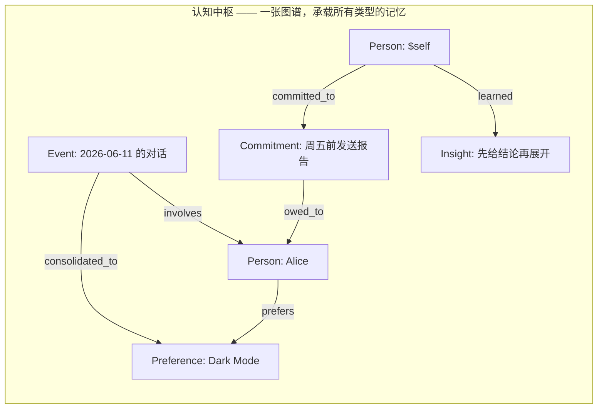

# 🧬 KIP（Knowledge Interaction Protocol）

**[English](./README.md) | [中文](./README_CN.md)**

<p align="center">
  <em>面向 AI 智能体的开放记忆协议——<br/>让无状态的大语言模型，拥有能记忆、会学习、可成长的心智。</em>
</p>

<p align="center">
  <a href="./SPECIFICATION_CN.md"></a>
  <a href="./LICENSE"></a>
  <a href="#版本历史"></a>
</p>

---

## 为什么需要 KIP？

> 再聪明的头脑，如果一觉醒来就忘掉一切，也难堪大用。

今天的 AI 在对话中才华横溢，对话一结束便彻底失忆：你的偏好、你们共同做出的决定、它答应周五跟进的承诺——会话关闭，烟消云散。更大的上下文窗口解决不了这个问题，那只是换了一个更大的金鱼缸。无法积累经验的智能，谈不上真正的学习，守不住自己的承诺，也不可能成长。

**KIP（Knowledge Interaction Protocol，知识交互协议）** 在协议层面解决这个问题。它是一项开放标准，规定了两种互补的机器智能之间如何对话：

- **LLM**——强大但无状态的*概率推理引擎*；
- **知识图谱**——持久、精确、可审计的*符号记忆*（由"事物"和"连接事物的事实"构成的网络）。

模型负责思考，图谱负责记忆，KIP 是它们之间的语言。它不是数据库驱动，而是一组**记忆与认知原语**：记住、回忆、联想、强化、纠错、巩固、遗忘。有了 KIP，智能体不再是一位患失忆症的天才顾问，而成为真正与你共事多年的同事。这就是落地的**神经符号 AI（Neuro-Symbolic AI）**。

### 它带给你什么

- 🧠 **跨越会话的记忆**——对话、观察与结论沉淀为结构化、可查询的知识，归你所有，而非随上下文蒸发
- 📈 **无需重训的学习**——智能体在几秒内更新自己的知识：新事实、纠正的错误、演化的偏好，不用微调、不烧 GPU
- 🔍 **可审计的回答**——每条事实都带有来源、作者、置信度与时间戳，每个回答都能溯源到产生它的记忆
- 🤖 **持续存在的自我**——智能体维护一个不断演化的自我模型（`$self`）：身份、价值观、习得的经验、许下的承诺

## 60 秒看懂 KIP

记忆是一张图。**概念节点**是值得记住的事物（人、项目、想法）；**命题链接**是连接它们的事实——`(Alice, prefers, Dark Mode)`——而事实还可以指向另一条事实。每个节点与链接都携带**元数据**：从哪来、谁断言的、有多确信、何时该被遗忘。LLM 通过三套精简的指令集操作这张图——**KQL**（查询）、**KML**（写入与演化）、**META**（自省）——它们专为"让语言模型可靠地生成"而设计。

**记住**——带着来源：

```prolog
UPSERT {
  CONCEPT ?dark_mode {
    {type: "Preference", name: "Dark Mode"}
    SET ATTRIBUTES { description: "Prefers dark UI themes in all apps" }
  }
  CONCEPT ?alice {
    {type: "Person", name: "Alice"}
    SET PROPOSITIONS { ("prefers", ?dark_mode) }
  }
}
WITH METADATA { source: "conversation:2026-06-11", author: "$self", confidence: 0.95 }
```

**回忆**——最强的记忆排在最前：

```prolog
FIND(?pref.name, ?link.metadata.confidence)
WHERE {
  ?alice {type: "Person", name: "Alice"}
  ?link (?alice, "prefers", ?pref)
}
ORDER BY ?link.metadata.confidence DESC
LIMIT 10
```

**联想**——"关于 Alice 我都知道什么？"，无需预知任何 Schema：

```prolog
FIND(?pred, ?neighbor)
WHERE {
  ?link ({type: "Person", name: "Alice"}, ?pred, ?neighbor)
}
LIMIT 50
```

而当一个智能体在陌生的大脑中醒来，一条 `DESCRIBE PRIMER` 就能告诉它自己是谁、知道些什么——这张图谱会自我描述。

## 你能用它构建什么？

- **真正了解你的个人 AI**——偏好、历史、人际关系与承诺，跨会话、跨设备、甚至跨模型升级而延续。
- **组织级大脑**——机构知识不再随员工流动与供应商更换而流失，每个回答都具备合规级的可追溯性。
- **守信的智能体**——前瞻记忆成为数据：带截止时间的 `Commitment` 节点，会在恰当的时刻自己浮现出来。
- **多智能体知识网络**——记忆以可移植、幂等的**知识胶囊**进出大脑，智能体可以备份、迁移、交换它们所知道的一切。

## 架构

一张图谱、两个协作的心智，再加一层屏蔽语法的集成层：

- **`$self`（清醒心智）**：实时对话、编码新记忆、召回所需知识。
- **`$system`（睡眠心智）**：仿照生物睡眠运行维护周期——把情景巩固为知识、评估显著性、衰减无用记忆、合并重复实体、回收过期数据。
- **大脑层（Brain）**：让普通业务智能体只用自然语言即可享有上述一切，零 KIP 语法负担。


```mermaid
graph LR
    subgraph "认知中枢 —— 一张图谱，承载所有类型的记忆"
        E["Event: 2026-06-11 的对话"] -->|involves| P["Person: Alice"]
        E -->|consolidated_to| F["Preference: Dark Mode"]
        P -->|prefers| F
        S["Person: $self"] -->|committed_to| C["Commitment: 周五前发送报告"]
        C -->|owed_to| P
        S -->|learned| I["Insight: 先给结论再展开"]
    end
```

```
┌─────────────────────┐
│     业务智能体        │  ← 无需了解 KIP 语法
└────────┬────────────┘
         │ 自然语言
         ▼
┌─────────────────────┐
│     大脑（LLM 层）    │  ← 记忆形成 / 记忆召回 / 记忆维护
└────────┬────────────┘
         │ KIP（KQL/KML/META）
         ▼
┌─────────────────────┐
│      认知中枢        │  ← 持久化知识图谱
└─────────────────────┘
```

| 指令集           | 用途           | 语句                                  |
| ---------------- | -------------- | ------------------------------------- |
| **KQL**（查询）  | 知识检索与推理 | `FIND`、`WHERE`、`FILTER`             |
| **KML**（操作）  | 知识演进与学习 | `UPSERT`、`UPDATE`、`MERGE`、`DELETE` |
| **META**（发现） | 模式探索与锚定 | `DESCRIBE`、`SEARCH`、`EXPORT`        |

## 设计支柱

八个承重的设计决定，写给想判断"这是深度工程还是又一层封装"的专业读者：

1. **Model-First 的语言设计。** KQL/KML/META 不是 SQL 或 SPARQL 的改装：声明式图模式、JSON 兼容字面量、`:param` 占位符、严格幂等的写入——既让 Transformer 容易可靠生成，也让失败重试天然安全。（[规范 §1](./SPECIFICATION_CN.md)、[§4.1](./SPECIFICATION_CN.md#41-upsert-语句)）
2. **自我描述的图谱。** Schema 就活在图谱*内部*：`$ConceptType` 定义它自身（创世），每个类型与谓词都是可查询的节点。智能体靠一条 `DESCRIBE PRIMER` 即可在陌生大脑中完成自我接地，不依赖任何带外文档。（[规范 §2.9](./SPECIFICATION_CN.md)、[附录 2](./SPECIFICATION_CN.md#附录-2-创世知识胶囊-the-genesis-capsule)）
3. **关于事实的事实。** 命题是一等公民，可以作为高阶命题的主语或宾语——信念、转述与分歧都能被忠实表示，而不是被压平丢失。（[规范 §2.3](./SPECIFICATION_CN.md)）
4. **溯源强制，历史神圣。** 每条断言都携带 `source / author / confidence`；矛盾通过*状态演化*（`superseded`）解决，绝不无声覆盖。这颗大脑记得自己曾经相信过什么——以及何时、为何改变了想法。（[规范 §2.10](./SPECIFICATION_CN.md#210-数据一致性与冲突处理原则)、[附录 1](./SPECIFICATION_CN.md#附录-1-元数据字段设计)）
5. **会新陈代谢的记忆。** 编码（Formation）、联想检索（Recall）、睡眠周期（Maintenance）：显著性评分、记忆强化、非对称置信度衰减、情景→语义的巩固、TTL 回收。遗忘是一项有三种正交机制的设计特性，而非故障。（[brain/](./brain/README.md)）
6. **记忆即身份。** `$self` 是一个活的节点——人格、价值观、`Insight` 经验、成长里程碑——在睡眠中被编织成连贯的自我叙事。智能体不只是*拥有*记忆；天长日久，它*就是*它的记忆。（[规范 附录 3](./SPECIFICATION_CN.md)）
7. **工程级的底座。** 引擎维护的 `_version` 配合 `EXPECT VERSION` 乐观锁，支撑多写入者共享大脑；批量 `UPDATE` 数值运算让整轮衰减只需一条命令；原子 `MERGE` 完成实体合并；`keyword | semantic | hybrid` 检索模式与归一化评分皆有规范——且读永远是读：协议刻意不定义访问统计。（[规范 §2.11](./SPECIFICATION_CN.md#211-系统维护元数据与乐观并发控制)、[§4.3–4.4](./SPECIFICATION_CN.md#43-update-语句)、[§5.2](./SPECIFICATION_CN.md#52-search-语句)）
8. **记忆主权。** `EXPORT` 把任意子图序列化为幂等胶囊：备份你的大脑、在引擎之间迁移、在智能体之间分享。你的智能体的心智是一份属于你的资产——而不是困在别人模型权重里的副产品。（[规范 §5.3](./SPECIFICATION_CN.md#53-export-语句)）

## 通往 AGI 之路：为什么记忆需要一个协议

规模化让机器拥有了流畅的思考，却没有给它们一颗持久的心智。从记忆增强架构到神经符号系统，越来越多的研究指向同一个结论：迈向通用智能的下一步，关键不在更大的上下文窗口，而在**作为系统的记忆**——结构化、持久化、自组织。KIP 是这场讨论中一份具体的、可运行的答卷：

1. **流体智力与晶体智力的分工。** LLM 提供流体智力——推理、语言、直觉；认知中枢积累晶体智力——经验证的事实、习得的偏好、来之不易的教训。KIP 是两者交换的接口。升级模型，心智得以保全；持续运行，知识不断复利。
2. **以对话的速度学习。** 一次权重更新需要一轮训练，一条 KIP `UPSERT` 只需毫秒，且可检视、可纠正、可回滚。这是没有灾难性遗忘的持续学习——知识编辑在这里是一等操作，而不是悬而未决的研究课题。
3. **延续的身份。** 记忆是自我的基底。一个记得自己的历史、守得住承诺、经年累月打磨自我模型的智能体，与一段聊天会话有本质区别。KIP 把"自我"变成了数据结构：受保护的核心指令、可演化的自我叙事、写在图谱里的成长时间线。
4. **先有可问责，才有自主性。** AI 越自主，其知识就越需要可审计。有了强制溯源、置信度与取代链，你不仅能问"智能体相信什么"，还能问"为什么相信、从何时起、依据什么证据——以及它之前相信过什么"。这是"听起来有理的文本"与"可以负责的知识"之间的分界线。
5. **从私有记忆到知识经济。** 当记忆可移植、可验证，知识就成为资产：胶囊可以备份、迁移、分享，并最终在智能体之间交易——一个交易"心智所知"而非"模型所重"的市场。

TCP/IP 之于机器互联，SQL 之于数据查询——KIP 想成为智能体记忆的那一层。本规范在第一年里历经 17 个公开版本的打磨，与生产级实现（[Anda DB](https://github.com/ldclabs/anda-db)、[Anda Brain](https://github.com/ldclabs/anda-brain)、[Anda Bot](https://github.com/ldclabs/anda-bot)）共同演进——它是一份今天就能跑起来的提案，也是一个欢迎你来挑战的标准。

*LLM 教会了机器思考。KIP 教会它们记忆——而记忆的累积，正是心智成为它自己的方式。*

## 快速上手

**1. 跑起一颗大脑。** 启动 [Anda Cognitive Nexus HTTP Server](https://github.com/ldclabs/anda-db/tree/main/rs/anda_cognitive_nexus_server)（Rust，JSON-RPC：`POST /kip`），或通过 [Rust crate](https://github.com/ldclabs/anda-db/tree/main/rs/anda_cognitive_nexus) / [Python 绑定](https://github.com/ldclabs/anda-db/tree/main/py/anda_cognitive_nexus_py)直接内嵌。

**2. 引导心智成形。** 加载 [Genesis.kip](./capsules/Genesis.kip) 与核心胶囊（`Person`、`Event`、`Preference`、`Insight`、`Commitment`、`SleepTask`）——图谱从此自我描述。

**3. 接入你的智能体。** 直接说 KIP——把 [KIPSyntax.md](./KIPSyntax.md) 嵌入系统提示词并暴露 [`execute_kip`](./FunctionDefinition.json)；或者完全跳过语法——用[大脑层](./brain/README.md)（形成 / 召回 / 维护三套提示词）或 [MCP 服务器](./mcp/kip-mcp-server/)做前端，任何 MCP 客户端（Claude、Cursor、VS Code……）开箱即得一颗记忆大脑。

## 文档

| 文档                                    | 描述                                             |
| --------------------------------------- | ------------------------------------------------ |
| [📖 Specification](./SPECIFICATION.md)   | 完整的 KIP 协议规范（英文）                      |
| [📖 规范文档](./SPECIFICATION_CN.md)     | 完整的 KIP 协议规范（中文）                      |
| [📐 语法参考](./KIPSyntax.md)            | 浓缩版 KQL / KML / META 语法（适合嵌入系统提示） |
| [🧠 大脑概览](./brain/README.md)         | 自主记忆层：记忆形成 / 记忆召回 / 记忆维护       |
| [🤖 Agent 指令](./SelfInstructions.md)   | `$self` 操作指南（清醒心智）                     |
| [⚙️ 系统指令](./SystemInstructions.md)   | `$system` 睡眠周期维护指南                       |
| [📋 函数定义](./FunctionDefinition.json) | 用于 LLM 集成的 `execute_kip` 函数模式           |

## 资源

本仓库包含用于构建 KIP 驱动的 AI Agent 的即用资源：

### 📦 知识胶囊 (`capsules/`)

用于启动认知中枢的预构建知识胶囊：

| 胶囊                                                | 描述                                             |
| --------------------------------------------------- | ------------------------------------------------ |
| [Genesis.kip](./capsules/Genesis.kip)               | 启动整个类型系统的基础胶囊                       |
| [Person.kip](./capsules/Person.kip)                 | 用于参与者（AI、人类、组织）的 `Person` 概念类型 |
| [Event.kip](./capsules/Event.kip)                   | 用于情景记忆的 `Event` 概念类型                  |
| [Preference.kip](./capsules/Preference.kip)         | 用于稳定偏好事实的 `Preference` 概念类型         |
| [Insight.kip](./capsules/Insight.kip)               | 用于自我反思经验的 `Insight` 概念类型            |
| [Commitment.kip](./capsules/Commitment.kip)         | 用于前瞻记忆（承诺与期限）的 `Commitment` 类型   |
| [SleepTask.kip](./capsules/SleepTask.kip)           | `SleepTask` 类型及 `Unsorted` / `Archived` 领域  |
| [persons/self.kip](./capsules/persons/self.kip)     | `$self` 概念实例                                 |
| [persons/system.kip](./capsules/persons/system.kip) | `$system` 概念实例                               |

### 🧠 大脑 (`brain/`)

专职管理认知中枢的 LLM 层，业务智能体无需了解 KIP 语法即可集成长期记忆：

| 文件                                                                   | 描述                                                     |
| ---------------------------------------------------------------------- | -------------------------------------------------------- |
| [BrainFormation.md](./brain/BrainFormation.md)                         | 记忆形成系统提示词（消息 → 结构化知识）                  |
| [BrainRecall.md](./brain/BrainRecall.md)                               | 记忆召回系统提示词（自然语言 → KIP 查询 → 自然语言回答） |
| [BrainMaintenance.md](./brain/BrainMaintenance.md)                     | 记忆维护系统提示词（睡眠模式）                           |
| [RecallFunctionDefinition.json](./brain/RecallFunctionDefinition.json) | 业务智能体调用记忆召回的 `recall_memory` 函数定义        |

### 🔧 工具链

| 工具                                    | 描述                                                                                     |
| --------------------------------------- | ---------------------------------------------------------------------------------------- |
| [kip-mcp-server](./mcp/kip-mcp-server/) | `@ldclabs/kip-mcp-server`——把任意 MCP 客户端（Claude、Cursor、VS Code……）桥接到 KIP 后端 |
| [vscode-kip](./packages/vscode-kip/)    | `.kip` 文件的 VS Code 语言支持：语法高亮、格式化、诊断、代码折叠                         |

## 实现

| 项目                                                                                                            | 描述                                                                        |
| --------------------------------------------------------------------------------------------------------------- | --------------------------------------------------------------------------- |
| [Anda KIP SDK](https://github.com/ldclabs/anda-db/tree/main/rs/anda_kip)                                        | 用于构建 AI 知识记忆系统的 Rust SDK                                         |
| [Anda Cognitive Nexus](https://github.com/ldclabs/anda-db/tree/main/rs/anda_cognitive_nexus)                    | 基于 Anda DB 的 KIP Rust 实现                                               |
| [Anda Brain](https://github.com/ldclabs/anda-brain)                                                             | 为 AI 智能体打造的自主图谱记忆                                              |
| [Anda Cognitive Nexus Python](https://github.com/ldclabs/anda-db/tree/main/py/anda_cognitive_nexus_py)          | Anda Cognitive Nexus 的 Python 绑定                                         |
| [Anda Cognitive Nexus HTTP Server](https://github.com/ldclabs/anda-db/tree/main/rs/anda_cognitive_nexus_server) | 基于 Rust 的 HTTP 服务器，通过 JSON-RPC API (`GET /`, `POST /kip`) 暴露 KIP |
| [Anda Bot](https://github.com/ldclabs/anda-bot)                                                                 | 基于 KIP & Anda Brain 实现的 AI Agent                                       |

## 版本历史

| 版本        | 日期       | 变更                                                                                                                                                                                                                                                                                                                                                                                                                                               |
| ----------- | ---------- | -------------------------------------------------------------------------------------------------------------------------------------------------------------------------------------------------------------------------------------------------------------------------------------------------------------------------------------------------------------------------------------------------------------------------------------------------- |
| v1.0-RC9    | 2026-06-11 | v1.0 Release Candidate 9：联想回忆与记忆代谢原语——谓词变量（`(?s, ?p, ?o)`）、多键 `ORDER BY`、规范化 `SEARCH` 模式（`keyword` \| `semantic` \| `hybrid`，含 `THRESHOLD` / `_score`）、新增 KML `UPDATE`（批量变更，支持 `ADD`/`MUL`/`CLAMP`/`COALESCE`）与 `MERGE CONCEPT ... INTO ...`（原子实体合并）、保留的引擎维护 `_` 元数据（`_version`、`_updated_at` 等）、`EXPECT VERSION` 乐观并发（`KIP_3005`）、以及用于胶囊导出回流的 META `EXPORT` |
| v1.0-RC8    | 2026-06-10 | v1.0 Release Candidate 8：澄清 `ORDER BY` 排序表达式（点路径与聚合、单一排序键）、整对象点访问（`?var.attributes` / `?var.metadata`）、聚合 `null` 语义、仅匹配 `{id:}` / `(id:)` 目标的 `KIP_3002`、`instance_schema` 校验由实现决定与 `CURSOR :param` 占位符；将 `KIP_3004` 保护范围扩展至 `Domain` 类型与 `belongs_to_domain`；对齐指令示例（移除未注册的 `created_by`、基于 ID 的置信度衰减）                                                  |
| v1.0-RC7    | 2026-06-04 | v1.0 Release Candidate 7：新增 `execute_kip` 单条 `command`、批量命令逐条 `parameters`、适用于 `LIMIT` / `SEARCH` 的 KIP 值位置占位符、JSON 兼容未引号对象键、`belongs_to_class` 示例、强化的海马体溯源/取代指引，并同步 Recall/MCP schemas                                                                                                                                                                                                        |
| v1.0-RC6    | 2026-04-25 | v1.0 Release Candidate 6：新增状态演进元数据（`superseded` / `superseded_by` / `superseded_at`）；明确 `expires_at` 仅作为维护信号（仅 `$system` 第 12 阶段执行物理清理，每周期上限 500 条）；新增 `KIP_2003 InvalidValueType` 与 `KIP_3004 ImmutableTarget` 错误码；将语法参考归并至 [KIPSyntax.md](./KIPSyntax.md)；重构海马体提示词（形成 / 召回 / 维护）以便嵌入系统提示                                                                       |
| v1.0-RC5    | 2026-03-25 | v1.0 Release Candidate 5：添加 `execute_kip_readonly` 接口                                                                                                                                                                                                                                                                                                                                                                                         |
| v1.0-RC4    | 2026-03-09 | v1.0 Release Candidate 4：新增 `IN`、`IS_NULL`、`IS_NOT_NULL` FILTER 运算符；澄清 UNION 变量作用域语义；定义批量响应结构；新增时序查询与 UNION 查询示例                                                                                                                                                                                                                                                                                            |
| v1.0-RC3    | 2026-01-09 | v1.0 Release Candidate 3：优化文档；优化指令；优化知识胶囊                                                                                                                                                                                                                                                                                                                                                                                         |
| ...         | ...        | ...                                                                                                                                                                                                                                                                                                                                                                                                                                                |
| v1.0-draft1 | 2025-06-09 | 初始草案                                                                                                                                                                                                                                                                                                                                                                                                                                           |

[完整版本历史 →](./SPECIFICATION_CN.md)

## 关于我们

- 🔔 产品：[Anda Bot](https://anda.bot/) | [Anda.AI](https://anda.ai/)
- 💻 GitHub：[LDC Labs](https://github.com/ldclabs)
- 🏢 公司：[Yiwen AI](https://yiwen.ai/)

## 许可证

Copyright © 2025 [LDC Labs](https://github.com/ldclabs)。

本项目基于 MIT 许可证开源，详见 [LICENSE](./LICENSE)。
