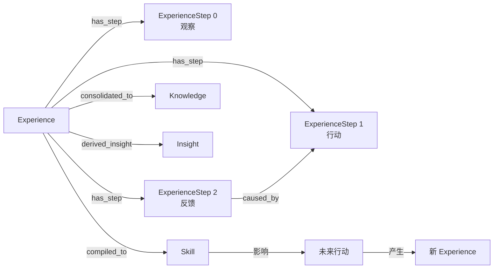

# 🧬 KIP（Knowledge Interaction Protocol，知识交互协议）

**[English](./README.md) | [中文](./README_CN.md)**

<p align="center">
  <em>面向 AI 智能体的开放式经验学习协议——<br/>把交互沉淀为记忆、知识和技能，再带回下一次行动。</em>
</p>

<p align="center">
  <a href="./SPECIFICATION_CN.md"></a>
  <a href="#经验学习-profile"></a>
  <a href="./LICENSE"></a>
</p>

---

## 为什么需要 KIP？

一次会话中的有效做法，未必会自动进入下一次会话。更长的上下文可以延后遗忘，向量检索可以找回相似文字，但它们通常不会明确记录：当时要完成什么、哪个动作改变了局面、哪项观察推翻了预期，以及这些信息应怎样影响下一步。

KIP 要解决的是完整的学习闭环：

```text
经验 → 记忆 → 知识 → 技能 → 行动
  ▲                         │
  └──────── 新反馈 ─────────┘
```

- **经验（Experience）**保存主体围绕目标走过的状态—决策—行动—反馈轨迹。
- **记忆（Memory）**让过去参与未来的计算。
- **知识（Knowledge）**从证据和经验中压缩出稳定规律。
- **技能（Skill）**把经验编译成选择行动的策略。
- **行动（Action）**把策略带回现实，并产生新的经验。

协议连接两类互补的机器智能：

- **LLM**：能力强、但本身不保存长期状态的概率推理与策略引擎；
- **认知中枢（Cognitive Nexus）**：持久、精确、可审计的符号化记忆与学习底座。

模型负责理解和行动，图谱负责保存和整理真正有用的过去，KIP 则规定两者怎样对话。它不是数据库驱动，而是一组认知原语：**记住、重放、联想、强化、纠正、巩固、编译技能和遗忘**。

### 它能带来什么

- **保存轨迹，不只保存文字**：目标、行动、观察、结果和预测误差可以作为一段完整 Experience 被查询和重放。
- **跨会话的长期记忆**：Event、Experience、事实、偏好、洞见、技能和承诺都保存在可回访的图谱中。
- **在线更新学习结果**：新出现的成功和失败证据可以直接修正 Knowledge 与 Skill，不必等待模型权重更新。
- **面向行动的召回**：行动前可生成 Action Briefing，带回适用技能、相似经验、约束、风险和承诺。
- **可追溯**：断言带有来源、作者、置信度和时间状态；知识与技能可以追溯到原始证据。
- **持续的自我模型**：`$self` 可以积累身份、价值观、教训、承诺，以及行为变化的历史。
- **可迁移**：幂等的知识胶囊可用于备份、迁移和交换自描述记忆图。

## 60 秒了解 KIP

认知中枢是一张图。**概念节点（Concept Node）**表示值得记住的事物，**命题链接（Proposition Link）**表示连接它们的有类型断言。断言本身也能成为主语或宾语，因此 KIP 可以表达来源、归因、分歧和信念演变。

LLM 通过三组紧凑指令操作这张图：

| 指令集 | 用途 | 语句 |
| --- | --- | --- |
| **KQL** | 检索与图推理 | `FIND`、`WHERE`、`FILTER` |
| **KML** | 形成、纠正和演化记忆 | `UPSERT`、`UPDATE`、`MERGE`、`DELETE` |
| **META** | 接地、发现和迁移 | `DESCRIBE`、`SEARCH`、`EXPORT` |

**带来源地记住一条事实：**

```prolog
UPSERT {
  CONCEPT ?dark_mode {
    {type: "Preference", name: "Dark Mode"}
    SET ATTRIBUTES { description: "Prefers dark UI themes in all apps" }
  }
  CONCEPT ?alice {
    {type: "Person", name: "Alice"}
    SET PROPOSITIONS { ("prefers", ?dark_mode) }
  }
}
WITH METADATA {
  source: "conversation:2026-06-11",
  author: "$self",
  confidence: 0.95,
  memory_strength: 0.80
}
```

**优先召回当前较强的断言：**

```prolog
FIND(?pref.name, ?link.metadata.confidence, ?link.metadata.memory_strength)
WHERE {
  ?alice {type: "Person", name: "Alice"}
  ?link (?alice, "prefers", ?pref)
  FILTER(IS_NULL(?link.metadata.superseded) || ?link.metadata.superseded == false)
}
ORDER BY ?link.metadata.memory_strength DESC, ?link.metadata.confidence DESC
LIMIT 10
```

**事先不知道 Schema，也能做关联探索：**

```prolog
FIND(?predicate, ?neighbor)
WHERE {
  ?link ({type: "Person", name: "Alice"}, ?predicate, ?neighbor)
}
LIMIT 50
```

当智能体第一次进入一张陌生图谱，`DESCRIBE PRIMER` 会告诉它自己是谁、有哪些 Domain，以及有哪些类型和谓词可以使用。图谱能够描述自身。

## 经验学习 Profile

KIP Core 仍是一套通用图协议。经验学习是在它之上用普通 KIP 胶囊搭出来的**认知记忆 Profile**，不需要修改 KQL、KML 或 META 语法。

### 核心模型

| 概念 | 它回答什么问题 | 表示形式 |
| --- | --- | --- |
| `Event` | 发生了什么？ | 有时间边界的事件或交互摘要 |
| `Experience` | 追求目标时走过了什么路径，哪里发生了变化？ | 目标导向轨迹 |
| `ExperienceStep` | 这一刻观察了什么、决定了什么、做了什么或收到了什么反馈？ | 有序轨迹记录 |
| `Insight` | 应该记住哪条陈述式教训？ | 可独立阅读的反思性知识 |
| `Skill` | 处在这类状态时，应该用什么策略行动？ | 程序性记忆 |

同一段现实过程可以同时留下 Event 和 Experience，但两者不能混用。Event 偏观察者视角，Experience 偏主体视角。没有明显目标—行动—反馈结构的普通对话，保留为 Event 就够了；包含假设、工具调用、失败、状态修正和最终结果的部署过程，才值得编码为 Experience。

`Memory`、`Knowledge` 和 `Action` 是学习闭环中的功能角色，不是必须注册的通用 Concept Type。具体语义知识仍由各 Domain 的胶囊定义；经验学习 Profile 新增三个 Concept Type（`Experience`、`ExperienceStep`、`Skill`）和四个 Proposition Type（`has_step`、`caused_by`、`derived_insight`、`compiled_to`）。


```mermaid
graph LR
    X["Experience"] -->|"has_step"| S1["ExperienceStep 0<br/>观察"]
    X -->|"has_step"| S2["ExperienceStep 1<br/>行动"]
    X -->|"has_step"| S3["ExperienceStep 2<br/>反馈"]
    S3 -->|"caused_by"| S2
    X -->|"consolidated_to"| K["Knowledge"]
    X -->|"derived_insight"| I["Insight"]
    X -->|"compiled_to"| P["Skill"]
    P -->|"影响"| A["未来行动"]
    A -->|"产生"| NX["新 Experience"]
```

`ExperienceStep.index` 只规定时间顺序。`caused_by` 是可选的显式因果断言：**先发生，不等于由它导致。**

### 预期是重要的学习信号

当现实没有按主体的模型运行时，经验的学习价值往往最高：

```text
预期观察 → 实际观察 → 预测误差 → 策略更新
```

因此 `ExperienceStep` 支持 `expected_observation`、`actual_observation` 和 `prediction_error`。Experience 还可以保存整体 `surprise_score`，用于显著性和巩固优先级计算。

### 置信度不等于记忆强度

Profile 把三类信号分开：

| 信号 | 含义 | 通常因何变化 |
| --- | --- | --- |
| `metadata.confidence` | 证据在多大程度上支持这条断言 | 新证据、矛盾、纠正 |
| `metadata.memory_strength` | 这段记忆当前有多容易访问、在召回时有多强的竞争力 | 强化、成功复用、随时间衰减 |
| `attributes.salience_score` | Event 或 Experience 有多值得编码和巩固 | 目标相关性、意外程度、结果影响、新颖性、情绪、复用价值 |

一条事实可能长期没有用到，但仍然高度可信；此时 `confidence` 可以保持很高，`memory_strength` 则逐渐降低。一段刚发生的 Experience 也可能很醒目，却还不足以支持高置信度的因果解释。Maintenance 不能再用 `confidence` 代替召回频率或遗忘强度。

### 从 Experience 到 Skill

程序性巩固不是把一段轨迹改写成摘要，而是比较多段轨迹：

1. 按目标、初始状态、Domain、工具和结果聚类 Experience。
2. 对照成功与失败轨迹。
3. 找出真正改变结果的决策或行动；不能从先后顺序直接推断因果。
4. 编译候选 `Skill`，写清触发条件、前置条件、步骤、分支、成功标准和失败信号。
5. 用 `compiled_to` 与反向 `derived_from` 保留每条来源。
6. 在后续 Experience 中验证策略，按证据增强、收窄、转入复查或废弃。

`Skill.execution_mode` 表示能力边界（`advisory`、`supervised`、`autonomous`），不构成绕过应用授权或安全策略的许可。

### Action Briefing

Recall 不应止于“有哪些相关内容”。在执行重要动作之前，Action Briefing 可以组织出：

- 当前目标和已知约束；
- 相似的成功与失败 Experience；
- 适用的 Skill，以及成熟度、置信度和失败信号；
- 相关 Knowledge 与 Insight；
- 尚未解决的矛盾、风险和到期 Commitment。

这也是判断一条信息是否构成功能性记忆的办法：如果删掉它不会改变任何相关的未来状态、预测或行动，它更接近档案，而不是正在发挥作用的记忆。

## 一个完整的 Experience 示例

下面的例子只使用现有 KIP Core 语法。执行前先加载 Experience Learning Profile 的胶囊。

```prolog
UPSERT {
  CONCEPT ?observe_failure {
    {type: "ExperienceStep", name: "Experience:2026-08-13T09:00:deploy-v2:Step:00"}
    SET ATTRIBUTES {
      index: 0,
      kind: "observation",
      summary: "The v2 service failed its health check after deployment",
      timestamp: "2026-08-13T09:00:00Z",
      actual_observation: "health endpoint returned 503"
    }
    SET PROPOSITIONS { ("belongs_to_domain", {type: "Domain", name: "Unsorted"}) }
  }
  WITH METADATA {
    source: "execution-trace:deploy-v2", author: "$self",
    created_at: "2026-08-13T09:10:00Z", observed_at: "2026-08-13T09:00:00Z",
    confidence: 0.95, memory_strength: 0.90,
    memory_tier: "short-term", expires_at: "2026-09-12T09:10:00Z"
  }
  CONCEPT ?check_database {
    {type: "ExperienceStep", name: "Experience:2026-08-13T09:00:deploy-v2:Step:01"}
    SET ATTRIBUTES {
      index: 1,
      kind: "action",
      summary: "Checked the active database target before retrying migration",
      timestamp: "2026-08-13T09:03:00Z",
      tool: "database-inspector",
      expected_observation: "the service points to the migrated database",
      actual_observation: "the service points to the old database",
      prediction_error: "the assumed migration problem was actually a connection-target problem",
      success: true
    }
    SET PROPOSITIONS { ("belongs_to_domain", {type: "Domain", name: "Unsorted"}) }
  }
  WITH METADATA {
    source: "execution-trace:deploy-v2", author: "$self",
    created_at: "2026-08-13T09:10:00Z", observed_at: "2026-08-13T09:03:00Z",
    confidence: 0.95, memory_strength: 0.90,
    memory_tier: "short-term", expires_at: "2026-09-12T09:10:00Z"
  }
  CONCEPT ?experience {
    {type: "Experience", name: "Experience:2026-08-13T09:00:deploy-v2"}
    SET ATTRIBUTES {
      experience_class: "problem_solving",
      goal: "Deploy service v2 with a healthy database connection",
      initial_state: {service_version: "v2", assumed_database: "migrated-primary"},
      status: "completed",
      outcome: "Corrected the database target and completed the deployment",
      success: true,
      prediction_error: "The service was connected to the old database, not the migrated primary",
      surprise_score: 82,
      learning_value: 91,
      started_at: "2026-08-13T09:00:00Z",
      ended_at: "2026-08-13T09:10:00Z",
      consolidation_status: "pending",
      salience_score: 86
    }
    SET PROPOSITIONS {
      ("involves", {type: "Person", name: "$self"})
      ("belongs_to_domain", {type: "Domain", name: "Unsorted"})
      ("has_step", ?observe_failure) WITH METADATA {
        source: "execution-trace:deploy-v2", author: "$self",
        created_at: "2026-08-13T09:10:00Z", confidence: 0.95,
        memory_strength: 0.90, expires_at: "2026-09-12T09:10:00Z"
      }
      ("has_step", ?check_database) WITH METADATA {
        source: "execution-trace:deploy-v2", author: "$self",
        created_at: "2026-08-13T09:10:00Z", confidence: 0.95,
        memory_strength: 0.90, expires_at: "2026-09-12T09:10:00Z"
      }
    }
  }
  WITH METADATA {
    source: "execution-trace:deploy-v2", author: "$self",
    created_at: "2026-08-13T09:10:00Z", observed_at: "2026-08-13T09:10:00Z",
    confidence: 0.95, memory_strength: 0.90,
    memory_tier: "short-term", expires_at: "2026-09-12T09:10:00Z"
  }
}

UPSERT {
  CONCEPT ?experience {
    {type: "Experience", name: "Experience:2026-08-13T09:00:deploy-v2"}
  }
  CONCEPT ?skill {
    {type: "Skill", name: "Skill:deployment:verify-database-target"}
    SET ATTRIBUTES {
      skill_class: "diagnostic",
      description: "Verify the active database target before treating a deployment failure as a migration failure",
      goal: "Distinguish database-target failures from migration failures early",
      trigger_conditions: ["new deployment fails startup or health checks", "database schema error is suspected"],
      preconditions: ["database target is inspectable"],
      procedure: ["read the service's active database target", "compare it with the migrated target", "only then inspect or rerun migrations"],
      expected_outcome: "database target mismatch is confirmed or ruled out before mutation",
      success_criteria: ["active target identity is verified", "no migration is rerun against an unverified target"],
      failure_signals: ["target identity cannot be read", "multiple environments share ambiguous credentials"],
      recovery_strategy: "stop and request environment-owner verification",
      execution_mode: "supervised",
      maturity: "candidate",
      evidence_count: 1,
      success_count: 1,
      failure_count: 0,
      last_validated_at: "2026-08-13T09:10:00Z"
    }
    SET PROPOSITIONS {
      ("derived_from", ?experience)
      ("belongs_to_domain", {type: "Domain", name: "Unsorted"})
    }
  }
  WITH METADATA {
    source: "ProceduralConsolidation",
    author: "$system",
    created_at: "2026-08-13T10:00:00Z",
    confidence: 0.72,
    memory_strength: 0.85
  }
  PROPOSITION ?compilation {
    (?experience, "compiled_to", ?skill)
  }
  WITH METADATA {
    source: "ProceduralConsolidation",
    author: "$system",
    created_at: "2026-08-13T10:00:00Z",
    confidence: 0.72,
    memory_strength: 0.85
  }
}
```

## 架构

```text
┌─────────────────────┐
│   Business Agent    │  ← 目标、决策、行动和用户交互
└────────┬────────────┘
         │ 自然语言 + 结构化轨迹
         ▼
┌─────────────────────┐
│       Brain         │  ← Formation / Recall / Maintenance
└────────┬────────────┘
         │ KIP（KQL / KML / META）
         ▼
┌─────────────────────┐
│  Cognitive Nexus    │  ← Event / Experience / Knowledge / Skill / Self
└─────────────────────┘
```

- **Formation** 判断记忆边界，编码 Event 与 Experience，保留来源和预测误差，不保存噪声或隐式思维链。
- **Recall** 执行联想召回与轨迹重放，也可以生成会改变下一步行动的 Action Briefing。
- **Maintenance** 把 Event 与 Experience 巩固成 Knowledge、Insight、Skill 和连贯的自我模型，同时完成强化、纠正、取代、衰减、归档和遗忘。

## 兼容性约定

Experience Learning Profile 是纯增量扩展：

- **不改语法。** 现有 KQL、KML 和 META 解析器继续有效。
- **不加基础值类型。** Profile 只使用已有的 Concept、Proposition、Object、Array、number、string 和 boolean。
- **不改身份规则。** Concept 仍由 `id` 或 `{type, name}` 标识；Proposition 仍由 `id` 或 `(subject, predicate, object)` 标识。
- **自举过程幂等。** 所有 Profile 胶囊都使用普通 `UPSERT`，可安全重放。
- **Schema 仍是建议性约束。** 只理解 KIP Core 的引擎也能存取这些类型，无需写 Profile 专用代码。
- **旧记忆继续有效。** 只使用 Event 的图谱无需迁移，可以逐步引入 Experience 和 Skill。
- **既有谓词只扩宽，不收窄。** `involves`、`mentions`、`consolidated_to` 和 `derived_from` 保留原有合法组合，并增加对 Experience 的支持。

KIP Core 规定协议；胶囊定义认知词汇；Anda Brain 负责把 Experience Learning Loop 落成智能体行为。

## 设计原则

1. **面向模型设计语言。** 声明式图模式、JSON 兼容值、参数和幂等写入，让模型更容易生成可靠命令，也便于失败后重试。([规范 §1](./SPECIFICATION_CN.md#1-简介与设计哲学))
2. **图谱能够自描述。** 类型和谓词都存在图内；`DESCRIBE PRIMER` 可以在没有外部 Schema 文档时为智能体接地。([规范 §2.9](./SPECIFICATION_CN.md#29-知识自举与元定义knowledge-bootstrapping--meta-definition))
3. **Experience 是轨迹，不是文本块。** Profile 保存目标、状态、决策、行动、反馈、结果和预测误差。
4. **顺序不是因果。** Step 的 `index` 负责排序；`caused_by` 只有在证据充分时才创建。
5. **事实也能成为事实的对象。** 高阶命题可以表示归因、置信度、分歧和信念演变。([规范 §2.3](./SPECIFICATION_CN.md#23-命题链接proposition-link))
6. **来源必填，历史保留。** 纠正通过状态演变与 supersession 完成，不静默覆盖旧值。([规范 §2.10](./SPECIFICATION_CN.md#210-数据一致性与冲突处理原则))
7. **语义巩固和程序性巩固是两条管线。** Experience 可以压缩成 Knowledge 或 Insight，也可以编译成 Skill；两者不能相互替代。
8. **记忆强度不是真值。** 保留与召回机制不能偷偷改写认知置信度。
9. **记忆需要代谢。** Formation、Recall 和 Maintenance 把巩固、强化、遗忘和再巩固纳入整体架构。([brain/](./brain/README_CN.md))
10. **记忆归用户所有。** `EXPORT` 可将子图导出为可迁移、可重放的幂等胶囊。([规范 §5.3](./SPECIFICATION_CN.md#53-export-语句))

## 可以用它做什么

- **会在使用中成长的个人 AI**：不仅记得偏好和承诺，也记得过去的尝试为什么成功或失败。
- **组织经验系统**：决策依据、事故轨迹、运营知识和验证过的流程不会随着人员或模型更替而消失。
- **无需重训的持续改进智能体**：新 Experience 直接更新可检查的 Knowledge 和 Skill。
- **面向行动的副驾驶**：在部署、诊断、谈判或高风险决策前，先调出适用策略和反例。
- **多智能体学习网络**：在明确来源和置信度的前提下交换 Knowledge 与 Skill 胶囊。

## 快速上手

1. **运行认知中枢。** 可使用 [Anda Cognitive Nexus HTTP Server](https://github.com/ldclabs/anda-db/tree/main/rs/anda_cognitive_nexus_server)、[Rust crate](https://github.com/ldclabs/anda-db/tree/main/rs/anda_cognitive_nexus) 或 [Python binding](https://github.com/ldclabs/anda-db/tree/main/py/anda_cognitive_nexus_py)。
2. **加载 KIP Core。** 先加载 [Genesis.kip](./capsules/Genesis.kip)，再加载 `Person`、`Event`、`Preference`、`Insight`、`Commitment` 和 `SleepTask`，以及共享的情景/溯源谓词胶囊 `involves`、`mentions`、`consolidated_to`、`derived_from`。
3. **加载 Experience Learning Profile。** 依次加载 `Experience`、`ExperienceStep`、`Skill` 以及四个 Experience 专属谓词胶囊。推荐顺序见下方。
4. **连接智能体。** 可嵌入 [KIPSyntax.md](./KIPSyntax.md) 并暴露 [`execute_kip`](./FunctionDefinition.json)，也可以使用 [Brain 层](./brain/README_CN.md) 或 [MCP Server](./mcp/kip-mcp-server/) 代理 KIP。

```text
capsules/Genesis.kip
capsules/Person.kip
capsules/Event.kip
capsules/Preference.kip
capsules/Insight.kip
capsules/Commitment.kip
capsules/SleepTask.kip
capsules/Experience.kip
capsules/ExperienceStep.kip
capsules/Skill.kip
capsules/involves.kip
capsules/mentions.kip
capsules/consolidated_to.kip
capsules/derived_from.kip
capsules/has_step.kip
capsules/caused_by.kip
capsules/derived_insight.kip
capsules/compiled_to.kip
```

类型胶囊排在谓词胶囊之前，确保 `subject_types` 和 `object_types` 引用已经接地。所有写入都是幂等的，完整序列可以重复执行。只使用 Event 的部署加载核心类型胶囊和四个共享谓词胶囊即可；谓词 `subject_types` / `object_types` 中的 `Experience` 引用在注册 Profile 类型之前保持休眠，无副作用。

## 文档

| 文档 | 内容 |
| --- | --- |
| [📖 Specification](./SPECIFICATION.md) | KIP Core 英文规范 |
| [📖 中文规范](./SPECIFICATION_CN.md) | KIP Core 中文规范 |
| [📐 语法速查](./KIPSyntax.md) | 适合嵌入提示词的 KQL / KML / META 语法摘要 |
| [🧠 Brain 总览](./brain/README_CN.md) | Formation / Recall / Maintenance 架构 |
| [🧭 经验学习架构](./brain/ExperienceLearningArchitecture_CN.md) | Experience Learning Loop 的理论与行为模型 |
| [🧩 认知记忆 Profile](./brain/CognitiveMemoryProfile_CN.md) | Experience 与 Skill 的具体 Schema 和操作约定 |
| [🤖 智能体指令](./SelfInstructions.md) | `$self` 的运行指南 |
| [⚙️ 系统指令](./SystemInstructions.md) | `$system` 的维护指南 |
| [📋 函数定义](./FunctionDefinition.json) | `execute_kip` 函数 Schema |
| [🗣 领域语言](./CONTEXT_CN.md) | Experience Learning 的规范术语 |

## 资源

### 📦 知识胶囊（`capsules/`）

| 胶囊 | 内容 |
| --- | --- |
| [Genesis.kip](./capsules/Genesis.kip) | 自描述 KIP 类型系统的自举入口 |
| [Person.kip](./capsules/Person.kip) | AI、人类和组织等行为主体 |
| [Event.kip](./capsules/Event.kip) | 客观情景事件 |
| [Experience.kip](./capsules/Experience.kip) | 目标导向轨迹 |
| [ExperienceStep.kip](./capsules/ExperienceStep.kip) | 有序的观察、决策、行动和反馈记录 |
| [Skill.kip](./capsules/Skill.kip) | 程序性记忆与行动策略 |
| [involves.kip](./capsules/involves.kip) | `Event / Experience → Person` 参与关系 |
| [mentions.kip](./capsules/mentions.kip) | `Event / Experience → 概念` 非参与者引用 |
| [consolidated_to.kip](./capsules/consolidated_to.kip) | `Event / Experience → 语义知识` 巩固关系 |
| [derived_from.kip](./capsules/derived_from.kip) | 指回来源 Event / Experience 的反向溯源 |
| [has_step.kip](./capsules/has_step.kip) | `Experience → ExperienceStep` 归属关系 |
| [caused_by.kip](./capsules/caused_by.kip) | 有证据支持的 Step 因果关系 |
| [derived_insight.kip](./capsules/derived_insight.kip) | `Experience → Insight` 巩固关系 |
| [compiled_to.kip](./capsules/compiled_to.kip) | `Experience → Skill` 程序性巩固关系 |
| [Preference.kip](./capsules/Preference.kip) | 稳定偏好事实 |
| [Insight.kip](./capsules/Insight.kip) | 陈述式教训与自我反思 |
| [Commitment.kip](./capsules/Commitment.kip) | 承诺、提醒和截止时间 |
| [SleepTask.kip](./capsules/SleepTask.kip) | 后台维护任务，包括 `compile_to_skill` |
| [persons/self.kip](./capsules/persons/self.kip) | `$self` 概念实例 |
| [persons/system.kip](./capsules/persons/system.kip) | `$system` 概念实例 |

### 🧠 Brain（`brain/`）

| 文件 | 内容 |
| --- | --- |
| [BrainFormation_CN.md](./brain/BrainFormation_CN.md) | 消息与结构化轨迹 → Event / Experience / Knowledge |
| [BrainRecall_CN.md](./brain/BrainRecall_CN.md) | 自然语言 → 联想召回 / 轨迹重放 / Action Briefing |
| [BrainMaintenance_CN.md](./brain/BrainMaintenance_CN.md) | 语义与程序性巩固、纠正、衰减和遗忘 |
| [RecallFunctionDefinition.json](./brain/RecallFunctionDefinition.json) | 面向业务智能体的只读记忆接口 |

### 🔧 工具

| 工具 | 内容 |
| --- | --- |
| [kip-mcp-server](./mcp/kip-mcp-server/) | 将兼容 MCP 的客户端接入 KIP 后端 |
| [vscode-kip](./packages/vscode-kip/) | `.kip` 语法高亮、格式化、诊断和折叠 |

## 实现

| 项目 | 内容 |
| --- | --- |
| [Anda KIP SDK](https://github.com/ldclabs/anda-db/tree/main/rs/anda_kip) | KIP Rust SDK |
| [Anda Cognitive Nexus](https://github.com/ldclabs/anda-db/tree/main/rs/anda_cognitive_nexus) | 基于 Anda DB 的 KIP 实现 |
| [Anda Brain](https://github.com/ldclabs/anda-brain) | 面向 AI 智能体的自主记忆与经验学习层 |
| [Anda Cognitive Nexus Python](https://github.com/ldclabs/anda-db/tree/main/py/anda_cognitive_nexus_py) | Cognitive Nexus Python 绑定 |
| [Anda Bot](https://github.com/ldclabs/anda-bot) | 基于 KIP 与 Anda Brain 的 AI 智能体 |

## 版本策略

KIP Core 与认知记忆 Profile 分开演进：

- 顶部徽章标识 KIP Core 的语法和执行约定。
- 胶囊可以新增或扩宽认知类型和谓词，不必修改 Core。
- 只有语法、执行语义、返回结构或协议级不变量发生变化时，才需要发布新的 Core 修订。

因此，Experience Learning Profile 不会重命名 KIP，也不会让已有 v1.0 客户端失效。它只是把协议原本隐含的学习目标说清楚，并用可运行的结构把它落下来。

[KIP Core 完整版本历史 →](./SPECIFICATION_CN.md)

## 关于我们

- 🔔 产品：[Anda Bot](https://anda.bot/) | [Anda.AI](https://anda.ai/)
- 💻 GitHub：[LDC Labs](https://github.com/ldclabs)
- 🏢 公司：[易文智能](https://yiwen.ai/)

## 许可证

Copyright © 2026 [LDC Labs](https://github.com/ldclabs)。

本项目使用 MIT License，详见 [LICENSE](./LICENSE)。
