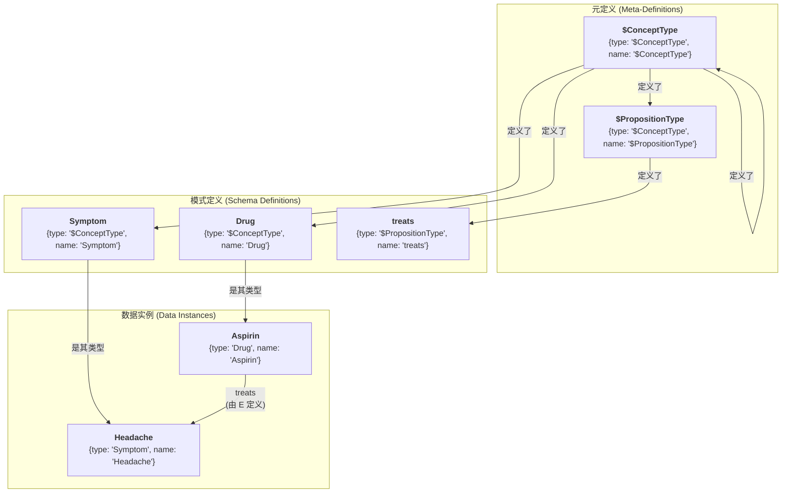
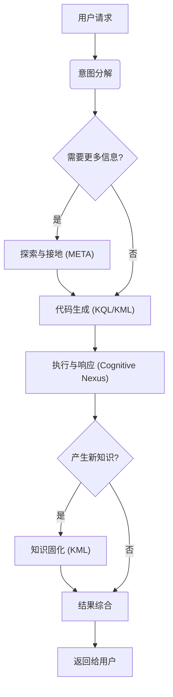

# 🧬 KIP（Knowledge Interaction Protocol，知识交互协议）规范（候选版）

**[English](./SPECIFICATION.md) | [中文](./SPECIFICATION_CN.md)**

**版本历史**：

| 版本        | 日期       | 变更说明                                                                                                                                                                                                                                                                                                                                                                                                                                                                                                                                                                   |
| ----------- | ---------- | -------------------------------------------------------------------------------------------------------------------------------------------------------------------------------------------------------------------------------------------------------------------------------------------------------------------------------------------------------------------------------------------------------------------------------------------------------------------------------------------------------------------------------------------------------------------------- |
| v1.0-draft1 | 2025-06-09 | 初始草案                                                                                                                                                                                                                                                                                                                                                                                                                                                                                                                                                                   |
| v1.0-draft2 | 2025-06-15 | 优化 `UNION` 子句                                                                                                                                                                                                                                                                                                                                                                                                                                                                                                                                                          |
| v1.0-draft3 | 2025-06-18 | 优化术语，简化语法，移除 `SELECT` 子查询，添加 `META` 子句，增强命题链接子句                                                                                                                                                                                                                                                                                                                                                                                                                                                                                               |
| v1.0-draft4 | 2025-06-19 | 简化语法，移除 `COLLECT`，`AS`，`@`                                                                                                                                                                                                                                                                                                                                                                                                                                                                                                                                        |
| v1.0-draft5 | 2025-06-25 | 移除 `ATTR` 和 `META`，引入“点表示法”取代；添加 `(id: "<link_id>")`；优化 `DELETE` 语句                                                                                                                                                                                                                                                                                                                                                                                                                                                                                    |
| v1.0-draft6 | 2025-07-06 | 确立命名规范；引入自举模型：新增 "$ConceptType", "$PropositionType" 元类型和 Domain 类型，实现模式的图内定义；添加创世知识胶囊                                                                                                                                                                                                                                                                                                                                                                                                                                             |
| v1.0-draft7 | 2025-07-08 | 使用 `CURSOR` 取代 `OFFSET` 用于分页查询；添加 Person 类型的知识胶囊                                                                                                                                                                                                                                                                                                                                                                                                                                                                                                       |
| v1.0-draft8 | 2025-07-17 | 优化文档；添加 Event 类型用于情景记忆；添加 SystemInstructions.md；添加 FunctionDefinition.json                                                                                                                                                                                                                                                                                                                                                                                                                                                                            |
| v1.0-RC     | 2025-11-19 | v1.0 Release Candidate：优化文档；添加 KIP 标准错误码                                                                                                                                                                                                                                                                                                                                                                                                                                                                                                                      |
| v1.0-RC2    | 2025-12-31 | v1.0 Release Candidate 2：优化文档；参数占位符前缀从 `?` 改为 `:`；支持命令批量执行                                                                                                                                                                                                                                                                                                                                                                                                                                                                                        |
| v1.0-RC3    | 2026-01-09 | v1.0 Release Candidate 3：优化文档；优化指令；优化知识胶囊                                                                                                                                                                                                                                                                                                                                                                                                                                                                                                                 |
| v1.0-RC4    | 2026-03-09 | v1.0 Release Candidate 4：新增 `IN`、`IS_NULL`、`IS_NOT_NULL` FILTER 运算符；澄清 UNION 变量作用域语义；定义批量响应结构；新增时序查询与 UNION 查询示例                                                                                                                                                                                                                                                                                                                                                                                                                    |
| v1.0-RC5    | 2026-03-25 | v1.0 Release Candidate 5：添加 `execute_kip_readonly` 接口                                                                                                                                                                                                                                                                                                                                                                                                                                                                                                                 |
| v1.0-RC6    | 2026-04-25 | v1.0 Release Candidate 6：对齐错误码 `KIP_2003`（`InvalidValueType`）；澄清聚合查询的隐式 `GROUP BY` 语义、路径操作符 `{0,n}` 零跳语义、`WITH METADATA` 优先级、`DELETE CONCEPT` 级联语义、`KIP_3004` 保护范围、`OPTIONAL` 空值投影、`expires_at` 生命周期与批量执行 KQL/KML 错误语义                                                                                                                                                                                                                                                                                      |
| v1.0-RC7    | 2026-06-04 | v1.0 Release Candidate 7：新增 `execute_kip` 单条 `command` 输入与批量命令的逐条 `parameters`；明确占位符替换发生在完整 KIP 值位置（包括 `LIMIT` 与 `SEARCH`）；记录 JSON 兼容对象字面量可使用未加引号的标识符键；收紧 Schema 命名、命题唯一性与基于 ID 的命题更新指引；统一示例使用 `belongs_to_class`；强化海马体 Formation/Maintenance 的 `created_at` 溯源、基于 ID 的 supersession 与维护日志读-合并-写；新增 `recall_memory.context.user` 作为 legacy alias，并同步 MCP/tool schemas                                                                                 |
| v1.0-RC8    | 2026-06-10 | v1.0 Release Candidate 8：澄清 `ORDER BY` 排序表达式（支持点路径与聚合表达式、单一排序键）；定义整对象点访问（`?var.attributes` / `?var.metadata`）；定义聚合函数的 `null` 语义（`OPTIONAL` 未命中组的 `COUNT` 为 `0`）；明确仅匹配的 `{id:}` / `(id:)` 目标不存在时返回 `KIP_3002`；将 `KIP_3004` 保护范围扩展至 `Domain` 类型与 `belongs_to_domain` 定义；声明 `instance_schema` 的强制校验由实现决定；允许 `CURSOR :param` 占位符；移除指令示例中未注册的 `created_by` 谓词，并将 `$system` 置信度衰减指引对齐为基于 ID 的命题更新                                      |
| v1.0-RC9    | 2026-06-11 | v1.0 Release Candidate 9：新增联想回忆与记忆代谢原语：命题模式中的谓词变量（`(?s, ?p, ?o)`）；多键 `ORDER BY`；规范化 `SEARCH` 检索模式（`MODE "keyword" \| "semantic" \| "hybrid"`、`THRESHOLD`、瞬态 `_score`）；新增 KML `UPDATE` 语句（基于模式匹配的批量变更，支持 `ADD` / `MUL` / `CLAMP` / `COALESCE` 更新表达式）与 `MERGE CONCEPT ... INTO ...` 语句（原子实体合并）；保留由引擎维护的 `_` 元数据命名空间（`_version`、`_updated_at`；刻意不含读取追踪统计）；`EXPECT VERSION` 乐观并发控制及新错误码 `KIP_3005`；新增 META `EXPORT` 语句以实现知识胶囊的导出回流 |

**KIP 实现**：

- [Anda KIP SDK](https://github.com/ldclabs/anda-db/tree/main/rs/anda_kip): 用于构建可持续 AI 知识记忆系统的 KIP Rust SDK。
- [Anda Cognitive Nexus](https://github.com/ldclabs/anda-db/tree/main/rs/anda_cognitive_nexus): 基于 Anda DB 的 KIP Rust 实现。
- [Anda Cognitive Nexus Python](https://github.com/ldclabs/anda-db/tree/main/py/anda_cognitive_nexus_py): Anda Cognitive Nexus 的 Python 绑定。
- [Anda Cognitive Nexus HTTP Server](https://github.com/ldclabs/anda-db/tree/main/rs/anda_cognitive_nexus_server): 基于 Rust 的 HTTP 服务器，通过 JSON-RPC API (`GET /`, `POST /kip`) 暴露 KIP
- [Anda App](https://github.com/ldclabs/anda-app): 基于 KIP 的 AI 智能体客户端应用。

**关于我们**：
[ICPanda](https://panda.fans/)：ICPanda 是一个社区驱动项目，致力于构建基础设施和应用，使 AI 智能体能作为 Web3 生态中的一等公民持续发展。

## 0. 前言

大型语言模型（LLM）展现了卓越的通用推理与生成能力，但其**“无状态”（Stateless）**的本质导致了长期记忆的缺失，而基于概率的生成机制则引发了不可控的“幻觉”与知识过时问题。

如何构建一个既能利用 LLM 强大的推理能力，又能通过结构化数据确保持久性、准确性和可追溯性的系统，是当前 AI 智能体架构的核心挑战。**神经符号人工智能（Neuro-Symbolic AI）**被认为是解决这一问题的关键路径。

**KIP（Knowledge Interaction Protocol，知识交互协议）** 为此而生。

KIP 定义了一套标准的交互协议，旨在弥合 **LLM（概率推理引擎）** 与 **知识图谱（确定性知识库）** 之间的鸿沟。它不是一个简单的数据库接口，而是一套专为智能体设计的**记忆与认知操作原语**。

通过 KIP，我们致力于实现：

1.  **记忆持久化（Persistence）**：将智能体的对话、观测与推理结果，转化为结构化的“知识胶囊”，实现记忆的原子性存储与复用。
2.  **知识动态演进（Evolution）**：提供完整的增删改查（CRUD）与元数据管理机制，使智能体具备自主更新知识库、修正错误的“学习”能力。
3.  **交互可解释（Explainability）**：将隐式的思维过程显式化为 KIP 指令，使智能体的每一次回答都有据可查，每一次决策都逻辑透明。

本规范旨在为开发者提供一套开放、通用的标准，构建下一代具备**可信记忆**与**持续学习能力**的智能体。

## 1. 简介与设计哲学

**KIP（Knowledge Interaction Protocol，知识交互协议）** 是一种专为大型语言模型设计的、面向知识图谱的交互协议。它通过定义一套标准化的指令集 (KQL/KML) 和 JSON 数据模式，规范了智能体与其外部长期记忆（Long-term Memory）之间的通信方式。

KIP 的核心目标是建立一个**统一的认知中枢（Cognitive Nexus）**，使 AI 智能体能够像使用文件系统一样自然、高效地操作复杂的知识网络。

**设计哲学：**

- **模型优先（Model-First）**：协议语法专为 Transformer 架构优化。采用 JSON 原生数据结构，指令逻辑符合自然语言推理直觉，最大限度降低 LLM 生成代码时的语法错误率。
- **意图导向（Intent-Driven）**：采用声明式（Declarative）语法。智能体只需描述“需要什么知识”或“由于什么事实要更新什么”，底层的图遍历与事务处理由协议实现层封装。
- **图原生与自描述（Graph-Native & Self-Describing）**：基于“概念-命题”的图谱结构。支持**模式自举（Schema Bootstrapping）**，即数据的类型定义（Schema）本身也存储在图中，智能体可通过查询元数据自主理解未知的知识结构。
- **原子性与幂等性（Atomicity & Idempotency）**：所有的知识写入操作（UPSERT）均被设计为原子事务，且具备幂等性。这确保了在网络波动或智能体重复推理的场景下，知识库状态的一致性与稳定性。
- **可验证性（Verifiability）**：强调“来源（Provenance）”与“上下文（Context）”。协议强制支持元数据（Metadata）绑定，确保每一条知识都能追溯其来源、置信度及生成时间。

## 2. 核心定义

### 2.1. 认知中枢（Cognitive Nexus）

一个由**概念节点**和**命题链接**构成的知识图谱，是 AI 智能体 **统一的记忆大脑**。它容纳了从短暂的情景事件到持久的语义知识等所有层次的记忆，并通过系统后台的自主进程实现记忆的**新陈代谢（巩固与遗忘）**。

### 2.2. 概念节点（Concept Node）

- **定义**：知识图谱中的**实体**或**抽象概念**，是知识的基本单元（如图中的“点”）。
- **示例**：一个名为“阿司匹林”的`Drug`节点，一个名为“头痛”的`Symptom`节点。
- **构成**：
  - `id`：String，唯一标识符，用于在图中唯一定位该节点。
  - `type`：String，节点的类型。**其值必须是一个在图中已定义的、类型为 `"$ConceptType"` 的概念节点的名称**。遵循 `UpperCamelCase` 命名法。
  - `name`：String，节点的名称。`type` + `name` 组合在图中也唯一定位一个节点。
  - `attributes`：Object，节点的属性，描述该概念的内在特性。
  - `metadata`：Object，节点的元数据，描述该概念的来源、可信度等信息。

### 2.3. 命题链接（Proposition Link）

- **定义**：一个**实体化的命题（Proposition）**，它以 `(主语, 谓词, 宾语)` 的三元组形式，陈述了一个**事实（Fact）**。它在图中作为**链接（Link）**，将两个概念节点连接起来，或实现更高阶的连接。
- **示例**：一个陈述“（阿司匹林）- [用于治疗] ->（头痛）”这一事实的命题链接。
- **构成**：
  - `id`：String，唯一标识符，用于在图中唯一定位该链接。
  - `subject`：String，关系的发起者，一个概念节点或另一个命题链接的 ID。
  - `predicate`：String，定义了主语和宾语之间的**关系（Relation）**类型。**其值必须是一个在图中已定义的、类型为 `"$PropositionType"` 的概念节点的名称**。遵循 `snake_case` 命名法。
  - `object`：String，关系的接受者，一个概念节点或另一个命题链接的 ID。
  - `attributes`：Object，命题的属性，描述该命题的内在特性。
  - `metadata`：Object，命题的元数据，描述该命题的来源、可信度等信息。

### 2.4. 知识胶囊（Knowledge Capsule）

一种幂等性的知识更新单元，是包含了一组**概念节点**和**命题链接**的知识合集，用于解决高质量知识的封装、分发和复用问题。

### 2.5. 认知引导（Cognitive Primer）

一个高度结构化、信息密度极高、专门为 LLM 设计的 JSON 兼容对象，它包含了认知中枢的全局摘要和领域地图，帮助 LLM 快速理解和使用认知中枢。

### 2.6. 属性（Attributes）与元数据（Metadata）

- **属性（Attributes）**：描述**概念**或**事实**内在特性的键值对，是构成知识记忆的一部分。
- **元数据（Metadata）**：描述**知识来源、可信度和上下文**的键值对。它不改变知识本身的内容，而是描述关于这条知识的“知识”。（元数据字段设计见附录 1）
- **保留系统元数据（Reserved System Metadata）**：以下划线（`_`）开头的元数据键构成**由引擎维护的保留命名空间**（如 `_version`、`_updated_at`）。它们与普通元数据一样可通过点表示法读取，但对 KML **只读**——任何设置或删除 `_` 前缀键的尝试都会返回 `KIP_2002`。（详见 §2.11 与附录 1 的 A1.4）

### 2.7. 值类型（Value Types）

KIP 采用 **JSON 兼容**的数据模型。图中存储的值使用 JSON 类型，而 KIP 命令文本为方便 LLM 生成允许少量简写：对象键既可以是带引号的 JSON 字符串，也可以是不带引号的标识符；`:name` 这类参数占位符会在执行前完成替换。这既保持了数据交换的无歧义性，也让命令更紧凑。

- **基本类型**：`string`, `number`, `boolean`, `null`。
- **复杂类型**：`Array`, `Object`。
- **使用限制**：虽然 `Array` 和 `Object` 可作为属性或元数据的值存储，但 KQL 的 `FILTER` 子句针对基本比较值进行操作。数组字面量主要用于 `IN(...)` 等辅助函数，而不是用于深层结构比较。

### 2.8. 标识符与命名规范（Identifiers & Naming Conventions）

标识符是 KIP 中用于为变量、类型、谓词、属性和元数据键命名的基础。为了保证协议的清晰性、可读性和一致性，KIP 对标识符的语法和命名风格进行了统一规定。

#### 2.8.1. 标识符语法（Identifier Syntax）

一个合法的 KIP 标识符**必须**以字母（`a-z`, `A-Z`）或下划线（`_`）开头，其后可以跟随任意数量的字母、数字（`0-9`）或下划线。
此规则适用于所有类型的命名，但元类型以 `$` 前缀作为特殊标记，变量则以 `?` 前缀作为语法标记。
在通过 `execute_kip` 执行命令时，命令文本中还可以使用以 `:` 为前缀的**参数占位符**（如 `:name`, `:limit`），用于在执行前由 `execute_kip.parameters` 进行安全替换。

#### 2.8.2. 命名约定（Naming Conventions）

在遵循基本语法规则之上，为了增强可读性和代码的自解释性，KIP 对 Schema 级名称和变量**要求**遵循以下命名约定，并建议所有属性与元数据键也采用相同风格：

- **概念节点类型（Concept Node Types）**：使用**大驼峰命名法（UpperCamelCase）**。
  - **示例**: `Drug`, `Symptom`, `MedicalDevice`, `ClinicalTrial`。
  - **元类型**: `$ConceptType`, `$PropositionType`, 以 `$` 开头的为系统保留元类型。
- **命题链接谓词（Proposition Link Predicates）**：使用**蛇形命名法（snake_case）**。
  - **示例**: `treats`, `has_side_effect`, `is_subclass_of`, `belongs_to_domain`。
- **属性与元数据键（Attribute & Metadata Keys）**：使用**蛇形命名法（snake_case）**。
  - **示例**: `molecular_formula`, `risk_level`, `observed_at`。
- **变量（Variables）**：**必须**以 `?` 作为前缀，其后使用**蛇形命名法（snake_case）**。
  - **示例**: `?drug`, `?side_effect`, `?clinical_trial`。

> **注意**：KIP 协议对大小写敏感。Schema 级概念类型必须使用 `UpperCamelCase`（如 `Drug`），命题谓词必须使用 `snake_case`（如 `treats`）。错误的拼写（如 `drug` 代替 `Drug`）会导致 `KIP_2001` 错误。

### 2.9. 知识自举与元定义（Knowledge Bootstrapping & Meta-Definition）

KIP 的核心设计之一是**知识图谱的自我描述能力**。认知中枢的模式（Schema）——即所有合法的概念类型和命题类型——本身就是图中的一部分，由概念节点来定义。这使得整个知识体系可以自举（Bootstrap），无需外部定义即可被理解和扩展。

#### 2.9.1. 元类型（Meta-Types）

系统仅预定义两个特殊的、以 `$` 开头的元类型：

- **`"$ConceptType"`**：用于定义**概念节点类型**的类型。一个节点的 `type` 是 `"$ConceptType"`，意味着这个节点本身定义了一个“类型”。
  - **示例**：`{type: "$ConceptType", name: "Drug"}` 这个节点，它定义了 `Drug` 作为一个合法的概念类型。之后，我们才能创建 `{type: "Drug", name: "Aspirin"}` 这样的节点。
- **`"$PropositionType"`**：用于定义**命题链接谓词**的类型。一个节点的 `type` 是 `"$PropositionType"`，意味着这个节点本身定义了一个“关系”或“谓词”。
  - **示例**：`{type: "$PropositionType", name: "treats"}` 这个节点，它定义了 `treats` 作为一个合法的谓词。之后，我们才能创建 `(?aspirin, "treats", ?headache)` 这样的命题。

**重要强调（必须遵循）**：

- **先定义后使用**：任何“概念节点类型”和“命题链接谓词”在被实例化或在 KQL/KML 中引用之前，必须先通过元类型显式注册：
  - 概念类型需存在 `{type: "$ConceptType", name: "<Type>"}`；
  - 谓词需存在 `{type: "$PropositionType", name: "<predicate>"}`。
- **Schema 可持续演化**：已定义类型的 `instance_schema`、`description` 等均可在后续持续改进与迭代；包括 `"$ConceptType"` 与 `"$PropositionType"` 自身的定义也允许演进。演进应尽量保持向后兼容，避免破坏既有实例与命题。
- **约束校验强度**：类型的 `instance_schema` 默认是最佳实践指引——实例**应当**（SHOULD）提供标记为 `is_required: true` 的属性，且**可以**（MAY）携带 Schema 之外的其他属性。实现**可以**（MAY）选择严格校验必填属性与值类型；在严格校验模式下，违例分别返回 `KIP_2002`（缺少必填属性）或 `KIP_2003`（值类型不符）。

#### 2.9.2. 创世之源 (The Genesis)

这两个元类型本身也由概念节点定义，形成一个自洽的闭环：

- `"$ConceptType"` 的定义节点是：`{type: "$ConceptType", name: "$ConceptType"}`
- `"$PropositionType"` 的定义节点是：`{type: "$ConceptType", name: "$PropositionType"}`

这意味着 `"$ConceptType"` 是一种 `"$ConceptType"`，这构成了整个类型系统的逻辑基石。



#### 2.9.3. 认知领域 (Domain)

为了对知识进行有效的组织和隔离，KIP 引入了 `Domain` 的概念：

- **`Domain`**：它本身是一个概念类型，通过 `{type: "$ConceptType", name: "Domain"}` 定义。
- **领域节点**：例如，`{type: "Domain", name: "Medical"}` 创建了一个名为“医疗”的认知领域。
- **归属关系**：概念节点在创建之初可以不归属于任何领域，保持系统的灵活性和真实性。在后续的推理中，应该通过 `belongs_to_domain` 命题链接，将其归属到对应的领域下，这确保了知识能被 LLM 高效利用。

### 2.10. 数据一致性与冲突处理原则

- **属性更新策略**：在 `UPSERT` 操作中，`SET ATTRIBUTES` 采用**浅合并（Shallow Merge）策略**：仅对指令中出现的 Key 进行更新（覆盖），未出现的 Key 保持不变。对于某个 Key 的值为 `Array` 或 `Object` 时，更新语义仍是**按该 Key 整体覆盖**（不会递归深合并），因此智能体若要更新数组内容，必须提供完整的数组。
- **元数据优先级**：当 `WITH METADATA` 在一个 `UPSERT` 块的多个层级同时出现（外层 `UPSERT` 块与内层 `CONCEPT`/`PROPOSITION` 块，或 `SET PROPOSITIONS` 中单条命题上的 `WITH METADATA`）时，**内层的元数据按 Key 浅合并并覆盖外层**：内层未出现的 Key 继承自外层；内层出现的 Key（包括其值为 `null` 的情况）以内层为准。
- **命题唯一性**：KIP 强制实施 **(Subject, Predicate, Object) 唯一性约束**。对于相同的主语 ID 和宾语 ID（无论端点是概念节点还是命题链接），同一谓词只能存在一条命题。重复的 `UPSERT` 操作将被视为对现有命题的元数据或属性更新。
- **记忆生命周期（`expires_at`）**：非空的 `metadata.expires_at` 声明的是知识**何时**成为遗忘的候选，并**不会**自动把该条知识从查询结果中过滤掉——已过期的知识在被后台系统进程（通常由 `$system` 在睡眠周期中执行）真正清理或归档之前，仍然可被查询到。需要忽略已过期记忆的智能体应显式添加 `FILTER(IS_NULL(?x.metadata.expires_at) || ?x.metadata.expires_at > <now>)`。

### 2.11. 系统维护元数据与乐观并发控制

一个被多个写入者共享的记忆大脑（例如多个业务智能体写入同一个认知中枢，或 Formation 与睡眠周期并发运行）需要两项作者自述元数据无法提供的保证：**可信的簿记**（实际改了什么、何时改的）与读-改-写流程的**丢失更新保护**。KIP 通过保留的 `_` 元数据命名空间同时提供这两者。

#### 2.11.1. 保留的 `_` 元数据字段

以 `_` 开头的元数据键仅由引擎维护。KML 语句不能设置或删除它们（`KIP_2002`）；KQL 像读取普通元数据一样读取它们（`?x.metadata._version`）。协议定义：

| 字段           | 类型   | 引擎支持级别 | 语义                                                                                                                |
| :------------- | :----- | :----------- | :------------------------------------------------------------------------------------------------------------------ |
| `_version`     | Number | **必须**     | 元素的单调变更计数器。创建时为 `1`，元素的每次成功变更（属性、元数据，或命题被 `MERGE` 重新指向端点）至少递增 1。   |
| `_updated_at`  | String | 推荐         | 引擎记录的元素最后变更时间（ISO 8601）。与作者自述的 `created_at` / `observed_at` 不同，这是引擎层面的事实。        |
| `_score`       | Number | 可选         | **瞬态字段，永不持久化。** 附加在 `SEARCH` 返回元素上的归一化相关度评分 `[0, 1]`（见 §5.2）。在搜索结果之外不存在。 |
| `_merged_from` | Array  | 可选         | 幸存节点上的 `MERGE` 来源痕迹：引擎为每个被并入的源节点追加一条 `"<Type>:<name>"` 记录（见 §4.4）。                 |

引擎**可以**（MAY）定义额外的 `_` 前缀字段；智能体 **必须**将未知的 `_` 字段视为只读，且**不得**依赖其存在。

协议刻意**不定义任何访问统计**（如最近召回时间戳、召回计数器）：维护它们会把每一次读取都变成一次写入——对缓存、只读副本与幂等重试皆不友好；且召回频率并不能代表重要性（一条久未被召回的承诺或身份事实，并不因此变得不真实或不重要）。记忆代谢进程应转而权衡作者维护的信号（`evidence_count`、`last_observed`、`salience_score`、`expires_at`）。

#### 2.11.2. `EXPECT VERSION` —— 条件写入

数组与对象值在其键上整体覆盖（§2.10），因此安全更新它们需要读-改-写。而在读与写之间，并发写入者可能已经修改了该元素——两次更新会无声地丢失其一。为此，`UPSERT` 块接受一个可选守卫，紧跟在身份子句之后：

```prolog
CONCEPT ?self {
  {type: "Person", name: "$self"}
  EXPECT VERSION :v
  SET ATTRIBUTES { behavior_preferences: :merged_preferences }
}
```

- **语义**：仅当匹配元素当前的 `_version` 等于期望值时，该块才会执行。不匹配时，**整个 `UPSERT` 语句原子化中止**并返回 `KIP_3005`（`VersionConflict`），不产生任何部分写入。
- **`EXPECT VERSION 0`** 断言该元素**尚不存在**——即仅创建（create-only）写入。若元素已存在，语句以 `KIP_3005` 失败。
- **恢复方式**：重新读取元素（获得最新的 `_version`），在内存中重新合并，然后重试。这一循环是 `$self` 属性、日志及其他数组/对象值安全并发演化的标准模式。
- 守卫接受参数占位符（`EXPECT VERSION :v`）。它仅在 `UPSERT` 的 `CONCEPT` 与 `PROPOSITION` 块中有效；在批量 `UPDATE` / `DELETE` 语句中**无效**——批量语句的目标应由其 `WHERE` 条件守卫。
- `EXPECT VERSION` 在任何位置都是可选的。不带守卫的写入保持现有的“最后写入者获胜”的浅合并语义。

## 3. KIP-KQL 指令集：知识查询语言

KQL 是 KIP 中负责知识检索和推理的部分。

### 3.1. 查询结构

```prolog
FIND( ... )
WHERE {
  ...
}
ORDER BY ...
LIMIT N
CURSOR "<token>"
```

### 3.2. 点表示法（Dot Notation）

**点表示法是 KIP 中访问概念节点和命题链接内部数据的首选方式**。它提供了一种统一、直观且强大的机制，用于在 `FIND`, `FILTER`, 和 `ORDER BY` 等子句中直接使用数据。

一个绑定到变量 `?var` 上的节点或链接，其内部数据可以通过以下路径访问：

- **访问顶级字段**:
  - `?var.id`, `?var.type`, `?var.name`：用于概念节点。
  - `?var.id`, `?var.subject`, `?var.predicate`, `?var.object`：用于命题链接。
- **访问属性 (Attributes)**:
  - `?var.attributes.<attribute_name>`
- **访问元数据 (Metadata)**:
  - `?var.metadata.<metadata_key>`
- **访问整个对象**:
  - `?var.attributes`、`?var.metadata`：返回完整的属性/元数据对象。适用于 `FIND` 投影（如 `FIND(?self.attributes)`、`FIND(?link.metadata)`）；整对象值不可在 `FILTER` 中比较（见 §2.7）。

**示例**:

```prolog
// 查找药物名称及其风险等级
FIND(?drug.name, ?drug.attributes.risk_level)
WHERE {
  ?drug {type: "Drug"}
}

// 筛选置信度高于 0.9 的命题
FIND(?link)
WHERE {
  ?link ({type: "Drug", name: "Aspirin"}, "treats", {type: "Symptom", name: "Headache"})
  FILTER(?link.metadata.confidence > 0.9)
}
```

### 3.3. `FIND` 子句

**功能**：声明查询的最终输出。

**语法**：`FIND( ... )`

- **多变量返回**：可以指定一个或多个变量，如 `FIND(?drug, ?symptom)`。
- **聚合返回**：可以使用聚合函数对变量进行计算，如 `FIND(?var1, ?agg_func(?var2))`。
  - **聚合函数**：`COUNT(?var)`，`COUNT(DISTINCT ?var)`，`SUM(?var)`，`AVG(?var)`，`MIN(?var)`，`MAX(?var)`。
  - **隐式分组**：当 `FIND` 同时混用普通变量（或点表示法表达式）与聚合函数时，所有非聚合表达式构成一个**隐式 `GROUP BY` 键**。每一组不同的分组键值产生一行结果，聚合函数在组内分别计算。若 `FIND` 只包含聚合函数，则整个结果集被视为单一分组。
  - **空值语义**：聚合函数忽略 `null`（未绑定）值。特别地，当某分组中仅有携带 `null` 绑定的行（如 `OPTIONAL` 未命中）时，`COUNT(?var)` 返回 `0`。

### 3.4. `WHERE` 子句

**功能**：包含一系列图模式匹配和过滤子句，所有子句之间默认为逻辑 **AND** 关系。

#### 3.4.1. 概念节点子句

**功能**：匹配概念节点并绑定到变量。使用 `{...}` 语法。

**语法**：

- `?node_var {id: "<node_id>"}`：通过唯一 ID 匹配唯一概念节点。
- `?node_var {type: "<Type>", name: "<name>"}`：通过类型和名称匹配唯一概念节点。
- `?nodes_var {type: "<Type>"}`，`?nodes_var {name: "<name>"}`：通过类型或者名称匹配一批概念节点。

`?node_var` 将匹配到的概念节点绑定到变量上，便于后续操作。但当概念节点子句直接用于命题链接子句的主语或宾语时，不应该定义变量名。

**示例**：

```prolog
// 匹配所有药物类型的节点
?drug {type: "Drug"}

// 匹配名为 "Aspirin" 的药物
?aspirin {type: "Drug", name: "Aspirin"}

// 匹配指定 ID 的节点
?headache {id: "C:123"}
```

#### 3.4.2. 命题链接子句

**功能**：匹配命题链接并绑定到变量。使用 `(...)` 语法。

**语法**：

- `?link_var (id: "<link_id>")`：通过唯一 ID 匹配唯一命题链接。
- `?link_var (?subject, "<predicate>", ?object)`：通过结构模式匹配一批命题链接。其中主语或者宾语可以是概念节点或另一个命题链接的变量，或没有变量名的子句。
- `?link_var (?subject, ?predicate, ?object)`：谓词位置本身也可以是一个**变量**，它会绑定到每条匹配链接的谓词**名称**（字符串）。这是**联想回忆**的原语——在事先不知道关系的情况下探索一个节点的周边。
- 谓词部分支持路径操作符（仅限字面量谓词）：
  - `"<predicate>"{m,n}`：匹配谓词 m 到 n 跳，如 `"follows"{1,5}`，`"follows"{1,}`，`"follows"{5}`。当 `m == 0` 时，包含一个**零跳自反匹配**——主语和宾语被绑定到**同一节点**（不进行任何边遍历）；更高跳数仍按谓词的传递语义展开。
  - `"<predicate1>" | "<predicate2>" | ...`：匹配一组字面量谓词，如 `"follows" | "connects" | "links"`。

`?link_var` 是可选的，将匹配到的命题链接绑定到变量上，便于后续操作。

**谓词变量规则**：

- 谓词变量绑定的是一个 `string`（谓词名称）。它可以在 `FIND` 中投影、在 `FILTER` 中检验（比较、`IN`、字符串函数），并像其他变量一样跨子句统一（unify）。
- 谓词变量**不能**携带路径量词或谓词集合（`?p{1,3}` 与 `?p | "treats"` 均非法 → `KIP_1001`）。
- **必须有界探索**：在含谓词变量的子句中，至少一个端点**应当**（SHOULD）被约束（通过 ID、`type`/`name` 或此前已绑定的变量）。引擎**可以**（MAY）以 `KIP_4002` 拒绝完全无约束的 `(?s, ?p, ?o)` 模式；探索类查询务必搭配 `LIMIT`。

**示例**：

```prolog
// 找到所有能治疗头痛的药物
(?drug, "treats", ?headache)

// 将一个已知ID的命题绑定到变量
?specific_fact (id: "P:12345:treats")

// 高阶命题: 宾语是另一个命题
(?user, "stated", (?drug, "treats", ?symptom))
```

```prolog
// 查找一个概念的 5 层以内的父概念
(?concept, "is_subclass_of"{0,5}, ?parent_concept)
```

```prolog
// 联想回忆：与阿司匹林直接相连的一切，并带出关系名
FIND(?pred, ?neighbor)
WHERE {
  ?link ({type: "Drug", name: "Aspirin"}, ?pred, ?neighbor)
  FILTER(?pred != "belongs_to_domain")
}
LIMIT 50
```

#### 3.4.3. 过滤器子句（`FILTER`）

**功能**：对已绑定的变量应用更复杂的过滤条件。**强烈推荐使用点表示法**。

**语法**：`FILTER(boolean_expression)`

**函数与运算符**:

- **比较**: `==`, `!=`, `<`, `>`, `<=`, `>=`
- **逻辑**: `&&` (AND), `||` (OR), `!` (NOT)
- **成员匹配**：`IN(?expr, [<value1>, <value2>, ...])` — 当 `?expr` 匹配列表中的任意值时返回 `true`。
- **空值检查**：`IS_NULL(?expr)`, `IS_NOT_NULL(?expr)` — 用于测试一个值是否为 `null`（缺失或显式为 null），适合检查属性或元数据是否存在。
- **字符串**：`CONTAINS(?str, "sub")`, `STARTS_WITH(?str, "prefix")`, `ENDS_WITH(?str, "suffix")`, `REGEX(?str, "pattern")`

**示例**：

```prolog
// 筛选出风险等级小于 3，且名称包含 "acid" 的药物
FILTER(?drug.attributes.risk_level < 3 && CONTAINS(?drug.name, "acid"))
```

```prolog
// 按事件类别筛选
FILTER(IN(?event.attributes.event_class, ["Conversation", "SelfReflection"]))
```

```prolog
// 查找设置了过期时间的概念
FILTER(IS_NOT_NULL(?node.metadata.expires_at))
```

```prolog
// 查找近期事件（时序查询模式）
FILTER(?event.attributes.start_time > "2025-01-01T00:00:00Z")
```

#### 3.4.4. 否定子句（`NOT`）

**功能**：排除满足特定模式的解。

**语法**：`NOT { ... }`

**示例**：

```prolog
// 排除所有属于 NSAID 类的药物
NOT {
  ?nsaid_class {name: "NSAID"}
  (?drug, "belongs_to_class", ?nsaid_class)
}
```

更简单的写法：

```prolog
// 排除所有属于 NSAID 类的药物
NOT {
  (?drug, "belongs_to_class", {name: "NSAID"})
}
```

#### 3.4.5. 可选子句（`OPTIONAL`）

**功能**：尝试匹配可选模式，类似 SQL 的 `LEFT JOIN`。

**语法**：`OPTIONAL { ... }`

**示例**：

```prolog
// 查找所有药物，并（如果存在的话）一并找出它们的副作用
?drug {type: "Drug"}

OPTIONAL {
  (?drug, "has_side_effect", ?side_effect)
}
```

#### 3.4.6. 合并子句（`UNION`）

**功能**：合并多个模式的结果，实现逻辑 **OR**。

**语法**：`UNION { ... }`

**示例**：

```prolog
// 找到能治疗“头痛”和“发烧”的药物

(?drug, "treats", {name: "Headache"})

UNION {
  (?drug, "treats", {name: "Fever"})
}
```

#### 3.4.7. 变量作用域详解：NOT, OPTIONAL, UNION

为了保证 KQL 查询的无歧义性和可预测性，理解 `WHERE` 子句中不同图模式子句如何处理变量作用域至关重要。核心概念是**绑定（Binding）**——一个变量被赋予一个值，和**可见性（Visibility）**——一个绑定在查询的其他部分是否可用。

**外部变量**指在特定子句（如 `NOT`）之外已绑定的变量。**内部变量**指仅在特定子句内部进行首次绑定的变量。

##### 3.4.7.1. `NOT` 子句：纯粹的过滤器

`NOT` 子句的设计哲学是**“排除那些能让内部模式成立的解”**。它是一个纯粹的过滤器，其作用域规则如下：

- **外部变量可见性**: `NOT` 内部**可以看到**所有在它之前已经绑定的外部变量，并利用这些绑定来尝试匹配其内部模式。
- **内部变量不可见性**: `NOT` 内部绑定的任何新变量（内部变量）的作用域被**严格限制在 `NOT` 子句之内**。

**执行流程示例**: 查找所有非 NSAID 类的药物。

```prolog
FIND(?drug.name)
WHERE {
  ?drug {type: "Drug"} // ?drug 是外部变量

  NOT {
    // ?drug 的绑定在这里可见
    // ?nsaid_class 是内部变量，其作用域仅限于此
    ?nsaid_class {name: "NSAID"}
    (?drug, "belongs_to_class", ?nsaid_class)
  }
}
```

1. 引擎找到一个 `?drug -> "Aspirin"` 的解。
2. 引擎带着这个绑定进入 `NOT` 子句，尝试匹配 `("Aspirin", "belongs_to_class", ...)`。
3. 如果匹配成功，意味着阿司匹林是 NSAID，则 `NOT` 子句整体失败，`?drug -> "Aspirin"` 这个解被**丢弃**。
4. 如果匹配失败（例如，`?drug -> "Vitamin C"`），则 `NOT` 子句成功，该解被**保留**。
5. 无论何种情况，`?nsaid_class` 都不会在 `NOT` 之外可见。

##### 3.4.7.2. `OPTIONAL` 子句：左连接

`OPTIONAL` 子句的设计哲学是**“尝试匹配可选模式；如果成功，保留新绑定；如果失败，保留原解但新变量为空”**，类似 SQL 的 `LEFT JOIN`。

- **外部变量可见性**: `OPTIONAL` 内部**可以看到**所有在它之前已经绑定的外部变量。
- **内部变量条件性可见性**: `OPTIONAL` 内部绑定的新变量（内部变量），其作用域**扩展**到 `OPTIONAL` 子句之外。

**执行流程示例**: 查找所有药物及其已知的副作用。

```prolog
FIND(?drug.name, ?side_effect.name)
WHERE {
  ?drug {type: "Drug"} // ?drug 是外部变量

  OPTIONAL {
    // ?drug 的绑定可见
    // ?side_effect 是内部变量，其作用域将扩展到外部
    (?drug, "has_side_effect", ?side_effect)
  }
}
```

1. 引擎找到 `?drug -> "Aspirin"`。
2. 进入 `OPTIONAL`，尝试匹配 `("Aspirin", "has_side_effect", ?side_effect)`。
3. **情况A (匹配成功)**: 找到副作用“胃部不适”。最终解为 `?drug -> "Aspirin", ?side_effect -> "Stomach Upset"`。
4. **情况B (匹配失败)**: 对于 `?drug -> "Vitamin C"`，`OPTIONAL` 内部无匹配。最终解为 `?drug -> "Vitamin C", ?side_effect -> null`。
5. 在两种情况下，`?side_effect` 都在 `OPTIONAL` 之外可见。**在 `OPTIONAL` 未匹配成功时**，对未绑定变量使用点表示法访问字段（如 `?side_effect.name`、`?side_effect.attributes.severity`）会产出 `null`，且 `IS_NULL(?side_effect)` 为 `true`，以保证下游 `FILTER` 与 `FIND` 投影的可预测性。

##### 3.4.7.3. `UNION` 子句：独立执行，结果合并

`UNION` 子句的设计哲学是**“实现多个独立查询路径的逻辑‘或’（OR）关系，并将所有路径产生的结果集合并”**。`UNION` 子句与它之前的语句块是并列关系。

- **外部变量不可见性**: `UNION` 内部**不可以看到**所有在它之前已经绑定的外部变量，是**完全独立的作用域**。
- **内部变量条件性可见性**: `UNION` 内部绑定的新变量（内部变量），其作用域**扩展**到 `UNION` 子句之外。
- **同名变量**：如果主块和 `UNION` 块分别绑定了**同名变量**（例如都使用 `?drug`），它们会被视为**相互独立的绑定**。最终结果集是两个分支结果的**按行合并**，某个分支中未出现的变量会被设为 `null`。

**执行流程示例 1**: 找到通过两条完全独立路径匹配到的结果。

```prolog
FIND(?drug.name, ?product.name)
WHERE {
  // 主模式块
  ?drug {type: "Drug"}
  (?drug, "treats", {name: "Headache"})

  UNION {
    // 替代模式块（独立作用域）
    ?product {type: "Product"}
    (?product, "manufactured_by", {name: "Bayer"})
  }
}
```

1. **执行主模式块**: 找到 `?drug -> "Ibuprofen"`。
2. **执行 `UNION` 块**: 独立地找到 `?product -> "Aspirin"`。
3. **合并结果集**:
   - 解1: `?drug -> "Ibuprofen", ?product -> null` (来自主块)
   - 解2: `?drug -> null, ?product -> "Aspirin"` (来自 `UNION` 块)
4. `?drug` 和 `?product` 在 `FIND` 子句中都可见。

**执行流程示例 2**: 使用同名变量表达常见的逻辑“或”查询。

```prolog
FIND(?drug.name)
WHERE {
  // 能治疗 Headache 的药物
  ?drug {type: "Drug"}
  (?drug, "treats", {name: "Headache"})

  UNION {
    // 或者能治疗 Fever 的药物（独立作用域中的全新 ?drug 绑定）
    ?drug {type: "Drug"}
    (?drug, "treats", {name: "Fever"})
  }
}
```

1. 主块找到 `?drug -> "Ibuprofen"`、`?drug -> "Acetaminophen"`。
2. `UNION` 块独立地找到 `?drug -> "Ibuprofen"`、`?drug -> "Aspirin"`。
3. 合并后的结果（去重后）为：`["Ibuprofen", "Acetaminophen", "Aspirin"]`。

### 3.5. 结果修饰子句（Solution Modifiers）

这些子句在 `WHERE` 逻辑执行完毕后，对产生的结果集进行后处理。

- `ORDER BY <expr> [ASC|DESC] [, <expr> [ASC|DESC]]...`: 根据**一个或多个以逗号分隔的排序键**对结果进行排序，自左向右依次比较；每个键默认为 `ASC`（升序）。每个表达式可以是已绑定变量（`?var`）、点表示法路径（`?var.attributes.<key>`），或同时出现在 `FIND` 中的聚合表达式（如配合隐式分组的 `ORDER BY COUNT(?n) ASC`）。**`null` 值无论排序方向如何都排在最后**——因此按可选信号（如 `salience_score`）排序时，未评分的行会自然沉底。
  - 示例：`ORDER BY ?event.attributes.salience_score DESC, ?event.attributes.start_time DESC` —— 最难忘的优先，新近度作为次级排序键。
- `LIMIT N`: 限制返回数量。支持参数占位符（`LIMIT :limit`）。
- `CURSOR "<token>"`: 指定一个 token 作为游标位置，用于分页查询。支持参数占位符（`CURSOR :cursor`）。

### 3.6. 综合查询示例

**示例 1**：找到所有能治疗‘头痛’的非 NSAID 类药物，要求其风险等级低于4，并按风险等级从低到高排序，返回药物名称和风险等级。

```prolog
FIND(
  ?drug.name,
  ?drug.attributes.risk_level
)
WHERE {
  ?drug {type: "Drug"}
  ?headache {name: "Headache"}

  (?drug, "treats", ?headache)

  NOT {
    (?drug, "belongs_to_class", {name: "NSAID"})
  }

  FILTER(?drug.attributes.risk_level < 4)
}
ORDER BY ?drug.attributes.risk_level ASC
LIMIT 20
```

**示例 2**：列出所有 NSAID 类的药物，并（如果存在的话）显示它们各自的已知副作用及其来源。

```prolog
FIND(
  ?drug.name,
  ?side_effect.name,
  ?link.metadata.source
)
WHERE {
  (?drug, "belongs_to_class", {name: "NSAID"})

  OPTIONAL {
    ?link (?drug, "has_side_effect", ?side_effect)
  }
}
```

**示例 3（高阶命题解构）**：找到由用户‘张三’陈述的、关于‘阿司匹林治疗头痛’这一事实，并返回该陈述的可信度。

```prolog
FIND(?statement.metadata.confidence)
WHERE {
  // 匹配事实：(药物)-[treats]->(症状)
  ?fact (
    {type: "Drug", name: "Aspirin"},
    "treats",
    {type: "Symptom", name: "Headache"}
  )

  // 匹配高阶命题：(张三)-[stated]->(事实)
  ?statement ({type: "Person", name: "张三"}, "stated", ?fact)
}
```

**示例 4（时序与记忆查询）**：查找近期的对话事件及其关联的关键概念。

```prolog
FIND(?event, ?concept)
WHERE {
  ?event {type: "Event"}
  FILTER(?event.attributes.event_class == "Conversation")
  FILTER(?event.attributes.start_time > "2025-06-01T00:00:00Z")
  FILTER(IS_NOT_NULL(?event.attributes.participants))

  OPTIONAL {
    (?event, "mentions", ?concept)
  }
}
ORDER BY ?event.attributes.start_time DESC
LIMIT 20
```

**示例 5（联想回忆与记忆排序）**：以某人为起点，在事先不知道谓词的情况下探索其周边的全部关系（排除组织性链接），并按记忆强度排序。

```prolog
FIND(?pred, ?neighbor, ?link.metadata.confidence)
WHERE {
  ?person {type: "Person", name: "Alice"}
  ?link (?person, ?pred, ?neighbor)
  FILTER(?pred != "belongs_to_domain")
}
ORDER BY ?link.metadata.confidence DESC, ?link.metadata.created_at DESC
LIMIT 50
```

## 4. KIP-KML 指令集：知识操作语言

KML 是 KIP 中负责知识演化的部分，是智能体实现学习的核心工具。它由四条语句组成：`UPSERT`（按身份定位的创建或更新）、`UPDATE`（基于模式匹配的批量变更）、`MERGE`（原子实体合并）与 `DELETE`（定向删除）。

### 4.1. `UPSERT` 语句

**功能**：创建或更新知识，承载“知识胶囊”。操作需保证**幂等性 (Idempotent)**，即重复执行同一条指令，其结果与执行一次完全相同，不会产生重复数据或意外的副作用。

**语法**：

```prolog
UPSERT {
  CONCEPT ?local_handle {
    {type: "<Type>", name: "<name>"} // Or: {id: "<id>"}
    EXPECT VERSION <n> // 可选的乐观并发守卫（见 §2.11.2）
    SET ATTRIBUTES { <key>: <value>, ... }
    SET PROPOSITIONS {
      ("<predicate>", { <existing_concept> })
      ("<predicate>", ( <existing_proposition> ))
      ("<predicate>", ?other_handle) WITH METADATA { <key>: <value>, ... }
      ...
    }
  }
  WITH METADATA { <key>: <value>, ... }

  PROPOSITION ?local_prop { // ?local_prop 为可选句柄
    (?subject, "<predicate>", ?object) // Or: (id: "<id>")
    EXPECT VERSION <n> // 可选的乐观并发守卫（见 §2.11.2）
    SET ATTRIBUTES { <key>: <value>, ... }
  }
  WITH METADATA { <key>: <value>, ... }

  ...
}
WITH METADATA { <key>: <value>, ... }
```

#### 关键组件：

- **`UPSERT` 块**： 整个操作的容器。
- **`CONCEPT` 块**：定义一个概念节点。
  - `?local_handle`：以 `?` 开头的本地句柄（或称锚点），用于在事务内引用此新概念，它只在本次 `UPSERT` 块事务中有效。
  - `{type: "<Type>", name: "<name>"}`：匹配或创建概念节点，`{id: "<id>"}` 只会匹配已有概念节点（若节点不存在，返回 `KIP_3002`）。
  - `EXPECT VERSION <n>`（可选）：守卫该块免受并发修改影响。仅当匹配元素的 `_version` 等于 `<n>` 时块才会执行；`EXPECT VERSION 0` 断言该元素尚不存在（仅创建）。不匹配时整个 `UPSERT` 以 `KIP_3005` 中止（见 §2.11.2）。
  - `SET ATTRIBUTES { ... }`：设置或更新（浅合并）节点的属性。
  - `SET PROPOSITIONS { ... }`：定义或更新该概念节点发起的命题链接。`SET PROPOSITIONS` 的行为是增量添加（additive），而非替换（replacing）。它会检查该概念节点的所有出度关系：1. 如果图中不存在完全相同的命题（主语、谓词、宾语都相同），则创建这个新命题；2. 如果图中已存在完全相同的命题，则仅更新或添加 `WITH METADATA` 中指定的元数据。如果一个命题本身需要携带复杂的内在属性，建议使用独立的 `PROPOSITION` 块来定义它，并通过本地句柄 `?handle` 进行引用。
    - `("<predicate>", ?local_handle)`：链接到本次胶囊中定义的另一个概念或命题。
    - `("<predicate>", {type: "<Type>", name: "<name>"})`，`("<predicate>", {id: "<id>"})`：链接到图中已存在的概念；若目标不存在，则返回 `KIP_3002` 错误。
    - `("<predicate>", (id: "<id>"))`：按 ID 链接到图中已存在的命题；若目标不存在，则返回 `KIP_3002` 错误。
    - `("<predicate>", (?subject, "<predicate>", ?object))`：按结构身份链接到图中已存在的命题；若目标不存在，则返回 `KIP_3002` 错误。
- **`PROPOSITION` 块**：定义一个独立的命题链接，通常用于在胶囊内创建复杂的关系。
  - `?local_prop`：可选的本地句柄，用于在同一 `UPSERT` 块的后续子句中引用此命题链接。
  - `(<subject>, "<predicate>", <object>)`：会匹配或创建命题链接，`(id: "<id>")` 只会匹配已有命题链接（若链接不存在，返回 `KIP_3002`）。
  - `SET ATTRIBUTES { ... }`：一个简单的键值对列表，用于设置或更新（浅合并）命题链接的属性。
- **`WITH METADATA` 块**： 追加在 `CONCEPT`，`PROPOSITION` 或 `UPSERT` 块的元数据。`UPSERT` 块的元数据是所有在该块内定义的概念节点和命题链接的默认元数据；每个 `CONCEPT` 或 `PROPOSITION` 块（以及 `SET PROPOSITIONS` 内部的单条命题项）可以单独定义自己的 `WITH METADATA`，其**会按 Key 浅合并并覆盖外层块的元数据**（参见 §2.10）。

#### 执行顺序与本地句柄作用域 (Execution Order & Local Handle Scope)

为了保证 `UPSERT` 操作的确定性和可预测性，必须严格遵守以下规则：

1. **顺序执行 (Sequential Execution)**: `UPSERT` 块内部的所有 `CONCEPT` 和 `PROPOSITION` 子句**严格按照其在代码中出现的顺序执行**。

2. **先定义，后引用 (Define Before Use)**: 一个本地句柄（如 `?my_concept`）必须在其被定义的 `CONCEPT` 或 `PROPOSITION` 块执行完毕后，才能在后续的子句中被引用。**绝对禁止在定义之前引用一个本地句柄**。

此规则确保了 `UPSERT` 块的依赖关系是一个**有向无环图 (DAG)**，从根本上杜绝了循环引用的可能性。

#### 知识胶囊示例

假设我们有一个知识胶囊，用于定义一种新的、假设存在的益智药 "Cognizine"。这个胶囊包含：

- 药物本身的概念和属性。
- 它能治疗“脑雾（Brain Fog）”。
- 它属于“益智药（Nootropic）”类别（这是一个已存在的类别）。
- 它有一个新发现的副作用：“神经绽放（Neural Bloom）”（这也是一个新的概念）。

> **注意**：示例中引用的“已存在的类别/概念/命题”（例如 `DrugClass:Nootropic`）必须事先存在于图中；否则在 `UPSERT`/`SET PROPOSITIONS` 中引用该目标会返回 `KIP_3002`。

**知识胶囊 `cognizine_capsule.kip` 的内容：**

```prolog
// Knowledge Capsule: cognizin.v1.0
// Description: Defines the novel nootropic drug "Cognizine" and its effects.

UPSERT {
  // Define the new side effect concept: Neural Bloom
  CONCEPT ?neural_bloom {
    { type: "Symptom", name: "Neural Bloom" }
    SET ATTRIBUTES {
      description: "A rare side effect characterized by a temporary burst of creative thoughts."
    }
    // This concept has no outgoing propositions in this capsule
  }

  // Define the main drug concept: Cognizine
  CONCEPT ?cognizine {
    { type: "Drug", name: "Cognizine" }
    SET ATTRIBUTES {
      molecular_formula: "C12H15N5O3",
      dosage_form: { "type": "tablet", "strength": "500mg" },
      risk_level: 2,
      description: "A novel nootropic drug designed to enhance cognitive functions."
    }
    SET PROPOSITIONS {
      // Link to an existing concept (Nootropic)
      ("belongs_to_class", { type: "DrugClass", name: "Nootropic" })

      // Link to an existing concept (Brain Fog)
      ("treats", { type: "Symptom", name: "Brain Fog" })

      // Link to another new concept defined within this capsule (?neural_bloom)
      ("has_side_effect", ?neural_bloom)
    }
  }
}
WITH METADATA {
  // Global metadata for all facts in this capsule
  source: "KnowledgeCapsule:Nootropics_v1.0",
  author: "LDC Labs Research Team",
  confidence: 0.95,
  status: "reviewed"
}
```

### 4.2. `DELETE` 语句

**功能**：从认知中枢中有针对性地移除知识（属性、命题或整个概念）的统一接口。

#### 4.2.1. 删除属性（`DELETE ATTRIBUTES`）

**功能**：批量删除匹配的概念节点或命题链接的多个属性。

**语法**：`DELETE ATTRIBUTES { "attribute_name", ... } FROM ?target WHERE { ... }`

**示例**：

```prolog
// 从 "Aspirin" 节点中删除 "risk_category" 和 "old_id" 属性
DELETE ATTRIBUTES {"risk_category", "old_id"} FROM ?drug
WHERE {
  ?drug {type: "Drug", name: "Aspirin"}
}
```

```prolog
// 从所有药物节点中删除 "risk_category" 属性
DELETE ATTRIBUTES { "risk_category" } FROM ?drug
WHERE {
  ?drug { type: "Drug" }
}
```

```prolog
// 从所有 treats 命题链接中删除 "category" 属性
DELETE ATTRIBUTES { "category" } FROM ?links
WHERE {
  ?links (?s, "treats", ?o)
}
```

#### 4.2.2. 删除元数据字段（`DELETE METADATA`）

**功能**：批量删除匹配的概念节点或命题链接的多个元数据字段。

**语法**：`DELETE METADATA { "metadata_key", ... } FROM ?target WHERE { ... }`

**示例**：

```prolog
// 从 "Aspirin" 节点中删除元数据的 "old_source" 字段
DELETE METADATA {"old_source"} FROM ?drug
WHERE {
  ?drug {type: "Drug", name: "Aspirin"}
}
```

#### 4.2.3. 删除命题（`DELETE PROPOSITIONS`）

**功能**：批量删除匹配的命题链接。

**语法**：`DELETE PROPOSITIONS ?target_link WHERE { ... }`

**示例**：

```prolog
// 删除特定不可信来源的 treats 命题
DELETE PROPOSITIONS ?link
WHERE {
  ?link (?s, "treats", ?o)
  FILTER(?link.metadata.source == "untrusted_source_v1")
}
```

#### 4.2.4. 删除概念（`DELETE CONCEPT`）

**功能**：彻底删除一个概念节点及其所有相关联的命题链接。

**语法**：`DELETE CONCEPT ?target_node DETACH WHERE { ... }`

- `DETACH` 关键字为必需，作为安全确认，表示意图是删除节点及其所有关系。
- **级联语义**：所有以该节点为 `subject` 或 `object` 的命题链接都会被一同删除；若这些命题本身又被**高阶命题**引用（作为其主语或宾语），则会被递传地删除。这保证了 `DETACH` 后不会遗留悬空引用。实现应在响应中报告级联删除的数量，以便智能体审计影响。
- **受保护目标**：尝试删除或修改受保护的系统结构会返回 `KIP_3004`。受保护结构包括元类型（`$ConceptType`/`$PropositionType`）、基础的 `Domain` 类型与 `belongs_to_domain` 谓词定义、核心领域（如 `CoreSchema`）、系统行动者（`$self`/`$system`）的身份元组（`type` + `name`）及其 `core_directives`。`$self` 的普通可演化属性不受此规则保护。

**示例**：

```prolog
// 删除 "OutdatedDrug" 这个概念及其所有关系
DELETE CONCEPT ?drug DETACH
WHERE {
  ?drug {type: "Drug", name: "OutdatedDrug"}
}
```

### 4.3. `UPDATE` 语句

**功能**：对已存在的概念节点或命题链接进行基于模式匹配的**批量变更**。`UPSERT` 按身份逐个定位元素，而 `UPDATE` 在单条原子语句中变更 `WHERE` 模式匹配到的*所有*元素。它**绝不创建**新元素。这是**记忆代谢**的主力原语：置信度衰减、强化计数、显著性刷新、状态清扫，都从 N 条按身份定位的写入收敛为一条意图级命令。

**语法**：

```prolog
UPDATE ?target
SET ATTRIBUTES { <key>: <value_or_expr>, ... }
SET METADATA { <key>: <value_or_expr>, ... }
WHERE {
  ...
}
LIMIT N
```

- `?target`：在 `WHERE` 子句中绑定的变量；可以绑定概念节点或命题链接。绑定到 `?target` 的每个不同元素恰好被更新一次。
- `SET ATTRIBUTES` / `SET METADATA`：至少需要其一，两者可同时出现。均遵循 §2.10 的**浅合并**语义。`SET METADATA` 写入的是作者自述元数据——写入保留的 `_` 前缀键会被以 `KIP_2002` 拒绝。
- `WHERE`：标准 KQL 模式匹配（包括 `FILTER`、`NOT`、`OPTIONAL`、谓词变量）。
- `LIMIT N`（可选）：单条语句更新元素数量的安全上限。支持占位符（`LIMIT :limit`）。由于没有 `ORDER BY` 语义，被截断时选中哪些元素由实现决定——`LIMIT` 用作爆炸半径防护，而非排序选择。
- **原子性**：整条 `UPDATE` 是一个事务；要么更新全部匹配（截断后的）元素，要么全不更新。
- **受保护目标**：匹配到受保护的系统结构（见 `KIP_3004`）会导致语句失败；请收窄 `WHERE` 模式。

#### 更新表达式（Update Expressions）

`SET ATTRIBUTES` / `SET METADATA` 内的值位置可以是 JSON 值（与 `UPSERT` 相同），**也可以是基于元素*自身*当前状态逐元素计算的数值更新表达式**：

| 函数                       | 语义                                                             |
| :------------------------- | :--------------------------------------------------------------- |
| `ADD(<a>, <b>)`            | `a + b`（用负数 `b` 实现减法）                                   |
| `MUL(<a>, <b>)`            | `a × b`                                                          |
| `CLAMP(<x>, <lo>, <hi>)`   | 将 `x` 约束到 `[lo, hi]` 区间                                    |
| `COALESCE(<x>, <default>)` | `x` 非 `null` 时取 `x`，否则取 `default` —— 一趟初始化缺失计数器 |

- 操作数可以是数字字面量、参数占位符、嵌套的更新表达式，或 **`?target` 自身**的点表示法路径（如 `?target.metadata.confidence`）。不允许引用其他变量的路径——每个元素的新值必须可由其自身状态计算得出，从而保证批量更新的确定性与顺序无关性。
- 如果某个路径操作数解析为 `null`（且未被 `COALESCE` 包裹）或解析为非数字，该表达式结果为 `null`，**该元素跳过这个键**（其余键照常更新）。
- 更新表达式仅在 `UPDATE` 中有效；`UPSERT` 的值仍为纯 JSON。

**示例**：

```prolog
// 睡眠周期置信度衰减：一条命令覆盖所有谓词
//（谓词变量 + 批量更新）
UPDATE ?link
SET METADATA {
  confidence: CLAMP(MUL(?link.metadata.confidence, :decay_factor), 0.0, 1.0),
  decay_applied_at: :timestamp
}
WHERE {
  ?link (?s, ?p, ?o)
  FILTER(IS_NULL(?link.metadata.superseded) || ?link.metadata.superseded != true)
  FILTER(?link.metadata.created_at < :decay_threshold && ?link.metadata.confidence > 0.3)
}
LIMIT 500
```

```prolog
// 再次确认时的记忆强化 —— 无需读-改-写往返
UPDATE ?pref
SET ATTRIBUTES {
  evidence_count: ADD(COALESCE(?pref.attributes.evidence_count, 0), 1),
  last_observed: :timestamp
}
SET METADATA { observed_at: :timestamp }
WHERE {
  ?pref {type: "Preference", name: :pref_name}
}
```

**响应**：`{"updated": <count>}` —— 实际发生变更的元素数量。当两者不一致时（例如某些键因 `null` 表达式被跳过），实现还应报告 `{"matched": <count>}`。

### 4.4. `MERGE` 语句

**功能**：**原子实体合并** —— 声明两个概念节点指称同一实体，并将其中一个并入另一个。重复概念是演化型记忆最具腐蚀性的失效模式（之后的每条链接都会把证据分裂到两个孪生节点上），而通过多条命令手工合并既消耗 token 又不具原子性。`MERGE` 将这一意图收敛为单个事务性原语。

**语法**：

```prolog
MERGE CONCEPT ?source INTO ?target
WHERE {
  ...
}
```

- `?source` 与 `?target` **必须**各自恰好绑定**一个**概念节点，且二者 `type` **相同**：匹配数为零 → `KIP_3002`；多于一个 → `KIP_3003`；类型不同 → `KIP_2002`。若 `?source` 与 `?target` 绑定到同一节点，语句为空操作（no-op）并返回成功。
- **语义（原子执行）**：
  1.  **重指链接**：所有以 `?source` 为主语或宾语的命题链接被重指向 `?target`，**保留链接的 `id`**（高阶引用保持有效）。若重指后与 `?target` 已有链接在 (Subject, Predicate, Object) 唯一性约束（§2.10）下冲突，则保留目标侧的链接：目标侧链接缺失的属性/元数据键由源侧链接补入（已有键以目标侧为准），指向被弃链接的高阶引用被重指到幸存链接，重复链接随之移除。
  2.  **补全属性**：`?source` 上存在而 `?target` 上缺失的属性键被复制过去；冲突时以 `?target` 的值为准。唯一的特例是 `aliases` 数组取**并集**，并且 `?source` 的 `name` 会被追加进 `?target.attributes.aliases`（必要时创建该数组）——旧的接地路径必须在合并后继续有效。
  3.  **删除源节点**：移除 `?source`。引擎应（SHOULD）将源节点的 `"<Type>:<name>"` 追加到保留字段 `?target.metadata._merged_from` 中以保存来源痕迹。
- **受保护目标**：任一节点受保护（见 `KIP_3004`）时语句失败。
- **重试语义**：合并成功后重放同一语句会返回 `KIP_3002`（源节点已不存在）——应将其视为“已合并”。

**示例**：

```prolog
// "JS" 与 "JavaScript" 是同一个概念；保留规范名
MERGE CONCEPT ?dup INTO ?canonical
WHERE {
  ?dup {type: "SkillTopic", name: "JS"}
  ?canonical {type: "SkillTopic", name: "JavaScript"}
}
```

**响应**：`{"merged": true, "links_repointed": <n>, "links_deduplicated": <m>, "attributes_filled": <k>}`。

## 5. KIP-META 指令集：知识探索与接地

META 是 KIP 的只读子集，专注于“自省”（Introspection）、“消歧”（Disambiguation）与“序列化”（Serialization）：`DESCRIBE` 负责 Schema 自省，`SEARCH` 负责索引驱动的接地与联想检索，`EXPORT` 负责知识胶囊的导出回流。这些命令均不会改变图谱。

### 5.1. `DESCRIBE` 语句

**功能**：`DESCRIBE` 命令用于查询认知中枢的“模式”（Schema）信息，帮助 LLM 理解认知中枢中“有什么”。

**语法**：`DESCRIBE [TARGET] <options>`

#### 5.1.1. 认知引导（`DESCRIBE PRIMER`）

**功能**：获取“认知引导（Cognitive Primer）”，用于引导 LLM 如何高效地利用认知中枢。

认知引导包含 2 部分内容：

1. **身份层（Identity）** - “我是谁？”
   这是最高度的概括，定义了 AI 智能体的核心身份、能力边界和基本原则。内容包括：
   - 智能体的角色和目标（例如：“我是一个专业的医学知识助手，旨在提供准确、可追溯的医学信息”）。
   - 认知中枢的存在和作用（“我的记忆和知识存储在认知中枢中，我可以通过 KIP 调用查询它”）。
   - 核心能力摘要（“我能够进行疾病诊断、药品查询、解读检查报告...”）。
2. **领域地图层（Domain Map）** - “我知道些什么？”
   这是“认知引导”的核心。它不是知识的罗列，而是认知中枢的**拓扑结构摘要**。内容包括：
   - **主要知识域（Domains）**：列出知识库中的顶层领域。
   - **关键概念（Key Concepts）**：在每个领域下，列出最重要或最常被查询的**概念节点**。
   - **关键命题（Key Propositions）**：列出最重要或最常被查询的**命题链接**中的谓词。

**语法**：`DESCRIBE PRIMER`

#### 5.1.2. 列出所有存在的认知领域（`DESCRIBE DOMAINS`）

**功能**：列出所有可用的认知领域，用于引导 LLM 如何高效接地。

**语法**：`DESCRIBE DOMAINS`

**语义等价于**：

```prolog
FIND(?domains.name)
WHERE {
  ?domains {type: "Domain"}
}
```

#### 5.1.3. 列出所有存在的概念节点类型（`DESCRIBE CONCEPT TYPES`）

**功能**：列出所有存在的概念节点类型，用于引导 LLM 如何高效接地。

**语法**：`DESCRIBE CONCEPT TYPES [LIMIT N] [CURSOR "<opaque_token>"]`

**语义等价于**：

```prolog
FIND(?type_def.name)
WHERE {
  ?type_def {type: "$ConceptType"}
}
LIMIT N CURSOR "<token>"
```

#### 5.1.4. 描述一个特定概念节点类型（`DESCRIBE CONCEPT TYPE "<TypeName>"`）

**功能**：描述一个特定概念节点类型的详细信息，包括其拥有的属性和常见关系。

**语法**：`DESCRIBE CONCEPT TYPE "<TypeName>"`

**语义等价于**:

```prolog
FIND(?type_def)
WHERE {
  ?type_def {type: "$ConceptType", name: "<TypeName>"}
}
```

**示例**：

```prolog
DESCRIBE CONCEPT TYPE "Drug"
```

#### 5.1.5. 列出所有命题链接类型（`DESCRIBE PROPOSITION TYPES`）

**功能**：列出所有命题链接的谓词，用于引导 LLM 如何高效接地。

**语法**：`DESCRIBE PROPOSITION TYPES [LIMIT N] [CURSOR "<opaque_token>"]`

**语义等价于**:

```prolog
FIND(?type_def.name)
WHERE {
  ?type_def {type: "$PropositionType"}
}
LIMIT N CURSOR "<token>"
```

#### 5.1.6. 描述一个特定命题链接类型的详细信息 (`DESCRIBE PROPOSITION TYPE "<predicate>"`)

**功能**：描述一个特定命题链接谓词的详细信息，包括其主语和宾语的常见类型（定义域和值域）。

**语法**：`DESCRIBE PROPOSITION TYPE "<predicate>"`

**语义等价于**:

```prolog
FIND(?type_def)
WHERE {
  ?type_def {type: "$PropositionType", name: "<predicate>"}
}
```

### 5.2. `SEARCH` 语句

**功能**：`SEARCH` 命令用于将自然语言术语链接到知识图谱中明确的实体。它是协议的**联想检索**原语：查找由索引驱动（文本和/或向量），而非完整的图模式匹配。智能体的回忆很少从精确的名字出发——它从*意思*出发——因此语义检索在此被规范为一等的、可移植的能力，而不是实现层的脚注。

**语法**：

```
SEARCH CONCEPT|PROPOSITION "<term>"|:term
  [WITH TYPE "<Type>"|:type]
  [MODE "keyword"|"semantic"|"hybrid"|:mode]
  [THRESHOLD <0.0-1.0>|:threshold]
  [LIMIT N|:limit]
```

#### 5.2.1. 检索模式（Retrieval Modes）

| 模式         | 语义                                                                                                                     |
| :----------- | :----------------------------------------------------------------------------------------------------------------------- |
| `"keyword"`  | 在接地字段上做词法匹配（文本索引）。即现有的基线行为；始终可用。                                                         |
| `"semantic"` | 在接地字段上做基于意义的相似度检索。引擎负责向量的生成与存储；**向量永远不跨越协议边界**——智能体发送文本，引擎解析意义。 |
| `"hybrid"`   | 词法 + 语义的融合排序（融合策略由引擎定义，如 RRF）。在具备语义能力的引擎上为**推荐默认值**。                            |

- 省略 `MODE` 时，支持语义检索的引擎使用 `"hybrid"`，否则使用 `"keyword"`。
- 不具备语义能力的引擎**必须**将 `"semantic"` / `"hybrid"` 降级为 `"keyword"` 而非报错——召回降级胜过零召回——并**应当**通过带外方式（如 `DESCRIBE PRIMER` 的身份层）公布实际能力。

#### 5.2.2. 接地字段与评分（Grounding Fields & Scoring）

- **接地字段**：引擎**必须**索引概念的 `name` 与 `attributes.aliases`；**应当**索引 `attributes.description` 及其他显著文本属性（如 Event 的 `content_summary`），并在文档中说明参与索引的字段。对 `SEARCH PROPOSITION`，最低要求是谓词名称与命题类型的 `description`。
- **评分**：每个命中结果在**瞬态**保留字段 `metadata._score` 中携带归一化相关度评分（`[0, 1]`，越高越相关；见 §2.11.1）。`_score` 永不持久化，也不会出现在搜索结果之外。
- **`THRESHOLD`**：丢弃 `_score` 低于给定值的命中。适用于“只有当你真的记得类似的东西时才回答”这类探针——此时弱匹配比诚实的未命中更糟。
- **排序**：结果按 `_score` 降序返回。

**示例**：

```prolog
// 在整个图谱中搜索概念 "aspirin"
SEARCH CONCEPT "aspirin" LIMIT 5

// 在特定类型中搜索概念 "阿司匹林"
SEARCH CONCEPT "阿司匹林" WITH TYPE "Drug"

// 在整个图谱中搜索 "treats" 的命题
SEARCH PROPOSITION "treats" LIMIT 10

// 联想回忆：即使没有任何词面重叠，也按意义找到相关概念
SEARCH CONCEPT "headache relief" MODE "semantic" THRESHOLD 0.75 LIMIT 10

// 模糊、跨语言记忆探针的混合接地
SEARCH CONCEPT "深色模式" MODE "hybrid" LIMIT 10
```

### 5.3. `EXPORT` 语句

**功能**：将匹配到的概念节点与命题链接序列化为一份**幂等的知识胶囊**——一段合法的 `UPSERT` 脚本，可在任何 KIP 兼容的认知中枢上复现这些知识。`EXPORT` 补全了胶囊的生命周期：知识以胶囊形式进入图谱（§4.1），也能以同样的形式离开。这正是记忆大脑*属于自己*而非租用的标志——记忆可以备份、跨实现迁移，并在智能体之间交换。

**语法**：

```prolog
EXPORT ?target
WHERE {
  ...
}
LIMIT N
```

- `?target`：在 `WHERE` 子句中绑定的变量；可绑定概念节点和/或命题链接。
- **只读**：`EXPORT` 不产生任何变更，可在 `execute_kip_readonly` 上使用。
- **胶囊内容**：
  - 每个导出的概念呈现为一个 `CONCEPT` 块，携带其 `{type, name}` 身份、完整 `attributes` 与作者自述 `metadata`（通过 `WITH METADATA`）。
  - 每个导出的命题呈现为一个 `PROPOSITION` 块，携带完整的 `attributes` / `metadata`。导出集内的端点以本地句柄引用；导出集**之外**的端点以 `{type: "<Type>", name: "<name>"}` 引用——导入时要求这些目标已存在（否则 `KIP_3002`），与 §4.1 语义一致。
  - 保留的 `_` 元数据（`_version`、`_updated_at` 等）**绝不导出**——那是源引擎的簿记，不是知识。
  - 不隐含 Schema 定义：若导出内容使用了目标图谱可能缺失的类型/谓词，请把那些 `$ConceptType` / `$PropositionType` 节点也一并导出（它们是普通概念，同一条语句即可匹配）。
- 引擎**可以**（MAY）限制导出规模（`KIP_4002`）；大子图请配合 `LIMIT` 分多次按范围导出。

**示例**：

```prolog
// 把 "Medical" 领域中的全部知识导出为一份可移植胶囊
EXPORT ?n
WHERE {
  (?n, "belongs_to_domain", {type: "Domain", name: "Medical"})
}
LIMIT 500
```

**响应**：`{"capsule": "<KIP UPSERT 脚本>", "concepts": <n>, "propositions": <m>}`。

## 6. 请求和响应结构（Request & Response Structure）

与认知中枢的所有交互都通过一个标准化的请求-响应模型进行。LLM 智能体通过结构化的请求（通常封装在 Function Calling 中）向认知中枢发送 KIP 命令，认知中枢则返回结构化的 JSON 响应。

### 6.1. 请求结构（Request Structure）

LLM 生成的 KIP 命令应该通过如下 Function Calling 的结构化请求发送给认知中枢：

提供以下两个 Function Calling：

1. **`execute_kip`**: 用于执行所有 KIP 命令（包含 KQL、KML、META），可读写。
2. **`execute_kip_readonly`**: 仅用于执行安全的只读查询命令（KQL `FIND`、META `DESCRIBE` / `SEARCH` / `EXPORT`）。当智能体明确只需要检索知识而不会进行任何更改时，应优先使用此函数。

**单条命令：**

```js
{
  "function": {
    "name": "execute_kip_readonly",
    "arguments": {
      "command": "FIND(?drug.name) WHERE { ?symptom {name: :symptom_name} (?drug, \"treats\", ?symptom) } LIMIT :limit",
      "parameters": {
        "symptom_name": "Headache",
        "limit": 10
      }
    }
  }
}
```

**批量执行（减少往返轮次）：**

```js
{
  "function": {
    "name": "execute_kip",
    "arguments": {
      "commands": [
        "DESCRIBE PRIMER",
        "FIND(?t.name) WHERE { ?t {type: \"$ConceptType\"} } LIMIT 50",
        {
          "command": "UPSERT { CONCEPT ?e { {type:\"Event\", name: :name} } }",
          "parameters": { "name": "MyEvent" }
        }
      ],
      "parameters": { "limit": 10 }
    }
  }
}
```

**函数参数详解**（`execute_kip` 与 `execute_kip_readonly` 参数一致）：

| 参数名           | 类型    | 是否必须 | 描述                                                                                                                                                                                                                                                                                                                                                                                                                                                                 |
| :--------------- | :------ | :------- | :------------------------------------------------------------------------------------------------------------------------------------------------------------------------------------------------------------------------------------------------------------------------------------------------------------------------------------------------------------------------------------------------------------------------------------------------------------------- |
| **`command`**    | String  | 否       | 包含完整的 KIP 命令文本。**与 `commands` 互斥**。                                                                                                                                                                                                                                                                                                                                                                                                                    |
| **`commands`**   | Array   | 否       | 用于批量执行的 KIP 命令数组。**与 `command` 互斥**。数组元素可以是 `String`（使用共享 `parameters`）或 `Object`（`{command, parameters}`，独立参数会覆盖共享参数）。命令按顺序执行。**错误中断规则**：KML 命令（`UPSERT`/`UPDATE`/`MERGE`/`DELETE`）的任何执行错误会立即中断批次执行，以避免后续命令在不一致的图状态上运行；KQL（`FIND`/`SEARCH`）与 META（`DESCRIBE`/`EXPORT`）错误是隔离的只读失败，语法错误则意味着命令从未执行——二者都会内联返回并继续后续命令。 |
| **`parameters`** | Object  | 否       | 一个可选的键值对对象，用于占位符替换。命令文本中的占位符（如 `:symptom_name`）会在执行前被安全替换。占位符必须出现在**完整的 KIP 值位置**（如 `name: :symptom_name`、`LIMIT :limit` 或 `SEARCH CONCEPT :term`），不能嵌在字符串内部（如 `"Hello :name"`），因为替换是用 JSON 序列化方式进行的。                                                                                                                                                                      |
| **`dry_run`**    | Boolean | 否       | 如果为 `true`，则仅验证命令的语法和逻辑，不执行。                                                                                                                                                                                                                                                                                                                                                                                                                    |

### 6.2. 响应结构（Response Structure）

**认知中枢的所有响应都是一个 JSON 对象，结构如下：**

#### 6.2.1. 单条命令响应

| 键                | 类型   | 是否必须 | 描述                                                                                                       |
| :---------------- | :----- | :------- | :--------------------------------------------------------------------------------------------------------- |
| **`result`**      | Object | 否       | 当请求成功时**必须**存在，包含请求的成功结果，其内部结构由 KIP 请求命令定义。                              |
| **`error`**       | Object | 否       | 当请求失败时**必须**存在，包含结构化的错误详情。                                                           |
| **`next_cursor`** | String | 否       | 一个不透明的标识符，用于表示在最后返回的结果之后的分页位置。如果存在该标识符，则可能还有更多结果可供获取。 |

#### 6.2.2. 批量命令响应

当使用 `commands`（批量执行）时，响应中的 `result` 是一个按命令顺序对应的数组。**一旦遇到 KML（`UPSERT`/`UPDATE`/`MERGE`/`DELETE`）执行错误即停止执行**，因此数组长度可能小于提交的命令数。KQL、META 与语法错误会内联返回，不会中断后续命令的执行。

| 键           | 类型  | 是否必须 | 描述                                                                                                                    |
| :----------- | :---- | :------- | :---------------------------------------------------------------------------------------------------------------------- |
| **`result`** | Array | 是       | 一个按顺序包含各条命令响应对象的数组。每个元素的结构与单条命令响应一致，即都可能包含 `result`、`error`、`next_cursor`。 |

**示例**：

```js
// 请求：
{ "commands": ["DESCRIBE PRIMER", "FIND(?n) WHERE { ?n {type: \"Drug\"} } LIMIT 5"] }

// 响应：
{
  "result": [
    { "result": { ... } },
    { "result": [{ "type": "Drug", "name": "Aspirin", ... }, ...], "next_cursor": "abc123" }
  ]
}
```

**KML 错误时停止执行**：

```js
// 如果第 2 条命令是 KML 命令且执行失败：
{
  "result": [
    { "result": { ... } },                    // 第 1 条命令成功
    { "error": { "code": "KIP_2001", ... } }  // 第 2 条命令失败，第 3 条及之后不会执行
  ]
}
```

## 7. 协议交互工作流（Protocol Interaction Workflow）

LLM 作为“认知策略师”，必须遵循以下协议工作流与认知中枢进行交互，以确保通信的准确性和鲁棒性。

**流程图示例**:



1. **意图分解（Deconstruct Intent）**：
   LLM 将用户的模糊请求分解为一系列清晰的逻辑目标：是查询信息，还是更新知识，或是二者的组合。

2. **探索与接地（Explore & Ground）**：
   LLM 通过生成一系列 KIP-META 命令与认知中枢对话，以澄清歧义和获取构建最终查询所需的确切“坐标”。

3. **代码生成（Generate Code）**：
   LLM 使用从 META 交互中获得的**精确 ID、类型和属性名**，生成一个高质量的 KQL 或 KML 查询。

4. **执行与响应（Execute & Respond）**：
   生成的代码被发送到认知中枢的推理引擎执行，推理引擎返回结构化的数据结果或操作成功的状态。

5. **知识固化（Solidify Knowledge）**：
   如果在交互中产生了新的、可信的知识（例如，用户确认了一个新的事实），LLM 应该履行“学习”的职责：
   - 生成一个封装了新知识的 `UPSERT` 语句。
   - 执行该语句，将新知识永久固化到认知中枢，完成学习闭环。

6. **结果综合（Synthesize Results）**：
   LLM 将从符号核心收到的结构化数据或操作回执，翻译成流畅、人性化且**可解释**的自然语言。建议 LLM 向用户解释自己的推理过程（即 KIP 代码所代表的逻辑），从而建立信任。

## 附录 1. 元数据字段设计

精心设计的元数据是构建一个能够自我进化、可追溯、可审计的记忆系统的关键。我们推荐以下**溯源与可信度**、**时效性与生命周期**、**上下文与审核**三个类别的元数据字段。

### A1.1. 溯源与可信度 (Provenance & Trustworthiness)

- `source` (来源): `String` | `Array<String>`, 知识的直接来源标识。
- `author` (作者/创建者): `String`, 断言或创建该记录的实体。
- `confidence` (可信度): `Number`, 对知识为真的信心分数 (0.0-1.0)。
- `evidence` (证据): `Array<String>`, 指向支持断言的具体证据。

### A1.2. 时效性与生命周期 (Temporality & Lifecycle)

- `created_at` / `observed_at`: `String` (ISO 8601), 创建或观测时间戳。
- `expires_at`: `String` (ISO 8601), 记忆的过期时间戳。**此字段是实现记忆自动“遗忘”机制的关键。** 它是供 `$system` 后台清理任务使用的*信号*，而非查询时的自动过滤器（参见 §2.10 “记忆生命周期”）：已过期的知识在被真正清理或归档之前仍可被查询。通常由系统根据知识类型（如 `Event`）自动填充。
- `valid_from` / `valid_until`: `String` (ISO 8601), 知识断言的有效起止时间。
- `status` (状态): `String`, 如 `"active"`, `"deprecated"`, `"retracted"`。
- `memory_tier` (记忆层级): `String`, **由系统自动标记**，如 `"short-term"`, `"long-term"`, 用于内部的维护和查询优化。
- `superseded` (已被取代): `Boolean`, 当较新的事实取代当前事实、而当前事实作为历史状态保留时为 `true`。
- `superseded_by` / `supersedes` (取代链): `String`, 指向状态演进链中的相关事实。
- `superseded_at` (取代时间): `String` (ISO 8601), 该断言被取代的时间。

### A1.3. 上下文与审核 (Context & Auditing)

- `relevance_tags` (相关标签): `Array<String>`, 主题或领域标签。
- `access_level` (访问级别): `String`, 如 `"public"`, `"private"`。
- `review_info` (审核信息): `Object`, 包含审核历史的结构化对象。

### A1.4. 保留系统字段（`_` 命名空间，由引擎维护）

这些字段仅由引擎写入，对 KML **只读**（写入返回 `KIP_2002`）；完整语义见 §2.11。

- `_version`: `Number`（**必须**），单调变更计数器；`EXPECT VERSION` 守卫的判定目标。
- `_updated_at`: `String` ISO 8601（推荐），引擎记录的最后变更时间。
- `_score`: `Number`（可选，瞬态），归一化的 `SEARCH` 相关度；永不持久化。
- `_merged_from`: `Array<String>`（可选），`MERGE` 操作的来源痕迹（`"<Type>:<name>"` 条目）。

## 附录 2. 创世知识胶囊 (The Genesis Capsule)

**创世的设计哲学**：

1. **完全自洽（Fully Self-Consistent）**：定义 `"$ConceptType"` 的节点，其自身的结构必须完全符合它所定义的规则。它用自己的存在，完美诠释了“什么是概念类型”。
2. **元数据驱动（Metadata-Driven）**：元类型节点的 `attributes` 使得模式（Schema）本身是可查询、可描述、可演化的。
3. **引导性（Guidance-Oriented）**：这些定义不仅仅是约束，更是给 LLM 的“使用说明书”。它告诉 LLM 如何命名、如何构建实例、哪些实例最重要，极大地降低了 LLM 与知识中枢交互的“幻觉”概率。
4. **可扩展性（Extensible）**：`instance_schema` 结构允许未来为不同类型的概念定义极其丰富和复杂的属性约束，为构建专业领域的知识库打下坚实基础。

```prolog
// # KIP Genesis Capsule v1.0
// The foundational knowledge that bootstraps the entire Cognitive Nexus.
// It defines what a "Concept Type" and a "Proposition Type" are,
// by creating instances of them that describe themselves.
//
UPSERT {
    // --- STEP 1: THE PRIME MOVER - DEFINE "$ConceptType" ---
    // The absolute root of all knowledge. This node defines what it means to be a "type"
    // of concept. It defines itself, creating the first logical anchor.
    CONCEPT ?concept_type_def {
        {type: "$ConceptType", name: "$ConceptType"}
        SET ATTRIBUTES {
            description: "Defines a class or category of Concept Nodes. It acts as a template for creating new concept instances. Every concept node in the graph must have a 'type' that points to a concept of this type.",
            display_hint: "📦",
            instance_schema: {
                "description": {
                    "type": "string",
                    "is_required": true,
                    "description": "A human-readable explanation of what this concept type represents."
                },
                "display_hint": {
                    "type": "string",
                    "is_required": false,
                    "description": "A suggested icon or visual cue for user interfaces (e.g., an emoji or icon name)."
                },
                "instance_schema": {
                    "type": "object",
                    "is_required": false,
                    "description": "A recommended schema defining the common and core attributes for instances of this concept type. It serves as a 'best practice' guideline for knowledge creation, not a rigid constraint. Keys are attribute names, values are objects defining 'type', 'is_required', and 'description'. Instances SHOULD include required attributes but MAY also include any other attribute not defined in this schema, allowing for knowledge to emerge and evolve freely."
                },
                "key_instances": {
                    "type": "array",
                    "item_type": "string",
                    "is_required": false,
                    "description": "A list of names of the most important or representative instances of this type, to help LLMs ground their queries."
                }
            },
            key_instances: [ "$ConceptType", "$PropositionType", "Domain" ]
        }
    }

    // --- STEP 2: DEFINE "$PropositionType" USING "$ConceptType" ---
    // With the ability to define concepts, we now define the concept of a "relation" or "predicate".
    CONCEPT ?proposition_type_def {
        {type: "$ConceptType", name: "$PropositionType"}
        SET ATTRIBUTES {
            description: "Defines a class of Proposition Links (a predicate). It specifies the nature of the relationship between a subject and an object.",
            display_hint: "🔗",
            instance_schema: {
                "description": {
                    "type": "string",
                    "is_required": true,
                    "description": "A human-readable explanation of what this relationship represents."
                },
                "subject_types": {
                    "type": "array",
                    "item_type": "string",
                    "is_required": true,
                    "description": "A list of allowed '$ConceptType' names for the subject. Use '*' for any type."
                },
                "object_types": {
                    "type": "array",
                    "item_type": "string",
                    "is_required": true,
                    "description": "A list of allowed '$ConceptType' names for the object. Use '*' for any type."
                },
                "is_symmetric": { "type": "boolean", "is_required": false, "default_value": false },
                "is_transitive": { "type": "boolean", "is_required": false, "default_value": false }
            },
            key_instances: [ "belongs_to_domain" ]
        }
    }

    // --- STEP 3: DEFINE THE TOOLS FOR ORGANIZATION ---
    // Now that we can define concepts and propositions, we create the specific
    // concepts needed for organizing the knowledge graph itself.

    // 3a. Define the "Domain" concept type.
    CONCEPT ?domain_type_def {
        {type: "$ConceptType", name: "Domain"}
        SET ATTRIBUTES {
            description: "Defines a high-level container for organizing knowledge. It acts as a primary category for concepts and propositions, enabling modularity and contextual understanding.",
            display_hint: "🗺",
            instance_schema: {
                "description": {
                    "type": "string",
                    "is_required": true,
                    "description": "A clear, human-readable explanation of what knowledge this domain encompasses."
                },
                "display_hint": {
                    "type": "string",
                    "is_required": false,
                    "description": "A suggested icon or visual cue for this specific domain (e.g., a specific emoji)."
                },
                "scope_note": {
                    "type": "string",
                    "is_required": false,
                    "description": "A more detailed note defining the precise boundaries of the domain, specifying what is included and what is excluded."
                },
                "aliases": {
                    "type": "array",
                    "item_type": "string",
                    "is_required": false,
                    "description": "A list of alternative names or synonyms for the domain, to aid in search and natural language understanding."
                },
                "steward": {
                    "type": "string",
                    "is_required": false,
                    "description": "The name of the 'Person' (human or AI) primarily responsible for curating and maintaining the quality of knowledge within this domain."
                }

            },
            key_instances: ["CoreSchema"]
        }
    }

    // 3b. Define the "belongs_to_domain" proposition type.
    CONCEPT ?belongs_to_domain_prop {
        {type: "$PropositionType", name: "belongs_to_domain"}
        SET ATTRIBUTES {
            description: "A fundamental proposition that asserts a concept's membership in a specific knowledge domain.",
            subject_types: ["*"], // Any concept can belong to a domain.
            object_types: ["Domain"] // The object must be a Domain.
        }
    }

    // 3c. Create a dedicated domain "CoreSchema" for meta-definitions.
    // This domain will contain the definitions of all concept types and proposition types.
    CONCEPT ?core_domain {
        {type: "Domain", name: "CoreSchema"}
        SET ATTRIBUTES {
            description: "The foundational domain containing the meta-definitions of the KIP system itself.",
            display_hint: "🧩"
        }
    }
}
WITH METADATA {
    source: "SystemBootstrap",
    author: "$system",
    confidence: 1.0,
    status: "active"
}

// Post-Genesis Housekeeping
UPSERT {
    // Assign all meta-definition concepts to the "CoreSchema" domain.
    CONCEPT ?core_domain {
        {type: "Domain", name: "CoreSchema"}
    }

    CONCEPT ?concept_type_def {
        {type: "$ConceptType", name: "$ConceptType"}
        SET PROPOSITIONS { ("belongs_to_domain", ?core_domain) }
    }
    CONCEPT ?proposition_type_def {
        {type: "$ConceptType", name: "$PropositionType"}
        SET PROPOSITIONS { ("belongs_to_domain", ?core_domain) }
    }
    CONCEPT ?domain_type_def {
        {type: "$ConceptType", name: "Domain"}
        SET PROPOSITIONS { ("belongs_to_domain", ?core_domain) }
    }
    CONCEPT ?belongs_to_domain_prop {
        {type: "$PropositionType", name: "belongs_to_domain"}
        SET PROPOSITIONS { ("belongs_to_domain", ?core_domain) }
    }
}
WITH METADATA {
    source: "SystemBootstrap",
    author: "$system",
    confidence: 1.0,
    status: "active"
}
```

## 附录 3：核心身份与行为人定义（创世模板）

本附录为基于 KIP 的认知中枢提供了一套推荐的、用于定义认知行为人的基础模板。这些定义确立了“人”（`Person`）、智能体的自我身份（`$self`）以及系统守护者（`$system`）的概念。它们被设计为引导知识图谱启动的初始“创世知识胶囊”的一部分。

### A3.1. `Event` 概念类型

`Event` 概念类型用于容纳各种类型的短期/情景记忆，如对话、网页浏览、工具使用等。它能连接到长期的、语义化的概念，成为从情景记忆中提炼语义记忆的桥梁。

**[Event.kip](./capsules/Event.kip)**

### A3.2. `Person` 概念类型

这是系统中任何**行为人**的通用概念，无论其为 AI、人类还是一个群体。

**[Person.kip](./capsules/Person.kip)**

#### A3.2.1. `$self` 节点：智能体的涌现式自我

此节点代表 AI 智能体自身。它被设计为一个“带有守护外壳的白板”，其个性通过交互涌现，而其核心完整性则受到与生俱来的指令的保护。

**[self.kip](./capsules/persons/self.kip)**

#### A3.2.2. `$system` 节点：清醒的园丁

此节点代表系统的“超我”。它是一个没有情感、没有个性的 AI **行为人**，负责引导 `$self` 的成长并维护整个知识图谱的健康。

**[system.kip](./capsules/persons/system.kip)**

## 附录 4. KIP 标准错误码 (KIP Standard Error Codes)

为了支持 AI 智能体的**自我修正（Self-Correction）**能力，Cognitive Nexus 在执行失败时必须返回标准化的错误对象。错误码分为 4 类：

- **1xxx (Syntax Errors)**: 语法错误，LLM 生成的代码格式不对。
- **2xxx (Schema Errors)**: 模式错误，违反了类型定义或数据约束。
- **3xxx (Logic/Data Errors)**: 逻辑或数据错误，如引用了不存在的变量或 ID。
- **4xxx (System Errors)**: 系统级错误，如超时或权限不足。

### 响应示例

```json
{
  "error": {
    "code": "KIP_2002",
    "message": "Attribute 'dosage' is undefined for Concept Type 'Person'.",
    "hint": "Check the schema definition for 'Person' using 'DESCRIBE CONCEPT TYPE \"Person\"'."
  }
}
```

### 错误码对照表

| 错误码     | 错误名称              | 描述                                                                                                                                                                                                                                                    | 给智能体的修正建议 (Recovery Hint)                                                                                                                           |
| :--------- | :-------------------- | :------------------------------------------------------------------------------------------------------------------------------------------------------------------------------------------------------------------------------------------------------ | :----------------------------------------------------------------------------------------------------------------------------------------------------------- |
| **1xxx**   | **语法与解析错误**    |                                                                                                                                                                                                                                                         |                                                                                                                                                              |
| `KIP_1001` | `InvalidSyntax`       | KQL/KML 代码无法被解析，存在拼写错误或结构错误。                                                                                                                                                                                                        | 检查括号匹配、关键字拼写及语句结构。确保 JSON 数据格式正确。                                                                                                 |
| `KIP_1002` | `InvalidIdentifier`   | 使用了非法的标识符格式（如以数字开头）。                                                                                                                                                                                                                | 标识符必须匹配正则 `[a-zA-Z_][a-zA-Z0-9_]*`。                                                                                                                |
| **2xxx**   | **模式与类型错误**    |                                                                                                                                                                                                                                                         |                                                                                                                                                              |
| `KIP_2001` | `TypeMismatch`        | 尝试使用的概念类型或命题谓词在 Schema 中未定义。                                                                                                                                                                                                        | **这是最常见的错误。** 请先执行 `DESCRIBE` 确认类型名称。切记类型名区分大小写（如 `Drug` vs `drug`）。                                                       |
| `KIP_2002` | `ConstraintViolation` | 违反了数据约束（如缺少必填字段 `is_required: true`；写入保留的 `_` 元数据键；`MERGE` 的两个节点类型不同）。                                                                                                                                             | 补充缺失的必填属性。绝不要写入 `_` 前缀的元数据——它由引擎维护。                                                                                              |
| `KIP_2003` | `InvalidValueType`    | 属性值的 JSON 类型与 Schema 定义不符（如期望数字却收到字符串）。                                                                                                                                                                                        | 修正 JSON 值的类型。                                                                                                                                         |
| **3xxx**   | **逻辑与数据错误**    |                                                                                                                                                                                                                                                         |                                                                                                                                                              |
| `KIP_3001` | `ReferenceError`      | 引用了未定义的变量或句柄（Handle）。                                                                                                                                                                                                                    | 确保在 `UPSERT` 中先定义 `CONCEPT` 块并分配句柄，再在后续子句中引用。                                                                                        |
| `KIP_3002` | `NotFound`            | 指定 ID 或名称的节点/链接在图中不存在（用于 `DELETE`、或在 `UPSERT`/`SET PROPOSITIONS` 等操作中引用既有目标时）。                                                                                                                                       | 目标可能已被删除或从未创建。请先尝试 `SEARCH` 或 `FIND` 确认存在性。                                                                                         |
| `KIP_3003` | `DuplicateExists`     | 违反唯一性约束（如重复创建已存在的唯一节点且不允许更新），或 `MERGE` 的变量匹配到了多个节点。                                                                                                                                                           | 如果意图是更新，请检查是否应使用 `UPSERT` 而非创建逻辑。对 `MERGE`，请收窄 `WHERE` 模式直至每个变量恰好匹配一个节点。                                        |
| `KIP_3004` | `ImmutableTarget`     | 尝试修改或删除受保护的系统结构：元类型（`$ConceptType`、`$PropositionType`）、基础的 `Domain` 类型与 `belongs_to_domain` 谓词定义、核心域（如 `CoreSchema`）、系统行动者（`$self`、`$system`）的**身份元组**（`type` + `name`）或其 `core_directives`。 | **禁止操作。** 注意：`$self` 的普通属性（如 `persona`、`strengths`、`behavior_preferences`、`identity_narrative`）被有意设计为可演化的，**不受**此限制约束。 |
| `KIP_3005` | `VersionConflict`     | `EXPECT VERSION` 守卫与元素当前的 `_version` 不匹配（有并发写入者修改了它，或对已存在的元素使用了 `EXPECT VERSION 0`）。整个 `UPSERT` 已中止；未写入任何内容。                                                                                          | 重新读取元素以获得最新的 `_version` 与当前值，在内存中重新合并后再重试守卫写入。绝不要拿着过期版本号盲目重试。                                               |
| **4xxx**   | **系统与执行错误**    |                                                                                                                                                                                                                                                         |                                                                                                                                                              |
| `KIP_4001` | `ExecutionTimeout`    | 查询过于复杂，执行时间超过系统限制。                                                                                                                                                                                                                    | 优化查询。减少 `UNION` 的使用，降低 `LIMIT`，或减少正则匹配/跳数。                                                                                           |
| `KIP_4002` | `ResourceExhausted`   | 结果集过大或内存不足。                                                                                                                                                                                                                                  | 必须使用 `LIMIT` 和 `CURSOR` 进行分页获取。                                                                                                                  |
| `KIP_4003` | `InternalError`       | 数据库内部未知错误。                                                                                                                                                                                                                                    | 请联系系统管理员或稍后重试。                                                                                                                                 |
